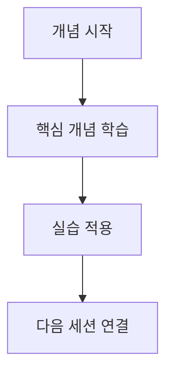
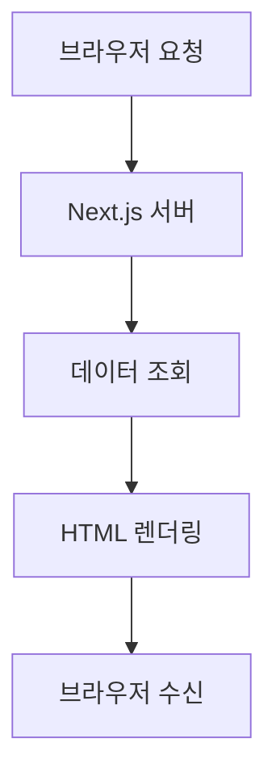

# moai-domain-edu-content

Domain knowledge for building Nextra 4.x educational documentation sites with Korean content standards.

---

## Quick Start: 4-Step Workflow

Step 1 — Initialize project (first time only):

```
/moai project
```

Step 2 — Create infrastructure SPEC:

```
/moai plan "Nextra 4.x educational site infrastructure for [Course Name].
Curriculum file: [path/to/curriculum.md]
Structure: [W1-W4, 3 sessions each]
Standard MDX sections: 학습목표, 핵심개념, 빅픽처다이어그램, 실습, 요약"
```

Step 3 — Create content SPEC per batch (3-4 sessions):

```
/moai plan "Content generation for Week [N] sessions [S1-S3].
Curriculum file: [path] Week [N] section.
Quality standards from moai-domain-edu-content skill:
- Include 왜/맥락 explanations inline (do NOT generate flat content and enhance separately)
- Mermaid safe syntax only (no apostrophes, no + in stateDiagram-v2)
- One pilot session first, then batch on approval"
```

Step 4 — Fix Mermaid errors if any:

```
/moai loop [paste browser console error]
```

---

## Section 1: Curriculum Spec File Format

Standard format for the curriculum specification file created before starting a project:

```markdown
# [Course Name] Curriculum Spec

## Target Audience
[e.g., Korean-speaking beginners with zero programming experience]

## Tech Stack
[e.g., Next.js 15, Nextra 4.x, TypeScript, Korean language]

## Content Structure
| Week | Session | Title | 3 Key Concepts | Learning Goal |
|------|---------|-------|----------------|---------------|
| W1   | S1      | [title] | concept1, concept2, concept3 | [goal] |

## Quality Standards
- "왜 필요한가?" (Why is this needed?) blockquote for each key concept
- One Mermaid big-picture diagram per session ("이번 세션 전체 그림")
- "📎 연결 포인트" callouts linking to future sessions
- "흔한 오해" (Common Misconceptions) correction section
- Mentor tone: friendly, respectful, non-condescending
```

### Quality Standards Detail

Each key concept requires:

- **왜 필요한가?**: A blockquote explaining why the concept exists and why the learner needs it before reading the explanation. This is the primary engagement hook.
- **연결 포인트**: A callout that explicitly links the current concept to a future session, reducing learner anxiety about incomplete understanding.
- **흔한 오해**: A dedicated section that names a common wrong mental model and corrects it — not buried in prose, but prominently formatted.

Mentor tone guidelines:

- Write as an experienced senior explaining to a smart junior
- Never condescend or assume the learner is slow
- Use "우리" (we) language for shared journey feel
- Prefer concrete analogies over abstract definitions

---

## Section 2: Standard MDX Session Template

Complete template for each session file. All section headers and content are in Korean. Technical terms appear in English with Korean explanation.

```mdx
# [N]회차: [Title]

## 학습 목표

이 세션을 마치면 다음을 할 수 있습니다:
- [Goal 1]
- [Goal 2]
- [Goal 3]

---

## 이번 세션 전체 그림



---

## 핵심 개념

### 1. [Concept 1]

> **왜 필요한가?** [Explanation of why this concept exists and why the learner needs it]

[Concept explanation in Korean. Technical terms in English with Korean annotation.]

> **📎 연결 포인트 → [N]회차**: [How this concept connects to a future session topic]

### 2. [Concept 2]

> **왜 필요한가?** [Explanation for concept 2]

[Concept 2 explanation]

> **📎 연결 포인트 → [N]회차**: [Future connection]

### 3. [Concept 3]

> **왜 필요한가?** [Explanation for concept 3]

[Concept 3 explanation]

> **📎 연결 포인트 → [N]회차**: [Future connection]

---

## 흔한 오해

> **흔한 오해**: "[Common misconception stated as a learner would say it]"
> **실제로는**: [Correct explanation that reframes the understanding]

---

## 실습

### 기본 실습: [Exercise title]

[Step-by-step instructions for the foundational exercise]

### 도전 실습: [Challenge title]

[Instructions for the stretch exercise — builds on the basic exercise]

---

## 요약

- **[Term]**: [Definition in one sentence]
- **[Term]**: [Definition in one sentence]
- **[Term]**: [Definition in one sentence]
```

### Template Rules

- Do NOT use JSX component imports such as `<Callout>` or `<Steps>` — use blockquote `>` syntax instead
- All prose content must be in Korean
- Technical identifiers (function names, CLI commands, file paths) stay in English
- The Mermaid diagram in the template above uses safe syntax — follow Section 3 rules when customizing it

---

## Section 3: Mermaid Safe Syntax Guide

### Allowed Diagram Types

- `graph TD` — top-down flowchart (most common for big-picture diagrams)
- `graph LR` — left-right flowchart
- `sequenceDiagram` — sequence diagrams for process flows
- `stateDiagram-v2` — state machines
- `erDiagram` — entity relationship diagrams

### Forbidden Characters

**Apostrophe `'` in any label context**

Causes a NEWLINE parse error in Note and label contexts. This is the most common Mermaid breakage in Korean educational content where English possessives appear.

**`+` in `stateDiagram-v2` transition labels**

Causes an INVALID token error. Use `and` or descriptive text instead.

### Safe Alternatives

| Forbidden | Safe Alternative | Reason |
|-----------|-----------------|--------|
| `Let's Encrypt` | `Lets Encrypt` | Remove apostrophe |
| `cleanup + re-run` | `cleanup and re-run` | Replace + with and |
| `'use client'` | `use client` | Remove quotes from directive strings |
| `name:'Alice'` | `name:Alice` | Remove single quotes in data examples |
| `(Let's go)` | `(Lets go)` | No apostrophe inside parens |

### Node Label Best Practices

- Use double-quoted labels `["text"]` for labels containing special characters
- Use `\n` for line breaks within labels
- Avoid mixing Korean and special punctuation in the same label
- Test each diagram independently before combining into the session file

### Safe Diagram Example



This example follows all safe syntax rules: double-quoted labels, no apostrophes, no forbidden characters.

---

## Section 4: SPEC Batch Split Strategy

### Context Window Constraints

- Context window limit: approximately 180K tokens per run phase
- One MDX session generates approximately 500-800 lines, equivalent to 8K-15K tokens
- Recommended: 3-4 sessions per SPEC for comfortable execution with review headroom

### SPEC Naming Convention

| SPEC Type | Pattern | Purpose |
|-----------|---------|---------|
| Infrastructure | `SPEC-INFRA-[SLUG]` | Nextra setup, navigation, layout, `_meta.js` |
| Content batch | `SPEC-CONTENT-W[N]` | Content generation per week or batch |
| Enhancement | `SPEC-ENHANCE-[SLUG]` | Cross-cutting quality improvements after pilot review |

### Execution Order

1. **SPEC-INFRA first** — establishes file structure, `_meta.js`, navigation, and shared layout components
2. **SPEC-CONTENT-W1 pilot** — generate exactly 1 session, review quality against checklist in Section 5, get approval before continuing
3. **SPEC-CONTENT-W1 remaining** — generate rest of the batch after pilot approval
4. **SPEC-CONTENT-W2 through WN** — subsequent weekly batches, one at a time
5. **SPEC-ENHANCE** — optional, only if quality issues are found during review

### Why Pilot-First Matters

Generating all sessions in one run before reviewing a single one means that if the MDX template has a structural issue (wrong Mermaid syntax, missing 왜 blockquotes, JSX imports), all sessions will have the same defect. The pilot review catches template-level issues before batch multiplication.

---

## Section 5: Content Quality Checklist

Run this checklist on every session file before marking the SPEC phase complete.

### Per-Session Validation

- [ ] At least 3 `왜 필요한가?` blockquotes — one per key concept minimum
- [ ] At least 2 `📎 연결 포인트` callouts — linking to specific future session numbers
- [ ] At least 1 `흔한 오해` section — explicitly named and corrected
- [ ] Exactly 1 Mermaid big-picture diagram in the `이번 세션 전체 그림` section
- [ ] No apostrophes `'` anywhere inside Mermaid code blocks
- [ ] No `+` in `stateDiagram-v2` transition labels
- [ ] All prose content in Korean — technical terms in English are acceptable
- [ ] No JSX component imports — use blockquote `>` syntax for callouts

### Actionable Failure Recovery

**Missing 왜 blockquotes**: Add them before the concept explanation, not after. The question "왜 필요한가?" must precede the answer, not follow it.

**Mermaid apostrophe error**: Search the file for `'` inside triple-backtick mermaid blocks and apply the safe alternatives from Section 3.

**JSX import found**: Replace `<Callout>` and similar components with `> **Label**: text` blockquote syntax. Remove the import line at the top of the file.

**연결 포인트 missing**: Each concept should link to at least one future session. If the curriculum spec does not specify the connection, use the nearest logically dependent session number.

---

## Section 6: Works Well With

- **manager-spec**: SPEC document creation for educational site infrastructure and content batches
- **expert-frontend**: Nextra configuration, MDX rendering, navigation setup, and `_meta.js` management
- **manager-ddd**: Content generation execution following curriculum spec with quality standards
- **moai-library-nextra**: Advanced Nextra 4.x configuration patterns, theme customization, and MDX component reference
