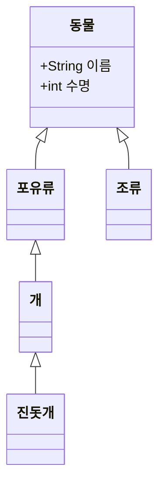
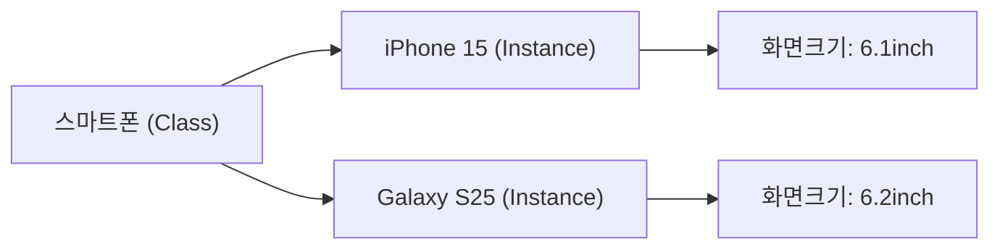

# SPEC-CONTENT-P2: Phase 2 MDX Content Generation -- "Ontology Building Blocks"

## Overview

This SPEC defines the complete MDX content generation for Phase 2 of the Ontology Fundamentals Learning Platform. Phase 2 covers the core building blocks of ontology: classes, instances, properties, axioms, and hierarchy. The content targets Korean-speaking beginners who have completed Phase 1 and now understand WHY ontology exists, and are ready to learn the structural elements that COMPOSE an ontology.

This SPEC produces 7 MDX files that replace the skeleton files created by SPEC-INFRA-001. Each file is a fully written educational session with Korean explanations, English technical terms, Mermaid diagrams, callouts, and exercises.

**Phase 2 Learning Objective:** Learners can read and write the basic building blocks of an ontology. Phase 1 Connection: The communication failures explored in Phase 1 occur because "concepts" and "relationships" are not explicitly defined -- Phase 2 teaches exactly how to define them.

**Scope boundary:** This SPEC covers content authoring only. Infrastructure, components, styling, and build configuration are handled by SPEC-INFRA-001.

---

## Environment

### Content Platform

- **Framework:** Nextra 4.x with Next.js 15 App Router (established by SPEC-INFRA-001)
- **Content Format:** MDX files in `content/phase-2/` directory
- **Content Language:** Korean (all explanations), English (technical terms with Korean definition on first use)
- **Diagram Engine:** Mermaid 11.12.2 (client-side rendering via MermaidDiagram component)
- **Target Audience:** Korean-speaking beginners who have completed Phase 1 (understand motivation for ontology)

### Content Quality Standards (per session)

| Element | Minimum Count | Format |
|---------|---------------|--------|
| "왜 필요한가?" blockquotes | 3 per session | `> **왜 필요한가?** [explanation]` |
| "연결 포인트" callouts | 2 per session | `> **연결 포인트 -> Phase [N]**: [connection]` |
| "흔한 오해" section | 1 per session | `> **흔한 오해**: "[misconception]"` / `> **실제로는**: [correction]` |
| Mermaid diagram | 1 per session | labeled "이번 세션 전체 그림" |
| Concept explanation depth | 300-500 words each | Principle-oriented, with analogies |

### Narrative Arc (mandatory per concept)

Every major concept follows this structure:
1. **Problem first**: Describe the limitation of the previous approach or concept
2. **Concept introduction**: Present the new concept as the solution
3. **Why this matters**: Explain practical impact with real-world examples
4. **Connection forward**: Link to where this concept leads in later phases

---

## Assumptions

### A-001: Infrastructure Ready

SPEC-INFRA-001 has been implemented. The `content/phase-2/` directory exists with skeleton MDX files, `_meta.js` navigation is configured, the MermaidDiagram component is functional, and `mdx-components.tsx` makes custom components available globally.

### A-002: No JSX Imports

Per SPEC-INFRA-001 constraint C-002, MDX files must not contain `import` statements. All components are globally available. Callouts and special formatting use blockquote `>` syntax exclusively.

### A-003: Mermaid Safe Syntax

Mermaid diagrams must follow safe syntax rules:
- No apostrophes in node labels
- No `+` operator in `stateDiagram-v2`
- Use `["double quoted labels"]` for labels with special characters
- Allowed types: `graph TD`, `graph LR`, `sequenceDiagram`, `stateDiagram-v2`, `erDiagram`, `classDiagram`

### A-004: Skeleton File Replacement

Each generated MDX file replaces the corresponding skeleton file in `content/phase-2/`. The YAML frontmatter structure (`title`, `description`, `difficulty`) established by SPEC-INFRA-001 is preserved, but content sections are fully written.

### A-005: Phase 1 Completion Assumed

Readers have completed Phase 1 and understand:
- The difference between data, information, and knowledge
- Why interoperability failures happen (semantic mismatch)
- Gruber's definition: "An explicit specification of a shared conceptualization"
- Why databases, natural language documents, and taxonomies are insufficient
- The concept of ontology as a solution to these problems

Phase 2 builds directly on this foundation, now teaching the structural "vocabulary" used to construct ontologies.

### A-006: Curriculum Source

All Phase 2 content follows the curriculum defined in `my-docs/edu-content.md`, specifically the "Phase 2 -- Components of Ontology" section covering classes, instances, properties, axioms, hierarchy, and exercises.

---

## Requirements

### R-001: Complete Phase 2 Content Set [UBIQUITOUS]

The system shall provide 7 fully written MDX files for Phase 2 that replace the skeleton content from SPEC-INFRA-001.

**Files:**

| File | Session Title (Korean) | Topic |
|------|----------------------|-------|
| `00-introduction.mdx` | Phase 2 소개: 온톨로지의 구성 요소 | Phase 2 overview, learning roadmap, Phase 1 connection |
| `01-classes.mdx` | 클래스(Class): 개념의 범주 | Classes as categories of concepts |
| `02-instances.mdx` | 인스턴스(Individual): 실세계 대상 | Instances as real-world objects |
| `03-properties.mdx` | 속성(Property): 객체 속성 vs 데이터 속성 | Object properties vs data properties |
| `04-axioms.mdx` | 공리(Axiom): 제약과 규칙 | Axioms as constraints and rules enabling reasoning |
| `05-hierarchy.mdx` | 계층 구조와 상속 | Class hierarchy, inheritance, ontology vs DB vs knowledge graph comparison |
| `06-exercises.mdx` | Phase 2 종합 실습 + 핵심 질문 | Comprehensive exercises and competency questions |

### R-002: Korean Content with English Technical Terms [UBIQUITOUS]

Each session shall present all explanations in Korean. English technical terms shall be introduced in parentheses on first use with a Korean definition, then may be used freely afterward.

**First-use format example:**
- "클래스(Class) -- 공통 특성을 가진 대상들의 집합을 나타내는 개념적 범주"
- "인스턴스(Individual/Instance) -- 클래스에 속하는 구체적인 실세계 대상"
- "객체 속성(Object Property) -- 개념과 개념을 연결하는 관계"
- "데이터 속성(Data Property) -- 개념에 값(리터럴)을 부여하는 속성"
- "공리(Axiom) -- 온톨로지에서 항상 참이어야 하는 제약 또는 규칙"

### R-003: "왜 필요한가?" Motivation Blockquotes [EVENT-DRIVEN]

**When** a learner reads any session, **the system shall** present at least 3 "왜 필요한가?" blockquotes that explain the motivation for each concept before introducing the solution.

**Format:**
```markdown
> **왜 필요한가?** [explanation of why this concept matters in practical terms]
```

**Placement rule:** Each "왜 필요한가?" blockquote must appear BEFORE the concept explanation it motivates, not after.

### R-004: Mermaid Big-Picture Diagram [UBIQUITOUS]

Each session shall include exactly one Mermaid diagram labeled "이번 세션 전체 그림" using safe Mermaid syntax.

**Diagram requirements per session:**

| Session | Diagram Type | Content Description |
|---------|-------------|-------------------|
| 00-introduction | `graph TD` | Phase 2 roadmap: 6 sessions (classes -> instances -> properties -> axioms -> hierarchy -> exercises) with arrows showing build-up flow |
| 01-classes | `classDiagram` | Ontology class hierarchy example: 동물(Animal) with subclasses 포유류(Mammal), 조류(Bird); 스마트폰(Smartphone) with subclass examples |
| 02-instances | `graph LR` | Class-to-instance relationship: 스마트폰 class connected to iPhone 15, Galaxy S25 instances with property values |
| 03-properties | `graph TD` | Object property (edge) vs data property (label) visualization: nodes connected by object properties, nodes annotated with data properties |
| 04-axioms | `graph TD` | Axiom types: existential restriction, functional property, inverse property as constraint arrows on a mini-ontology |
| 05-hierarchy | `graph TD` | Multi-level hierarchy: 포유류 -> 개 -> 진돗개 with SubClassOf and rdf:type arrows distinguished, plus comparison panel |
| 06-exercises | `graph TD` | Complete Phase 2 concept map connecting classes, instances, properties, axioms, and hierarchy |

### R-005: No JSX Imports [UNWANTED]

MDX sessions **shall NOT** use JSX import statements. All custom components (MermaidDiagram, Exercise, ConceptCard, CompetencyQuestion) are globally available via `mdx-components.tsx`. Callouts use blockquote `>` syntax.

### R-006: "연결 포인트" Forward References [UBIQUITOUS]

Each session shall include at least 2 "연결 포인트" callouts connecting the current concept to future phases (Phase 3, 4, 5, or beyond).

**Format:**
```markdown
> **연결 포인트 -> Phase [N]**: [what the learner will learn in that future phase and how it connects to the current concept]
```

### R-007: "흔한 오해" Misconception Sections [UBIQUITOUS]

Each session shall include at least 1 "흔한 오해" (common misconception) section with the misconception stated, then corrected.

**Format:**
```markdown
> **흔한 오해**: "[commonly held incorrect belief]"
> **실제로는**: [correct explanation with reasoning]
```

### R-008: Session 00-introduction.mdx Content [UBIQUITOUS]

The introduction session shall provide:
- Phase 2 title and subtitle in Korean
- Clear statement of Phase 2 learning objective: "온톨로지를 구성하는 기본 재료를 읽고 쓸 수 있다"
- Explicit connection to Phase 1: "Phase 1에서 살펴본 의사소통 실패의 원인은 '개념'과 '관계'가 명시되지 않아서다. Phase 2에서 바로 그 명시화 방법을 배운다"
- Brief overview of each of the 6 content sessions (01-06)
- "이번 Phase를 마치면 답할 수 있는 질문" section listing the 4 competency questions
- A Phase 2 roadmap Mermaid diagram
- At least 3 "왜 필요한가?" blockquotes
- At least 2 "연결 포인트" callouts
- At least 1 "흔한 오해" section

### R-009: Session 01-classes.mdx Content [UBIQUITOUS]

The classes session shall cover:

**Required content blocks:**

1. **Class definition and concept (300-500 words):**
   - A class is a set of objects sharing common characteristics
   - Examples: 동물(Animal), 스마트폰(Smartphone), 레이저 공정(Laser Process)
   - A class is NOT a real-world object -- it is a conceptual category
   - iPhone 15 is NOT a class; it is an instance (preview of next session)

2. **Why classes matter -- design impact (300-500 words):**
   - If classes are poorly designed, the entire ontology becomes unstable
   - Defining the scope/boundary of a class is the core of ontology design
   - Example: Is "갤럭시 S25"a class or an instance? It depends on the granularity of your model
   - Manufacturing example: "레이저 공정" as a class vs. "레이저 공정 #3번 라인" as an instance

3. **Class vs. set in mathematics analogy (200-300 words):**
   - Classes share properties with mathematical sets but have additional semantics
   - In ontology, classes carry meaning and relationships beyond mere membership

4. **"왜 필요한가?" blockquotes (3+):**
   - Before class definition: why we need categories at all
   - Before design impact: why class boundaries matter
   - Before scope discussion: why getting granularity right is critical

5. **"흔한 오해" section:**
   - Misconception: "클래스와 인스턴스의 구분은 항상 명확하다"
   - Reality: The same concept can be a class or instance depending on your modeling perspective and granularity. "Toyota Camry" can be a class (all Camry cars) or an instance (of the class "Car Model")

6. **"연결 포인트" callouts (2+):**
   - Phase 3: How classes relate to Description Logic concepts (class expressions)
   - Phase 5: How to systematically decide what should be a class (METHONTOLOGY, competency questions)

### R-010: Session 02-instances.mdx Content [UBIQUITOUS]

The instances session shall cover:

**Required content blocks:**

1. **Instance definition (300-500 words):**
   - Instances are concrete examples/members of a class
   - iPhone 15 is an instance of the 스마트폰(Smartphone) class
   - Instances have specific property values: iPhone 15 has screen size 6.1 inches

2. **Class as "mold" and instance as "product" analogy (300-400 words):**
   - Classes are the mold (틀), instances are what you stamp out from the mold (틀로 찍은 것)
   - DB analogy: table (class) vs. row (instance)
   - CRITICAL distinction from DB: In ontology, one instance can belong to MULTIPLE classes simultaneously
   - Example: "김철수" is simultaneously an instance of Person, Employee, Parent, and Customer

3. **Multiple class membership (300-400 words):**
   - This is a fundamental difference from relational databases
   - In RDB: one row belongs to one table (unless using JOINs which is structural, not semantic)
   - In ontology: an instance can naturally be typed under multiple classes
   - Example: A "hybrid car" belongs to both ElectricVehicle and InternalCombustionVehicle classes
   - Manufacturing example: A specific machine can be an instance of both "CNC Machine" and "Inspection Equipment"

4. **"왜 필요한가?" blockquotes (3+)**
5. **"흔한 오해" section:**
   - Misconception: "인스턴스는 DB의 행(row)과 같다"
   - Reality: While similar, ontology instances can belong to multiple classes simultaneously, have inferred class membership through reasoning, and carry semantic meaning beyond column values

6. **"연결 포인트" callouts (2+):**
   - Phase 4: How instances are represented in RDF triples (subject-predicate-object)
   - Phase 3: How a reasoner can automatically infer that an instance belongs to additional classes

### R-011: Session 03-properties.mdx Content [UBIQUITOUS]

The properties session shall cover:

**Required content blocks:**

1. **Object Property (객체 속성) (400-500 words):**
   - Connects one concept to another concept
   - Has direction (domain -> range)
   - Inverse properties can be defined
   - Examples:
     - 제조공정 --사용하는재료--> 알루미늄
     - 직원 --소속된--> 부서
     - Inverse: 부서 --구성원을포함--> 직원
   - Object properties create the "edges" of the knowledge graph

2. **Data Property (데이터 속성) (300-400 words):**
   - Attaches a literal value to a concept
   - Values have datatypes (xsd:string, xsd:float, xsd:integer, xsd:date)
   - Examples:
     - 스마트폰 --화면크기--> "6.1"^^xsd:float
     - 직원 --이름--> "김철수"^^xsd:string
     - 직원 --입사일--> "2020-03-15"^^xsd:date
   - Data properties add "labels" to nodes in the knowledge graph

3. **Graph visualization insight (200-300 words):**
   - Object properties form the edges of a graph
   - Data properties add labels/attributes to nodes
   - Together they create a rich, queryable knowledge structure
   - Visual analogy: a map where roads are object properties and city names/populations are data properties

4. **"왜 필요한가?" blockquotes (3+):**
   - Before object properties: why we need to connect concepts to each other
   - Before data properties: why concepts need concrete values
   - Before graph insight: why the distinction between the two types matters

5. **"흔한 오해" section:**
   - Misconception: "객체 속성과 데이터 속성의 구분이 왜 필요한가? 그냥 속성이면 되지 않나?"
   - Reality: The distinction enables different reasoning capabilities. Object properties support transitivity, symmetry, and inverse; data properties support range constraints and datatype validation. Mixing them would lose these reasoning capabilities.

6. **"연결 포인트" callouts (2+):**
   - Phase 4: How properties are expressed in RDF/OWL syntax (rdf:Property, owl:ObjectProperty, owl:DatatypeProperty)
   - Phase 5: How to decide what should be an object property vs. a data property during design

### R-012: Session 04-axioms.mdx Content [UBIQUITOUS]

The axioms session shall cover:

**Required content blocks:**

1. **Existential Restriction (존재 제약) (300-400 words):**
   - "모든 스마트폰은 반드시 제조사를 가진다"
   - If an instance claims to be a Smartphone but has no manufacturer property, it violates this axiom
   - Manufacturing example: "모든 제품은 반드시 품질 검사 기록을 가져야 한다"
   - Practical impact: axioms catch data completeness errors automatically

2. **Functional Property (기능적 속성) (300-400 words):**
   - "사람은 동시에 두 개의 주민등록번호를 가질 수 없다"
   - A property that can have at most one value per instance
   - Example: 생년월일 (date of birth) is functional -- a person has exactly one
   - Counter-example: 전화번호 (phone number) is NOT functional -- a person can have multiple

3. **Inverse Property (역속성) (200-300 words):**
   - "A가 B의 부모이면 B는 A의 자녀다"
   - Defining inverse relationships enables bi-directional reasoning
   - Example: 가르치다(teaches) and 배우다(taughtBy) are inverses
   - Manufacturing: 공급하다(supplies) and 공급받다(suppliedBy) are inverses

4. **Core insight: Axioms enable reasoning (300-500 words):**
   - Without axioms, an ontology is just a classification table (taxonomy with properties)
   - With axioms, a reasoner can:
     - Detect inconsistencies (a smartphone without a manufacturer)
     - Infer new facts (if A teaches B, then B is taught by A)
     - Validate data completeness
   - This is the key differentiator that Phase 1 identified: REASONING

5. **"왜 필요한가?" blockquotes (3+):**
   - Before existential restriction: why completeness constraints matter
   - Before functional property: why uniqueness constraints matter
   - Before core insight: why axioms are what make ontology more than taxonomy

6. **"흔한 오해" section:**
   - Misconception: "공리는 너무 어렵고 실무에서는 안 쓴다"
   - Reality: Axioms are the most powerful feature of ontology. Without them, you just have a fancy classification system. Even simple axioms like "every product must have a category" prevent common data quality issues that cost companies millions.

7. **"연결 포인트" callouts (2+):**
   - Phase 3: How axioms are expressed in Description Logic and how reasoners use them
   - Phase 4: How axioms are written in OWL syntax (owl:Restriction, owl:FunctionalProperty)

### R-013: Session 05-hierarchy.mdx Content [UBIQUITOUS]

The hierarchy session shall cover:

**Required content blocks:**

1. **Class Hierarchy and Inheritance (300-500 words):**
   - 포유류(Mammal) -> 개(Dog) -> 진돗개(Jindo Dog): subclasses inherit all properties of their parent class
   - SubClassOf relationship: if Dog SubClassOf Mammal, then all properties of Mammal apply to Dog
   - Property inheritance: if Mammal has "체온조절(thermoregulation)" property, Dog automatically has it too
   - Manufacturing: 제조장비(ManufacturingEquipment) -> CNC머신(CNCMachine) -> 5축CNC(5AxisCNC)

2. **SubClassOf vs rdf:type distinction (300-400 words):**
   - SubClassOf: relates a class to its parent class (진돗개 SubClassOf 개)
   - rdf:type: relates an instance to its class (내 강아지 "바둑이" rdf:type 진돗개)
   - Common confusion: mixing these two relationships is a top beginner mistake
   - Analogy: SubClassOf is like "category is a sub-category of" while rdf:type is "this specific thing belongs to this category"

3. **Hierarchy depth recommendation (200-300 words):**
   - Too deep (10+ levels): difficult to maintain, hard to understand, often contains unnecessary distinctions
   - Recommended: 4-5 levels maximum for practical ontologies
   - Each level should add meaningful semantic distinction
   - Over-classification trap: not every distinction in the real world needs its own class

4. **Ontology vs DB vs Knowledge Graph Comparison Table:**

   | Feature | Relational DB | Ontology | Knowledge Graph |
   |---------|--------------|----------|-----------------|
   | Core Unit | Table/Row | Class/Instance | Node/Edge |
   | Relationships | Foreign Key | Object Property + Axiom | Edge with label |
   | Schema Flexibility | Fixed (ALTER TABLE) | Open World, extensible | Schema-optional |
   | Reasoning | No (query only) | Yes (automated inference) | Partial (depends on engine) |
   | Multiple Typing | No (one table per row) | Yes (multiple classes per instance) | Yes (multiple labels per node) |
   | Standards | SQL | OWL/RDF | No universal standard |

5. **"왜 필요한가?" blockquotes (3+):**
   - Before hierarchy: why we need hierarchical organization at all
   - Before SubClassOf vs rdf:type: why distinguishing these matters
   - Before comparison table: why understanding how ontology differs from alternatives matters

6. **"흔한 오해" section:**
   - Misconception: "온톨로지는 데이터베이스의 상위 버전이다"
   - Reality: Ontology and databases solve different problems and often work together. A database stores and retrieves data efficiently. An ontology defines the meaning of that data and enables reasoning. Many real-world systems use both: a database for storage and an ontology for semantics.

7. **"연결 포인트" callouts (2+):**
   - Phase 3: How reasoners use hierarchy to perform automatic classification
   - Phase 7: How knowledge graphs (Google Knowledge Graph, DBpedia) use these structural patterns in practice

### R-014: Session 06-exercises.mdx Content [UBIQUITOUS]

The exercises session shall include both practice exercises and Phase 2 competency questions:

**Required content blocks:**

1. **Phase 2 recap section:**
   - Brief summary of what was covered in sessions 01-05
   - Visual concept map (Mermaid diagram) connecting all Phase 2 concepts

2. **Basic exercises (기본 실습):**

   Exercise 1: Domain Modeling
   - Task: Choose a domain you know well and identify 5 classes, 3 instances, 3 object properties, and 2 data properties
   - Guidance: Think about entities, their categories, relationships between them, and their attributes
   - Example format provided: table template for organizing the elements
   - Domains to consider: your workplace, a hobby, a sport, a cooking recipe collection

   Exercise 2: Class vs Instance Classification
   - Task: Given a list of 10 items, classify each as class or instance
   - Provided items spanning diverse domains (manufacturing, technology, animals, geography)
   - Answer key with explanations for each, noting items that could be either depending on perspective

3. **Challenge exercises (도전 실습):**

   Exercise 3: is-a vs has-a Distinction
   - Task: For the domain from Exercise 1, provide 2 examples of is-a relationships and 2 examples of has-a relationships
   - Explain the difference: is-a (SubClassOf) defines category membership, has-a (Object Property) defines structural composition
   - Why this matters: confusing is-a and has-a is the most common beginner modeling mistake

   Exercise 4: Axiom Design Challenge
   - Task: For 2 classes from Exercise 1, write 1 existential restriction and 1 functional property constraint in natural language
   - Example: "모든 [Class A]는 반드시 [property]를 가진다" (existential)
   - Example: "각 [Class B]는 최대 하나의 [property]를 가진다" (functional)

4. **Competency Questions (핵심 질문) -- Phase 2 pass criteria (4 questions):**

   Question 1: "클래스와 인스턴스의 경계가 모호한 예시를 들고, 어떻게 결정하는지 설명하시오"
   - Guidance: Think about "Toyota Camry" -- is it a class or instance? It depends on your modeling scope.
   - Reference: Session 01 class boundary discussion

   Question 2: "객체 속성과 데이터 속성을 구분하는 기준은 무엇인가?"
   - Guidance: Object properties connect concepts; data properties attach literal values. Think about what connects to what.
   - Reference: Session 03 property types

   Question 3: "공리가 없으면 온톨로지는 무엇이 되는가?"
   - Guidance: Without axioms, you have a taxonomy with properties -- no reasoning, no consistency checking, no inference.
   - Reference: Session 04 core insight

   Question 4: "SubClassOf와 rdf:type을 혼동하면 어떤 문제가 생기는가?"
   - Guidance: Mixing class-to-class and instance-to-class relationships creates logical inconsistency and breaks reasoning.
   - Reference: Session 05 SubClassOf vs rdf:type

5. **Self-assessment checklist:**
   - "나는 주어진 도메인에서 클래스와 인스턴스를 구분할 수 있다"
   - "나는 객체 속성과 데이터 속성의 차이를 설명하고 예시를 들 수 있다"
   - "나는 공리의 역할과 추론과의 관계를 설명할 수 있다"
   - "나는 SubClassOf와 rdf:type의 차이를 정확히 설명할 수 있다"
   - "나는 온톨로지, 데이터베이스, 지식그래프의 차이를 비교 설명할 수 있다"

---

## Specifications

### S-001: MDX Frontmatter Structure

Each MDX file shall have YAML frontmatter:

```yaml
---
title: "[Korean session title]"
description: "[Korean description for search indexing, 50-100 chars]"
difficulty: "beginner"
---
```

### S-002: Session Content Structure Template

Each content session (01-05) follows this structure:

```markdown
---
title: "[Title]"
description: "[Description]"
difficulty: "beginner"
---

# [Session Number]회차: [Korean Title]

## 학습 목표

(3 bullet points describing what the learner will achieve)

> **왜 필요한가?** [Opening motivation before first concept]

## 이번 세션 전체 그림

(Mermaid diagram code block)

## [First Major Concept Heading]

> **왜 필요한가?** [Motivation for this specific concept]

(300-500 word explanation with analogies and examples)

> **연결 포인트 -> Phase [N]**: [Forward reference]

## [Second Major Concept Heading]

> **왜 필요한가?** [Motivation for this specific concept]

(300-500 word explanation with analogies and examples)

## [Additional Concept Headings as needed]

> **연결 포인트 -> Phase [N]**: [Forward reference]

## 흔한 오해

> **흔한 오해**: "[Misconception]"
> **실제로는**: [Correct explanation]

(Additional misconceptions if relevant)

## 요약

(Concise summary of key takeaways, 3-5 bullet points)

## 다음 세션 예고

(Brief preview of what comes next and why it matters)
```

### S-003: Introduction Session Structure (00-introduction.mdx)

```markdown
---
title: "Phase 2 소개: 온톨로지의 구성 요소"
description: "온톨로지를 구성하는 기본 재료를 학습하는 Phase 2 안내"
difficulty: "beginner"
---

# Phase 2: 온톨로지의 구성 요소

## 이 Phase에서 배우는 것

(Phase 2 learning objective and Phase 1 connection)

> **왜 필요한가?** [Why learning building blocks matters after understanding motivation]

## 이번 세션 전체 그림

(Phase 2 roadmap Mermaid diagram)

## Phase 1에서 여기까지

(Brief recap of Phase 1 and bridge to Phase 2)

## 세션 구성

(Overview of 6 content sessions with brief descriptions)

## 이번 Phase를 마치면 답할 수 있는 질문

(4 competency questions listed)

## 흔한 오해

> **흔한 오해**: "[Misconception about ontology components]"
> **실제로는**: [Correction]

> **연결 포인트 -> Phase 3**: [Preview of logical foundations]
> **연결 포인트 -> Phase 4**: [Preview of standards and languages]
```

### S-004: Exercise Session Structure (06-exercises.mdx)

```markdown
---
title: "Phase 2 종합 실습 + 핵심 질문"
description: "Phase 2 핵심 개념을 직접 실습하고 역량을 확인하는 종합 실습"
difficulty: "beginner"
---

# Phase 2 종합 실습

## 이번 세션 전체 그림

(Phase 2 concept map Mermaid diagram)

## Phase 2 핵심 요약

(Brief recap of all Phase 2 sessions)

## 기본 실습

### 실습 1: [Title]
### 실습 2: [Title]

## 도전 실습

### 실습 3: [Title]
### 실습 4: [Title]

## 핵심 질문 (Phase 2 통과 기준)

### 질문 1: [Question]
### 질문 2: [Question]
### 질문 3: [Question]
### 질문 4: [Question]

## 자가 점검 체크리스트

(Self-assessment checklist)

## 다음 Phase 예고

> **연결 포인트 -> Phase 3**: [What comes next]
```

### S-005: Mermaid Syntax Constraints

All Mermaid diagrams must follow these rules:
- No apostrophes (`'`) anywhere in diagram code
- No `+` operator in `stateDiagram-v2`
- Use `["double quoted labels"]` for labels with Korean characters or special characters
- Test every diagram mentally for syntax validity before writing
- Wrap in standard markdown code fences with `mermaid` language identifier
- Recommended types for Phase 2: `graph TD`, `graph LR`, `classDiagram` (for ontology structures)

**Example safe pattern for classDiagram:**


**Example safe pattern for graph:**


### S-006: Content Depth Requirements

Each major concept explanation (not including callouts, exercises, or summaries) shall be 300-500 words and include:
- At least 1 real-world analogy relevant to Korean industries (manufacturing, healthcare, e-commerce, technology)
- The "problem first, solution second" narrative arc
- Concrete examples, not abstract definitions
- Connection to why this matters for the learner's practical work

### S-007: Technical Term Introduction Pattern

On first use of any English technical term:
```
한국어_용어(English_Term) -- 한국어로 된 간결한 정의
```

After first introduction, either the Korean term or English term may be used freely.

**Phase 2 key terms to introduce:**
- 클래스(Class)
- 인스턴스(Individual/Instance)
- 객체 속성(Object Property)
- 데이터 속성(Data Property/Datatype Property)
- 공리(Axiom)
- 존재 제약(Existential Restriction)
- 기능적 속성(Functional Property)
- 역속성(Inverse Property)
- 계층 구조(Hierarchy)
- SubClassOf
- rdf:type
- 리터럴(Literal)
- 도메인(Domain) -- property 맥락에서
- 레인지(Range) -- property 맥락에서
- 지식 그래프(Knowledge Graph) -- in comparison table context

### S-008: Phase 1 Connection Requirement

The introduction session (00-introduction.mdx) and at least 2 content sessions must explicitly reference Phase 1 concepts to build continuity:
- Phase 1's interoperability failures -> Phase 2's explicit concept/relationship definitions solve them
- Phase 1's Gruber definition (shared conceptualization) -> Phase 2's classes and properties ARE the conceptualization
- Phase 1's reasoning promise -> Phase 2's axioms enable it

---

## Constraints

### C-001: No Implementation Code

This SPEC produces MDX content files only. No TypeScript, JavaScript, CSS, or configuration file changes.

### C-002: Skeleton Replacement

Generated content replaces skeleton files from SPEC-INFRA-001. The file paths must match exactly:
- `content/phase-2/00-introduction.mdx`
- `content/phase-2/01-classes.mdx`
- `content/phase-2/02-instances.mdx`
- `content/phase-2/03-properties.mdx`
- `content/phase-2/04-axioms.mdx`
- `content/phase-2/05-hierarchy.mdx`
- `content/phase-2/06-exercises.mdx`

### C-003: Mermaid Safe Syntax (inherited from SPEC-INFRA-001)

- FORBIDDEN: Apostrophes in Mermaid node labels
- FORBIDDEN: `+` in stateDiagram-v2
- Use `["double quoted labels"]` for labels with special characters
- Safe types: `graph TD`, `graph LR`, `sequenceDiagram`, `stateDiagram-v2`, `erDiagram`, `classDiagram`

### C-004: No JSX Imports (inherited from SPEC-INFRA-001)

MDX files must not contain `import` statements. All components available via `mdx-components.tsx`.

### C-005: Word Count Target

Total Phase 2 content (all 7 files combined): approximately 10,000-15,000 Korean words. Individual session targets:
- 00-introduction: 800-1,200 words
- 01-classes: 1,500-2,500 words
- 02-instances: 1,500-2,500 words
- 03-properties: 1,500-2,500 words
- 04-axioms: 1,500-2,500 words
- 05-hierarchy: 1,500-2,500 words
- 06-exercises: 1,500-2,000 words

### C-006: Conceptual Accuracy

- Class/Instance distinction must be consistent and accurate throughout
- Object Property vs Data Property distinction must follow OWL semantics
- Axiom examples must be logically correct and represent real OWL capabilities
- SubClassOf vs rdf:type must be technically accurate per W3C standards
- Comparison table (DB vs Ontology vs Knowledge Graph) must be factually correct
- No fabricated examples or statistics

### C-007: Consistent Cross-References

- Forward references must only point to phases that exist in the curriculum (Phase 3-8)
- Session-to-session references within Phase 2 must use relative links
- Backward references to Phase 1 concepts must be accurate
- Competency questions in exercises must match the questions defined in this SPEC

### C-008: Phase 1 Bridge

- Introduction session MUST contain explicit bridge section from Phase 1
- At least 2 other sessions must reference Phase 1 concepts
- The bridge must demonstrate HOW Phase 2 concepts solve Phase 1 problems

---

## Traceability

| Requirement | Plan Reference | Acceptance Reference |
|-------------|---------------|---------------------|
| R-001 | Plan: Session Overview | AC-001 |
| R-002 | Plan: All Sessions | AC-002 |
| R-003 | Plan: All Sessions | AC-003 |
| R-004 | Plan: Diagram Specs | AC-004 |
| R-005 | Plan: All Sessions | AC-005 |
| R-006 | Plan: All Sessions | AC-006 |
| R-007 | Plan: All Sessions | AC-007 |
| R-008 | Plan: Session 00 | AC-008 |
| R-009 | Plan: Session 01 | AC-009 |
| R-010 | Plan: Session 02 | AC-010 |
| R-011 | Plan: Session 03 | AC-011 |
| R-012 | Plan: Session 04 | AC-012 |
| R-013 | Plan: Session 05 | AC-013 |
| R-014 | Plan: Session 06 | AC-014 |

---

## Expert Consultation Recommendations

### Frontend Expert (expert-frontend)

This SPEC involves MDX content authoring within a Nextra 4.x site. Consulting expert-frontend is recommended for:
- Verifying classDiagram Mermaid rendering behavior within Nextra
- Ensuring blockquote callout formatting renders correctly with Nextra theme
- Validating MDX syntax compatibility with Nextra 4.x parser

### Content/Education Domain Expert

If available, consulting a subject matter expert in ontology education would be valuable for:
- Verifying Class/Instance/Property/Axiom explanations for accuracy
- Reviewing the comparison table (DB vs Ontology vs Knowledge Graph) for correctness
- Ensuring progressive difficulty alignment from Phase 1 to Phase 2
