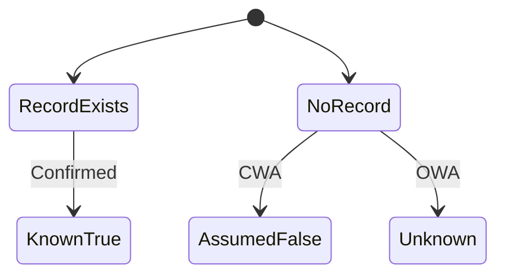
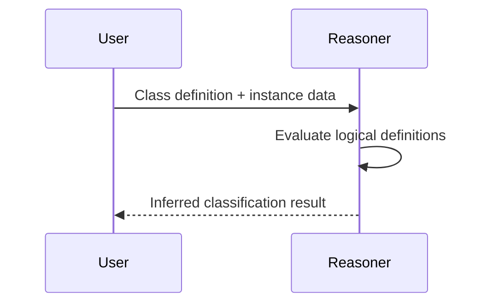

# SPEC-CONTENT-P3: Phase 3 MDX Content Generation -- "The Logical Foundations of Ontology"

## Overview

This SPEC defines the complete MDX content generation for Phase 3 of the Ontology Fundamentals Learning Platform. Phase 3 covers the logical foundations of ontology: Description Logic, the Open/Closed World Assumptions, reasoning types, reasoner tools, and computational complexity trade-offs. The content targets Korean-speaking beginners who have completed Phase 1 (motivation) and Phase 2 (building blocks) and are ready to understand HOW ontologies "think."

This SPEC produces 7 MDX files in the `content/phase-3/` directory. Each file is a fully written educational session with Korean explanations, English technical terms, Mermaid diagrams, callouts, and exercises.

**Learning objective:** Understand that ontology is not merely a classification table but a "reasoning engine."

**Phase 2 connection:** If you now know the building blocks, it is time to see how they produce "thought."

**Scope boundary:** This SPEC covers content authoring only. Infrastructure, components, styling, and build configuration are handled by SPEC-INFRA-001.

---

## Environment

### Content Platform

- **Framework:** Nextra 4.x with Next.js 15 App Router (established by SPEC-INFRA-001)
- **Content Format:** MDX files in `content/phase-3/` directory
- **Content Language:** Korean (all explanations), English (technical terms with Korean definition on first use)
- **Diagram Engine:** Mermaid 11.12.2 (client-side rendering via MermaidDiagram component)
- **Target Audience:** Korean-speaking beginners (25-50 years old) from manufacturing, AI, and knowledge management domains who have completed Phase 1 and Phase 2

### Content Quality Standards (per session)

| Element | Minimum Count | Format |
|---------|---------------|--------|
| "Why is this needed?" blockquotes | 3 per session | `> **Why is this needed?** [explanation]` |
| "Connection Point" callouts | 2 per session | `> **Connection Point -> Phase [N]**: [connection]` |
| "Common Misconception" section | 1 per session | `> **Common Misconception**: "[misconception]"` / `> **Actually**: [correction]` |
| Mermaid diagram | 1 per session | labeled "This Session Big Picture" |
| Concept explanation depth | 300-500 words each | Principle-oriented, with analogies |

### Narrative Arc (mandatory per concept)

Every major concept follows this structure:
1. **Problem first**: Describe the limitation of the previous approach
2. **Concept introduction**: Present the new concept as the solution
3. **Why this matters**: Explain practical impact with real-world examples
4. **Connection forward**: Link to where this concept leads in later phases

---

## Assumptions

### A-001: Infrastructure Ready

SPEC-INFRA-001 has been implemented. The `content/phase-3/` directory exists with skeleton MDX files, `_meta.js` navigation is configured, the MermaidDiagram component is functional, and `mdx-components.tsx` makes custom components available globally.

### A-002: No JSX Imports

Per SPEC-INFRA-001 constraint C-002, MDX files must not contain `import` statements. All components are globally available. Callouts and special formatting use blockquote `>` syntax exclusively.

### A-003: Mermaid Safe Syntax

Mermaid diagrams must follow safe syntax rules:
- No apostrophes in node labels
- No `+` operator in `stateDiagram-v2`
- Use `["double quoted labels"]` for labels with Korean characters or special characters
- Allowed types: `graph TD`, `graph LR`, `sequenceDiagram`, `stateDiagram-v2`, `erDiagram`, `classDiagram`

### A-004: Skeleton File Replacement

Each generated MDX file replaces the corresponding skeleton file in `content/phase-3/`. The YAML frontmatter structure (`title`, `description`, `difficulty`) established by SPEC-INFRA-001 is preserved, but content sections are fully written.

### A-005: Phase 1 and Phase 2 Completion

Readers have completed Phase 1 (why ontology exists) and Phase 2 (building blocks: classes, instances, properties, axioms, hierarchy). They understand basic ontology vocabulary but have no knowledge of formal logic, reasoning, or Description Logic. All Phase 3 concepts must build on Phase 2 foundations and explain new concepts from first principles with concrete analogies.

### A-006: Curriculum Source

All Phase 3 content follows the curriculum defined in `my-docs/edu-content.md`, specifically the "Phase 3 -- The Logical Foundations of Ontology" section covering sessions 3-1 through 3-4 plus exercises and competency questions.

### A-007: Difficulty Escalation

Phase 3 represents the first significant conceptual difficulty increase. Content must be especially careful with:
- Introducing formal logic concepts without assuming mathematical background
- Using visual explanations (Mermaid diagrams) for abstract processes
- Providing multiple analogies per concept
- Explicitly addressing the "OWA confusion" that most beginners face

---

## Requirements

### R-001: Complete Phase 3 Content Set [UBIQUITOUS]

The system shall provide 7 fully written MDX files for Phase 3 that replace the skeleton content from SPEC-INFRA-001.

**Files:**

| File | Session Title (Korean) | Topic |
|------|----------------------|-------|
| `00-introduction.mdx` | Phase 3 소개: 온톨로지는 어떻게 생각하는가? | Phase 3 overview, learning objectives, roadmap |
| `01-description-logic.mdx` | 기술 논리(DL)의 직관적 이해 | Description Logic as decidable subset of FOL, why DL matters for ontology |
| `02-owa-cwa.mdx` | 열린 세계 가정(OWA) vs 닫힌 세계 가정(CWA) | Open vs Closed World Assumptions, design implications |
| `03-reasoning-types.mdx` | 추론의 종류 | Consistency checking, classification, realization, property inference |
| `04-reasoners.mdx` | 추론기의 역할과 OWL 표현력 | HermiT, Pellet, FaCT++, soundness/completeness, OWL sublanguages |
| `05-complexity.mdx` | 계산 복잡도와 프로파일 선택 | OWL 2 profiles (EL, QL, RL), expressiveness vs performance trade-off |
| `06-exercises.mdx` | Phase 3 종합 실습과 핵심 질문 | Exercises with Protege, competency questions |

### R-002: Korean Content with English Technical Terms [UBIQUITOUS]

Each session shall present all explanations in Korean. English technical terms shall be introduced in parentheses on first use with a Korean definition, then may be used freely afterward.

**Phase 3 key terms to introduce:**

- 기술 논리(Description Logic, DL) -- 온톨로지의 수학적 기반이 되는 형식 논리 체계
- 1차 논리(First-Order Logic, FOL) -- 변수, 함수, 술어를 사용하는 형식 논리
- 결정 가능성(Decidability) -- 유한 시간 안에 참/거짓 판단이 보장되는 성질
- 열린 세계 가정(Open World Assumption, OWA) -- 기록되지 않은 것은 알 수 없다
- 닫힌 세계 가정(Closed World Assumption, CWA) -- 기록되지 않은 것은 거짓이다
- 일관성 검사(Consistency Checking) -- 논리적 모순 여부 확인
- 분류 추론(Classification) -- 자동 클래스 계층 계산
- 인스턴스 실현(Realization) -- 인스턴스가 속하는 클래스 자동 판단
- 속성값 추론(Property Inference) -- 속성 관계에서 새 사실 도출
- 추론기(Reasoner) -- 온톨로지 추론을 수행하는 소프트웨어 엔진
- 완전성(Completeness) -- 도출 가능한 모든 결론을 도출하는 성질
- 건전성(Soundness) -- 틀린 결론을 도출하지 않는 성질
- 전이적 속성(Transitive Property) -- A->B, B->C이면 A->C가 추론되는 속성
- OWL DL -- 결정 가능한 OWL 하위 언어
- OWL Full -- 표현력은 최대이나 추론 불가능
- OWL 2 프로파일(OWL 2 Profile) -- 성능 최적화를 위한 OWL 하위집합 (EL, QL, RL)

### R-003: "왜 필요한가?" Motivation Blockquotes [EVENT-DRIVEN]

**When** a learner reads any session, **the system shall** present at least 3 "왜 필요한가?" blockquotes that explain the motivation for each concept before introducing the solution.

**Format:**
```markdown
> **왜 필요한가?** [explanation of why this concept matters in practical terms]
```

**Placement rule:** Each "왜 필요한가?" blockquote must appear BEFORE the concept explanation it motivates, not after.

### R-004: Mermaid Big-Picture Diagram [UBIQUITOUS]

Each session shall include exactly one Mermaid diagram labeled "이번 세션 전체 그림" using safe Mermaid syntax.

**Diagram requirements per session:**

| Session | Diagram Type | Content Description |
|---------|-------------|-------------------|
| 00-introduction | `graph TD` | Phase 3 roadmap showing 6 sessions and their connections |
| 01-description-logic | `sequenceDiagram` | Reasoning process: class definition -> input instance -> reasoner evaluates -> inferred membership |
| 02-owa-cwa | `stateDiagram-v2` | OWA vs CWA state transitions: "Record exists" -> Known True; "No record" -> CWA: False / OWA: Unknown |
| 03-reasoning-types | `graph TD` | 4 reasoning types as branches from central "Reasoning Engine" node with examples |
| 04-reasoners | `graph LR` | Input (OWL ontology) -> Reasoner (HermiT/Pellet) -> Output (inferred facts), with soundness/completeness annotations |
| 05-complexity | `graph LR` | OWL 2 profiles spectrum: EL (fast, limited) -> QL (medium) -> RL (medium) -> DL (full, slower) |
| 06-exercises | `graph TD` | Complete Phase 3 concept map connecting DL, OWA/CWA, reasoning types, reasoners, and complexity |

### R-005: No JSX Imports [UNWANTED]

MDX sessions **shall NOT** use JSX import statements. All custom components (MermaidDiagram, Exercise, ConceptCard, CompetencyQuestion) are globally available via `mdx-components.tsx`. Callouts use blockquote `>` syntax.

### R-006: "연결 포인트" Forward References [UBIQUITOUS]

Each session shall include at least 2 "연결 포인트" callouts connecting the current concept to future phases or back to earlier phases.

**Format:**
```markdown
> **연결 포인트 -> Phase [N]**: [what the learner will learn in that future phase and how it connects to the current concept]
```

**Phase 3 connection targets:**
- Phase 4 (OWL language): How DL concepts map to OWL syntax
- Phase 5 (design methodology): How reasoning capability affects ontology design decisions
- Phase 2 (building blocks): Back-references to classes, properties, axioms now used in reasoning
- Phase 7 (applications): How reasoners power real-world knowledge graph systems

### R-007: "흔한 오해" Misconception Sections [UBIQUITOUS]

Each session shall include at least 1 "흔한 오해" (common misconception) section with the misconception stated, then corrected.

**Format:**
```markdown
> **흔한 오해**: "[commonly held incorrect belief]"
> **실제로는**: [correct explanation with reasoning]
```

### R-008: Session 00-introduction.mdx Content [UBIQUITOUS]

The introduction session shall provide:
- Phase 3 title and subtitle in Korean: "온톨로지의 논리적 기반"
- Clear statement of Phase 3 learning objective: "온톨로지가 단순 분류표가 아니라 '추론 엔진'임을 이해한다"
- Connection to Phase 2: "구성 요소를 알았다면, 이제 그것들이 어떻게 '생각'을 만들어내는지를 봐야 한다"
- Brief overview of each of the 6 content sessions (01-06)
- "이번 Phase를 마치면 답할 수 있는 질문" section listing the 4 competency questions
- A Phase 3 roadmap Mermaid diagram (`graph TD`)
- Conceptual framing: Phase 2 gave you the LEGO blocks, Phase 3 teaches you the instruction manual that lets a machine build with them
- At least 3 "왜 필요한가?" blockquotes
- At least 2 "연결 포인트" callouts
- At least 1 "흔한 오해" section

### R-009: Session 01-description-logic.mdx Content [UBIQUITOUS]

The Description Logic session shall cover:

**Required content blocks:**

1. **What is Description Logic (300-500 words):**
   - DL as a decidable fragment of First-Order Logic (FOL)
   - Why FOL is too powerful (undecidable) and DL is the "just right" subset
   - Analogy: FOL is like a supercomputer that might never finish calculating; DL is a calculator that always gives you an answer -- it is less powerful but always terminates
   - Korean terms: 기술 논리(Description Logic), 1차 논리(First-Order Logic), 결정 가능성(Decidability)

2. **The key insight -- machines judge class membership (300-500 words):**
   - Core idea: "클래스를 충분히 정의하면, 무엇이 그 클래스에 속하는지 기계가 스스로 판단한다"
   - Mammal example: "심장을 가지고 젖을 분비하면 포유류다" -> whale is inferred as mammal without explicit declaration
   - Manufacturing analogy: "정밀도가 0.01mm 이하이고 내열 온도가 500도 이상이면 고급 부품이다" -> a new part meeting these criteria is automatically classified
   - Healthcare analogy: "열이 38도 이상이고 기침이 있고 PCR 양성이면 확진자다" -> patient classified without manual tagging

3. **How DL differs from databases (300-500 words):**
   - Database: only knows what is explicitly stored (no derivation of new facts)
   - Ontology with DL: derives new facts from definitions and axioms
   - Concrete comparison: DB query "SELECT mammals" returns only manually tagged mammals; DL-based ontology query returns all entities matching the mammal definition, including those never explicitly tagged
   - This is the fundamental paradigm shift: from "store and retrieve" to "define and derive"

4. **Mermaid diagram -- "이번 세션 전체 그림":**
   - `sequenceDiagram` showing: User defines class -> Inputs instance data -> Reasoner evaluates definitions -> Returns inferred classification
   - Korean labels

### R-010: Session 02-owa-cwa.mdx Content [UBIQUITOUS]

The OWA vs CWA session shall cover:

**Required content blocks:**

1. **CWA -- The database world (300-500 words):**
   - Definition: "기록되지 않은 것은 거짓이다"
   - Example: Employee database. If no record says "Kim lives in Seoul" then Kim does NOT live in Seoul
   - Why this works for databases: closed systems with complete information
   - SQL analogy: `SELECT * FROM employees WHERE city = 'Seoul'` -- if Kim is not in the result, Kim is not in Seoul. Period.
   - Korean context: 주민등록 시스템 (resident registration system) -- if you are not registered in Seoul, you are not a Seoul resident

2. **OWA -- The ontology world (300-500 words):**
   - Definition: "기록되지 않은 것은 알 수 없다"
   - Example: Same employee scenario but in ontology world. No record about Kim and Seoul means "we do not know" -- Kim might live in Seoul, might not
   - Why this makes sense: ontologies model open, evolving domains where information is incomplete
   - Web analogy: The web does not contain all human knowledge. Just because a fact is not on the web does not make it false.
   - The semantic web vision: ontologies describe knowledge that may be distributed, incomplete, and continuously growing

3. **Design implications of OWA (300-500 words):**
   - Why "this value is absent" is hard to prove in ontology
   - How constraints must be designed differently: you cannot use "absence of data" as evidence
   - Concrete example: In a DB, an empty "spouse" field means "not married." In an ontology, empty "spouse" means "we do not know if this person is married"
   - How to handle this: use explicit negative assertions when you need to state something is NOT the case
   - Common beginner trap: designing ontology constraints as if CWA applies, then getting unexpected reasoner behavior

4. **Comparison table:**
   - Rows: Absence of information, Constraint validation, Use case, Example systems
   - Columns: CWA, OWA
   - Clear Korean descriptions in each cell

5. **Mermaid diagram -- "이번 세션 전체 그림":**
   - `stateDiagram-v2` showing state transitions:
     - "Record exists" -> "Known True"
     - "No record" branches to CWA path ("Assumed False") and OWA path ("Unknown")
   - Korean labels, no apostrophes, no `+` operator

### R-011: Session 03-reasoning-types.mdx Content [UBIQUITOUS]

The reasoning types session shall cover 4 types of reasoning:

**Required content blocks:**

1. **Consistency Checking (300-500 words):**
   - Definition: detecting logical contradictions in the ontology
   - Example: "독신자(Bachelor)는 결혼하지 않은 사람" AND "John is a Bachelor" AND "John is married" -> CONTRADICTION
   - Why this matters: finding contradictions before deploying an ontology prevents downstream errors
   - Manufacturing analogy: QC system defining "defective product = weight < 100g" but a product entry says "defective AND weight = 150g" -> reasoner catches the inconsistency
   - Korean context: like an audit that finds logical conflicts in regulations (규정 간 모순 탐지)

2. **Classification / Subsumption (300-500 words):**
   - Definition: automatically computing class hierarchy that was not explicitly stated
   - Example: If "Mammal = has heart AND produces milk" and "Whale = lives in ocean AND has heart AND produces milk" then reasoner infers Whale SubClassOf Mammal
   - Why this matters: as ontology grows, manual hierarchy maintenance becomes impossible. The reasoner keeps it consistent.
   - E-commerce analogy: product categories that self-organize based on attribute definitions rather than manual tagging

3. **Instance Realization (300-500 words):**
   - Definition: automatically determining which class(es) an instance belongs to
   - Example: An animal instance with properties {has heart, produces milk, lives in ocean} is automatically classified as both Mammal and Marine Animal
   - Difference from Classification: Classification is about class-to-class relationships; Realization is about instance-to-class relationships
   - Manufacturing analogy: a new component's specifications are entered, and the system automatically categorizes it into the correct part families

4. **Property Inference (300-500 words):**
   - Definition: deriving new facts from property characteristics (inverse, transitive, symmetric, etc.)
   - Transitive property example: "A is ancestor of B" AND "B is ancestor of C" -> "A is ancestor of C" (automatically inferred)
   - Inverse property example: "A teaches B" implies "B is taught by A"
   - Symmetric property example: "A is sibling of B" implies "B is sibling of A"
   - Why this matters: one relationship declaration generates multiple inferred facts, exponentially enriching the knowledge base
   - Healthcare analogy: "Drug A interacts with Drug B" (symmetric) -> system also knows "Drug B interacts with Drug A" without separate entry

5. **Mermaid diagram -- "이번 세션 전체 그림":**
   - `graph TD` showing "Reasoning Engine" at center with 4 branches:
     - Consistency Checking -> "Finds contradictions"
     - Classification -> "Builds hierarchy"
     - Realization -> "Classifies instances"
     - Property Inference -> "Derives new facts"
   - Korean labels

### R-012: Session 04-reasoners.mdx Content [UBIQUITOUS]

The reasoners session shall cover:

**Required content blocks:**

1. **What reasoners do (300-500 words):**
   - Reasoners are software engines that take OWL ontologies as input and produce inferred facts as output
   - Three major reasoners: HermiT, Pellet, FaCT++
   - Brief characteristics: HermiT (tableau-based, good for OWL 2 DL), Pellet (supports rules, SWRL), FaCT++ (C++ performance)
   - All integrated with Protege (the ontology editor introduced in Phase 2)

2. **Completeness and Soundness (300-500 words):**
   - Soundness(건전성): the reasoner never produces a wrong conclusion. Every inferred fact is logically valid.
   - Completeness(완전성): the reasoner finds ALL possible conclusions. Nothing is missed.
   - Analogy: A sound judge never convicts the innocent. A complete detective never lets a criminal escape. A good reasoner is both.
   - Why both matter: if a reasoner is sound but not complete, you might miss important inferences. If complete but not sound, you might get wrong answers.

3. **OWL expressiveness levels (300-500 words):**
   - OWL Lite: simple hierarchy and basic constraints; limited but fast reasoning
   - OWL DL (Description Logic): full reasoning guaranteed, decidable, most commonly used in practice
   - OWL Full: maximum expressiveness but reasoning is NOT guaranteed (undecidable)
   - Why OWL DL is the sweet spot: it gives you rich expression with guaranteed reasoning -- the best trade-off for most real-world applications
   - Analogy: OWL Lite is like basic arithmetic, OWL DL is algebra (powerful and solvable), OWL Full is unsolvable equations (you can write them but might never get an answer)

4. **Reasoner performance affects ontology design (200-300 words):**
   - Expressiveness comes at a computational cost
   - Design decision: use only the constructs you need, not the most expressive ones available
   - Preview of OWL 2 profiles (detailed in session 05)

5. **Mermaid diagram -- "이번 세션 전체 그림":**
   - `graph LR` showing: OWL Ontology -> Reasoner (HermiT / Pellet / FaCT++) -> Inferred Facts
   - Annotations: "Soundness: no wrong conclusions" and "Completeness: no missed conclusions"
   - Korean labels

### R-013: Session 05-complexity.mdx Content [UBIQUITOUS]

The complexity and profiles session shall cover:

**Required content blocks:**

1. **Why computational complexity matters (300-500 words):**
   - More expressive ontology language = slower reasoning
   - For small ontologies (hundreds of classes), this does not matter much
   - For large ontologies (millions of triples like SNOMED CT), the difference between polynomial and exponential time is the difference between "1 second" and "heat death of the universe"
   - Why this is relevant to the learner: choosing the right OWL profile is a practical design decision, not just a theoretical concern

2. **OWL 2 Profiles overview (400-500 words):**
   - **OWL 2 EL (Existential Language):**
     - Optimized for large ontologies with deep class hierarchies
     - Polynomial-time reasoning (fast)
     - Used by: SNOMED CT (medical ontology), Gene Ontology
     - Limitation: cannot express universal restrictions, cardinality, negation
   - **OWL 2 QL (Query Language):**
     - Optimized for ontologies that need to be queried with SPARQL-like languages
     - Can be rewritten as SQL queries for relational databases
     - Used by: data integration scenarios, enterprise data management
     - Limitation: very limited expressiveness
   - **OWL 2 RL (Rule Language):**
     - Optimized for rule-based reasoning over RDF data
     - Can be implemented with rule engines
     - Used by: business rule systems, policy enforcement
     - Limitation: cannot use existential quantification

3. **Trade-off visualization (300-400 words):**
   - Expressiveness vs Performance spectrum
   - Why OWL DL (full) is used when expressiveness is critical
   - Why EL/QL/RL profiles are used when scale or integration matters
   - Practical decision guide: "If your ontology has 1000+ classes AND needs sub-second query response, use a profile. If you need full reasoning on a focused domain, use OWL DL."

4. **Ontology size and reasoning performance (200-300 words):**
   - Small ontology (< 1K classes): use any OWL sublanguage
   - Medium ontology (1K-100K classes): profile selection matters
   - Large ontology (100K+ classes): profile is mandatory for practical use
   - Real-world reference: SNOMED CT has 350,000+ concepts and uses EL profile

5. **Mermaid diagram -- "이번 세션 전체 그림":**
   - `graph LR` showing a spectrum: OWL 2 EL (fast, limited expressiveness) -> OWL 2 QL -> OWL 2 RL -> OWL 2 DL (full expressiveness, slower)
   - Korean labels, performance/expressiveness annotations

### R-014: Session 06-exercises.mdx Content [UBIQUITOUS]

The exercises session shall include both practice exercises and Phase 3 competency questions:

**Required content blocks:**

1. **Phase 3 recap section:**
   - Brief summary of what was covered in sessions 01-05
   - Visual concept map (Mermaid diagram `graph TD`) connecting all Phase 3 concepts

2. **Basic exercises (기본 실습):**

   Exercise 1: Protege Installation and First Reasoner Run
   - Task: Install Protege, create a simple animal classification ontology with 5 classes (Animal, Mammal, Bird, Whale, Penguin)
   - Define Mammal and Bird with necessary/sufficient conditions
   - Run HermiT reasoner and observe automatic classification
   - Expected outcome: Whale classified under Mammal, Penguin classified under Bird
   - Step-by-step guidance for beginners

   Exercise 2: OWA vs CWA Thought Experiment
   - Task: Given a small dataset about employees, answer questions from CWA and OWA perspectives
   - Provide a table of known facts (e.g., "Kim works in Engineering", "Lee works in Marketing")
   - Questions: "Does Park work in Engineering?" -- CWA answer vs OWA answer
   - Guidance: explain why each answer differs and what implications this has for ontology design

3. **Challenge exercises (도전 실습):**

   Exercise 3: Contradiction Detection
   - Task: Define "Bachelor = Person AND NOT married" in Protege OWL
   - Create an instance "John" that is both a Bachelor and has "isMarriedTo" property pointing to "Jane"
   - Run reasoner and observe the inconsistency detection
   - Document what the reasoner reports and why

   Exercise 4: CWA/OWA Difference Experiment Design
   - Task: Design a small experiment that demonstrates the difference between CWA and OWA behavior
   - Guidance: Compare how a SQL query handles missing data vs how an OWL reasoner handles the same scenario
   - Write up the expected results for each approach

4. **Competency questions (핵심 질문) -- Phase 3 pass criteria:**

   Question 1: "OWA와 CWA의 차이를 실제 예시로 설명하라. 온톨로지 설계에 어떤 영향을 주는가?"
   - Guidance: Think about how "absence of information" is handled differently
   - Reference: Session 02

   Question 2: "분류(Classification)와 실현(Realization)의 차이는 무엇인가?"
   - Guidance: One is about class-to-class, the other is about instance-to-class
   - Reference: Session 03

   Question 3: "추론기가 없는 온톨로지는 어떤 능력을 잃는가?"
   - Guidance: Think about what reasoning provides -- consistency checking, automatic classification, property inference
   - Reference: Sessions 03 and 04

   Question 4: "OWL DL이 OWL Full보다 제한적인 이유는 무엇인가?"
   - Guidance: Think about the decidability vs expressiveness trade-off
   - Reference: Sessions 04 and 05

5. **Self-assessment checklist:**
   - "I can explain Description Logic as a decidable subset of FOL with a concrete analogy"
   - "I can contrast OWA and CWA with real-world examples and design implications"
   - "I can name and explain the 4 types of reasoning (consistency, classification, realization, property inference)"
   - "I can explain why OWL DL is preferred over OWL Full in practice"
   - "I can describe when to use OWL 2 EL vs QL vs RL profiles"

---

## Specifications

### S-001: MDX Frontmatter Structure

Each MDX file shall have YAML frontmatter:

```yaml
---
title: "[Korean session title]"
description: "[Korean description for search indexing, 50-100 chars]"
difficulty: "intermediate"
---
```

Note: Phase 3 difficulty is "intermediate" (upgraded from Phase 1's "beginner") reflecting the conceptual difficulty increase.

### S-002: Session Content Structure Template

Each content session (01-05) follows this structure:

```markdown
---
title: "[Title]"
description: "[Description]"
difficulty: "intermediate"
---

# [Session Number]: [Korean Title]

## 학습 목표

(3 bullet points describing what the learner will achieve)

> **왜 필요한가?** [Opening motivation before first concept]

## 이번 세션 전체 그림

(Mermaid diagram code block)

## [First Major Concept Heading]

> **왜 필요한가?** [Motivation for this specific concept]

(300-500 word explanation with analogies and examples)

> **연결 포인트 -> Phase [N]**: [Forward reference]

## [Second Major Concept Heading]

> **왜 필요한가?** [Motivation for this specific concept]

(300-500 word explanation with analogies and examples)

## [Additional Concept Headings as needed]

> **연결 포인트 -> Phase [N]**: [Forward reference]

## 흔한 오해

> **흔한 오해**: "[Misconception]"
> **실제로는**: [Correct explanation]

(Additional misconceptions if relevant)

## 요약

(Concise summary of key takeaways, 3-5 bullet points)

## 다음 세션 예고

(Brief preview of what comes next and why it matters)
```

### S-003: Introduction Session Structure (00-introduction.mdx)

```markdown
---
title: "Phase 3 소개: 온톨로지는 어떻게 생각하는가?"
description: "온톨로지의 논리적 기반을 이해하기 위한 Phase 3 학습 안내"
difficulty: "intermediate"
---

# Phase 3: 온톨로지의 논리적 기반

## 이 Phase에서 배우는 것

(Phase 3 learning objective and overview)

> **왜 필요한가?** [Why understanding logical foundations matters]

## 이번 세션 전체 그림

(Phase 3 roadmap Mermaid diagram)

## 세션 구성

(Overview of 6 content sessions with brief descriptions)

## Phase 2에서 Phase 3으로

(Connection from building blocks to logical reasoning)

## 이번 Phase를 마치면 답할 수 있는 질문

(4 competency questions listed)

## 흔한 오해

> **흔한 오해**: "[Misconception about ontology reasoning]"
> **실제로는**: [Correction]

> **연결 포인트 -> Phase 4**: [Preview of OWL language]
> **연결 포인트 -> Phase 5**: [Preview of design methodology]
```

### S-004: Exercise Session Structure (06-exercises.mdx)

```markdown
---
title: "Phase 3 종합 실습과 핵심 질문"
description: "Phase 3 핵심 개념을 직접 실습하고 역량을 확인하는 종합 실습"
difficulty: "intermediate"
---

# Phase 3 종합 실습

## 이번 세션 전체 그림

(Phase 3 concept map Mermaid diagram)

## Phase 3 핵심 요약

(Brief recap of all Phase 3 sessions)

## 기본 실습

### 실습 1: [Title]
### 실습 2: [Title]

## 도전 실습

### 실습 3: [Title]
### 실습 4: [Title]

## 핵심 질문 (Phase 3 통과 기준)

### 질문 1: [Question]
### 질문 2: [Question]
### 질문 3: [Question]
### 질문 4: [Question]

## 자가 점검 체크리스트

(Self-assessment checklist)

## 다음 Phase 예고

> **연결 포인트 -> Phase 4**: [What comes next]
```

### S-005: Mermaid Syntax Constraints

All Mermaid diagrams must follow these rules:
- No apostrophes (`'`) anywhere in diagram code
- No `+` operator in `stateDiagram-v2`
- Use `["double quoted labels"]` for labels with Korean characters or special characters
- Test every diagram mentally for syntax validity before writing
- Wrap in standard markdown code fences with `mermaid` language identifier

**Example safe pattern for stateDiagram-v2:**


**Example safe pattern for sequenceDiagram:**


### S-006: Content Depth Requirements

Each major concept explanation (not including callouts, exercises, or summaries) shall be 300-500 words and include:
- At least 1 real-world analogy relevant to Korean industries (manufacturing, healthcare, e-commerce)
- The "problem first, solution second" narrative arc
- Concrete examples, not abstract definitions
- Connection to why this matters for the learner's practical work

### S-007: Technical Term Introduction Pattern

On first use of any English technical term:
```
한국어_용어(English_Term) -- 한국어로 된 간결한 정의
```

After first introduction, either the Korean term or English term may be used freely.

### S-008: Phase 3 Difficulty Calibration

Phase 3 is the first phase with formal logic concepts. The following calibration rules apply:

1. **No mathematical notation** beyond basic set notation. No formal DL syntax (ALC, SHOIN, etc.) unless immediately followed by a plain-language translation.
2. **Every abstract concept gets a concrete analogy** from everyday life or Korean industry before formal explanation.
3. **OWA/CWA section** requires extra care: dedicate more space to examples and explicitly address the common confusion points.
4. **Reasoning examples** must show both the "input" (what you defined) and the "output" (what the reasoner inferred) side by side for clarity.

---

## Constraints

### C-001: No Implementation Code

This SPEC produces MDX content files only. No TypeScript, JavaScript, CSS, or configuration file changes.

### C-002: Skeleton Replacement

Generated content replaces skeleton files from SPEC-INFRA-001. The file paths must match exactly:
- `content/phase-3/00-introduction.mdx`
- `content/phase-3/01-description-logic.mdx`
- `content/phase-3/02-owa-cwa.mdx`
- `content/phase-3/03-reasoning-types.mdx`
- `content/phase-3/04-reasoners.mdx`
- `content/phase-3/05-complexity.mdx`
- `content/phase-3/06-exercises.mdx`

### C-003: Mermaid Safe Syntax (inherited from SPEC-INFRA-001)

- FORBIDDEN: Apostrophes in Mermaid node labels
- FORBIDDEN: `+` in stateDiagram-v2
- Use `["double quoted labels"]` for labels with special characters
- Safe types: `graph TD`, `graph LR`, `sequenceDiagram`, `stateDiagram-v2`, `erDiagram`

### C-004: No JSX Imports (inherited from SPEC-INFRA-001)

MDX files must not contain `import` statements. All components available via `mdx-components.tsx`.

### C-005: Word Count Target

Total Phase 3 content (all 7 files combined): approximately 10,000-15,000 Korean words. Individual session targets:
- 00-introduction: 800-1,200 words
- 01-description-logic: 1,500-2,500 words
- 02-owa-cwa: 1,500-2,500 words
- 03-reasoning-types: 2,000-3,000 words
- 04-reasoners: 1,500-2,500 words
- 05-complexity: 1,500-2,500 words
- 06-exercises: 1,500-2,000 words

### C-006: Academic Accuracy

- Description Logic origins must be correctly attributed (originated in AI research in the 1980s, formalized by Baader et al.)
- OWA/CWA distinction must be technically accurate
- Reasoner capabilities (HermiT, Pellet, FaCT++) must reflect actual feature sets
- OWL sublanguage hierarchy (Lite/DL/Full, OWL 2 profiles) must match W3C specifications
- SNOMED CT's use of OWL 2 EL profile must be factually correct
- No fabricated examples or statistics

### C-007: Consistent Cross-References

- Forward references must only point to phases that exist in the curriculum (Phase 4-8)
- Back-references to Phase 1-2 must use relative links where possible
- Session-to-session references within Phase 3 must use relative links
- Competency questions in exercises must match the questions listed in the curriculum document

### C-008: No Formal Logic Notation Without Translation

Mathematical or formal logic notation (e.g., ALC syntax, set-builder notation) must not appear without an immediate natural language translation in Korean. The target audience does not have a formal logic background.

---

## Traceability

| Requirement | Plan Reference | Acceptance Reference |
|-------------|---------------|---------------------|
| R-001 | Plan: Session Overview | AC-001 |
| R-002 | Plan: All Sessions | AC-002 |
| R-003 | Plan: All Sessions | AC-003 |
| R-004 | Plan: Diagram Specs | AC-004 |
| R-005 | Plan: All Sessions | AC-005 |
| R-006 | Plan: All Sessions | AC-006 |
| R-007 | Plan: All Sessions | AC-007 |
| R-008 | Plan: Session 00 | AC-008 |
| R-009 | Plan: Session 01 | AC-009 |
| R-010 | Plan: Session 02 | AC-010 |
| R-011 | Plan: Session 03 | AC-011 |
| R-012 | Plan: Session 04 | AC-012 |
| R-013 | Plan: Session 05 | AC-013 |
| R-014 | Plan: Session 06 | AC-014 |

---

## Expert Consultation Recommendations

### Frontend Expert (expert-frontend)

This SPEC involves MDX content authoring within a Nextra 4.x site. Consulting expert-frontend is recommended for:
- Verifying Mermaid diagram rendering behavior within Nextra (especially `stateDiagram-v2` used in session 02)
- Ensuring blockquote callout formatting renders correctly with Nextra theme
- Validating MDX syntax compatibility with Nextra 4.x parser

### Content/Education Domain Expert

If available, consulting a subject matter expert in ontology/formal logic education would be valuable for:
- Verifying Description Logic explanations for accuracy without oversimplification
- Reviewing OWA/CWA examples for technical correctness
- Ensuring reasoning type explanations align with standard ontology education practices
- Validating OWL 2 profile descriptions against W3C specifications
