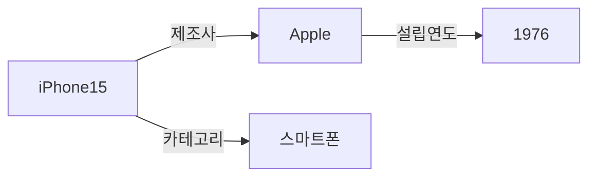

# SPEC-CONTENT-P4: Phase 4 MDX Content Generation -- "Standards and Language Ecosystem"

## Overview

This SPEC defines the complete MDX content generation for Phase 4 of the Ontology Fundamentals Learning Platform. Phase 4 covers the ontology standards stack: RDF, RDFS, OWL, SPARQL, serialization formats, and key tools. The content targets Korean-speaking learners who have completed Phases 1-3 (motivation, building blocks, logical foundations) and are now ready to learn the concrete languages and tools used in practice.

This SPEC produces 8 MDX files that will be placed in `content/phase-4/`. Each file is a fully written educational session with Korean explanations, English technical terms, Mermaid diagrams, code examples, callouts, and exercises.

**Scope boundary:** This SPEC covers content authoring only. Infrastructure, components, styling, and build configuration are handled by SPEC-INFRA-001.

**Phase 3 connection:** Learners now understand that reasoning is possible. Phase 4 teaches the concrete languages that express ontological knowledge for machines to process.

---

## Environment

### Content Platform

- **Framework:** Nextra 4.x with Next.js 15 App Router (established by SPEC-INFRA-001)
- **Content Format:** MDX files in `content/phase-4/` directory
- **Content Language:** Korean (all explanations), English (technical terms with Korean definition on first use)
- **Diagram Engine:** Mermaid 11.12.2 (client-side rendering via MermaidDiagram component)
- **Target Audience:** Korean-speaking learners who completed Phases 1-3, with developing ontology knowledge
- **Code Examples:** Turtle (.ttl), SPARQL, JSON-LD, RDF/XML, N-Triples syntax with proper syntax highlighting

### Content Quality Standards (per session)

| Element | Minimum Count | Format |
|---------|---------------|--------|
| "왜 필요한가?" blockquotes | 3 per session | `> **왜 필요한가?** [explanation]` |
| "연결 포인트" callouts | 2 per session | `> **연결 포인트 -> Phase [N]**: [connection]` |
| "흔한 오해" section | 1 per session | `> **흔한 오해**: "[misconception]"` / `> **실제로는**: [correction]` |
| Mermaid diagram | 1 per session | labeled "이번 세션 전체 그림" |
| Concept explanation depth | 300-500 words each | Principle-oriented, with analogies |

### Narrative Arc (mandatory per concept)

Every major concept follows this structure:
1. **Problem first**: Describe the limitation of the previous approach or layer
2. **Concept introduction**: Present the new standard/language as the solution
3. **Why this matters**: Explain practical impact with real-world examples
4. **Code example**: Show concrete syntax in Turtle, SPARQL, or other relevant format
5. **Connection forward**: Link to where this concept leads in later phases

---

## Assumptions

### A-001: Infrastructure Ready

SPEC-INFRA-001 has been implemented. The `content/phase-4/` directory exists with skeleton MDX files (or will be created), `_meta.js` navigation is configured, the MermaidDiagram component is functional, and `mdx-components.tsx` makes custom components available globally.

### A-002: No JSX Imports

Per SPEC-INFRA-001 constraint C-002, MDX files must not contain `import` statements. All components are globally available. Callouts and special formatting use blockquote `>` syntax exclusively.

### A-003: Mermaid Safe Syntax

Mermaid diagrams must follow safe syntax rules:
- No apostrophes in node labels
- No `+` operator in `stateDiagram-v2`
- Use `["double quoted labels"]` for labels with special characters
- Allowed types: `graph TD`, `graph LR`, `sequenceDiagram`, `stateDiagram-v2`, `erDiagram`, `classDiagram`

### A-004: Phases 1-3 Completed by Learner

Learners entering Phase 4 understand:
- Why ontology exists (Phase 1: motivation, interoperability, Gruber's definition)
- Ontology building blocks (Phase 2: classes, instances, properties, axioms)
- Logical foundations (Phase 3: description logic, reasoning, reasoners)
- Phase 4 builds on Phase 3 by introducing the concrete W3C standard languages

### A-005: Audience Knowledge Level

Readers now have foundational ontology knowledge from Phases 1-3. They understand concepts like classes, properties, axioms, and reasoning. They may have programming background (Python for RDFLib exercises). Technical syntax (Turtle, SPARQL) will be new but conceptual foundations are established.

### A-006: Curriculum Source

All Phase 4 content follows the curriculum defined in `my-docs/edu-content.md`, specifically the "Phase 4 -- Standards and Language Ecosystem" section covering sessions 4-1 through 4-6 plus exercises and competency questions.

### A-007: Code Syntax Highlighting

Code blocks use standard Markdown code fences with language identifiers:
- ` ```turtle ` for Turtle (.ttl) syntax
- ` ```sparql ` for SPARQL queries
- ` ```json ` for JSON-LD examples
- ` ```xml ` for RDF/XML examples
- ` ```ntriples ` or ` ```text ` for N-Triples
- ` ```python ` for RDFLib examples

---

## Requirements

### R-001: Complete Phase 4 Content Set [UBIQUITOUS]

The system shall provide 8 fully written MDX files for Phase 4.

**Files:**

| File | Session Title (Korean) | Topic |
|------|----------------------|-------|
| `00-introduction.mdx` | Phase 4 개요: 표준과 언어 생태계 | Phase 4 overview, RDF->RDFS->OWL layer structure introduction |
| `01-rdf.mdx` | RDF: 지식 표현의 기본 단위 | RDF triples, URIs, graph structure |
| `02-rdfs.mdx` | RDFS: 계층 구조를 추가하다 | RDFS vocabulary, subclass/subproperty, domain/range |
| `03-owl.mdx` | OWL: 본격적인 온톨로지 언어 | OWL variants (Lite, DL, Full), OWL 2 profiles |
| `04-sparql.mdx` | SPARQL: 온톨로지에 질문하는 방법 | SPARQL query language, endpoints, SPARQL 1.1 |
| `05-serialization.mdx` | 직렬화 포맷 비교 | Turtle, JSON-LD, RDF/XML, N-Triples comparison |
| `06-tools-software.mdx` | 주요 도구 소개 | Protege, Apache Jena, RDFLib, triplestores |
| `07-exercises.mdx` | Phase 4 실습 + 핵심 질문 | Exercises and competency questions |

### R-002: Korean Content with English Technical Terms [UBIQUITOUS]

Each session shall present all explanations in Korean. English technical terms shall be introduced in parentheses on first use with a Korean definition, then may be used freely afterward.

**First-use format example:**
- "트리플(Triple) -- 주어, 술어, 목적어로 구성된 지식 표현의 최소 단위"
- "직렬화(Serialization) -- 그래프 구조의 데이터를 텍스트 파일로 변환하는 과정"
- "트리플스토어(Triplestore) -- RDF 트리플을 저장하고 SPARQL로 질의할 수 있는 데이터베이스"

**Phase 4 key terms to introduce:**
- 트리플(Triple)
- URI(Uniform Resource Identifier)
- 주어(Subject), 술어(Predicate), 목적어(Object)
- 지식 그래프(Knowledge Graph)
- 리소스(Resource)
- rdfs:subClassOf, rdfs:subPropertyOf, rdfs:domain, rdfs:range
- 기술 논리(Description Logic)
- 프로파일(Profile) -- OWL 2 profiles context
- 직렬화(Serialization)
- 트리플스토어(Triplestore)
- SPARQL 엔드포인트(SPARQL Endpoint)
- 추론기(Reasoner) -- recap from Phase 3

### R-003: "왜 필요한가?" Motivation Blockquotes [EVENT-DRIVEN]

**When** a learner reads any session, **the system shall** present at least 3 "왜 필요한가?" blockquotes that explain the motivation for each concept before introducing the solution.

**Format:**
```markdown
> **왜 필요한가?** [explanation of why this standard/language matters in practical terms]
```

**Placement rule:** Each "왜 필요한가?" blockquote must appear BEFORE the concept explanation it motivates, not after.

### R-004: Mermaid Big-Picture Diagram [UBIQUITOUS]

Each session shall include exactly one Mermaid diagram labeled "이번 세션 전체 그림" using safe Mermaid syntax.

**Diagram requirements per session:**

| Session | Diagram Type | Content Description |
|---------|-------------|-------------------|
| 00-introduction | `graph TD` | RDF->RDFS->OWL layer stack with SPARQL and serialization as cross-cutting |
| 01-rdf | `graph LR` | Triple structure visualization: Subject--Predicate-->Object with URI labels |
| 02-rdfs | `graph TD` | RDFS hierarchy showing subClassOf chain with domain/range annotations |
| 03-owl | `graph TD` | OWL layer stack: OWL Lite -> OWL DL -> OWL Full with OWL 2 profiles branching |
| 04-sparql | `graph LR` | SPARQL query flow: User Query -> Triple Pattern Matching -> Result Set |
| 05-serialization | `graph LR` | Same RDF graph shown in 4 serialization format nodes converging to single "Same Information" |
| 06-tools-software | `graph TD` | Tool learning path: Protege -> RDFLib -> Triplestore with tool categories |
| 07-exercises | `graph TD` | Phase 4 complete concept map connecting all standards, languages, and tools |

### R-005: No JSX Imports [UNWANTED]

MDX sessions **shall NOT** use JSX import statements. All custom components (MermaidDiagram, Exercise, ConceptCard, CompetencyQuestion) are globally available via `mdx-components.tsx`. Callouts use blockquote `>` syntax.

### R-006: "연결 포인트" Forward References [UBIQUITOUS]

Each session shall include at least 2 "연결 포인트" callouts connecting the current concept to future phases or referencing prior phases.

**Format:**
```markdown
> **연결 포인트 -> Phase [N]**: [what the learner will learn in that future phase and how it connects to the current concept]
```

### R-007: "흔한 오해" Misconception Sections [UBIQUITOUS]

Each session shall include at least 1 "흔한 오해" (common misconception) section with the misconception stated, then corrected.

**Format:**
```markdown
> **흔한 오해**: "[commonly held incorrect belief]"
> **실제로는**: [correct explanation with reasoning]
```

### R-008: Session 00-introduction.mdx Content [UBIQUITOUS]

The introduction session shall provide:
- Phase 4 title and subtitle in Korean
- Clear statement of Phase 4 learning objective: "온톨로지 관련 표준 스택을 보고 무엇이 무엇인지 구분하고 선택할 수 있다"
- Phase 3 connection: "추론이 가능하다는 것을 알았다면, 이제 그것을 실제로 표현하는 언어를 배워야 한다"
- Brief overview of each of the 7 content sessions (01-07)
- "이번 Phase를 마치면 답할 수 있는 질문" section listing the 4 competency questions
- RDF->RDFS->OWL layer stack Mermaid diagram showing the standards hierarchy
- Explanation of why understanding the "layer cake" is essential for practical ontology work
- At least 3 "왜 필요한가?" blockquotes
- At least 2 "연결 포인트" callouts
- At least 1 "흔한 오해" section

### R-009: Session 01-rdf.mdx Content [UBIQUITOUS]

The RDF session shall cover RDF as the foundational knowledge representation unit:

**Required content blocks:**

1. **Triple concept (detailed):**
   - All knowledge expressed as Subject--Predicate--Object triples
   - Examples: `<iPhone15> <제조사> <Apple>`, `<Apple> <설립연도> "1976"`
   - Explain the difference between object resources (URI) and literal values (strings, numbers)
   - Korean manufacturing example: `<삼성전자_수원공장> <생산제품> <갤럭시S25>`

2. **URI concept (detailed):**
   - Every entity identified by a globally unique URI
   - Like a web address but for any concept, not just web pages
   - Namespace prefixes for readability (e.g., `ex:`, `foaf:`, `rdf:`)
   - Why global uniqueness matters for interoperability (callback to Phase 1)

3. **Graph structure:**
   - Triples form a directed graph (nodes and edges)
   - Multiple triples about the same subject create a rich description
   - Show how triples accumulate into a knowledge graph
   - Contrast with tabular (database) representation

4. **RDF limitations:**
   - RDF alone has no reasoning capability
   - Cannot express "Dog is a subclass of Animal" in RDF alone
   - Needs RDFS/OWL layers for richer semantics
   - RDF is the foundation but not sufficient alone

5. **Turtle syntax examples:**
   - Show the same triples in Turtle format
   - Explain prefix declarations, semicolons for same-subject shortcuts
   - Annotated code block with Korean comments

6. **Mermaid diagram:**
   - `graph LR` visualizing RDF triples as a graph
   - Subject nodes connected to Object nodes via Predicate edges
   - Korean labels showing the triple structure

### R-010: Session 02-rdfs.mdx Content [UBIQUITOUS]

The RDFS session shall cover RDFS as the hierarchical extension to RDF:

**Required content blocks:**

1. **RDFS vocabulary (detailed):**
   - `rdfs:subClassOf` -- "개는 동물의 하위 클래스" (Dog subClassOf Animal)
   - `rdfs:subPropertyOf` -- property hierarchy
   - `rdfs:domain` -- which class a property applies to
   - `rdfs:range` -- what type a property value must be
   - Each with concrete Korean examples and Turtle code

2. **Hierarchy and inheritance:**
   - How `subClassOf` chains enable class hierarchies
   - Inheritance of properties through the hierarchy
   - Example: Animal -> Mammal -> Dog hierarchy with inherited properties
   - Manufacturing example: Equipment -> Machine -> CNC Machine

3. **Limited reasoning with RDFS:**
   - RDFS supports inheritance-based reasoning (if Dog subClassOf Animal, then all Dogs are Animals)
   - But RDFS cannot express: disjointness, cardinality, equivalence
   - When RDFS is sufficient: simple classification systems, library catalogs, basic taxonomies
   - When you need OWL: complex constraints, formal reasoning, rich relationships

4. **RDFS vs. OWL expressivity comparison:**
   - What RDFS can express vs. what it cannot
   - The trade-off: simplicity vs. expressivity
   - Decision guide: when to use RDFS alone vs. when to upgrade to OWL

5. **Turtle code examples:**
   - RDFS vocabulary used in Turtle syntax
   - Show a small class hierarchy with domain/range constraints
   - Annotated with Korean explanations

6. **Mermaid diagram:**
   - `graph TD` showing RDFS hierarchy (e.g., Animal -> Mammal -> Dog) with domain/range annotations on properties

### R-011: Session 03-owl.mdx Content [UBIQUITOUS]

The OWL session shall cover OWL as the full ontology language:

**Required content blocks:**

1. **OWL overview:**
   - W3C standard built on Description Logic (callback to Phase 3)
   - Purpose: guarantee reasoning capability with formal semantics
   - Why OWL exists: RDFS is not expressive enough for real-world ontology needs

2. **OWL species/variants (detailed):**
   - **OWL Lite:** Simple hierarchies and constraints, low reasoning cost
     - Use case: simple classification with basic cardinality (0 or 1)
   - **OWL DL:** Complete reasoning guaranteed, decidable, most widely used in practice
     - Use case: industrial ontologies, medical ontologies, any project needing reliable reasoning
   - **OWL Full:** Unrestricted expressivity, but no reasoning completeness guarantee
     - Use case: research scenarios where expressivity matters more than complete reasoning
   - Why OWL DL is the sweet spot: balance of expressivity and computational tractability

3. **OWL 2 profiles (detailed):**
   - **OWL 2 EL:** Efficient classification, large ontologies (e.g., SNOMED CT)
   - **OWL 2 QL:** Efficient query answering over large datasets (SPARQL-like workloads)
   - **OWL 2 RL:** Rule-based reasoning, implementable with rule engines
   - Each profile trades some expressivity for better computational performance
   - Decision guide table: choose EL for large taxonomies, QL for query-heavy systems, RL for rule-based systems

4. **Selection criteria:**
   - Need reasoning? -> OWL DL
   - Simple structure only? -> RDFS
   - Web exposure purpose? -> Schema.org (brief mention, detailed in Phase 6)
   - Large taxonomy? -> OWL 2 EL
   - Query-heavy? -> OWL 2 QL

5. **OWL syntax examples:**
   - Show key OWL constructs in Turtle/OWL syntax
   - `owl:Class`, `owl:ObjectProperty`, `owl:DatatypeProperty`
   - Restrictions: `owl:someValuesFrom`, `owl:allValuesFrom`, `owl:cardinality`
   - Annotated with Korean explanations

6. **Mermaid diagram:**
   - `graph TD` showing OWL layer stack: OWL Lite at bottom, OWL DL in middle, OWL Full at top
   - OWL 2 profiles (EL, QL, RL) branching from the side
   - Each node annotated with key characteristic in Korean

### R-012: Session 04-sparql.mdx Content [UBIQUITOUS]

The SPARQL session shall cover SPARQL as the query language for ontologies:

**Required content blocks:**

1. **SPARQL as "SQL for RDF":**
   - Triple pattern-based querying
   - Basic structure: `SELECT ?variables WHERE { triple patterns }`
   - Example: `SELECT ?x WHERE { ?x rdf:type :스마트폰 . ?x :제조사 :Apple }`
   - Comparison with SQL to leverage existing database knowledge

2. **SPARQL query types:**
   - `SELECT` -- return variable bindings (most common)
   - `CONSTRUCT` -- return an RDF graph
   - `ASK` -- return boolean (yes/no)
   - `DESCRIBE` -- return description of a resource
   - Each with a concrete example and Korean explanation

3. **SPARQL 1.1 features:**
   - Aggregation: `COUNT`, `SUM`, `AVG`, `GROUP BY`
   - Subqueries: queries within queries
   - `SPARQL Update`: `INSERT DATA`, `DELETE DATA` for modifying triples
   - `FILTER`, `OPTIONAL`, `UNION` for complex patterns

4. **SPARQL Endpoints:**
   - Concept: a URL where you can send SPARQL queries to public ontologies
   - DBpedia SPARQL Endpoint
   - Wikidata Query Service (https://query.wikidata.org)
   - How to execute queries against public endpoints
   - "SPARQL을 모르면 온톨로지를 '읽기 전용'으로밖에 쓸 수 없다"

5. **Practical SPARQL examples:**
   - Query 1: Find all smartphones manufactured by Apple
   - Query 2: Count products by manufacturer
   - Query 3: Find all subclasses of a given class
   - Each with full SPARQL code block and Korean annotation

6. **Mermaid diagram:**
   - `graph LR` showing SPARQL query flow: User writes query -> Triple pattern matching against RDF graph -> Result set returned

### R-013: Session 05-serialization.mdx Content [UBIQUITOUS]

The serialization session shall compare RDF serialization formats:

**Required content blocks:**

1. **Core insight: same information, different notation:**
   - All formats represent the same RDF graph
   - Choice of format depends on use case, not information content
   - Analogy: like saving the same photo as JPEG, PNG, or TIFF

2. **Turtle (.ttl) -- detailed:**
   - Most human-readable format
   - Best for learning and manual editing
   - Prefix declarations, semicolons for same-subject, commas for same-predicate
   - Complete annotated example (5-10 triples) with Korean comments

3. **JSON-LD -- detailed:**
   - JSON format familiar to web developers
   - Schema.org recommends this format
   - `@context` for namespace mapping
   - Complete annotated example showing the same triples as the Turtle example
   - Why web developers prefer it: fits into existing JSON workflows

4. **RDF/XML -- detailed:**
   - Original W3C standard format
   - Good for machine processing, poor for human reading
   - Complete annotated example showing the same triples
   - Why it still exists: legacy systems, some tools default to it

5. **N-Triples -- detailed:**
   - Simplest possible format: one triple per line, full URIs
   - Best for large-scale batch processing
   - Complete annotated example showing the same triples
   - Use case: data pipelines, bulk loading into triplestores

6. **Comparison table:**
   - Rows: Turtle, JSON-LD, RDF/XML, N-Triples
   - Columns: Human readability, Machine processing, File size, Use case, Learning recommendation

7. **Mermaid diagram:**
   - `graph LR` showing the same RDF graph node connected to 4 serialization format nodes, all converging to "Same Information" center

### R-014: Session 06-tools-software.mdx Content [UBIQUITOUS]

The tools session shall introduce key ontology software:

**Required content blocks:**

1. **Protege (detailed):**
   - Free, open-source ontology editor from Stanford
   - GUI-based design and editing
   - Built-in reasoner integration (HermiT, Pellet)
   - Visualization of class hierarchies
   - Recommended as the first tool to learn
   - Brief usage walkthrough description (not installation guide)

2. **Apache Jena (detailed):**
   - Java-based RDF/OWL processing framework
   - Components: Jena API, ARQ (SPARQL engine), TDB (triplestore), Fuseki (SPARQL server)
   - Use case: production-grade Java applications
   - When to use: enterprise systems, large-scale processing

3. **RDFLib (detailed):**
   - Python-based RDF library
   - Script-based ontology processing
   - Parse, create, query RDF graphs with Python
   - Use case: data science, scripting, quick prototyping
   - Code example: loading a Turtle file and running a SPARQL query
   - Recommended as the second tool to learn after Protege

4. **Triplestores (detailed):**
   - GraphDB, Stardog, Blazegraph, Apache Jena Fuseki
   - Provide SPARQL Endpoints for stored RDF data
   - Reasoning support varies by product
   - Use case: production deployment of ontology-based systems
   - Brief comparison of key features

5. **Learning path recommendation:**
   - Step 1: Protege (visual understanding, no code needed)
   - Step 2: RDFLib (programmatic access, Python scripting)
   - Step 3: Triplestore (production deployment, SPARQL endpoints)
   - Each step with rationale for the ordering

6. **Mermaid diagram:**
   - `graph TD` showing the recommended learning path with tool categories (Editor, Library, Database) as groupings

### R-015: Session 07-exercises.mdx Content [UBIQUITOUS]

The exercises session shall include both practice exercises and Phase 4 competency questions:

**Required content blocks:**

1. **Phase 4 recap section:**
   - Brief summary of what was covered in sessions 01-06
   - Visual concept map (Mermaid diagram) connecting all Phase 4 standards, languages, and tools

2. **Basic exercises (기본 실습):**

   Exercise 1: Turtle Triple Writing
   - Task: Write 10 triples in Turtle format from your own domain (e.g., your workplace, hobby, university)
   - Guidance: Use at least 3 different predicates, include both URI objects and literal values
   - Example answer format provided (3-4 example triples as template)
   - Include prefix declaration template

   Exercise 2: RDFLib SPARQL Practice
   - Task: Using RDFLib (Python), load the Turtle file from Exercise 1 and execute 3 SPARQL queries
   - Query 1: Find all instances of a specific type
   - Query 2: Find all properties of a specific instance
   - Query 3: Count instances by type
   - Provide Python code template with Korean comments
   - Expected output description

3. **Challenge exercise (도전 실습):**

   Exercise 3: Wikidata SPARQL Endpoint
   - Task: Execute a real SPARQL query against https://query.wikidata.org
   - Provide 2 example queries to try:
     - Query A: Find all Korean universities with their founding years
     - Query B: Find all programming languages created after 2010
   - Step-by-step instructions for using the Wikidata Query Service web interface
   - Encourage modifying queries to explore different topics

4. **Competency questions (핵심 질문) -- Phase 4 pass criteria:**

   Question 1: "RDF, RDFS, OWL의 관계를 '층을 쌓는' 방식으로 설명하라."
   - Guidance: Think about what each layer adds. RDF provides triples, RDFS adds hierarchy, OWL adds full reasoning.
   - Reference: Sessions 01, 02, 03

   Question 2: "OWL DL과 OWL Full 중 실무에서 OWL DL을 선호하는 이유는 무엇인가?"
   - Guidance: Think about the trade-off between expressivity and decidability/reasoning completeness.
   - Reference: Session 03

   Question 3: "SPARQL에서 `?x rdf:type :스마트폰`은 무엇을 의미하는가?"
   - Guidance: Break down each part: ?x is a variable, rdf:type is the predicate, :스마트폰 is the class.
   - Reference: Session 04

   Question 4: "JSON-LD가 웹 개발자들에게 선호되는 이유는 무엇인가?"
   - Guidance: Think about the format (JSON), existing toolchains, Schema.org compatibility.
   - Reference: Session 05

5. **Self-assessment checklist:**
   - "I can write RDF triples in Turtle format for my own domain"
   - "I can explain the difference between RDF, RDFS, and OWL in terms of what each layer adds"
   - "I can write basic SPARQL SELECT queries"
   - "I can choose the appropriate serialization format for a given use case"
   - "I know the recommended order for learning ontology tools"

---

## Specifications

### S-001: MDX Frontmatter Structure

Each MDX file shall have YAML frontmatter:

```yaml
---
title: "[Korean session title]"
description: "[Korean description for search indexing, 50-100 chars]"
difficulty: "intermediate"
---
```

Note: Phase 4 uses `difficulty: "intermediate"` as it builds on Phases 1-3.

### S-002: Session Content Structure Template

Each content session (01-06) follows this structure:

```markdown
---
title: "[Title]"
description: "[Description]"
difficulty: "intermediate"
---

# [Session Number]회차: [Korean Title]

## 학습 목표

(3 bullet points describing what the learner will achieve)

> **왜 필요한가?** [Opening motivation before first concept]

## 이번 세션 전체 그림

(Mermaid diagram code block)

## [First Major Concept Heading]

> **왜 필요한가?** [Motivation for this specific concept]

(300-500 word explanation with code examples and analogies)

> **연결 포인트 -> Phase [N]**: [Forward reference]

## [Second Major Concept Heading]

> **왜 필요한가?** [Motivation for this specific concept]

(300-500 word explanation with code examples and analogies)

## [Additional Concept Headings as needed]

> **연결 포인트 -> Phase [N]**: [Forward reference]

## 흔한 오해

> **흔한 오해**: "[Misconception]"
> **실제로는**: [Correct explanation]

(Additional misconceptions if relevant)

## 요약

(Concise summary of key takeaways, 3-5 bullet points)

## 다음 세션 예고

(Brief preview of what comes next and why it matters)
```

### S-003: Introduction Session Structure (00-introduction.mdx)

```markdown
---
title: "Phase 4 개요: 표준과 언어 생태계"
description: "RDF, RDFS, OWL, SPARQL 등 온톨로지 표준 스택 학습 안내"
difficulty: "intermediate"
---

# Phase 4: 표준과 언어 생태계

## 이 Phase에서 배우는 것

(Phase 4 learning objective and overview)
(Phase 3 connection statement)

> **왜 필요한가?** [Why learning concrete standards matters after understanding reasoning]

## 이번 세션 전체 그림

(RDF->RDFS->OWL layer stack Mermaid diagram)

## 세션 구성

(Overview of 7 content sessions with brief descriptions)

## 이번 Phase를 마치면 답할 수 있는 질문

(4 competency questions listed)

## 흔한 오해

> **흔한 오해**: "[Misconception about standards]"
> **실제로는**: [Correction]

> **연결 포인트 -> Phase 5**: [Preview of design methodology]
> **연결 포인트 -> Phase 7**: [Preview of real-world applications]
```

### S-004: Exercise Session Structure (07-exercises.mdx)

```markdown
---
title: "Phase 4 실습 + 핵심 질문"
description: "Phase 4 표준과 도구를 실습하고 역량을 확인하는 종합 실습"
difficulty: "intermediate"
---

# Phase 4 종합 실습

## 이번 세션 전체 그림

(Phase 4 concept map Mermaid diagram)

## Phase 4 핵심 요약

(Brief recap of all Phase 4 sessions)

## 기본 실습

### 실습 1: Turtle 형식 Triple 작성
### 실습 2: RDFLib + SPARQL 질의

## 도전 실습

### 실습 3: Wikidata SPARQL Endpoint 실전 질의

## 핵심 질문 (Phase 4 통과 기준)

### 질문 1: [Question]
### 질문 2: [Question]
### 질문 3: [Question]
### 질문 4: [Question]

## 자가 점검 체크리스트

(Self-assessment checklist)

## 다음 Phase 예고

> **연결 포인트 -> Phase 5**: [What comes next]
```

### S-005: Mermaid Syntax Constraints

All Mermaid diagrams must follow these rules:
- No apostrophes (`'`) anywhere in diagram code
- No `+` operator in `stateDiagram-v2`
- Use `["double quoted labels"]` for labels with Korean characters or special characters
- Test every diagram mentally for syntax validity before writing
- Wrap in standard markdown code fences with `mermaid` language identifier

**Example safe pattern for RDF triple visualization:**


### S-006: Content Depth Requirements

Each major concept explanation (not including callouts, exercises, or summaries) shall be 300-500 words and include:
- At least 1 code example (Turtle, SPARQL, or other relevant syntax)
- At least 1 real-world analogy or practical use case
- The "problem first, solution second" narrative arc
- Concrete examples, not abstract definitions
- Connection to why this matters for the learner's practical work

### S-007: Technical Term Introduction Pattern

On first use of any English technical term:
```
한국어_용어(English_Term) -- 한국어로 된 간결한 정의
```

After first introduction, either the Korean term or English term may be used freely.

### S-008: Code Example Requirements

Each code example shall:
- Use proper syntax highlighting via markdown code fence language identifier
- Include Korean inline comments explaining key lines
- Be self-contained (runnable as shown, with any required prefixes included)
- Show realistic data relevant to Korean contexts where applicable
- For Turtle: always include `@prefix` declarations
- For SPARQL: always include `PREFIX` declarations
- For Python/RDFLib: include necessary import statements

---

## Constraints

### C-001: No Implementation Code

This SPEC produces MDX content files only. No TypeScript, JavaScript, CSS, or configuration file changes.

### C-002: File Path Convention

Generated content must follow exact file paths:
- `content/phase-4/00-introduction.mdx`
- `content/phase-4/01-rdf.mdx`
- `content/phase-4/02-rdfs.mdx`
- `content/phase-4/03-owl.mdx`
- `content/phase-4/04-sparql.mdx`
- `content/phase-4/05-serialization.mdx`
- `content/phase-4/06-tools-software.mdx`
- `content/phase-4/07-exercises.mdx`

### C-003: Mermaid Safe Syntax (inherited from SPEC-INFRA-001)

- FORBIDDEN: Apostrophes in Mermaid node labels
- FORBIDDEN: `+` in stateDiagram-v2
- Use `["double quoted labels"]` for labels with special characters
- Safe types: `graph TD`, `graph LR`, `sequenceDiagram`, `stateDiagram-v2`, `erDiagram`

### C-004: No JSX Imports (inherited from SPEC-INFRA-001)

MDX files must not contain `import` statements. All components available via `mdx-components.tsx`.

### C-005: Word Count Target

Total Phase 4 content (all 8 files combined): approximately 12,000-18,000 Korean words. Individual session targets:
- 00-introduction: 800-1,200 words
- 01-rdf: 2,000-3,000 words (many code examples)
- 02-rdfs: 1,500-2,500 words
- 03-owl: 2,000-3,000 words (complex topic with multiple variants)
- 04-sparql: 2,000-3,000 words (many query examples)
- 05-serialization: 1,500-2,500 words (4 format comparisons with code)
- 06-tools-software: 1,500-2,000 words
- 07-exercises: 1,500-2,500 words

### C-006: Technical Accuracy

- W3C standards must be described accurately (RDF 1.1, RDFS, OWL 2, SPARQL 1.1)
- OWL species distinctions (Lite, DL, Full) must be technically correct regarding decidability and reasoning completeness
- OWL 2 profiles (EL, QL, RL) must accurately describe their computational properties
- SPARQL syntax must be valid and executable
- Turtle syntax must conform to W3C Turtle specification
- JSON-LD examples must include valid `@context` declarations
- Wikidata SPARQL Endpoint URL (https://query.wikidata.org) must be correct

### C-007: Consistent Cross-References

- Forward references must only point to phases that exist in the curriculum (Phase 5-8)
- Backward references to Phases 1-3 must be accurate
- Session-to-session references within Phase 4 must use relative links
- Competency questions in exercises must match the questions listed in the curriculum document

### C-008: Code Example Consistency

- All serialization format examples (Turtle, JSON-LD, RDF/XML, N-Triples) in session 05 must represent the SAME set of triples so learners can compare directly
- SPARQL query examples must be executable against the RDF data shown in earlier sessions
- RDFLib Python code must be compatible with current RDFLib (6.x+) API

---

## Traceability

| Requirement | Plan Reference | Acceptance Reference |
|-------------|---------------|---------------------|
| R-001 | Plan: Session Overview | AC-001 |
| R-002 | Plan: All Sessions | AC-002 |
| R-003 | Plan: All Sessions | AC-003 |
| R-004 | Plan: Diagram Specs | AC-004 |
| R-005 | Plan: All Sessions | AC-005 |
| R-006 | Plan: All Sessions | AC-006 |
| R-007 | Plan: All Sessions | AC-007 |
| R-008 | Plan: Session 00 | AC-008 |
| R-009 | Plan: Session 01 | AC-009 |
| R-010 | Plan: Session 02 | AC-010 |
| R-011 | Plan: Session 03 | AC-011 |
| R-012 | Plan: Session 04 | AC-012 |
| R-013 | Plan: Session 05 | AC-013 |
| R-014 | Plan: Session 06 | AC-014 |
| R-015 | Plan: Session 07 | AC-015 |

---

## Expert Consultation Recommendations

### Frontend Expert (expert-frontend)

This SPEC involves MDX content authoring within a Nextra 4.x site. Consulting expert-frontend is recommended for:
- Verifying Mermaid diagram rendering behavior within Nextra
- Ensuring code block syntax highlighting works for Turtle, SPARQL, JSON-LD, RDF/XML formats
- Validating MDX syntax compatibility with Nextra 4.x parser

### Content/Education Domain Expert

If available, consulting a subject matter expert in semantic web standards would be valuable for:
- Verifying W3C standard descriptions for accuracy
- Reviewing OWL species and OWL 2 profile descriptions
- Validating SPARQL query examples for correctness
- Ensuring the RDF->RDFS->OWL progression accurately represents the standards hierarchy
