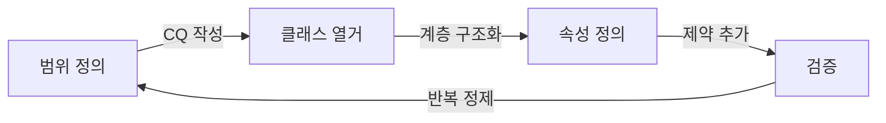

# SPEC-CONTENT-P5: Phase 5 MDX Content Generation -- "Ontology Design Methodology"

## Overview

This SPEC defines the complete MDX content generation for Phase 5 of the Ontology Fundamentals Learning Platform. Phase 5 covers ontology design methodology: how to systematically design a small domain ontology from scratch. The content follows a practitioner's workflow from process overview to quality evaluation.

**Learning objective:** Learners can independently design a small domain ontology using a systematic methodology.

**Phase 4 connection:** Phase 4 taught the standard languages (RDF, RDFS, OWL, SPARQL). Now learners know WHAT to write with -- Phase 5 teaches HOW to design what they write.

This SPEC produces 8 MDX files that replace the skeleton files created by SPEC-INFRA-001. Each file is a fully written educational session with Korean explanations, English technical terms, Mermaid diagrams, callouts, and exercises.

**Scope boundary:** This SPEC covers content authoring only. Infrastructure, components, styling, and build configuration are handled by SPEC-INFRA-001.

---

## Environment

### Content Platform

- **Framework:** Nextra 4.x with Next.js 15 App Router (established by SPEC-INFRA-001)
- **Content Format:** MDX files in `content/phase-5/` directory
- **Content Language:** Korean (all explanations), English (technical terms with Korean definition on first use)
- **Diagram Engine:** Mermaid 11.12.2 (client-side rendering via MermaidDiagram component)
- **Target Audience:** Korean-speaking beginners (25-50 years old) from manufacturing, AI, and knowledge management domains
- **Prerequisite knowledge:** Learners have completed Phase 1-4 and understand RDF/OWL basics, classes, properties, axioms, and SPARQL

### Content Quality Standards (per session)

| Element | Minimum Count | Format |
|---------|---------------|--------|
| "왜 필요한가?" blockquotes | 3 per session | `> **왜 필요한가?** [explanation]` |
| "연결 포인트" callouts | 2 per session | `> **연결 포인트 -> Phase [N]**: [connection]` |
| "흔한 오해" section | 1 per session | `> **흔한 오해**: "[misconception]"` / `> **실제로는**: [correction]` |
| Mermaid diagram | 1 per session | labeled "이번 세션 전체 그림" |
| Concept explanation depth | 300-500 words each | Principle-oriented, with analogies |

### "연결 포인트" Scope for Phase 5

Phase 5 "연결 포인트" callouts SHALL reference:
- **Phase 6:** Real standard ontology examples (FOAF, Schema.org, Gene Ontology, SNOMED CT) that demonstrate design methodology in practice
- **Phase 7:** Real-world applications (Knowledge Graphs, manufacturing, LLM era) where ontology design decisions have concrete impact

### Narrative Arc (mandatory per concept)

Every major concept follows this structure:
1. **Problem first**: Describe the limitation of ad-hoc or undisciplined approaches
2. **Concept introduction**: Present the methodology or technique as the solution
3. **Why this matters**: Explain practical impact with real-world design examples
4. **Connection forward**: Link to where this methodology applies in later phases

---

## Assumptions

### A-001: Infrastructure Ready

SPEC-INFRA-001 has been implemented. The `content/phase-5/` directory exists with skeleton MDX files, `_meta.js` navigation is configured, the MermaidDiagram component is functional, and `mdx-components.tsx` makes custom components available globally.

### A-002: No JSX Imports

Per SPEC-INFRA-001 constraint C-002, MDX files must not contain `import` statements. All components are globally available. Callouts and special formatting use blockquote `>` syntax exclusively.

### A-003: Mermaid Safe Syntax

Mermaid diagrams must follow safe syntax rules:
- No apostrophes in node labels
- No `+` operator in `stateDiagram-v2`
- Use `["double quoted labels"]` for labels with special characters
- Allowed types: `graph TD`, `graph LR`, `sequenceDiagram`, `stateDiagram-v2`, `erDiagram`, `classDiagram`

### A-004: Skeleton File Replacement

Each generated MDX file replaces the corresponding skeleton file in `content/phase-5/`. The YAML frontmatter structure (`title`, `description`, `difficulty`) established by SPEC-INFRA-001 is preserved, but content sections are fully written.

### A-005: Audience Knowledge Level

Readers have completed Phases 1-4 and understand:
- Why ontology is needed (Phase 1)
- Ontology building blocks: classes, instances, properties, axioms, hierarchy (Phase 2)
- Logical foundations: Description Logic, OWA/CWA, reasoning, reasoners (Phase 3)
- Standards and languages: RDF, RDFS, OWL, SPARQL, serialization, tools like Protege (Phase 4)

They are now ready to learn systematic DESIGN methodology -- the "how to build" knowledge that bridges language mastery to practical ontology engineering.

### A-006: Curriculum Source

All Phase 5 content follows the curriculum defined in the Phase 5 section of the educational content plan, covering sessions 5-0 through 5-7 including exercises and competency questions.

---

## Requirements

### R-001: Complete Phase 5 Content Set [UBIQUITOUS]

The system shall provide 8 fully written MDX files for Phase 5 that replace the skeleton content from SPEC-INFRA-001.

**Files:**

| File | Session Title (Korean) | Topic |
|------|----------------------|-------|
| `00-introduction.mdx` | Phase 5 개요: 설계 프로세스 전체 흐름 | Phase 5 overview, design process flow, learning objectives |
| `01-methontology.mdx` | 온톨로지 개발 프로세스 개요 | METHONTOLOGY, Ontology 101, common development flow |
| `02-competency-questions.mdx` | 범위 정의: Competency Questions | Defining scope through competency questions |
| `03-top-down-design.mdx` | 상향식 vs 하향식 vs 중간 방식 설계 | Three design strategies comparison |
| `04-bottom-up-design.mdx` | 기존 온톨로지 재사용 전략 | Reuse strategies: owl:imports, mapping, repositories |
| `05-anti-patterns.mdx` | 흔한 설계 실수와 안티패턴 | Common design mistakes and anti-patterns |
| `06-quality-criteria.mdx` | 온톨로지 품질 평가 기준 | Quality evaluation criteria: accuracy, completeness, consistency, conciseness, extensibility |
| `07-exercises.mdx` | Phase 5 실습 + 핵심 질문 | Exercises, competency questions, self-assessment |

### R-002: Korean Content with English Technical Terms [UBIQUITOUS]

Each session shall present all explanations in Korean. English technical terms shall be introduced in parentheses on first use with a Korean definition, then may be used freely afterward.

**First-use format example:**
- "역량 질문(Competency Question) -- 온톨로지가 답할 수 있어야 하는 질문의 목록"
- "안티패턴(Anti-pattern) -- 반복적으로 나타나는 잘못된 설계 패턴"

### R-003: "왜 필요한가?" Motivation Blockquotes [EVENT-DRIVEN]

**When** a learner reads any session, **the system shall** present at least 3 "왜 필요한가?" blockquotes that explain the motivation for each concept before introducing the solution.

**Format:**
```markdown
> **왜 필요한가?** [explanation of why this concept matters in practical terms]
```

**Placement rule:** Each "왜 필요한가?" blockquote must appear BEFORE the concept explanation it motivates, not after.

### R-004: Mermaid Big-Picture Diagram [UBIQUITOUS]

Each session shall include exactly one Mermaid diagram labeled "이번 세션 전체 그림" using safe Mermaid syntax.

**Diagram requirements per session:**

| Session | Diagram Type | Content Description |
|---------|-------------|-------------------|
| 00-introduction | `graph TD` | Phase 5 roadmap showing 7 sessions and their connections: process -> scope -> design strategies -> reuse -> quality |
| 01-methontology | `graph LR` | Ontology development lifecycle: Scope -> Search Existing -> Enumerate Classes -> Hierarchy -> Properties -> Constraints -> Instances -> Validate, with iteration arrow back to Scope |
| 02-competency-questions | `graph TD` | CQ derivation flow: Domain Analysis -> CQ Drafting -> CQ Refinement -> Scope Definition -> Design Guidance |
| 03-top-down-design | `graph TD` | Three-column comparison: Top-down (general to specific), Bottom-up (specific to general), Middle-out (core concepts expanding both directions) |
| 04-bottom-up-design | `graph LR` | Reuse workflow: Identify Need -> Search Repositories -> Evaluate Candidate -> Import/Map -> Verify Consistency |
| 05-anti-patterns | `graph TD` | Anti-pattern taxonomy: 4 categories of common mistakes branching from "Design Mistakes" root node |
| 06-quality-criteria | `graph TD` | Quality dimensions pentagon: Accuracy, Completeness, Consistency, Conciseness, Extensibility connected to central "Ontology Quality" node |
| 07-exercises | `graph TD` | Complete Phase 5 concept map: Methodology -> CQ -> Design Strategy -> Reuse -> Quality, connecting all concepts |

### R-005: No JSX Imports [UNWANTED]

MDX sessions **shall NOT** use JSX import statements. All custom components (MermaidDiagram, Exercise, ConceptCard, CompetencyQuestion) are globally available via `mdx-components.tsx`. Callouts use blockquote `>` syntax.

### R-006: "연결 포인트" Forward References [UBIQUITOUS]

Each session shall include at least 2 "연결 포인트" callouts connecting the current concept to Phase 6 (real standard ontology examples) and Phase 7 (real-world applications).

**Format:**
```markdown
> **연결 포인트 -> Phase [N]**: [what the learner will learn in that future phase and how it connects to the current concept]
```

### R-007: "흔한 오해" Misconception Sections [UBIQUITOUS]

Each session shall include at least 1 "흔한 오해" (common misconception) section with the misconception stated, then corrected.

**Format:**
```markdown
> **흔한 오해**: "[commonly held incorrect belief]"
> **실제로는**: [correct explanation with reasoning]
```

### R-008: Session 00-introduction.mdx Content [UBIQUITOUS]

The introduction session shall provide:
- Phase 5 title and subtitle in Korean
- Clear statement of Phase 5 learning objective: "스스로 작은 도메인 온톨로지를 체계적으로 설계할 수 있다"
- Phase 4 connection: "언어를 알았으니 이제 무엇을 어떻게 써야 할지 -- 설계 방법론이 필요하다"
- Brief overview of each of the 7 content sessions (01-07)
- "이번 Phase를 마치면 답할 수 있는 질문" section listing the 4 competency questions
- A Phase 5 roadmap Mermaid diagram
- At least 3 "왜 필요한가?" blockquotes
- At least 2 "연결 포인트" callouts
- At least 1 "흔한 오해" section

### R-009: Session 01-methontology.mdx Content [UBIQUITOUS]

The methodology overview session shall cover ontology development processes:

**Required content blocks:**

1. **METHONTOLOGY (1997) overview (300-500 words):**
   - Origin: Inspired by software engineering methodology (IEEE 1074)
   - Developed by Fernandez-Lopez, Gomez-Perez, and Juristo
   - Systematic process: planning, conceptualization, formalization, implementation, maintenance
   - Key contribution: Ontology development is an engineering discipline, not an art form
   - When to use: Large-scale, team-based ontology projects

2. **Ontology 101 / Noy & McGuinness (2001) overview (300-500 words):**
   - The most cited practical guide to ontology building
   - Developed at Stanford Knowledge Systems Laboratory
   - Pragmatic, step-by-step approach accessible to beginners
   - 7-step process focus: domain scope, reuse, enumerate terms, define classes, define properties, define constraints, create instances
   - When to use: Individual or small-team projects, learning purposes

3. **Common development flow (300-500 words):**
   - Despite different methodologies, the common thread:
     - Scope definition (what domain, what questions to answer)
     - Search for reusable existing ontologies
     - Enumerate key concepts (classes)
     - Define class hierarchy (is-a relationships)
     - Define properties (relationships and attributes)
     - Define constraints (cardinality, domain/range, axioms)
     - Add instances
     - Validate and iterate
   - Emphasis: This process is iterative, not waterfall. Return to earlier steps as understanding deepens.

4. **Iterative nature (200-300 words):**
   - Real ontology development cycles through these steps multiple times
   - Early versions are intentionally incomplete -- refine as domain understanding grows
   - Analogy: Like software agile development, not waterfall
   - Common mistake: Trying to get it perfect on the first pass

5. **Mermaid diagram:**
   - `graph LR` showing the common development flow as a cycle
   - Iteration arrow from "Validate" back to "Scope"
   - Korean labels for each step

### R-010: Session 02-competency-questions.mdx Content [UBIQUITOUS]

The competency questions session shall cover scope definition through CQs:

**Required content blocks:**

1. **What are Competency Questions? (300-500 words):**
   - Definition: Questions that the ontology must be able to answer
   - Purpose: Define scope BEFORE designing -- "이 온톨로지로 뭘 물어볼 수 있어야 하는가?"
   - Historical context: Gruninger & Fox (1995) introduced CQ methodology for TOVE ontology
   - Core insight: CQs are to ontology what user stories are to software development

2. **Smartphone parts ontology CQ examples (300-400 words):**
   - CQ1: "이 부품을 사용하는 모든 제품을 찾아라"
   - CQ2: "이 공정에서 발생할 수 있는 불량 유형은 무엇인가"
   - CQ3: "A 부품과 동일한 스펙을 가진 대체 부품은 무엇인가"
   - Show how each CQ implies specific classes, properties, and relationships
   - Demonstrate: CQ1 requires Product class, Part class, and usesPart relationship
   - Korean manufacturing context (삼성, LG 등 전자 제조 맥락)

3. **CQ quality criteria (200-300 words):**
   - Good CQ: Specific, answerable, scoped, verifiable via SPARQL
   - Bad CQ: Vague ("Tell me everything about parts"), unbounded, subjective
   - Rule of thumb: If you cannot imagine a SPARQL query answering the CQ, it is too vague
   - CQ refinement process: Start broad, then narrow

4. **CQ-driven scope control (300-400 words):**
   - The key insight: CQs that are clear lead to narrow, high-quality ontology design
   - CQs that are vague lead to scope creep and bloated ontologies
   - Practical technique: Write 5-10 CQs, then ask "Does concept X help answer any of my CQs?" -- if no, exclude it
   - Analogy: CQs are like test cases in TDD (Test-Driven Development) -- write the tests first, then build to pass them

5. **Mermaid diagram:**
   - `graph TD` showing CQ derivation flow from domain analysis through CQ drafting, refinement, to scope definition and design guidance

### R-011: Session 03-top-down-design.mdx Content [UBIQUITOUS]

The design strategies session shall compare three design approaches:

**Required content blocks:**

1. **Top-down (하향식) design (300-500 words):**
   - Start from the most general classes and specialize downward
   - Example: Start with "Product" -> "ElectronicProduct" -> "Smartphone" -> "FoldableSmartphone"
   - Advantage: Gives a clear overall picture from the start
   - Disadvantage: Early stages feel abstract and disconnected from concrete data
   - When to use: When the domain has well-established higher-level categories
   - Analogy: Like designing a building from the architectural plan down to individual rooms

2. **Bottom-up (상향식) design (300-500 words):**
   - Start from specific instances and group upward into classes
   - Example: Start with "Galaxy Z Fold 5", "iPhone 15 Pro" -> Group into "Smartphone" -> Group into "MobileDevice"
   - Advantage: Grounded in real data, practical from the start
   - Disadvantage: Hard to ensure consistent abstractions; different people may group differently
   - When to use: When you have lots of concrete data but no clear hierarchy
   - Analogy: Like organizing physical items by sorting into boxes, then labeling the boxes

3. **Middle-out (중간 방식) design (300-500 words):**
   - Start from the most stable, core concepts and expand both up and down
   - Example: Start with "Smartphone" (the concept everyone agrees on), then add "FoldableSmartphone" below and "MobileDevice" above
   - Advantage: Most stable starting point; recommended in practice
   - Disadvantage: Requires domain expertise to identify the "core" concepts
   - Why recommended: Core concepts are the most agreed-upon, reducing rework
   - Ontology 101 recommendation: Middle-out is the preferred approach in practice

4. **Comparison synthesis (200-300 words):**
   - When to choose each approach
   - Can combine approaches: start middle-out, then expand top-down for upper levels and bottom-up for leaf classes
   - Real projects often mix all three

5. **Mermaid diagram:**
   - `graph TD` showing three-column comparison of the three approaches
   - Visual representation of direction: arrows going down (top-down), up (bottom-up), both (middle-out)

### R-012: Session 04-bottom-up-design.mdx Content [UBIQUITOUS]

The ontology reuse session shall cover strategies for reusing existing ontologies:

**Required content blocks:**

1. **"Do not reinvent the wheel" principle (200-300 words):**
   - Why reuse matters: Quality, interoperability, community trust
   - The cost of building from scratch: more errors, less interoperability, wasted effort
   - Reuse is one of the core principles in ontology engineering

2. **Ontology repositories (300-400 words):**
   - BioPortal: Biomedical ontology repository (700+ ontologies)
   - LOV (Linked Open Vocabularies): Web-oriented vocabulary registry
   - OBO Foundry: Open Biological and Biomedical Ontologies with strict quality standards
   - How to search for existing ontologies: keyword search, class browsing, SPARQL endpoints
   - Evaluation criteria when choosing: community adoption, maintenance status, license, quality

3. **owl:imports mechanism (300-400 words):**
   - What it does: Imports another ontology entirely into the current ontology
   - Syntax explanation with example
   - Use case: When you want to build on top of an existing ontology entirely
   - Caution: Importing a large ontology adds all its axioms -- may introduce unwanted complexity or inconsistencies
   - Analogy: Like importing an entire library in programming vs. importing a specific module

4. **Concept mapping with owl:equivalentClass and owl:sameAs (300-400 words):**
   - owl:equivalentClass: Two classes from different ontologies represent the same concept
   - owl:sameAs: Two individuals from different ontologies are the same entity
   - Use case: Connecting your ontology to external ontologies without full import
   - Critical difference: equivalentClass for classes, sameAs for individuals
   - Caution with owl:sameAs: Overuse can cause inference explosion

5. **Consistency verification after reuse (200-300 words):**
   - Imported axioms may conflict with your own axioms
   - Run a reasoner (HermiT, Pellet) after importing to check for inconsistencies
   - Common issues: disjointness conflicts, range/domain mismatches
   - Best practice: Import, run reasoner, resolve conflicts, then continue development

6. **Mermaid diagram:**
   - `graph LR` showing the reuse workflow: Identify Need -> Search Repositories -> Evaluate Candidate -> Import/Map -> Verify Consistency

### R-013: Session 05-anti-patterns.mdx Content [UBIQUITOUS]

The anti-patterns session shall cover common design mistakes:

**Required content blocks:**

1. **Anti-pattern 1: Too deep hierarchy (300-400 words):**
   - Problem: Class hierarchies deeper than 5 levels become hard to manage
   - Impact on reasoning performance: Deep hierarchies increase reasoner computation time
   - Impact on maintainability: Changes at upper levels cascade unpredictably
   - Example: Manufacturing domain with Product -> ElectronicProduct -> ConsumerElectronic -> MobileDevice -> Smartphone -> FoldableSmartphone -> SamsungFoldable -> GalaxyZFold5 (8 levels)
   - Solution: Flatten by combining levels that do not add meaningful distinctions
   - Rule of thumb: If a level has only one subclass, consider eliminating it

2. **Anti-pattern 2: Reifying relationships as classes (300-400 words):**
   - Problem: Modeling a relationship (e.g., "employment relationship") as a class instead of an object property
   - Why it happens: Trying to add attributes to a relationship (e.g., "start date" of employment)
   - Impact: Creates unnecessarily complex structures, harder to query and reason about
   - Example: Instead of class "EmploymentRelation" with properties, use object property "employs" and consider n-ary relation pattern only when relationship attributes are essential
   - Solution: Use object property "고용하다(employs)" directly when possible; use n-ary relation pattern explicitly when relationship attributes are genuinely needed
   - Connection to OWL: OWL 2 supports property chains for some complex relationship patterns

3. **Anti-pattern 3: Namespace confusion (300-400 words):**
   - Problem: Inconsistent URI schemes across the ontology
   - Why it happens: Copy-pasting from multiple sources, no URI strategy planned upfront
   - Impact: Ontology fragmentation, broken references, import failures
   - Example: Mixing `http://example.org/onto#Class1` with `https://example.org/ontology/Class2` and `http://example.com/v1/Class3`
   - Solution: Define a URI namespace strategy before starting design; use a consistent base URI with version scheme
   - Best practice: `http://example.org/ontology/{version}#` pattern

4. **Anti-pattern 4: Instance-class confusion (300-400 words):**
   - Problem: Using the same entity as both a class and an instance (punning without clear intent)
   - Example: "서울(Seoul)" used as a class (with subclasses "강남구", "종로구") AND as an instance of "한국의 도시(Korean City)"
   - Why this is problematic: OWL 2 allows "punning" but it requires explicit intent and understanding of the consequences
   - Impact: Reasoning becomes unpredictable; queries return unexpected results
   - Solution: Decide clearly whether an entity is a class (has subclasses/instances) or an instance (is a member of a class); use metaclasses only when you truly need them

5. **Mermaid diagram:**
   - `graph TD` showing 4 anti-pattern categories branching from "Design Mistakes" root

### R-014: Session 06-quality-criteria.mdx Content [UBIQUITOUS]

The quality criteria session shall cover ontology quality evaluation:

**Required content blocks:**

1. **Accuracy (정확성) (300-400 words):**
   - Definition: Do the axioms correctly reflect domain knowledge?
   - Evaluation method: Domain expert review, compare axioms against authoritative sources
   - Example: If the ontology states "all smartphones have exactly one screen," but foldable phones have two screens, the axiom is inaccurate
   - Common source of inaccuracy: Overgeneralization from limited examples
   - Connection to CQs: If CQ answers are factually correct, accuracy is likely high

2. **Completeness (완전성) (300-400 words):**
   - Definition: Can the ontology answer ALL the competency questions?
   - Evaluation method: Attempt to write SPARQL queries for every CQ; if any CQ cannot be answered, the ontology is incomplete
   - Tradeoff: 100% completeness may not be achievable or desirable -- focus on CQ-driven completeness
   - Example: If CQ asks "Find all substitute parts" but the ontology has no "substitutePart" property, it is incomplete for that CQ
   - Practical approach: Prioritize CQs by importance, achieve completeness for high-priority CQs first

3. **Consistency (일관성) (300-400 words):**
   - Definition: Is the ontology free of logical contradictions?
   - Evaluation method: Run a reasoner (HermiT, Pellet, ELK) -- if reasoner reports "inconsistent ontology," there are contradictions
   - Automated checking: This is the one quality criterion that CAN be fully automated
   - Common causes: Disjoint class violations, unsatisfiable classes, contradictory range/domain constraints
   - Example: Declaring "MobileDevice" and "StationaryDevice" as disjoint, then classifying "Laptop" as both
   - Critical: An inconsistent ontology is essentially useless -- any statement can be derived from a contradiction (ex falso quodlibet)

4. **Conciseness (간결성) (200-300 words):**
   - Definition: Is there unnecessary redundancy?
   - Evaluation method: Check for duplicate class definitions, redundant axioms, unused classes
   - Example: Having both "CellPhone" and "MobilePhone" as separate classes with identical definitions
   - Impact: Redundancy increases maintenance burden and confusion
   - Rule: If two classes have identical definitions, merge them or define one as owl:equivalentClass of the other

5. **Extensibility (확장성) (200-300 words):**
   - Definition: Can new concepts be added without restructuring the existing ontology?
   - Evaluation method: Try adding a new concept and check if existing axioms and queries still work
   - Good extensibility indicators: Moderate depth hierarchy, clear separation of concerns, use of generic properties
   - Bad extensibility indicators: Deeply specialized classes, hardcoded values, monolithic structure
   - Analogy: Like the Open-Closed Principle in software engineering -- open for extension, closed for modification

6. **Mermaid diagram:**
   - `graph TD` showing 5 quality dimensions connected to central "Ontology Quality" node

### R-015: Session 07-exercises.mdx Content [UBIQUITOUS]

The exercises session shall include both practice exercises and Phase 5 competency questions:

**Required content blocks:**

1. **Phase 5 recap section:**
   - Brief summary of what was covered in sessions 01-06
   - Visual concept map (Mermaid diagram) connecting all Phase 5 concepts

2. **Basic exercise (기본 실습):**

   Exercise 1: Write 5 Competency Questions for Your Domain
   - Task: Choose a domain from your own work and write 5 CQs
   - Guidance: Start with "what" and "which" questions; avoid overly broad questions
   - Example format provided using the manufacturing domain
   - Self-evaluation: Check if each CQ implies at least one class and one property

3. **Challenge exercises (도전 실습):**

   Exercise 2: Design a Minimal Ontology in Protege
   - Task: Using the 5 CQs from Exercise 1, design a minimal ontology in Protege that can answer each CQ
   - Steps: Define classes, properties, and at least 3 instances
   - Validation: Write a SPARQL query for each CQ and verify the ontology returns correct answers
   - Reference: Phase 4 sessions on OWL and SPARQL for syntax refresher

   Exercise 3: Anti-pattern Checklist Review
   - Task: Review your ontology from Exercise 2 against the 4 anti-patterns from session 05
   - Checklist provided with specific items to verify for each anti-pattern
   - Document any anti-patterns found and describe how to fix them

4. **Competency questions (핵심 질문) -- Phase 5 pass criteria (4 questions):**

   Question 1: "Competency Question이 명확할수록 온톨로지 설계 품질이 올라가는 이유는?"
   - Guidance: Think about scope control, design guidance, and validation criteria
   - Reference: Session 02

   Question 2: "하향식, 상향식, 중간 방식 중 실무에서 권장되는 접근법과 그 이유는?"
   - Guidance: Think about stability, agreement, and rework reduction
   - Reference: Session 03

   Question 3: "기존 온톨로지를 재사용할 때 반드시 확인해야 할 것은 무엇인가?"
   - Guidance: Think about consistency verification after import
   - Reference: Session 04

   Question 4: "온톨로지의 일관성(Consistency)을 자동으로 검사할 수 있는 방법은?"
   - Guidance: Think about reasoners and what "inconsistent ontology" means
   - Reference: Session 06

5. **Self-assessment checklist:**
   - "I can explain at least 2 ontology development methodologies"
   - "I can write Competency Questions that define ontology scope"
   - "I can compare top-down, bottom-up, and middle-out design approaches"
   - "I can identify and apply ontology reuse strategies"
   - "I can recognize 4 common anti-patterns in ontology design"
   - "I can evaluate an ontology against 5 quality criteria"

---

## Specifications

### S-001: MDX Frontmatter Structure

Each MDX file shall have YAML frontmatter:

```yaml
---
title: "[Korean session title]"
description: "[Korean description for search indexing, 50-100 chars]"
difficulty: "intermediate"
---
```

Note: Phase 5 difficulty is "intermediate" (not "beginner") since learners must have completed Phases 1-4.

### S-002: Session Content Structure Template

Each content session (01-06) follows this structure:

```markdown
---
title: "[Title]"
description: "[Description]"
difficulty: "intermediate"
---

# [Session Number]회차: [Korean Title]

## 학습 목표

(3 bullet points describing what the learner will achieve)

> **왜 필요한가?** [Opening motivation before first concept]

## 이번 세션 전체 그림

(Mermaid diagram code block)

## [First Major Concept Heading]

> **왜 필요한가?** [Motivation for this specific concept]

(300-500 word explanation with analogies and examples)

> **연결 포인트 -> Phase [N]**: [Forward reference]

## [Second Major Concept Heading]

> **왜 필요한가?** [Motivation for this specific concept]

(300-500 word explanation with analogies and examples)

## [Additional Concept Headings as needed]

> **연결 포인트 -> Phase [N]**: [Forward reference]

## 흔한 오해

> **흔한 오해**: "[Misconception]"
> **실제로는**: [Correct explanation]

(Additional misconceptions if relevant)

## 요약

(Concise summary of key takeaways, 3-5 bullet points)

## 다음 세션 예고

(Brief preview of what comes next and why it matters)
```

### S-003: Introduction Session Structure (00-introduction.mdx)

```markdown
---
title: "Phase 5 개요: 설계 프로세스 전체 흐름"
description: "온톨로지 설계 방법론을 배우기 위한 Phase 5 학습 안내"
difficulty: "intermediate"
---

# Phase 5: 온톨로지 설계 방법론

## 이 Phase에서 배우는 것

(Phase 5 learning objective and overview)
(Connection from Phase 4: "언어를 알았으니 이제 무엇을 어떻게 써야 할지")

> **왜 필요한가?** [Why methodology matters beyond language knowledge]

## 이번 세션 전체 그림

(Phase 5 roadmap Mermaid diagram)

## 세션 구성

(Overview of 7 content sessions with brief descriptions)

## 이번 Phase를 마치면 답할 수 있는 질문

(4 competency questions listed)

## 흔한 오해

> **흔한 오해**: "[Misconception about ontology design]"
> **실제로는**: [Correction]

> **연결 포인트 -> Phase 6**: [Preview of Phase 6]
> **연결 포인트 -> Phase 7**: [Preview of applications]
```

### S-004: Exercise Session Structure (07-exercises.mdx)

```markdown
---
title: "Phase 5 실습 + 핵심 질문"
description: "Phase 5 설계 방법론을 직접 실습하고 역량을 확인하는 종합 실습"
difficulty: "intermediate"
---

# Phase 5 종합 실습

## 이번 세션 전체 그림

(Phase 5 concept map Mermaid diagram)

## Phase 5 핵심 요약

(Brief recap of all Phase 5 sessions)

## 기본 실습

### 실습 1: [Title]

## 도전 실습

### 실습 2: [Title]
### 실습 3: [Title]

## 핵심 질문 (Phase 5 통과 기준)

### 질문 1: [Question]
### 질문 2: [Question]
### 질문 3: [Question]
### 질문 4: [Question]

## 자가 점검 체크리스트

(Self-assessment checklist)

## 다음 Phase 예고

> **연결 포인트 -> Phase 6**: [What comes next]
```

### S-005: Mermaid Syntax Constraints

All Mermaid diagrams must follow these rules:
- No apostrophes (`'`) anywhere in diagram code
- No `+` operator in `stateDiagram-v2`
- Use `["double quoted labels"]` for labels with Korean characters or special characters
- Test every diagram mentally for syntax validity before writing
- Wrap in standard markdown code fences with `mermaid` language identifier

**Example safe pattern:**


### S-006: Content Depth Requirements

Each major concept explanation (not including callouts, exercises, or summaries) shall be 300-500 words and include:
- At least 1 real-world analogy relevant to Korean industries (manufacturing, healthcare, e-commerce)
- The "problem first, solution second" narrative arc
- Concrete examples, not abstract definitions
- Connection to why this matters for the learner's practical work

### S-007: Technical Term Introduction Pattern

On first use of any English technical term:
```
한국어_용어(English_Term) -- 한국어로 된 간결한 정의
```

After first introduction, either the Korean term or English term may be used freely.

**Phase 5 key terms to introduce:**
- 메소톨로지(METHONTOLOGY) -- 온톨로지 공학을 위한 체계적 개발 방법론
- 역량 질문(Competency Question, CQ) -- 온톨로지가 답할 수 있어야 하는 질문
- 하향식 설계(Top-down Design) -- 가장 일반적인 개념에서 구체적 개념으로 진행하는 설계 방식
- 상향식 설계(Bottom-up Design) -- 구체적 인스턴스에서 일반적 개념으로 올라가는 설계 방식
- 중간 방식(Middle-out Design) -- 핵심 개념에서 시작해 양방향으로 확장하는 설계 방식
- 안티패턴(Anti-pattern) -- 반복적으로 나타나는 잘못된 설계 패턴
- 온톨로지 재사용(Ontology Reuse) -- 기존에 검증된 온톨로지를 활용하는 전략
- 일관성(Consistency) -- 온톨로지 내 논리적 모순이 없는 상태
- 확장성(Extensibility) -- 기존 구조 변경 없이 새 개념을 추가할 수 있는 능력
- 간결성(Conciseness) -- 불필요한 중복이 없는 상태
- 정확성(Accuracy) -- 공리가 도메인 지식을 올바르게 반영하는 정도
- 완전성(Completeness) -- 모든 CQ에 답할 수 있는 정도

---

## Constraints

### C-001: No Implementation Code

This SPEC produces MDX content files only. No TypeScript, JavaScript, CSS, or configuration file changes.

### C-002: Skeleton Replacement

Generated content replaces skeleton files from SPEC-INFRA-001. The file paths must match exactly:
- `content/phase-5/00-introduction.mdx`
- `content/phase-5/01-methontology.mdx`
- `content/phase-5/02-competency-questions.mdx`
- `content/phase-5/03-top-down-design.mdx`
- `content/phase-5/04-bottom-up-design.mdx`
- `content/phase-5/05-anti-patterns.mdx`
- `content/phase-5/06-quality-criteria.mdx`
- `content/phase-5/07-exercises.mdx`

### C-003: Mermaid Safe Syntax (inherited from SPEC-INFRA-001)

- FORBIDDEN: Apostrophes in Mermaid node labels
- FORBIDDEN: `+` in stateDiagram-v2
- Use `["double quoted labels"]` for labels with special characters
- Safe types: `graph TD`, `graph LR`, `sequenceDiagram`, `stateDiagram-v2`, `erDiagram`, `classDiagram`

### C-004: No JSX Imports (inherited from SPEC-INFRA-001)

MDX files must not contain `import` statements. All components available via `mdx-components.tsx`.

### C-005: Word Count Target

Total Phase 5 content (all 8 files combined): approximately 12,000-18,000 Korean words. Individual session targets:
- 00-introduction: 800-1,200 words
- 01-methontology: 1,800-2,800 words
- 02-competency-questions: 1,800-2,500 words
- 03-top-down-design: 1,800-2,800 words
- 04-bottom-up-design: 1,500-2,500 words
- 05-anti-patterns: 1,800-2,500 words
- 06-quality-criteria: 1,800-2,500 words
- 07-exercises: 1,500-2,000 words

### C-006: Academic Accuracy

- METHONTOLOGY must be attributed to Fernandez-Lopez, Gomez-Perez, and Juristo (1997)
- Ontology 101 must be attributed to Noy & McGuinness (2001), Stanford
- Competency Questions methodology must be attributed to Gruninger & Fox (1995)
- BioPortal, LOV, and OBO Foundry must be described accurately as ontology repositories
- owl:imports, owl:equivalentClass, owl:sameAs must be described according to OWL 2 specification
- No fabricated examples or statistics -- all examples should be plausible and logically correct

### C-007: Consistent Cross-References

- Forward references must only point to phases that exist in the curriculum (Phase 6-8)
- Backward references to Phases 1-4 should reference concepts actually taught in those phases
- Session-to-session references within Phase 5 must use relative links
- Competency questions in exercises must match the questions listed in the curriculum document

### C-008: Difficulty Level

All Phase 5 content is "intermediate" difficulty. Unlike Phase 1 (beginner), this phase assumes learners can:
- Read simple RDF/OWL syntax
- Use Protege at a basic level
- Write simple SPARQL queries
- Understand class hierarchies and property types

---

## Traceability

| Requirement | Plan Reference | Acceptance Reference |
|-------------|---------------|---------------------|
| R-001 | Plan: Session Overview | AC-001 |
| R-002 | Plan: All Sessions | AC-002 |
| R-003 | Plan: All Sessions | AC-003 |
| R-004 | Plan: Diagram Specs | AC-004 |
| R-005 | Plan: All Sessions | AC-005 |
| R-006 | Plan: All Sessions | AC-006 |
| R-007 | Plan: All Sessions | AC-007 |
| R-008 | Plan: Session 00 | AC-008 |
| R-009 | Plan: Session 01 | AC-009 |
| R-010 | Plan: Session 02 | AC-010 |
| R-011 | Plan: Session 03 | AC-011 |
| R-012 | Plan: Session 04 | AC-012 |
| R-013 | Plan: Session 05 | AC-013 |
| R-014 | Plan: Session 06 | AC-014 |
| R-015 | Plan: Session 07 | AC-015 |

---

## Expert Consultation Recommendations

### Frontend Expert (expert-frontend)

This SPEC involves MDX content authoring within a Nextra 4.x site. Consulting expert-frontend is recommended for:
- Verifying Mermaid diagram rendering behavior within Nextra
- Ensuring blockquote callout formatting renders correctly with Nextra theme
- Validating MDX syntax compatibility with Nextra 4.x parser

### Content/Education Domain Expert

If available, consulting a subject matter expert in ontology education would be valuable for:
- Verifying METHONTOLOGY and Ontology 101 methodology descriptions for accuracy
- Reviewing anti-pattern descriptions for correctness and completeness
- Ensuring quality criteria align with established ontology engineering literature
- Reviewing CQ examples for realism and pedagogical value
