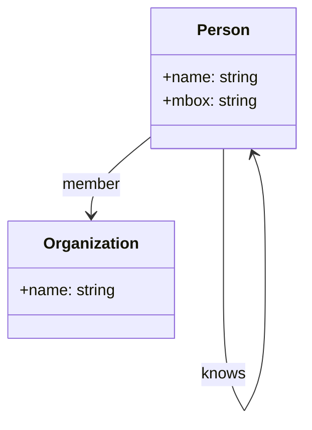

# SPEC-CONTENT-P6: Phase 6 MDX Content Generation -- "Major Standard Ontologies Analysis"

## Overview

This SPEC defines the complete MDX content generation for Phase 6 of the Ontology Fundamentals Learning Platform. Phase 6 covers the analysis of real-world standard ontologies: FOAF, Dublin Core, Schema.org, Gene Ontology, and SNOMED CT/HL7 FHIR. The curriculum culminates in a comparative analysis extracting shared design principles across all five ontologies.

This SPEC produces 8 MDX files that replace the skeleton files created by SPEC-INFRA-001. Each file is a fully written educational session with Korean explanations, English technical terms, Mermaid diagrams, callouts, comparison tables, and exercises.

**Learning objective:** Analyze ontologies in real-world use and extract the principles shared by good designs.

**Phase 5 connection:** Having learned design methodologies, learners now analyze how experts actually built production ontologies.

**Scope boundary:** This SPEC covers content authoring only. Infrastructure, components, styling, and build configuration are handled by SPEC-INFRA-001.

---

## Environment

### Content Platform

- **Framework:** Nextra 4.x with Next.js 15 App Router (established by SPEC-INFRA-001)
- **Content Format:** MDX files in `content/phase-6/` directory
- **Content Language:** Korean (all explanations), English (technical terms with Korean definition on first use)
- **Diagram Engine:** Mermaid 11.12.2 (client-side rendering via MermaidDiagram component)
- **Target Audience:** Korean-speaking learners who have completed Phases 1-5 (understand ontology motivation, building blocks, logical foundations, standards ecosystem, and design methodology)

### Content Quality Standards (per session)

| Element | Minimum Count | Format |
|---------|---------------|--------|
| "Why needed?" blockquotes | 3 per session | `> **Why needed?** [explanation]` |
| "Connection point" callouts | 2 per session | `> **Connection point -> Phase [N]**: [connection]` |
| "Common misconception" section | 1 per session | `> **Common misconception**: "[misconception]"` / `> **Actually**: [correction]` |
| Mermaid diagram | 1 per session | labeled "Session overview diagram" |
| Comparison tables | At least 1 per ontology session | Standard Markdown table format |
| Concept explanation depth | 300-500 words each | Principle-oriented, with analogies |

### Narrative Arc (mandatory per ontology)

Every ontology analysis follows this structure:
1. **Purpose first**: What problem does this ontology solve?
2. **Structure analysis**: Key classes, properties, and design choices
3. **Design principle extraction**: What makes this ontology successful?
4. **Connection forward**: How does this relate to the learner's own work?

---

## Assumptions

### A-001: Infrastructure Ready

SPEC-INFRA-001 has been implemented. The `content/phase-6/` directory exists with skeleton MDX files, `_meta.js` navigation is configured, the MermaidDiagram component is functional, and `mdx-components.tsx` makes custom components available globally.

### A-002: No JSX Imports

Per SPEC-INFRA-001 constraint C-002, MDX files must not contain `import` statements. All components are globally available. Callouts and special formatting use blockquote `>` syntax exclusively.

### A-003: Mermaid Safe Syntax

Mermaid diagrams must follow safe syntax rules:
- No apostrophes in node labels
- No `+` operator in `stateDiagram-v2`
- Use `["double quoted labels"]` for labels with Korean characters or special characters
- Allowed types: `graph TD`, `graph LR`, `sequenceDiagram`, `stateDiagram-v2`, `erDiagram`, `classDiagram`

### A-004: Skeleton File Replacement

Each generated MDX file replaces the corresponding skeleton file in `content/phase-6/`. The YAML frontmatter structure (`title`, `description`, `difficulty`) established by SPEC-INFRA-001 is preserved, but content sections are fully written.

### A-005: Learner Knowledge Level

Readers have completed Phases 1-5. They understand:
- Why ontologies exist and what problems they solve (Phase 1)
- Ontology building blocks: classes, instances, properties, axioms (Phase 2)
- Logical foundations: Description Logic, reasoning, open world assumption (Phase 3)
- Standards ecosystem: RDF, RDFS, OWL, SPARQL, serialization formats (Phase 4)
- Design methodology: METHONTOLOGY, competency questions, design patterns, anti-patterns (Phase 5)

Phase 6 content may reference these prior concepts without re-explaining them, but should include brief reminders where helpful.

### A-006: Curriculum Source

All Phase 6 content follows the curriculum defined in `my-docs/edu-content.md`, specifically the "Phase 6 -- Major Standard Ontologies Analysis" section covering sessions 6-1 through 6-6 plus exercises and competency questions.

### A-007: External Ontology References

Content references external ontologies (FOAF, Dublin Core, Schema.org, Gene Ontology, SNOMED CT). All examples must be factually accurate based on publicly available documentation. No fabricated ontology structures or statistics.

---

## Requirements

### R-001: Complete Phase 6 Content Set [UBIQUITOUS]

The system shall provide 8 fully written MDX files for Phase 6 that replace the skeleton content from SPEC-INFRA-001.

**Files:**

| File | Session Title (Korean) | Topic |
|------|----------------------|-------|
| `00-introduction.mdx` | Phase 6 overview: why real case analysis | Phase 6 overview, learning objectives, roadmap |
| `01-foaf.mdx` | FOAF: Friend of a Friend | Simplest ontology for social networks |
| `02-dublin-core.mdx` | Dublin Core metadata standard | Universal document metadata |
| `03-schema-org.mdx` | Schema.org: web structure vocabulary | Practical adoption over academic rigor |
| `04-gene-ontology.mdx` | Gene Ontology: biological knowledge | DAG structure and multiple inheritance |
| `05-snomed-ct.mdx` | SNOMED CT and HL7 FHIR | Life-critical domain ontology |
| `06-analysis.mdx` | Shared design principle extraction | Cross-analysis of all 5 ontologies |
| `07-exercises.mdx` | Phase 6 exercises and key questions | Comprehensive exercises and competency questions |

### R-002: Korean Content with English Technical Terms [UBIQUITOUS]

Each session shall present all explanations in Korean. English technical terms shall be introduced in parentheses on first use with a Korean definition, then may be used freely afterward.

**First-use format examples:**
- "FOAF(Friend of a Friend) -- people and their social relationships and activities to describe an ontology"
- "JSON-LD(JavaScript Object Notation for Linked Data) -- web pages with structured data to embed a format"
- "DAG(Directed Acyclic Graph) -- cycles do not exist with direction to have a graph structure"

### R-003: "Why Needed?" Motivation Blockquotes [EVENT-DRIVEN]

**When** a learner reads any session, **the system shall** present at least 3 "why needed?" blockquotes that explain the motivation for each concept before introducing the solution.

**Format:**
```markdown
> **Why needed?** [explanation of why this concept matters in practical terms]
```

**Placement rule:** Each "why needed?" blockquote must appear BEFORE the concept explanation it motivates, not after.

### R-004: Mermaid Big-Picture Diagram [UBIQUITOUS]

Each session shall include exactly one Mermaid diagram labeled "Session overview diagram" using safe Mermaid syntax.

**Diagram requirements per session:**

| Session | Diagram Type | Content Description |
|---------|-------------|-------------------|
| 00-introduction | `graph TD` | Phase 6 roadmap showing 7 sessions and their connections |
| 01-foaf | `classDiagram` | FOAF core classes and properties (Person, Organization, knows, mbox) |
| 02-dublin-core | `graph LR` | Dublin Core 15 elements organized by category |
| 03-schema-org | `graph TD` | Schema.org type hierarchy (Thing -> CreativeWork -> Article, Person, Organization) |
| 04-gene-ontology | `graph TD` | Gene Ontology three root terms (Molecular Function, Biological Process, Cellular Component) as DAG |
| 05-snomed-ct | `graph LR` | SNOMED CT concept model showing relationship types and FHIR resource mapping |
| 06-analysis | `graph TD` | Five ontologies compared across shared design principles (radial or comparison layout) |
| 07-exercises | `graph TD` | Complete Phase 6 concept map connecting all analyzed ontologies to shared principles |

### R-005: No JSX Imports [UNWANTED]

MDX sessions **shall NOT** use JSX import statements. All custom components (MermaidDiagram, Exercise, ConceptCard, CompetencyQuestion) are globally available via `mdx-components.tsx`. Callouts use blockquote `>` syntax.

### R-006: "Connection Point" Forward/Backward References [UBIQUITOUS]

Each session shall include at least 2 "connection point" callouts connecting the current concept to other phases. For Phase 6, these should include:
- Backward references to Phase 5 design methodology principles
- Forward references to Phase 7 real-world applications

**Format:**
```markdown
> **Connection point -> Phase [N]**: [what the learner learned/will learn in that phase and how it connects to the current concept]
```

### R-007: "Common Misconception" Sections [UBIQUITOUS]

Each session shall include at least 1 "common misconception" section with the misconception stated, then corrected.

**Format:**
```markdown
> **Common misconception**: "[commonly held incorrect belief]"
> **Actually**: [correct explanation with reasoning]
```

### R-008: Session 00-introduction.mdx Content [UBIQUITOUS]

The introduction session shall provide:
- Phase 6 title and subtitle in Korean
- Clear statement of Phase 6 learning objective: "Analyze real-world ontologies and extract shared principles of good design"
- Phase 5 connection: "Having learned design methodology, we now analyze how experts actually built ontologies"
- Brief overview of each of the 7 content sessions (01-07)
- "Questions answerable after this Phase" section listing the 3 competency questions
- A Phase 6 roadmap Mermaid diagram
- At least 3 "why needed?" blockquotes
- At least 2 "connection point" callouts
- At least 1 "common misconception" section

### R-009: Session 01-foaf.mdx Content [UBIQUITOUS]

The FOAF session shall cover:

**Required content blocks:**

1. **Purpose and history (200-300 words):**
   - Origin: Dan Brickley and Libby Miller, early 2000s Semantic Web project
   - Goal: Describe people, their activities, and relationships in RDF
   - Why it became a foundational Semantic Web ontology

2. **Core structure analysis (300-500 words):**
   - Key classes: `foaf:Person`, `foaf:Organization`, `foaf:Agent`, `foaf:Document`
   - Key properties: `foaf:name`, `foaf:knows`, `foaf:mbox`, `foaf:homepage`, `foaf:interest`
   - The `foaf:knows` property: symmetric social relationship
   - How FOAF links distributed profiles across the web (no central database)

3. **Design principle extraction (300-400 words):**
   - "Design only what you need" principle -- extreme minimalism
   - Extensibility through RDF: other ontologies can add properties to foaf:Person
   - Namespace design: `http://xmlns.com/foaf/0.1/`
   - Open-world assumption in practice: unknown properties are not denied

4. **Practical relevance (200-300 words):**
   - Social network data interoperability
   - Linked Data and distributed identity
   - Connection to modern social graph concepts (Facebook Open Graph, Google Knowledge Graph)

5. **Comparison table:** FOAF key characteristics summary

6. **Mermaid diagram:**
   - `classDiagram` showing FOAF core classes and their key properties/relationships

### R-010: Session 02-dublin-core.mdx Content [UBIQUITOUS]

The Dublin Core session shall cover:

**Required content blocks:**

1. **Purpose and history (200-300 words):**
   - Origin: 1995 OCLC/NCSA workshop in Dublin, Ohio
   - Goal: Create a minimal set of metadata elements applicable to any digital resource
   - The 15 core elements and why exactly 15

2. **Core elements analysis (300-500 words):**
   - Organized by categories: Content (title, subject, description, source, language, relation, coverage), Intellectual Property (creator, publisher, contributor, rights), Instantiation (date, type, format, identifier)
   - Each element explained with concrete examples
   - The principle of "dumb-down": any element can be simplified to a text string

3. **How ontology becomes a standard (300-400 words):**
   - The Dublin Core Metadata Initiative (DCMI) community process
   - ISO 15836 standardization journey
   - How community consensus builds adoption: workshops, working groups, voting
   - Lesson: Technical quality alone is insufficient; community process is essential

4. **Dublin Core and RDF integration (200-300 words):**
   - Dublin Core expressed as RDF vocabulary
   - Namespace: `http://purl.org/dc/elements/1.1/` and `http://purl.org/dc/terms/`
   - How Dublin Core influenced later metadata standards

5. **Comparison table:** Dublin Core element summary with examples

6. **Mermaid diagram:**
   - `graph LR` showing Dublin Core 15 elements organized by their three categories

### R-011: Session 03-schema-org.mdx Content [UBIQUITOUS]

The Schema.org session shall cover:

**Required content blocks:**

1. **Purpose and history (200-300 words):**
   - Origin: 2011 joint initiative by Google, Bing, Yahoo (later Yandex joined)
   - Goal: Structured data for web pages to improve search engine understanding
   - Why search engines needed structured data beyond plain HTML

2. **Scale and structure analysis (300-500 words):**
   - Scale: 800+ types, 1400+ properties
   - Root type: `schema:Thing` with subtypes (CreativeWork, Event, Organization, Person, Place, Product, etc.)
   - JSON-LD as primary embedding format with concrete HTML example
   - Microdata and RDFa as alternative formats

3. **Pragmatic design philosophy (300-500 words):**
   - Deliberate choice: Simple type hierarchy over full OWL expressiveness
   - No complex axioms, no formal reasoning -- intentional tradeoff
   - "Adoption rate over academic accuracy" principle
   - Comparison with OWL: what Schema.org sacrifices and what it gains
   - The "Webmaster test": if a web developer cannot understand it in 5 minutes, it will not be adopted

4. **SEO and practical impact (200-300 words):**
   - Rich snippets in Google search results
   - Knowledge panels
   - Voice assistant integration
   - Korean search engines and Schema.org adoption

5. **Comparison table:** Schema.org vs. OWL-based ontologies (expressiveness, adoption, complexity, target audience)

6. **Mermaid diagram:**
   - `graph TD` showing Schema.org type hierarchy from Thing downward with key subtypes

### R-012: Session 04-gene-ontology.mdx Content [UBIQUITOUS]

The Gene Ontology session shall cover:

**Required content blocks:**

1. **Purpose and history (200-300 words):**
   - Origin: 1998 Gene Ontology Consortium
   - Goal: Standardize gene function annotation across species
   - Why biology needed a shared vocabulary for gene functions

2. **Three-root DAG structure (300-500 words):**
   - Three independent hierarchies:
     - Molecular Function (what a gene product does)
     - Biological Process (the larger process it participates in)
     - Cellular Component (where in the cell it acts)
   - DAG (Directed Acyclic Graph) structure explained
   - Why a tree is insufficient: a gene product can participate in multiple processes
   - Concrete example: a kinase enzyme classified under multiple parents

3. **Multiple inheritance in practice (300-400 words):**
   - Why single inheritance fails for biology
   - Example: An enzyme that is both a "transferase" and a "membrane protein"
   - How GO handles multiple parents without cycles
   - Comparison with Phase 2 class hierarchy concepts (simple tree vs. DAG)

4. **Scale and community governance (200-300 words):**
   - 45,000+ terms (as of recent counts)
   - Evidence codes: how annotations are supported by experimental evidence
   - Community curation process: how terms are added, modified, deprecated
   - Version control and change management

5. **Relevance beyond biology (200-300 words):**
   - GO as a model for large-scale ontology engineering
   - Lessons applicable to manufacturing, healthcare, and other domains
   - The importance of domain expert involvement in ontology design

6. **Mermaid diagram:**
   - `graph TD` showing Gene Ontology three root terms branching into subtypes as a DAG (showing one example of multiple inheritance)

### R-013: Session 05-snomed-ct.mdx Content [UBIQUITOUS]

The SNOMED CT / HL7 FHIR session shall cover:

**Required content blocks:**

1. **Purpose and context (200-300 words):**
   - SNOMED CT: Systematized Nomenclature of Medicine -- Clinical Terms
   - Goal: Comprehensive medical terminology standard for clinical data
   - Why healthcare needs the most rigorous ontology design: lives depend on it

2. **SNOMED CT structure and scale (300-500 words):**
   - 360,000+ medical concepts
   - Concept model: concepts, descriptions (human-readable terms), relationships
   - Relationship types: is-a (hierarchy), finding site, causative agent, associated morphology
   - Post-coordination: combining concepts to create new meanings
   - Example: "Fracture of left femur" composed from separate concepts

3. **HL7 FHIR integration (300-400 words):**
   - FHIR: Fast Healthcare Interoperability Resources
   - FHIR as "ontology + API": not just terminology but data exchange standard
   - Resources: Patient, Observation, Condition, Medication, etc.
   - How FHIR uses SNOMED CT for clinical terminology binding
   - Real-world impact: hospital system interoperability

4. **Version control and change management (200-300 words):**
   - Why version management is critical in medical ontologies
   - Release cycles: biannual international releases
   - Backward compatibility requirements
   - What happens when a medical term is deprecated: impact on existing records

5. **Ontology in life-critical domains (200-300 words):**
   - Consequences of ontology errors in healthcare
   - Regulatory requirements (FDA, medical device software)
   - The tradeoff: comprehensiveness vs. complexity
   - Korean healthcare context: building on Phase 1 EMR interoperability example

6. **Mermaid diagram:**
   - `graph LR` showing SNOMED CT concept model (concepts -> descriptions -> relationships) and FHIR resource mapping

### R-014: Session 06-analysis.mdx Content [UBIQUITOUS]

The comparative analysis session shall cover:

**Required content blocks:**

1. **Five-ontology comparison table (mandatory):**
   - Rows: FOAF, Dublin Core, Schema.org, Gene Ontology, SNOMED CT
   - Columns: Purpose, Scale (number of concepts/types), Expressiveness (OWL level), Standard body, Adoption status, Domain specificity
   - Each cell with concise Korean explanation

2. **Shared design principles (400-600 words):**
   - Principle 1: Clear purpose and scope (CQ-based)
   - Principle 2: Community consensus and sustained maintenance
   - Principle 3: Namespace design for reuse and extension
   - Principle 4: Documentation -- natural language descriptions for every class and property
   - Each principle illustrated with examples from the 5 analyzed ontologies

3. **Design spectrum analysis (300-400 words):**
   - Minimalist design (FOAF) vs. comprehensive design (SNOMED CT)
   - Academic rigor (Gene Ontology) vs. practical adoption (Schema.org)
   - General-purpose (Dublin Core) vs. domain-specific (SNOMED CT)
   - Where each ontology falls on these spectra and why

4. **Lessons for ontology designers (300-400 words):**
   - "There is no one correct level of expressiveness" -- context determines design
   - Community process is as important as technical design
   - Start simple, extend as needed (FOAF lesson)
   - Document everything (all 5 ontologies share this)
   - Test against competency questions (Phase 5 connection)

5. **Mermaid diagram:**
   - `graph TD` showing all 5 ontologies connected to their shared design principles, demonstrating convergence

### R-015: Session 07-exercises.mdx Content [UBIQUITOUS]

The exercises session shall include both practice exercises and Phase 6 competency questions:

**Required content blocks:**

1. **Phase 6 recap section:**
   - Brief summary of what was covered in sessions 01-06
   - Visual concept map (Mermaid diagram) connecting all Phase 6 concepts

2. **Basic exercises:**

   Exercise 1: Schema.org Domain Exploration
   - Task: Go to schema.org and find types related to your own domain
   - Compare found types with your Phase 5 competency questions
   - Document: which CQs are answered by Schema.org types? Which are not?
   - Guidance: Navigate schema.org type hierarchy, read type descriptions

   Exercise 2: FOAF Visual Analysis
   - Task: Download the FOAF ontology file and open it in Protege
   - Identify: core classes, key properties, class hierarchy
   - Draw the class diagram you observe and compare with the session 01 Mermaid diagram
   - Alternative for those without Protege: use WebVOWL online viewer

3. **Challenge exercise:**

   Exercise 3: Wikidata SPARQL Gene Ontology Query
   - Task: Execute SPARQL queries on Wikidata endpoint to explore Gene Ontology terms
   - Provided: 2-3 sample SPARQL queries with explanation
   - Challenge: Modify queries to find specific biological process terms
   - Connection to Phase 4 SPARQL knowledge

4. **Competency questions (Phase 6 pass criteria):**

   Question 1: "Schema.org is not using the full expressiveness of OWL -- what is the reason?"
   - Guidance: Think about adoption rate vs. expressiveness tradeoff
   - Reference: Session 03 pragmatic design philosophy

   Question 2: "Explain with a biological example why multiple inheritance is needed in Gene Ontology"
   - Guidance: Think about classification of gene products that belong to multiple categories
   - Reference: Session 04 DAG structure analysis

   Question 3: "What characteristics do successful ontologies share?"
   - Guidance: Review the 4 shared principles from session 06
   - Reference: Session 06 comparative analysis

5. **Self-assessment checklist:**
   - "I can explain the purpose and design philosophy of at least 3 major ontologies"
   - "I can identify the shared design principles across successful ontologies"
   - "I can evaluate an ontology design choice (e.g., simple hierarchy vs. full OWL) based on context"
   - "I can use Schema.org to find relevant types for my domain"

---

## Specifications

### S-001: MDX Frontmatter Structure

Each MDX file shall have YAML frontmatter:

```yaml
---
title: "[Korean session title]"
description: "[Korean description for search indexing, 50-100 chars]"
difficulty: "intermediate"
---
```

Note: Phase 6 uses `difficulty: "intermediate"` as learners have completed Phases 1-5.

### S-002: Session Content Structure Template

Each ontology analysis session (01-05) follows this structure:

```markdown
---
title: "[Title]"
description: "[Description]"
difficulty: "intermediate"
---

# [Session Number]: [Korean Title]

## Learning objectives

(3 bullet points describing what the learner will achieve)

> **Why needed?** [Opening motivation before first concept]

## Session overview diagram

(Mermaid diagram code block)

## [Ontology Name] Overview

> **Why needed?** [Motivation for studying this specific ontology]

(200-300 word purpose and history)

## Core Structure Analysis

(300-500 word analysis of key classes, properties, design choices)

> **Connection point -> Phase [N]**: [reference to prior or future phase]

## Design Principle Extraction

> **Why needed?** [Why extracting principles matters]

(300-400 word analysis of what makes this ontology successful)

## [Domain-specific section as needed]

> **Connection point -> Phase [N]**: [Forward/backward reference]

## Common misconception

> **Common misconception**: "[Misconception]"
> **Actually**: [Correct explanation]

## Key characteristics summary

(Comparison table summarizing this ontology)

## Summary

(Concise summary of key takeaways, 3-5 bullet points)

## Next session preview

(Brief preview of what comes next and why it matters)
```

### S-003: Introduction Session Structure (00-introduction.mdx)

```markdown
---
title: "Phase 6 overview: Major Standard Ontology Analysis"
description: "Analyzing real-world ontologies to extract shared design principles for Phase 6 learning guide"
difficulty: "intermediate"
---

# Phase 6: Major Standard Ontology Analysis

## What this Phase covers

(Phase 6 learning objective and overview)

> **Why needed?** [Why case analysis matters after learning methodology]

## Session overview diagram

(Phase 6 roadmap Mermaid diagram)

## Session composition

(Overview of 7 content sessions with brief descriptions)

## Questions answerable after this Phase

(3 competency questions listed)

## Common misconception

> **Common misconception**: "[Misconception about ontology standards]"
> **Actually**: [Correction]

> **Connection point -> Phase 5**: [Connection to design methodology]
> **Connection point -> Phase 7**: [Preview of real-world applications]
```

### S-004: Comparative Analysis Session Structure (06-analysis.mdx)

```markdown
---
title: "Shared Design Principle Extraction and Comparative Analysis"
description: "Extracting shared design principles from 5 major ontologies through comparative analysis"
difficulty: "intermediate"
---

# Shared Design Principle Extraction

## Session overview diagram

(Five-ontology comparison Mermaid diagram)

## Five-Ontology Comparison Table

(Comprehensive comparison table)

## Shared Design Principles

### Principle 1: Clear purpose and scope
### Principle 2: Community consensus and sustained maintenance
### Principle 3: Namespace design for reuse and extension
### Principle 4: Documentation

## Design Spectrum Analysis

(Minimalist vs. comprehensive, academic vs. practical, general vs. domain-specific)

## Lessons for Ontology Designers

(Actionable insights)

## Common misconception

## Summary
```

### S-005: Exercise Session Structure (07-exercises.mdx)

```markdown
---
title: "Phase 6 Comprehensive Exercises"
description: "Phase 6 key concepts applied through practice and competency verification exercises"
difficulty: "intermediate"
---

# Phase 6 Comprehensive Exercises

## Session overview diagram

(Phase 6 concept map Mermaid diagram)

## Phase 6 Key Summary

(Brief recap of all Phase 6 sessions)

## Basic exercises

### Exercise 1: [Title]
### Exercise 2: [Title]

## Challenge exercise

### Exercise 3: [Title]

## Key questions (Phase 6 pass criteria)

### Question 1: [Question]
### Question 2: [Question]
### Question 3: [Question]

## Self-assessment checklist

(Self-assessment items)

## Next Phase preview

> **Connection point -> Phase 7**: [What comes next]
```

### S-006: Mermaid Syntax Constraints

All Mermaid diagrams must follow these rules:
- No apostrophes (`'`) anywhere in diagram code
- No `+` operator in `stateDiagram-v2`
- Use `["double quoted labels"]` for labels with Korean characters or special characters
- Test every diagram mentally for syntax validity before writing
- Wrap in standard markdown code fences with `mermaid` language identifier

**Example safe pattern:**


### S-007: Comparison Table Requirements

Each ontology session (01-05) shall include at least one comparison table. Session 06 shall include a comprehensive five-ontology comparison table.

**Required columns for the five-ontology table:**
- Ontology name
- Purpose (1-2 sentence Korean description)
- Scale (number of concepts/types/properties)
- Expressiveness (OWL DL, OWL Full, RDFS, simple hierarchy)
- Standard body (W3C, ISO, IHTSDO, Gene Ontology Consortium, Schema.org community)
- Adoption status

### S-008: Technical Term Introduction Pattern

On first use of any English technical term:
```
Korean_term(English_Term) -- concise Korean definition
```

After first introduction, either the Korean term or English term may be used freely.

**Phase 6 key terms to introduce:**
- FOAF(Friend of a Friend) -- people and social relationships describing ontology
- Dublin Core -- digital document metadata standard
- Schema.org -- search engine structured data vocabulary
- JSON-LD(JavaScript Object Notation for Linked Data) -- web structured data embedding format
- DAG(Directed Acyclic Graph) -- directed graph without cycles
- SNOMED CT(Systematized Nomenclature of Medicine) -- medical terminology standard
- HL7 FHIR(Fast Healthcare Interoperability Resources) -- medical data exchange standard
- Post-coordination -- combining existing concepts to create new ones
- Rich snippet -- enhanced search result with structured data
- Evidence code -- annotation evidence classification code (Gene Ontology)

### S-009: Content Depth Requirements

Each major concept explanation (not including callouts, exercises, or summaries) shall be 300-500 words and include:
- At least 1 concrete example from the ontology being analyzed
- Connection to Phase 5 design methodology concepts where applicable
- Reference to the specific design principle being illustrated
- Connection to why this matters for the learner's practical work

---

## Constraints

### C-001: No Implementation Code

This SPEC produces MDX content files only. No TypeScript, JavaScript, CSS, or configuration file changes.

### C-002: Skeleton Replacement

Generated content replaces skeleton files from SPEC-INFRA-001. The file paths must match exactly:
- `content/phase-6/00-introduction.mdx`
- `content/phase-6/01-foaf.mdx`
- `content/phase-6/02-dublin-core.mdx`
- `content/phase-6/03-schema-org.mdx`
- `content/phase-6/04-gene-ontology.mdx`
- `content/phase-6/05-snomed-ct.mdx`
- `content/phase-6/06-analysis.mdx`
- `content/phase-6/07-exercises.mdx`

### C-003: Mermaid Safe Syntax (inherited from SPEC-INFRA-001)

- FORBIDDEN: Apostrophes in Mermaid node labels
- FORBIDDEN: `+` in stateDiagram-v2
- Use `["double quoted labels"]` for labels with special characters
- Safe types: `graph TD`, `graph LR`, `sequenceDiagram`, `stateDiagram-v2`, `erDiagram`, `classDiagram`

### C-004: No JSX Imports (inherited from SPEC-INFRA-001)

MDX files must not contain `import` statements. All components available via `mdx-components.tsx`.

### C-005: Word Count Target

Total Phase 6 content (all 8 files combined): approximately 12,000-18,000 Korean words. Individual session targets:
- 00-introduction: 800-1,200 words
- 01-foaf: 1,500-2,500 words
- 02-dublin-core: 1,500-2,500 words
- 03-schema-org: 1,500-2,500 words
- 04-gene-ontology: 1,500-2,500 words
- 05-snomed-ct: 1,500-2,500 words
- 06-analysis: 1,500-2,500 words
- 07-exercises: 1,500-2,000 words

### C-006: Factual Accuracy

- FOAF class and property names must match the actual FOAF vocabulary specification
- Dublin Core 15 elements must match the actual Dublin Core Metadata Element Set
- Schema.org type hierarchy must reflect the actual schema.org structure
- Gene Ontology three root terms must match the actual GO structure
- SNOMED CT statistics (360,000+ concepts) must reflect publicly available data
- All academic references must be verifiable
- No fabricated ontology structures, statistics, or examples

### C-007: Consistent Cross-References

- Backward references to Phases 1-5 must reference concepts actually covered in those phases
- Forward references to Phases 7-8 must reference topics in the curriculum
- Phase 5 design methodology connections must reference METHONTOLOGY, competency questions, or design patterns from Phase 5
- Session-to-session references within Phase 6 must use relative links
- Competency questions in exercises must match the questions listed in the curriculum document

### C-008: Comparison Tables Required

- Each ontology session (01-05) must include at least 1 summary comparison table
- Session 06 must include the comprehensive five-ontology comparison table
- All tables must use standard Markdown table syntax

---

## Traceability

| Requirement | Plan Reference | Acceptance Reference |
|-------------|---------------|---------------------|
| R-001 | Plan: Session Overview | AC-001 |
| R-002 | Plan: All Sessions | AC-002 |
| R-003 | Plan: All Sessions | AC-003 |
| R-004 | Plan: Diagram Specs | AC-004 |
| R-005 | Plan: All Sessions | AC-005 |
| R-006 | Plan: All Sessions | AC-006 |
| R-007 | Plan: All Sessions | AC-007 |
| R-008 | Plan: Session 00 | AC-008 |
| R-009 | Plan: Session 01 | AC-009 |
| R-010 | Plan: Session 02 | AC-010 |
| R-011 | Plan: Session 03 | AC-011 |
| R-012 | Plan: Session 04 | AC-012 |
| R-013 | Plan: Session 05 | AC-013 |
| R-014 | Plan: Session 06 | AC-014 |
| R-015 | Plan: Session 07 | AC-015 |

---

## Expert Consultation Recommendations

### Frontend Expert (expert-frontend)

This SPEC involves MDX content authoring within a Nextra 4.x site. Consulting expert-frontend is recommended for:
- Verifying Mermaid `classDiagram` rendering behavior within Nextra (new diagram type for Phase 6)
- Ensuring comparison tables render correctly with Nextra theme (multiple wide tables)
- Validating MDX syntax compatibility with Nextra 4.x parser for complex table structures

### Content/Education Domain Expert

If available, consulting a subject matter expert in ontology education would be valuable for:
- Verifying FOAF, Dublin Core, Schema.org, Gene Ontology, and SNOMED CT factual accuracy
- Reviewing the five-ontology comparison table for completeness
- Ensuring the shared design principles extraction is pedagogically sound
- Validating Gene Ontology DAG examples for biological accuracy
