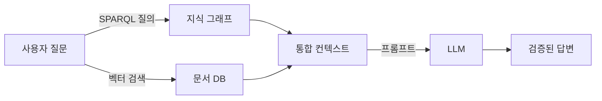

# SPEC-CONTENT-P7: Phase 7 MDX Content Generation -- "Ontology Applications"

## Overview

This SPEC defines the complete MDX content generation for Phase 7 of the Ontology Fundamentals Learning Platform. Phase 7 covers ontology applications across diverse domains: Semantic Web, Knowledge Graphs, search/recommendation systems, NLP integration, LLM-era Graph RAG, and manufacturing/industry applications. This is the phase where learners transition from understanding ontology theory to recognizing how it is applied in real-world systems.

This SPEC produces 8 MDX files that replace skeleton files in `content/phase-7/`. Each file is a fully written educational session with Korean explanations, English technical terms, Mermaid diagrams, callouts, and exercises.

**Learning objective:** The learner develops the judgment to apply ontology to their own problems.

**Connection to Phase 6:** After analyzing real-world ontology cases in Phase 6, Phase 7 abstracts those cases into generalizable application patterns.

**Scope boundary:** This SPEC covers content authoring only. Infrastructure, components, styling, and build configuration are handled by SPEC-INFRA-001.

---

## Environment

### Content Platform

- **Framework:** Nextra 4.x with Next.js 15 App Router (established by SPEC-INFRA-001)
- **Content Format:** MDX files in `content/phase-7/` directory
- **Content Language:** Korean (all explanations), English (technical terms with Korean definition on first use)
- **Diagram Engine:** Mermaid 11.12.2 (client-side rendering via MermaidDiagram component)
- **Target Audience:** Korean-speaking intermediate learners who have completed Phases 1-6, with backgrounds in manufacturing, AI, and knowledge management

### Content Quality Standards (per session)

| Element | Minimum Count | Format |
|---------|---------------|--------|
| "왜 필요한가?" blockquotes | 3 per session | `> **왜 필요한가?** [explanation]` |
| "연결 포인트" callouts | 2 per session | `> **연결 포인트 -> Phase [N]**: [connection]` |
| "흔한 오해" section | 1 per session | `> **흔한 오해**: "[misconception]"` / `> **실제로는**: [correction]` |
| Mermaid diagram | 1 per session | labeled "이번 세션 전체 그림" |
| Concept explanation depth | 300-500 words each | Principle-oriented, with analogies |

### Narrative Arc (mandatory per concept)

Every major concept follows this structure:
1. **Problem first**: Describe the limitation of the previous approach
2. **Concept introduction**: Present the new concept as the solution
3. **Why this matters**: Explain practical impact with real-world examples
4. **Connection forward**: Link to where this concept leads in later phases or real-world practice

---

## Assumptions

### A-001: Infrastructure Ready

SPEC-INFRA-001 has been implemented. The `content/phase-7/` directory will be created with skeleton MDX files, `_meta.js` navigation is configured, the MermaidDiagram component is functional, and `mdx-components.tsx` makes custom components available globally.

### A-002: No JSX Imports

Per SPEC-INFRA-001 constraint C-002, MDX files must not contain `import` statements. All components are globally available. Callouts and special formatting use blockquote `>` syntax exclusively.

### A-003: Mermaid Safe Syntax

Mermaid diagrams must follow safe syntax rules:
- No apostrophes in node labels
- No `+` operator in `stateDiagram-v2`
- Use `["double quoted labels"]` for labels with special characters
- Allowed types: `graph TD`, `graph LR`, `sequenceDiagram`, `stateDiagram-v2`, `erDiagram`, `classDiagram`

### A-004: Skeleton File Replacement

Each generated MDX file replaces the corresponding skeleton file in `content/phase-7/`. The YAML frontmatter structure (`title`, `description`, `difficulty`) established by SPEC-INFRA-001 is preserved, but content sections are fully written.

### A-005: Audience Knowledge Level

Readers have completed Phases 1-6 and understand: ontology motivation (Phase 1), building blocks (Phase 2), reasoning (Phase 3), RDF/OWL syntax (Phase 4), design methodology (Phase 5), and real-world cases like SNOMED CT, Schema.org, Gene Ontology (Phase 6). They are ready to see how ontology applies across diverse application domains. The audience includes practitioners from Korean manufacturing, AI/ML engineering, and knowledge management.

### A-006: Curriculum Source

All Phase 7 content follows the curriculum defined in `my-docs/edu-content.md`, specifically the "Phase 7 -- Ontology Applications" section covering sessions 7-1 through 7-6, exercises, and competency questions.

### A-007: LLM/Graph RAG Emphasis

Session 05 (LLM and Graph RAG) is the most current and practically important session for 2025-2026 audiences. It must receive especially detailed and engaging treatment, conveying excitement about the re-emergence of ontology in the AI era.

### A-008: Korean Manufacturing Context

Session 06 (Manufacturing/Industry Applications) must emphasize Korean manufacturing contexts: smart factories, semiconductor processes, laser processing, and Industry 4.0 initiatives relevant to Korean industrial settings.

---

## Requirements

### R-001: Complete Phase 7 Content Set [UBIQUITOUS]

The system shall provide 8 fully written MDX files for Phase 7 that replace the skeleton content from SPEC-INFRA-001.

**Files:**
| File | Session Title (Korean) | Topic |
|------|----------------------|-------|
| `00-introduction.mdx` | Phase 7 소개: 온톨로지의 응용 | Phase 7 overview, application domain map, learning objectives |
| `01-semantic-web.mdx` | 시맨틱 웹과 Linked Data | Tim Berners-Lee vision, Linked Data 4 principles, LOD cloud |
| `02-knowledge-graphs.mdx` | 지식 그래프 | Google KG, Wikidata, DBpedia, enterprise KGs |
| `03-search-recommendation.mdx` | 검색 및 추천 시스템 | Ontology-based expanded search, relationship-based recommendation |
| `04-nlp-ontology.mdx` | NLP와 온톨로지의 결합 | NER, Relation Extraction, ontology-based text classification |
| `05-llm-graph-rag.mdx` | LLM 시대의 온톨로지: Graph RAG | RAG + ontology hybrid, hallucination detection, Graph RAG |
| `06-manufacturing.mdx` | 제조/산업 도메인 응용 | ISO 15926, IFC, manufacturing process ontology, Korean industry |
| `07-exercises.mdx` | Phase 7 종합 실습 | Exercises with SPARQL, Graph RAG scenario design, competency questions |

### R-002: Korean Content with English Technical Terms [UBIQUITOUS]

Each session shall present all explanations in Korean. English technical terms shall be introduced in parentheses on first use with a Korean definition, then may be used freely afterward.

**First-use format examples:**
- "시맨틱 웹(Semantic Web) -- 기계가 데이터의 의미를 이해하고 처리할 수 있는 웹"
- "지식 그래프(Knowledge Graph) -- 개체와 관계를 그래프 구조로 표현한 대규모 지식 저장소"
- "그래프 RAG(Graph RAG) -- 지식 그래프를 검색 컨텍스트로 활용하는 RAG 방식"
- "링크드 데이터(Linked Data) -- 구조화된 데이터를 웹에서 상호 연결하는 방법론"

### R-003: "왜 필요한가?" Motivation Blockquotes [EVENT-DRIVEN]

**When** a learner reads any session, **the system shall** present at least 3 "왜 필요한가?" blockquotes that explain the motivation for each concept before introducing the solution.

**Format:**
```markdown
> **왜 필요한가?** [explanation of why this concept matters in practical terms]
```

**Placement rule:** Each "왜 필요한가?" blockquote must appear BEFORE the concept explanation it motivates, not after.

### R-004: Mermaid Big-Picture Diagram [UBIQUITOUS]

Each session shall include exactly one Mermaid diagram labeled "이번 세션 전체 그림" using safe Mermaid syntax.

**Diagram requirements per session:**

| Session | Diagram Type | Content Description |
|---------|-------------|-------------------|
| 00-introduction | `graph TD` | Phase 7 application domain map showing 6 content sessions and their connections |
| 01-semantic-web | `graph LR` | Tim Berners-Lee Semantic Web layer cake simplified, showing how Linked Data connects to the wider web |
| 02-knowledge-graphs | `graph TD` | Knowledge Graph composition: Ontology (schema) + Instance Data (facts) + Reasoning Rules, with Google KG/Wikidata/DBpedia as concrete examples |
| 03-search-recommendation | `graph LR` | Query flow: user query -> keyword search (limited) vs. ontology-expanded search (rich results), showing how ontology bridges the gap |
| 04-nlp-ontology | `graph LR` | NLP pipeline: raw text -> NER -> Relation Extraction -> Triple generation -> Ontology population |
| 05-llm-graph-rag | `graph TD` | Graph RAG architecture: User Question -> Knowledge Graph (SPARQL) + Vector DB (similarity) -> Merged Context -> LLM -> Verified Answer |
| 06-manufacturing | `graph TD` | Manufacturing ontology ecosystem: Process Parameters -> Quality Results with ontology layer providing explainability, linking to ISO 15926 and IFC |
| 07-exercises | `graph TD` | Complete Phase 7 concept map connecting all application domains to ontology core |

### R-005: No JSX Imports [UNWANTED]

MDX sessions **shall NOT** use JSX import statements. All custom components (MermaidDiagram, Exercise, ConceptCard, CompetencyQuestion) are globally available via `mdx-components.tsx`. Callouts use blockquote `>` syntax.

### R-006: "연결 포인트" Forward/Backward References [UBIQUITOUS]

Each session shall include at least 2 "연결 포인트" callouts connecting the current concept to other phases. For Phase 7, references may point backward (to Phases 1-6 foundations) or forward (to Phase 8 limitations).

**Format:**
```markdown
> **연결 포인트 -> Phase [N]**: [what the learner learned/will learn in that phase and how it connects to the current concept]
```

### R-007: "흔한 오해" Misconception Sections [UBIQUITOUS]

Each session shall include at least 1 "흔한 오해" (common misconception) section with the misconception stated, then corrected. Session 05 (LLM/Graph RAG) is particularly important for addressing the misconception that "ontology is outdated in the AI era."

**Format:**
```markdown
> **흔한 오해**: "[commonly held incorrect belief]"
> **실제로는**: [correct explanation with reasoning]
```

### R-008: Session 00-introduction.mdx Content [UBIQUITOUS]

The introduction session shall provide:
- Phase 7 title and subtitle in Korean
- Clear statement of Phase 7 learning objective: "자신의 문제에 온톨로지를 적용할 수 있는 판단력을 갖는다"
- Connection from Phase 6: "사례를 분석했으니, 이제 응용 패턴을 추상화한다"
- Brief overview of each of the 6 content sessions (01-06) with an "application domain map"
- "이번 Phase를 마치면 답할 수 있는 질문" section listing the 4 competency questions
- A Phase 7 roadmap Mermaid diagram
- At least 3 "왜 필요한가?" blockquotes
- At least 2 "연결 포인트" callouts
- At least 1 "흔한 오해" section

### R-009: Session 01-semantic-web.mdx Content [UBIQUITOUS]

The Semantic Web session shall cover:

**Required content blocks:**

1. **Tim Berners-Lee's vision (300-500 words):**
   - The original vision: transforming the web from a document space to a data space machines can understand
   - The web as it was: HTML for humans, meaningless to machines beyond display
   - Berners-Lee's 2001 Scientific American article vision
   - Why this matters: without machine-readable data, the web remains an information silo

2. **Linked Data 4 principles (300-500 words):**
   - Principle 1: Use URIs as names for things (not just documents)
   - Principle 2: Use HTTP URIs so people can look up those names
   - Principle 3: When someone looks up a URI, provide useful information using standards (RDF, SPARQL)
   - Principle 4: Include links to other URIs so people can discover more things
   - Concrete example: How a URI for "Seoul" in one dataset links to "South Korea" in another, and to "Capital City" in a third
   - Korean context example: KISTI (Korea Institute of Science and Technology Information) and Korean open data portals

3. **LOD (Linked Open Data) cloud (200-300 words):**
   - Thousands of datasets interconnected via RDF
   - The LOD cloud diagram as a visualization of the ecosystem
   - Key datasets: DBpedia, Wikidata, GeoNames, FOAF
   - Growth over time and current scale

4. **Partial realization insight (200-300 words):**
   - The full Semantic Web vision remains incomplete
   - But partial implementations (Schema.org, Wikidata) are already part of everyday life
   - Schema.org: how Google uses structured data for rich search results
   - Wikidata: how structured knowledge powers Wikipedia infoboxes and voice assistants
   - Connection to Phase 4 (RDF/OWL): the technologies learned in Phase 4 are what make this possible

5. **Mermaid diagram:**
   - `graph LR` showing simplified Semantic Web layer architecture from URI/IRI base through RDF, RDFS, OWL, to SPARQL query, with practical examples at each layer

### R-010: Session 02-knowledge-graphs.mdx Content [UBIQUITOUS]

The Knowledge Graphs session shall cover:

**Required content blocks:**

1. **Google Knowledge Graph (300-400 words):**
   - What appears in the right panel of Google search results
   - How Google uses ontology + instance data to power the Knowledge Panel
   - Example: searching "Albert Einstein" shows birth date, nationality, field, Nobel Prize -- all from a knowledge graph
   - Korean search context: Naver Knowledge also uses structured data

2. **Wikidata (300-400 words):**
   - Wikipedia's structured data counterpart
   - Community-maintained, open, SPARQL-queryable
   - Example SPARQL query: "List all Korean Nobel Prize winners" (simple but demonstrative)
   - How Wikidata feeds into Wikipedia infoboxes, Google, and voice assistants
   - Wikidata's ontology: properties (P-codes) and items (Q-codes) structure

3. **DBpedia (200-300 words):**
   - Automatic RDF extraction from Wikipedia
   - How it bootstrapped the LOD cloud
   - Comparison with Wikidata: automated extraction vs. community curation

4. **Knowledge Graph composition principle (300-400 words):**
   - Three layers: Ontology (schema defining what types of things exist and their relationships) + Instance Data (actual facts about specific entities) + Reasoning Rules (inference rules deriving new knowledge)
   - Connection to Phase 2 (building blocks: classes, properties) and Phase 3 (reasoning)
   - How these layers work together in practice

5. **Enterprise Knowledge Graphs trend (200-300 words):**
   - Companies building internal KGs for organizational knowledge management
   - Use cases: employee expertise graphs, product knowledge graphs, customer relationship graphs
   - Korean enterprise context: Samsung SDS, LG CNS, POSCO digital transformation initiatives using KG

6. **Mermaid diagram:**
   - `graph TD` showing KG composition: Ontology + Instance Data + Reasoning Rules forming Knowledge Graph, with branches to Google KG, Wikidata, DBpedia, and Enterprise KG

### R-011: Session 03-search-recommendation.mdx Content [UBIQUITOUS]

The Search and Recommendation session shall cover:

**Required content blocks:**

1. **Limitations of keyword search (200-300 words):**
   - Traditional search: exact keyword matching
   - Problem: "smartphone" search misses results about "mobile device", "iPhone", "Galaxy"
   - Problem: synonym blindness, hypernym/hyponym ignorance
   - Why this matters for real users: incomplete results, missed opportunities

2. **Ontology-based expanded search (300-500 words):**
   - How ontology enables semantic expansion: "smartphone" -> includes "mobile device", "iPhone", "Galaxy" through class hierarchy and equivalence relations
   - The mechanism: query term mapped to ontology concept, then expanded to related concepts via is-a, part-of, and equivalentClass relations
   - Korean e-commerce example: searching for "노트북" on a Korean shopping platform could automatically include "랩탑", "울트라북", specific brand models through ontology relationships
   - Concrete improvement metrics: how ontology-expanded search improves recall without sacrificing precision

3. **Ontology-based recommendation systems (300-500 words):**
   - How recommendation works: represent users and products as ontology instances with rich property descriptions
   - Property-based matching: user preferences (attributes) matched against product attributes via ontology relationships
   - Beyond collaborative filtering: ontology adds explainability -- "We recommend this because it shares [property] with items you liked"
   - Korean context: how Korean retail platforms could use product ontology for cross-category recommendations
   - Connection to Phase 2: the classes and properties learned in Phase 2 are the building blocks for these recommendation ontologies

4. **The bridge from keywords to meaning (200-300 words):**
   - Summary: ontology bridges the gap between syntactic search (keywords) and semantic search (meaning)
   - This is a concrete instance of the interoperability problem from Phase 1 -- resolving the gap between user intent and system understanding

5. **Mermaid diagram:**
   - `graph LR` showing dual flow: User Query -> Keyword Search (limited results) vs. User Query -> Ontology Expansion -> Semantic Search (comprehensive results)

### R-012: Session 04-nlp-ontology.mdx Content [UBIQUITOUS]

The NLP and Ontology session shall cover:

**Required content blocks:**

1. **Named Entity Recognition + Ontology (300-400 words):**
   - NER extracts entities from unstructured text (people, places, organizations, dates)
   - Ontology linking: extracted entities are mapped to ontology instances (entity linking/disambiguation)
   - Example: "삼성전자가 반도체 공장을 평택에 건설했다" -> NER extracts "삼성전자" (Organization), "반도체 공장" (Facility), "평택" (Location) -> each linked to ontology concepts
   - Why ontology matters for NER: disambiguation -- "삼성" could be Samsung Electronics, Samsung Life Insurance, Samsung SDI. Ontology provides the context to determine which one.

2. **Relation Extraction (300-400 words):**
   - Extracting triples from natural text
   - From the above example: (삼성전자, built, 반도체 공장), (반도체 공장, locatedIn, 평택)
   - How extracted triples populate an ontology -- transforming unstructured documents into structured knowledge
   - Korean language challenges: Korean sentence structure (SOV), particles (은/는/이/가), and how they affect relation extraction
   - Connection to Phase 4: the Triple (Subject-Predicate-Object) structure learned in Phase 4 is exactly what relation extraction produces

3. **Ontology-based text classification (200-300 words):**
   - Using ontology class hierarchies as label taxonomies
   - Example: classifying Korean news articles into categories using a news domain ontology
   - Advantage over flat label lists: hierarchical classification enables multi-granularity categorization

4. **The NLP-Ontology pipeline (200-300 words):**
   - Complete pipeline: Raw Text -> NER -> Entity Linking -> Relation Extraction -> Triple Generation -> Ontology Population
   - This pipeline converts unstructured text into structured knowledge that machines can reason about
   - Connection to Phase 3: the reasoning capabilities learned in Phase 3 are what makes the populated ontology valuable

5. **Mermaid diagram:**
   - `graph LR` showing the NLP-Ontology pipeline: Raw Text -> NER -> Relation Extraction -> Triple Generation -> Ontology Population

### R-013: Session 05-llm-graph-rag.mdx Content -- THE KEY SESSION [UBIQUITOUS]

The LLM and Graph RAG session is the most current and important session in Phase 7. It must be especially detailed, engaging, and convey excitement about the re-emergence of ontology relevance in the AI era.

**Required content blocks:**

1. **The false narrative: "Ontology is outdated in the AI era" (200-300 words):**
   - The common claim: "LLMs can understand everything, ontology is no longer needed"
   - Why this claim is wrong: LLMs are powerful but have fundamental weaknesses that ontology directly addresses
   - Set up the tension that the rest of the session resolves

2. **RAG + Ontology hybrid (400-500 words):**
   - Standard RAG: user question -> vector search in document chunks -> relevant chunks fed to LLM -> answer
   - Limitation of vector-only RAG: captures semantic similarity but misses logical relationships
   - Example: "Who is the CEO of the parent company of Instagram?" -- vector search finds documents about Instagram and about Meta separately, but cannot chain the ownership relationship
   - Ontology + Vector hybrid: structured queries (SPARQL) retrieve relational facts, vector search retrieves contextual text, both are merged as LLM context
   - How this works in practice: the ontology knows (Instagram, ownedBy, Meta) and (Meta, CEO, Mark Zuckerberg), providing the relational chain that vector search cannot
   - Korean industry example: a manufacturing company's internal knowledge base where equipment models, process parameters, and quality defect types are connected through an ontology -- vector search alone cannot trace the causal chain from a specific defect to its root process parameter

3. **LLM output structuring (300-400 words):**
   - LLM generates natural language text that contains factual claims
   - Ontology schema provides the structure to convert LLM output into triples
   - Example: LLM says "삼성전자의 2024년 반도체 매출은 약 50조원이다" -> extracted triple: (삼성전자_반도체, annualRevenue2024, 50조원)
   - This structured output can be validated, stored, and reasoned about

4. **Hallucination detection via ontology (300-400 words):**
   - LLM hallucination: generating plausible-sounding but factually incorrect statements
   - Ontology-based verification: compare LLM-generated facts against existing knowledge graph
   - Example: LLM claims "서울은 일본의 수도이다" -> ontology check: (서울, capitalOf, 대한민국) contradicts the claim
   - Consistency checking: LLM generates triples that must be consistent with existing ontology axioms
   - Why this matters: in regulated industries (healthcare, finance, manufacturing), hallucinated facts can cause real harm

5. **Graph RAG architecture (400-500 words):**
   - Full Graph RAG: Knowledge Graph provides structured context to LLM alongside vector-retrieved text
   - Architecture: User Question -> (1) SPARQL query on KG for relational facts + (2) Vector search for contextual documents -> Merged Context -> LLM generates answer with citations
   - Why Graph RAG outperforms standard RAG: relational reasoning, multi-hop question answering, verifiable facts
   - Concrete comparison: "What are the side effects of drugs prescribed for patients with both diabetes and hypertension?" -- standard RAG retrieves documents about each condition separately, Graph RAG traverses (Patient, hasDiagnosis, Diabetes), (Patient, hasDiagnosis, Hypertension), (Drug, prescribedFor, Diabetes), (Drug, hasSideEffect, X)
   - Tools and frameworks: LangChain + Neo4j, LlamaIndex + knowledge graph, Microsoft GraphRAG
   - Korean context: Korean healthcare knowledge graphs, Korean patent knowledge graphs

6. **The re-emergence narrative (200-300 words):**
   - Ontology is not competing with LLMs -- it complements them
   - LLMs excel at: natural language understanding, text generation, pattern recognition
   - Ontology excels at: structured reasoning, consistency checking, relationship traversal, explainability
   - Together: LLMs handle the "soft" language tasks, ontology handles the "hard" logic tasks
   - The result: more reliable, explainable, and verifiable AI systems

7. **Mermaid diagram:**
   - `graph TD` showing Graph RAG architecture: User Question branching to Knowledge Graph (SPARQL) and Vector DB (similarity search), both feeding into Merged Context, then to LLM, producing Verified Answer with ontology-based fact checking

### R-014: Session 06-manufacturing.mdx Content [UBIQUITOUS]

The Manufacturing/Industry Applications session shall cover with Korean manufacturing emphasis:

**Required content blocks:**

1. **ISO 15926 -- Oil/Gas plant lifecycle (200-300 words):**
   - International standard for lifecycle data integration in oil/gas plants
   - Why it exists: different engineering systems (design, construction, operation, maintenance) need to share data over decades
   - The ontology solution: a shared conceptual model that all systems reference
   - Relevance to Korean petrochemical industry (SK Innovation, GS Caltex, S-Oil)

2. **IFC -- Building/Construction BIM (200-300 words):**
   - Industry Foundation Classes for Building Information Modeling
   - How IFC uses ontology principles: classes for building elements, properties, relationships
   - Korean construction context: smart construction initiatives, government BIM mandates

3. **Manufacturing process ontology applications (400-500 words):**
   - **Process parameter to quality result modeling:**
     - Ontology connects: (LaserProcess, hasPower, 3000W), (LaserProcess, hasSpeed, 2m/min), (LaserProcess, producesQuality, GoodWeld)
     - When quality drops, the ontology enables tracing back to which parameter changed
   - **Equipment failure pattern knowledge:**
     - Capturing failure patterns as ontological knowledge: (Motor, hasSymptom, Vibration), (Vibration, indicatesFailure, BearingWear)
     - Moving from reactive maintenance to predictive maintenance through knowledge formalization
   - **AI explainability in process automation:**
     - The black box problem: AI model says "increase laser power" but cannot explain why
     - Ontology provides the "judgment basis": (HigherPower, causes, DeeperPenetration), (DeeperPenetration, improves, WeldStrength)
     - This is critical for quality audits and regulatory compliance
   - **Korean manufacturing context:**
     - Smart factory initiatives (스마트 공장)
     - POSCO steel manufacturing process optimization
     - Samsung semiconductor process knowledge management
     - Hyundai Motor production line ontology applications
     - Laser processing example from the curriculum: how ontology makes AI decisions in laser welding explainable

4. **Ontology as AI explainability tool (300-400 words):**
   - The fundamental problem: ML/DL models are black boxes
   - Ontology provides the reasoning chain: input conditions -> process decisions -> expected outcomes
   - In regulated industries (manufacturing quality, pharmaceutical production), explainability is not optional
   - Korean regulatory context: quality certification requirements for manufacturing
   - Connection to Phase 3 (Reasoning): the inference rules from Phase 3 are exactly what provides explainability here

5. **Mermaid diagram:**
   - `graph TD` showing manufacturing ontology ecosystem: Process Parameters and Quality Results connected through ontology layer, with branches to ISO 15926, IFC, and Korean manufacturing use cases

### R-015: Session 07-exercises.mdx Content [UBIQUITOUS]

The exercises session shall include practical exercises and Phase 7 competency questions:

**Required content blocks:**

1. **Phase 7 recap section:**
   - Brief summary of what was covered in sessions 01-06
   - Emphasis on the thread connecting all applications: ontology provides structured, machine-readable, reasoning-capable knowledge
   - Visual concept map (Mermaid diagram) connecting all Phase 7 application domains

2. **Basic exercises (기본 실습):**

   Exercise 1: Wikidata SPARQL Queries (10 queries)
   - Task: Execute 10 SPARQL queries on Wikidata Query Service (https://query.wikidata.org)
   - Provide 10 pre-written queries with Korean explanations:
     1. List all countries in East Asia with their capitals
     2. Find all Korean UNESCO World Heritage Sites
     3. List Nobel Prize winners in Physics from the last 20 years
     4. Find all programming languages and their designers
     5. List Korean universities and their founding years
     6. Find all movies directed by Bong Joon-ho with release dates
     7. List chemical elements discovered in the 20th century
     8. Find all Korean cities with population over 1 million
     9. List diseases and their known symptoms (limited to 20)
     10. Find all spacecraft launched by South Korea
   - For each query: provide the SPARQL code, explain each line, show expected output format
   - Guidance on how to modify queries for exploration
   - Difficulty: intermediate

3. **Challenge exercises (도전 실습):**

   Exercise 2: Graph RAG Application Scenario Design
   - Task: Design a Graph RAG application scenario for your own work domain
   - Template provided:
     - Domain description
     - Key entities and relationships (at least 10 triples)
     - Sample user questions that require multi-hop reasoning
     - Why standard vector RAG would fail for these questions
     - How the knowledge graph provides the missing relational context
   - Example scenario provided (laser manufacturing quality control)
   - Difficulty: advanced

   Exercise 3: LangChain + Neo4j Knowledge Graph QA Prototype
   - Task: Design (conceptual or actual) a simple knowledge graph QA system
   - Components:
     - Define a small ontology (5-10 classes, 10-15 properties) for a domain
     - Create sample instance data (20-30 triples)
     - Define 5 natural language questions that require the KG
     - Describe the query flow: NL question -> SPARQL/Cypher -> KG traversal -> answer assembly
   - Tool references: LangChain GraphCypherQAChain, Neo4j graph database, LlamaIndex KnowledgeGraphQueryEngine
   - Guidance on getting started with each tool
   - Difficulty: advanced

4. **Competency questions (핵심 질문) -- Phase 7 pass criteria (4 questions):**

   Question 1: "지식 그래프와 온톨로지의 관계를 설명하라."
   - Guidance: Think about the composition principle: ontology is the schema layer of a knowledge graph
   - Reference: Session 02 composition principle section

   Question 2: "LLM의 어떤 약점을 온톨로지가 보완할 수 있는가?"
   - Guidance: Think about hallucination, logical reasoning, relationship traversal, explainability
   - Reference: Session 05 hallucination detection and Graph RAG sections

   Question 3: "자신의 업무 도메인에서 온톨로지를 적용할 수 있는 구체적 시나리오를 하나 설계하라."
   - Guidance: Use the Graph RAG scenario design template from Exercise 2
   - Reference: All sessions, especially 05 and 06

   Question 4: "Graph RAG가 단순 벡터 RAG보다 유리한 경우는 어떤 때인가?"
   - Guidance: Think about multi-hop reasoning, relational queries, verifiable facts
   - Reference: Session 05 Graph RAG section

5. **Self-assessment checklist:**
   - "I can explain how Linked Data principles enable the Semantic Web"
   - "I can describe the three components of a Knowledge Graph"
   - "I can explain how ontology improves search beyond keyword matching"
   - "I can describe the NLP-to-ontology pipeline (NER -> Relation Extraction -> Triples)"
   - "I can explain why Graph RAG outperforms standard vector RAG for relational queries"
   - "I can describe at least one ontology application in manufacturing/industry"
   - "I can design a basic Graph RAG scenario for my own domain"

---

## Specifications

### S-001: MDX Frontmatter Structure

Each MDX file shall have YAML frontmatter:

```yaml
---
title: "[Korean session title]"
description: "[Korean description for search indexing, 50-100 chars]"
difficulty: "intermediate"
---
```

Note: Phase 7 difficulty is "intermediate" (not "beginner" as in Phase 1), reflecting the audience's progression through Phases 1-6.

### S-002: Session Content Structure Template

Each content session (01-06) follows this structure:

```markdown
---
title: "[Title]"
description: "[Description]"
difficulty: "intermediate"
---

# [Session Number]회차: [Korean Title]

## 학습 목표

(3 bullet points describing what the learner will achieve)

> **왜 필요한가?** [Opening motivation before first concept]

## 이번 세션 전체 그림

(Mermaid diagram code block)

## [First Major Concept Heading]

> **왜 필요한가?** [Motivation for this specific concept]

(300-500 word explanation with analogies and examples)

> **연결 포인트 -> Phase [N]**: [Forward/backward reference]

## [Second Major Concept Heading]

> **왜 필요한가?** [Motivation for this specific concept]

(300-500 word explanation with analogies and examples)

## [Additional Concept Headings as needed]

> **연결 포인트 -> Phase [N]**: [Forward/backward reference]

## 흔한 오해

> **흔한 오해**: "[Misconception]"
> **실제로는**: [Correct explanation]

(Additional misconceptions if relevant)

## 요약

(Concise summary of key takeaways, 3-5 bullet points)

## 다음 세션 예고

(Brief preview of what comes next and why it matters)
```

### S-003: Introduction Session Structure (00-introduction.mdx)

```markdown
---
title: "Phase 7 소개: 온톨로지의 응용"
description: "온톨로지가 실제로 어디에, 어떻게 쓰이는지 알아보는 Phase 7 학습 안내"
difficulty: "intermediate"
---

# Phase 7: 온톨로지의 응용

## 이 Phase에서 배우는 것

(Phase 7 learning objective and overview)
(Connection from Phase 6)

> **왜 필요한가?** [Why understanding applications matters]

## 이번 세션 전체 그림

(Phase 7 application domain map Mermaid diagram)

## 세션 구성

(Overview of 6 content sessions with brief descriptions)

## 이번 Phase를 마치면 답할 수 있는 질문

(4 competency questions listed)

## 흔한 오해

> **흔한 오해**: "[Misconception about ontology applications]"
> **실제로는**: [Correction]

> **연결 포인트 -> Phase 6**: [Connection from case studies]
> **연결 포인트 -> Phase 8**: [Preview of limitations and alternatives]
```

### S-004: Exercise Session Structure (07-exercises.mdx)

```markdown
---
title: "Phase 7 종합 실습"
description: "Phase 7 핵심 개념을 직접 실습하고 역량을 확인하는 종합 실습"
difficulty: "intermediate"
---

# Phase 7 종합 실습

## 이번 세션 전체 그림

(Phase 7 concept map Mermaid diagram)

## Phase 7 핵심 요약

(Brief recap of all Phase 7 sessions)

## 기본 실습

### 실습 1: Wikidata SPARQL 질의 10개

(10 SPARQL queries with Korean explanations)

## 도전 실습

### 실습 2: Graph RAG 적용 시나리오 설계
### 실습 3: LangChain + Neo4j 지식 그래프 QA 프로토타입

## 핵심 질문 (Phase 7 통과 기준)

### 질문 1: [Question]
### 질문 2: [Question]
### 질문 3: [Question]
### 질문 4: [Question]

## 자가 점검 체크리스트

(Self-assessment checklist)

## 다음 Phase 예고

> **연결 포인트 -> Phase 8**: [What comes next -- limitations and alternatives]
```

### S-005: Mermaid Syntax Constraints

All Mermaid diagrams must follow these rules:
- No apostrophes (`'`) anywhere in diagram code
- No `+` operator in `stateDiagram-v2`
- Use `["double quoted labels"]` for labels with Korean characters or special characters
- Test every diagram mentally for syntax validity before writing
- Wrap in standard markdown code fences with `mermaid` language identifier

**Example safe pattern:**


### S-006: Content Depth Requirements

Each major concept explanation (not including callouts, exercises, or summaries) shall be 300-500 words and include:
- At least 1 real-world analogy or example relevant to Korean industries (manufacturing, healthcare, e-commerce, AI/ML)
- The "problem first, solution second" narrative arc
- Concrete examples, not abstract definitions
- Connection to why this matters for the learner's practical work

### S-007: Technical Term Introduction Pattern

On first use of any English technical term:
```
한국어_용어(English_Term) -- 한국어로 된 간결한 정의
```

After first introduction, either the Korean term or English term may be used freely.

**Phase 7 key terms to introduce:**
- 시맨틱 웹(Semantic Web)
- 링크드 데이터(Linked Data)
- 링크드 오픈 데이터(Linked Open Data, LOD)
- 지식 그래프(Knowledge Graph)
- 개체명 인식(Named Entity Recognition, NER)
- 관계 추출(Relation Extraction)
- 그래프 RAG(Graph RAG)
- 검색 증강 생성(Retrieval-Augmented Generation, RAG)
- 할루시네이션(Hallucination)
- 엔터프라이즈 지식 그래프(Enterprise Knowledge Graph)
- SPARQL -- RDF 데이터를 질의하는 표준 쿼리 언어 (Phase 4에서 학습)
- BIM(Building Information Modeling) -- 건축물의 전체 생애주기 정보를 디지털 모델로 관리하는 방법론

### S-008: Session 05 Enhanced Treatment

Session 05 (LLM and Graph RAG) shall receive enhanced treatment:
- Target word count: 2,500-3,500 words (higher than other sessions)
- Include concrete code-like pseudocode examples (in markdown code blocks, not actual runnable code)
- Use an engaging, forward-looking tone conveying that ontology is at the frontier of AI advancement
- Address the "ontology is outdated" misconception with strong evidence and examples
- Include at least 2 "흔한 오해" sections (more than the minimum 1)

---

## Constraints

### C-001: No Implementation Code

This SPEC produces MDX content files only. No TypeScript, JavaScript, CSS, or configuration file changes.

### C-002: Skeleton Replacement

Generated content replaces skeleton files from SPEC-INFRA-001. The file paths must match exactly:
- `content/phase-7/00-introduction.mdx`
- `content/phase-7/01-semantic-web.mdx`
- `content/phase-7/02-knowledge-graphs.mdx`
- `content/phase-7/03-search-recommendation.mdx`
- `content/phase-7/04-nlp-ontology.mdx`
- `content/phase-7/05-llm-graph-rag.mdx`
- `content/phase-7/06-manufacturing.mdx`
- `content/phase-7/07-exercises.mdx`

### C-003: Mermaid Safe Syntax (inherited from SPEC-INFRA-001)

- FORBIDDEN: Apostrophes in Mermaid node labels
- FORBIDDEN: `+` in stateDiagram-v2
- Use `["double quoted labels"]` for labels with special characters
- Safe types: `graph TD`, `graph LR`, `sequenceDiagram`, `stateDiagram-v2`, `erDiagram`, `classDiagram`

### C-004: No JSX Imports (inherited from SPEC-INFRA-001)

MDX files must not contain `import` statements. All components available via `mdx-components.tsx`.

### C-005: Word Count Target

Total Phase 7 content (all 8 files combined): approximately 14,000-20,000 Korean words. Individual session targets:
- 00-introduction: 800-1,200 words
- 01-semantic-web: 1,500-2,500 words
- 02-knowledge-graphs: 1,500-2,500 words
- 03-search-recommendation: 1,500-2,500 words
- 04-nlp-ontology: 1,500-2,500 words
- 05-llm-graph-rag: 2,500-3,500 words (enhanced session)
- 06-manufacturing: 1,500-2,500 words
- 07-exercises: 2,000-3,000 words (includes 10 SPARQL queries with explanations)

### C-006: Academic and Factual Accuracy

- Tim Berners-Lee's Semantic Web vision must be attributed correctly (2001 Scientific American article)
- Linked Data 4 principles must be accurately stated
- Google Knowledge Graph must be described accurately based on public information
- Wikidata/DBpedia descriptions must be factually correct
- SPARQL query examples in exercises must be syntactically valid for Wikidata endpoint
- ISO 15926, IFC standards must be described accurately
- No fabricated statistics or examples -- all examples should be plausible and logically correct

### C-007: Consistent Cross-References

- References to other phases must only point to phases that exist in the curriculum (Phase 1-8)
- Backward references (to Phases 1-6) must align with content actually covered in those phases
- Forward references (to Phase 8) must align with Phase 8 curriculum (limitations and alternatives)
- Session-to-session references within Phase 7 must use relative links
- Competency questions in exercises must match the questions listed in the curriculum document

### C-008: Korean Manufacturing Authenticity

- Manufacturing examples must be relevant to Korean industrial context
- Company references should use well-known Korean companies (Samsung, POSCO, Hyundai, SK, LG) when illustrating enterprise applications
- Laser processing example from curriculum must be included in manufacturing session
- Smart factory (스마트 공장) terminology should be used where appropriate

---

## Traceability

| Requirement | Plan Reference | Acceptance Reference |
|-------------|---------------|---------------------|
| R-001 | Plan: Session Overview | AC-001 |
| R-002 | Plan: All Sessions | AC-002 |
| R-003 | Plan: All Sessions | AC-003 |
| R-004 | Plan: Diagram Specs | AC-004 |
| R-005 | Plan: All Sessions | AC-005 |
| R-006 | Plan: All Sessions | AC-006 |
| R-007 | Plan: All Sessions | AC-007 |
| R-008 | Plan: Session 00 | AC-008 |
| R-009 | Plan: Session 01 | AC-009 |
| R-010 | Plan: Session 02 | AC-010 |
| R-011 | Plan: Session 03 | AC-011 |
| R-012 | Plan: Session 04 | AC-012 |
| R-013 | Plan: Session 05 | AC-013 |
| R-014 | Plan: Session 06 | AC-014 |
| R-015 | Plan: Session 07 | AC-015 |

---

## Expert Consultation Recommendations

### Frontend Expert (expert-frontend)

This SPEC involves MDX content authoring within a Nextra 4.x site. Consulting expert-frontend is recommended for:
- Verifying Mermaid diagram rendering behavior within Nextra
- Ensuring blockquote callout formatting renders correctly with Nextra theme
- Validating MDX syntax compatibility with Nextra 4.x parser
- Testing SPARQL code block rendering in exercises session

### Content/Education Domain Expert

If available, consulting a subject matter expert in ontology education would be valuable for:
- Verifying Semantic Web and Linked Data accuracy
- Reviewing SPARQL query examples for syntactic validity on Wikidata endpoint
- Ensuring Graph RAG descriptions reflect current (2025-2026) best practices
- Verifying Korean manufacturing ontology examples for industrial accuracy
