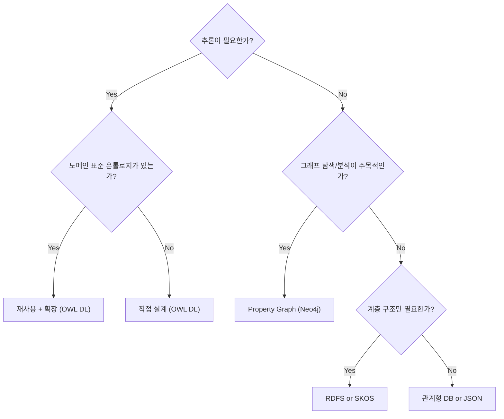

# SPEC-CONTENT-P8: Phase 8 MDX Content Generation -- "Limits and Alternatives"

## Overview

This SPEC defines the complete MDX content generation for Phase 8 of the Ontology Fundamentals Learning Platform. Phase 8 is the final phase of the course, covering the limits, costs, and alternatives to ontology. The content equips learners with the judgment to decide when ontology is the right tool and when simpler or different approaches are better suited.

This SPEC produces 8 MDX files that replace the skeleton files created by SPEC-INFRA-001. Each file is a fully written educational session with Korean explanations, English technical terms, Mermaid diagrams, callouts, and exercises.

**Learning objective:** Develop the judgment to use ontology at the right time and place, rather than applying it blindly.

**Connection from Phase 7:** Once learners understand real-world applications, they must also understand when NOT to use ontology -- this is what separates competent practitioners from beginners.

**Scope boundary:** This SPEC covers content authoring only. Infrastructure, components, styling, and build configuration are handled by SPEC-INFRA-001.

---

## Environment

### Content Platform

- **Framework:** Nextra 4.x with Next.js 15 App Router (established by SPEC-INFRA-001)
- **Content Format:** MDX files in `content/phase-8/` directory
- **Content Language:** Korean (all explanations), English (technical terms with Korean definition on first use)
- **Diagram Engine:** Mermaid 11.12.2 (client-side rendering via MermaidDiagram component)
- **Target Audience:** Korean-speaking learners who have completed Phases 1-7

### Content Quality Standards (per session)

| Element | Minimum Count | Format |
|---------|---------------|--------|
| "왜 필요한가?" blockquotes | 3 per session | `> **왜 필요한가?** [explanation]` |
| "연결 포인트" callouts | 2 per session | `> **연결 포인트 -> Phase [N]**: [connection]` (back-references to earlier phases) |
| "흔한 오해" section | 1 per session | `> **흔한 오해**: "[misconception]"` / `> **실제로는**: [correction]` |
| Mermaid diagram | 1 per session | labeled "이번 세션 전체 그림" |
| Concept explanation depth | 300-500 words each | Principle-oriented, with analogies |

### Narrative Arc (mandatory per concept)

Every major concept follows this structure:
1. **Problem first**: Describe the situation where ontology seems like the answer
2. **Reality check**: Present the cost, complexity, or limitation
3. **Alternative**: Introduce a simpler or more appropriate approach
4. **Decision criterion**: Provide a clear rule for choosing between ontology and the alternative

---

## Assumptions

### A-001: Infrastructure Ready

SPEC-INFRA-001 has been implemented. The `content/phase-8/` directory exists with skeleton MDX files, `_meta.js` navigation is configured, the MermaidDiagram component is functional, and `mdx-components.tsx` makes custom components available globally.

### A-002: No JSX Imports

Per SPEC-INFRA-001 constraint C-002, MDX files must not contain `import` statements. All components are globally available. Callouts and special formatting use blockquote `>` syntax exclusively.

### A-003: Mermaid Safe Syntax

Mermaid diagrams must follow safe syntax rules:
- No apostrophes in node labels
- No `+` operator in `stateDiagram-v2`
- Use `["double quoted labels"]` for labels with special characters
- Allowed types: `graph TD`, `graph LR`, `sequenceDiagram`, `stateDiagram-v2`, `erDiagram`, `classDiagram`, `flowchart TD`, `flowchart LR`

### A-004: Skeleton File Replacement

Each generated MDX file replaces the corresponding skeleton file in `content/phase-8/`. The YAML frontmatter structure (`title`, `description`, `difficulty`) established by SPEC-INFRA-001 is preserved, but content sections are fully written.

### A-005: Prior Phase Knowledge

Readers have completed Phases 1-7 and understand: ontology fundamentals (Phase 1-2), reasoning (Phase 3), standards ecosystem (Phase 4), design methodology (Phase 5), major ontologies (Phase 6), and real-world applications (Phase 7). Phase 8 content may freely reference concepts from all prior phases.

### A-006: Curriculum Source

All Phase 8 content follows the curriculum defined in the edu-content document, specifically the "Phase 8 -- Limits and Alternatives" section.

### A-007: Course Conclusion Context

Phase 8 is the final phase. Session 07-exercises.mdx must serve as a satisfying course conclusion, including a comprehensive course review, self-assessment checklist covering all 8 phases, and recommended resources for further learning.

---

## Requirements

### R-001: Complete Phase 8 Content Set [UBIQUITOUS]

The system shall provide 8 fully written MDX files for Phase 8 that replace the skeleton content from SPEC-INFRA-001.

**Files:**
| File | Session Title (Korean) | Topic |
|------|----------------------|-------|
| `00-introduction.mdx` | Phase 8 소개: 한계와 대안 | Phase 8 overview, course completion context |
| `01-cost-reality.mdx` | 온톨로지 구축의 현실적 비용 | Real-world costs of ontology construction |
| `02-mapping-problems.mdx` | 온톨로지 매핑 문제 | Ontology mapping challenges and limitations |
| `03-vector-embeddings.mdx` | 벡터 임베딩과의 비교 | Comparison with vector embeddings |
| `04-comparison.mdx` | 비교 분석: 온톨로지 vs 대안 기술 | Detailed comparison: Ontology vs Property Graph vs RDBMS vs SKOS/RDFS |
| `05-decision-tree.mdx` | 온톨로지 선택 의사결정 트리 | Decision tree for choosing the right technology |
| `06-when-not-to-use.mdx` | 언제 온톨로지가 과한가? | When ontology is overkill |
| `07-exercises.mdx` | Phase 8 실습 + 코스 종합 마무리 | Phase 8 exercises + comprehensive course review |

### R-002: Korean Content with English Technical Terms [UBIQUITOUS]

Each session shall present all explanations in Korean. English technical terms shall be introduced in parentheses on first use with a Korean definition, then may be used freely afterward.

**First-use format examples:**
- "벡터 임베딩(Vector Embedding) -- 텍스트나 개념을 고차원 숫자 벡터로 변환한 표현"
- "속성 그래프(Property Graph) -- 노드와 엣지에 임의의 속성을 부여할 수 있는 그래프 데이터 모델"
- "뉴로심볼릭 AI(Neurosymbolic AI) -- 신경망과 기호 추론을 결합한 인공지능 접근법"

### R-003: "왜 필요한가?" Motivation Blockquotes [EVENT-DRIVEN]

**When** a learner reads any session, **the system shall** present at least 3 "왜 필요한가?" blockquotes that explain the motivation for each concept before introducing the solution.

**Format:**
```markdown
> **왜 필요한가?** [explanation of why understanding this limitation/alternative matters]
```

**Placement rule:** Each "왜 필요한가?" blockquote must appear BEFORE the concept explanation it motivates, not after.

### R-004: Mermaid Big-Picture Diagram [UBIQUITOUS]

Each session shall include exactly one Mermaid diagram labeled "이번 세션 전체 그림" using safe Mermaid syntax.

**Diagram requirements per session:**

| Session | Diagram Type | Content Description |
|---------|-------------|-------------------|
| 00-introduction | `graph TD` | Phase 8 roadmap showing 7 sessions and their connections |
| 01-cost-reality | `graph LR` | Cost factors flow: domain experts + engineers -> construction cost -> maintenance cost -> performance cost |
| 02-mapping-problems | `graph TD` | Two ontologies attempting to map concepts, showing mismatches and the "turtles all the way down" recursion |
| 03-vector-embeddings | `graph LR` | Side-by-side comparison: ontology path (explicit rules -> logical reasoning) vs embedding path (statistical distribution -> similarity computation) |
| 04-comparison | `graph TD` | Technology comparison matrix showing Ontology, Property Graph, RDBMS, SKOS/RDFS with their strengths and ideal use cases |
| 05-decision-tree | `flowchart TD` | **CENTERPIECE**: Comprehensive decision tree flowchart for choosing the right knowledge representation technology |
| 06-when-not-to-use | `graph LR` | Four scenarios (SEO, graph traversal, tabular data, simple taxonomy) each pointing to the appropriate non-ontology solution |
| 07-exercises | `graph TD` | Complete 8-Phase course concept map connecting all phases from motivation to limits |

### R-005: No JSX Imports [UNWANTED]

MDX sessions **shall NOT** use JSX import statements. All custom components are globally available via `mdx-components.tsx`. Callouts use blockquote `>` syntax.

### R-006: "연결 포인트" Back-References [UBIQUITOUS]

Each session shall include at least 2 "연결 포인트" callouts referencing concepts from earlier phases. Since Phase 8 is the final phase, these callouts connect backward to reinforce prior learning.

**Format:**
```markdown
> **연결 포인트 -> Phase [N]**: [how a concept from that earlier phase connects to the current discussion]
```

### R-007: "흔한 오해" Misconception Sections [UBIQUITOUS]

Each session shall include at least 1 "흔한 오해" (common misconception) section with the misconception stated, then corrected.

**Format:**
```markdown
> **흔한 오해**: "[commonly held incorrect belief about ontology limits or alternatives]"
> **실제로는**: [correct explanation with reasoning]
```

### R-008: Session 00-introduction.mdx Content [UBIQUITOUS]

The introduction session shall provide:
- Phase 8 title and subtitle in Korean: "한계와 대안"
- Clear statement of Phase 8 learning objective: "온톨로지를 맹목적으로 쓰지 않고, 적재적소에 선택할 수 있는 판단력을 갖는다"
- Connection from Phase 7: "응용을 알았다면, 언제 쓰지 말아야 하는지도 알아야 진짜 실력이다"
- Brief overview of each of the 7 content sessions (01-07)
- "이번 Phase를 마치면 답할 수 있는 질문" section listing the competency questions
- A Phase 8 roadmap Mermaid diagram
- At least 3 "왜 필요한가?" blockquotes
- At least 2 "연결 포인트" callouts
- At least 1 "흔한 오해" section

### R-009: Session 01-cost-reality.mdx Content [UBIQUITOUS]

The cost reality session shall cover the real-world costs of ontology construction:

**Required content blocks:**

1. **Human resource cost (300-500 words):**
   - Domain experts and ontology engineers must collaborate closely -> high labor cost
   - Domain experts often do not understand formal logic; ontology engineers often do not understand the domain
   - The communication gap itself is a major cost factor
   - Korean industry context: the scarcity of qualified ontology engineers in the Korean market

2. **Maintenance cost (300-500 words):**
   - Initial construction is only the beginning; maintenance is harder
   - When domain knowledge evolves, axioms must be updated
   - Example: medical ontology must track new diseases, drug interactions, treatment protocols
   - Example: manufacturing ontology must adapt to new production lines and regulatory changes
   - The "living document" burden -- ontology is never "done"

3. **Performance cost (300-500 words):**
   - Large-scale ontologies suffer reasoning performance degradation
   - SNOMED CT full real-time reasoning is impractical
   - Trade-off: expressiveness vs. computational feasibility
   - OWL profiles (EL, QL, RL) as pragmatic compromises

4. **Pre-assessment principle:**
   - "Before concluding you need an ontology, first assess whether you can sustain the maintenance cost"
   - Decision framework: estimated construction cost vs. expected ROI

5. **Mermaid diagram:**
   - `graph LR` showing cost factors flowing from construction through maintenance to performance degradation

### R-010: Session 02-mapping-problems.mdx Content [UBIQUITOUS]

The mapping problems session shall cover ontology mapping challenges:

**Required content blocks:**

1. **Ontology mapping concept (300-500 words):**
   - Definition: connecting the same concept expressed differently across two ontologies
   - Why mapping is needed: organizations adopt different ontologies for the same domain
   - Real-world scale: healthcare with ICD, SNOMED CT, MeSH all needing interoperability
   - Korean healthcare context: 건강보험심사평가원 needing to bridge multiple classification systems

2. **Automated mapping tools (300-400 words):**
   - LogMap, AgreementMakerLight as representative tools
   - How they work: string similarity, structural matching, semantic anchoring
   - Accuracy limitations: automated tools miss nuanced domain distinctions
   - The human review bottleneck: every automated mapping needs expert validation

3. **The "turtles all the way down" problem (300-500 words):**
   - Mapping itself requires a meta-ontology or bridging ontology
   - The bridging ontology needs its own alignment with both source ontologies
   - Infinite regress: every layer of mapping introduces a new alignment problem
   - This is a fundamental theoretical limitation, not just an engineering challenge
   - Analogy: translating between languages requires a translator who knows both languages -- but who validates the translator?

4. **Standard ontology reuse principle (200-300 words):**
   - Reusing standard ontologies from the start is far more efficient than post-hoc mapping
   - Phase 6 connection: the standard ontologies covered earlier (FOAF, Schema.org, Gene Ontology, SNOMED CT) exist precisely to prevent this problem
   - Practical guidance: "design with standards first, customize later"

5. **Mermaid diagram:**
   - `graph TD` showing two ontologies with concept nodes, mapping arrows with question marks for uncertain alignments, and a recursive "meta-ontology" layer

### R-011: Session 03-vector-embeddings.mdx Content [UBIQUITOUS]

The vector embeddings session shall cover the comparison between ontologies and vector embeddings:

**Required content blocks:**

1. **Comparison table (presented as markdown table):**

   | Dimension | Ontology | Vector Embedding |
   |-----------|----------|-----------------|
   | Meaning Representation | Explicit rules and relationships | Statistical distributions |
   | Reasoning Capability | Logical reasoning possible | Similarity computation only |
   | Construction Cost | High (manual engineering) | Low (automatic learning from data) |
   | Explainability | High (transparent rules) | Low (black box vectors) |
   | Adding New Concepts | Manual work required | Retraining required |

2. **Ontology strengths in detail (300-500 words):**
   - Explicit, auditable knowledge representation
   - Logical reasoning derives NEW facts from existing knowledge
   - Full explainability: every inference can be traced back to axioms
   - Stable under changes: adding a new concept does not invalidate existing reasoning
   - Phase 3 connection: the reasoning capabilities covered there are the core differentiator

3. **Vector embedding strengths in detail (300-500 words):**
   - Automatic learning from large corpora -- no manual engineering
   - Captures nuanced semantic similarity that formal logic misses
   - Scales to millions of concepts effortlessly
   - Handles ambiguity and context naturally through distributional semantics
   - Modern LLM integration: embeddings are the native language of neural networks

4. **Complementary relationship (200-300 words):**
   - Ontology and embeddings are NOT competitors but complementary
   - Neurosymbolic AI: combining neural network pattern recognition with symbolic reasoning
   - Example: using embeddings for concept discovery, then ontology for formal validation
   - Research direction: Graph Neural Networks on ontology structures

5. **Mermaid diagram:**
   - `graph LR` showing two parallel paths: ontology (explicit rules -> logical reasoning -> derived facts) and embedding (training data -> vector space -> similarity scores), converging at "Neurosymbolic AI"

### R-012: Session 04-comparison.mdx Content [UBIQUITOUS]

The comparison session shall provide detailed analysis of ontology vs. alternative technologies:

**Required content blocks:**

1. **Ontology vs Property Graph / Neo4j (300-500 words):**
   - Property Graph is optimized for graph traversal and analysis, not reasoning
   - Cycle detection, shortest path, community detection are Property Graph strengths
   - Ontology provides OWA (Open World Assumption), Property Graph operates under CWA (Closed World Assumption)
   - When to choose Property Graph: primary goal is graph analytics, not logical inference
   - Korean tech context: Neo4j adoption in Korean fintech for fraud detection

2. **Ontology vs Relational Database (300-400 words):**
   - Relational DB excels when data fits tabular structure with well-defined schemas
   - No complex relationship reasoning needed -> relational DB is simpler, faster, cheaper
   - Ontology adds value when schema needs to evolve flexibly or when reasoning over relationships is required
   - Example: inventory management (relational DB sufficient) vs. drug interaction analysis (ontology needed)

3. **Ontology vs SKOS/RDFS (300-400 words):**
   - For simple classification hierarchies, OWL is overkill
   - SKOS (Simple Knowledge Organization System) handles taxonomies, thesauri, and controlled vocabularies
   - RDFS provides lightweight class/property hierarchies without OWL complexity
   - Decision criterion: "Do you need axioms and reasoning? If no, SKOS or RDFS is sufficient"
   - Phase 4 connection: the RDF/RDFS/OWL ecosystem covered there provides the context for this choice

4. **Comprehensive comparison table:**
   - Rows: OWL Ontology, Property Graph (Neo4j), Relational DB, SKOS, RDFS
   - Columns: Reasoning, Graph Analytics, Schema Flexibility, Learning Curve, Community Size, Construction Cost

5. **Mermaid diagram:**
   - `graph TD` showing each technology with its strengths and ideal use case domains

### R-013: Session 05-decision-tree.mdx Content [UBIQUITOUS]

The decision tree session is the centerpiece of Phase 8. It shall provide a comprehensive decision framework:

**Required content blocks:**

1. **Decision tree logic (presented both as text and Mermaid flowchart):**

   ```
   Is reasoning required?
   +-- No -> Is graph traversal/analysis the main purpose?
   |         +-- Yes -> Property Graph (Neo4j)
   |         +-- No -> Is only a hierarchy needed?
   |                   +-- Yes -> RDFS or SKOS
   |                   +-- No -> Relational DB or JSON
   +-- Yes -> Does a domain standard ontology exist?
              +-- Yes -> Reuse + Extend (OWL DL)
              +-- No -> Build from scratch (OWL DL)
   ```

2. **Mermaid flowchart (CENTERPIECE, 300-400 words of explanation):**
   - `flowchart TD` rendering the full decision tree above
   - Korean labels for every decision node and outcome
   - Clean visual hierarchy with clear branching
   - This diagram must be comprehensive, visually clear, and the most prominent element in the session
   - Each decision node explained in surrounding text with examples

3. **Decision node explanations (400-600 words total):**
   - "Is reasoning required?": Define what counts as reasoning (deriving new facts, consistency checking, classification)
   - "Graph traversal vs. reasoning": Shortest path, cycle detection, PageRank = graph analytics, not reasoning
   - "Hierarchy only?": If only parent-child "is-a" relationships needed, full OWL is unnecessary
   - "Standard ontology exists?": Reuse is always preferable to building from scratch (Phase 6 connection)
   - "Build from scratch": Apply methodology from Phase 5

4. **Real-world application examples (300-400 words):**
   - Manufacturing quality control: reasoning needed -> standard exists (ISA-95) -> reuse + extend
   - E-commerce product catalog: no reasoning -> hierarchy needed -> SKOS
   - Social network analysis: no reasoning -> graph traversal -> Neo4j
   - Medical diagnosis support: reasoning needed -> SNOMED CT exists -> reuse + extend

5. **Mermaid diagram:**
   - `flowchart TD` as described in item 2 -- this IS the primary Mermaid diagram for this session

### R-014: Session 06-when-not-to-use.mdx Content [UBIQUITOUS]

The "when not to use" session shall provide concrete scenarios where ontology is overkill:

**Required content blocks:**

1. **Scenario 1: JSON-LD for SEO (300-400 words):**
   - Goal: web page structured data for search engines
   - JSON-LD with Schema.org vocabulary is sufficient
   - No need for OWL axioms, reasoning, or ontology design methodology
   - Example: adding product structured data to a Korean e-commerce site
   - Phase 6 connection: Schema.org covered in Phase 6 is all you need here

2. **Scenario 2: Property Graph for graph analytics (300-400 words):**
   - Goal: fraud detection, recommendation engine, social network analysis
   - Neo4j or similar graph database handles traversal queries efficiently
   - OWL reasoning adds unnecessary complexity when the goal is pattern detection
   - Example: Korean banking fraud detection using graph traversal patterns

3. **Scenario 3: Relational DB for structured tabular data (300-400 words):**
   - Goal: inventory management, user accounts, transaction records
   - Well-defined schema with ACID transactions is simpler and faster
   - Ontology adds no value when data relationships are simple and stable
   - Example: Korean SME inventory management system

4. **Scenario 4: RDFS/SKOS for simple classification (300-400 words):**
   - Goal: product category hierarchy, document classification, controlled vocabulary
   - SKOS handles "broader/narrower" relationships efficiently
   - RDFS provides lightweight class hierarchy without OWL overhead
   - Example: Korean government document classification system

5. **Summary principle:**
   - "The best tool is the simplest one that solves the problem"
   - Ontology is the right choice ONLY when reasoning over complex relationships is genuinely required

6. **Mermaid diagram:**
   - `graph LR` showing four scenarios each pointing to the appropriate non-ontology solution

### R-015: Session 07-exercises.mdx Content [UBIQUITOUS]

The exercises session shall serve as both Phase 8 practice and the comprehensive course conclusion:

**Required content blocks:**

1. **Phase 8 recap section:**
   - Brief summary of what was covered in sessions 01-06
   - Visual concept map (Mermaid diagram) connecting all 8 Phases of the course

2. **Basic exercises (기본 실습):**

   Exercise 1: Decision Tree Application
   - Task: Select 3 projects or problems you are familiar with and apply the decision tree from session 05
   - For each project: identify whether reasoning is needed, determine the best technology choice
   - Provide a structured answer template

3. **Challenge exercises (도전 실습):**

   Exercise 2: Practical Comparison
   - Task: Take one domain and represent it in both Neo4j (Property Graph) and Protege (OWL ontology)
   - Compare: What can the ontology express that the property graph cannot? What queries are easier in Neo4j?
   - Guidance: Use a simple domain like "university courses and students" or "movie database"
   - Document the strengths and limitations you discover

4. **Course comprehensive questions (코스 종합 핵심 질문 3개):**

   Question 1: "온톨로지가 반드시 필요한 상황과 다른 기술로 충분한 상황을 구분하는 핵심 기준은 무엇인가?"
   - Guidance: Think about the decision tree -- reasoning requirement is the key discriminator

   Question 2: "온톨로지와 벡터 임베딩의 근본적 차이는 무엇이고, 둘을 함께 쓰면 어떤 이점이 있는가?"
   - Guidance: Think about explicit vs. statistical knowledge representation, and Neurosymbolic AI

   Question 3: "8개 Phase를 통해 배운 온톨로지의 전체 여정을 한 문단으로 요약할 수 있는가?"
   - Guidance: From motivation (Phase 1) through building blocks (Phase 2), reasoning (Phase 3), standards (Phase 4), methodology (Phase 5), standard ontologies (Phase 6), applications (Phase 7), to limits and alternatives (Phase 8)

5. **Course completion self-assessment checklist (전체 8 Phase 복습):**
   - Phase 1: "데이터, 정보, 지식의 차이를 실무 사례로 설명할 수 있다"
   - Phase 2: "클래스, 인스턴스, 속성, 공리의 관계를 설명할 수 있다"
   - Phase 3: "Description Logic 기반 추론이 어떻게 작동하는지 설명할 수 있다"
   - Phase 4: "RDF, RDFS, OWL, SPARQL의 역할과 관계를 설명할 수 있다"
   - Phase 5: "온톨로지 설계 방법론의 주요 단계를 적용할 수 있다"
   - Phase 6: "FOAF, Schema.org, Gene Ontology, SNOMED CT의 특징과 용도를 비교할 수 있다"
   - Phase 7: "Knowledge Graph, 제조업, LLM 시대의 온톨로지 활용 사례를 설명할 수 있다"
   - Phase 8: "온톨로지가 적합하지 않은 상황을 판별하고 대안을 제시할 수 있다"

6. **Recommended resources (추천 참고 자료 목록):**
   - Beginner (입문): Recommended books, online courses for ontology beginners
   - Intermediate (중급): Protege tutorials, OWL specification documents, SPARQL query guides
   - LLM integration (LLM 연계): Graph RAG papers, Neurosymbolic AI research, Knowledge Graph + LLM integration resources
   - Practice environments (실습 환경): Protege download, WebVOWL, Neo4j sandbox, SPARQL endpoints

7. **Course completion message:**
   - Congratulatory message for completing all 8 phases
   - Emphasis on practical application: "Now take what you have learned and apply it to your own domain"
   - Call to revisit earlier phases whenever needed as a reference

---

## Specifications

### S-001: MDX Frontmatter Structure

Each MDX file shall have YAML frontmatter:

```yaml
---
title: "[Korean session title]"
description: "[Korean description for search indexing, 50-100 chars]"
difficulty: "intermediate"
---
```

Note: Phase 8 difficulty is "intermediate" because learners have completed 7 prior phases.

### S-002: Session Content Structure Template

Each content session (01-06) follows this structure:

```markdown
---
title: "[Title]"
description: "[Description]"
difficulty: "intermediate"
---

# [Session Number]회차: [Korean Title]

## 학습 목표

(3 bullet points describing what the learner will achieve)

> **왜 필요한가?** [Opening motivation before first concept]

## 이번 세션 전체 그림

(Mermaid diagram code block)

## [First Major Concept Heading]

> **왜 필요한가?** [Motivation for this specific concept]

(300-500 word explanation with analogies and examples)

> **연결 포인트 -> Phase [N]**: [Back-reference to earlier phase]

## [Second Major Concept Heading]

> **왜 필요한가?** [Motivation for this specific concept]

(300-500 word explanation with analogies and examples)

## [Additional Concept Headings as needed]

> **연결 포인트 -> Phase [N]**: [Back-reference to earlier phase]

## 흔한 오해

> **흔한 오해**: "[Misconception]"
> **실제로는**: [Correct explanation]

(Additional misconceptions if relevant)

## 요약

(Concise summary of key takeaways, 3-5 bullet points)

## 다음 세션 예고

(Brief preview of what comes next and why it matters)
```

### S-003: Introduction Session Structure (00-introduction.mdx)

```markdown
---
title: "Phase 8 소개: 한계와 대안"
description: "온톨로지의 한계와 대안 기술을 이해하기 위한 Phase 8 학습 안내"
difficulty: "intermediate"
---

# Phase 8: 한계와 대안

## 이 Phase에서 배우는 것

(Phase 8 learning objective and course completion context)

> **왜 필요한가?** [Why understanding limitations makes you a better practitioner]

## 이번 세션 전체 그림

(Phase 8 roadmap Mermaid diagram)

## 세션 구성

(Overview of 7 content sessions with brief descriptions)

## Phase 7과의 연결

(Connection statement: applications knowledge -> limitation knowledge)

## 이번 Phase를 마치면 답할 수 있는 질문

(Competency questions listed)

## 흔한 오해

> **흔한 오해**: "[Misconception about ontology limitations]"
> **실제로는**: [Correction]

> **연결 포인트 -> Phase 1**: [Full circle reference]
> **연결 포인트 -> Phase 7**: [Direct predecessor connection]
```

### S-004: Exercise Session Structure (07-exercises.mdx)

```markdown
---
title: "Phase 8 실습 + 코스 종합 마무리"
description: "Phase 8 실습과 전체 8 Phase 코스 종합 마무리"
difficulty: "intermediate"
---

# Phase 8 실습 + 코스 종합 마무리

## 이번 세션 전체 그림

(Complete 8-Phase course concept map Mermaid diagram)

## Phase 8 핵심 요약

(Brief recap of all Phase 8 sessions 01-06)

## 기본 실습

### 실습 1: [Title]

## 도전 실습

### 실습 2: [Title]

## 코스 종합 핵심 질문

### 질문 1: [Question]
### 질문 2: [Question]
### 질문 3: [Question]

## 학습 완료 자기 점검 체크리스트

(Self-assessment checklist covering all 8 Phases)

## 추천 참고 자료

### 입문
### 중급
### LLM 연계
### 실습 환경

## 코스를 마치며

(Course completion message)
```

### S-005: Mermaid Syntax Constraints

All Mermaid diagrams must follow these rules:
- No apostrophes (`'`) anywhere in diagram code
- No `+` operator in `stateDiagram-v2`
- Use `["double quoted labels"]` for labels with Korean characters or special characters
- Test every diagram mentally for syntax validity before writing
- Wrap in standard markdown code fences with `mermaid` language identifier

**Example safe pattern:**


### S-006: Content Depth Requirements

Each major concept explanation (not including callouts, exercises, or summaries) shall be 300-500 words and include:
- At least 1 real-world analogy or example relevant to Korean industries
- The "situation -> reality check -> alternative -> decision criterion" narrative arc for Phase 8
- Concrete examples, not abstract definitions
- Connection to why this matters for the learner's practical decision-making

### S-007: Technical Term Introduction Pattern

On first use of any English technical term:
```
한국어_용어(English_Term) -- 한국어로 된 간결한 정의
```

After first introduction, either the Korean term or English term may be used freely.

**Phase 8 key terms to introduce:**
- 벡터 임베딩(Vector Embedding)
- 속성 그래프(Property Graph)
- 뉴로심볼릭 AI(Neurosymbolic AI)
- 온톨로지 매핑(Ontology Mapping)
- 그래프 신경망(Graph Neural Network)
- SKOS(Simple Knowledge Organization System)
- 열린 세계 가정(Open World Assumption)
- 닫힌 세계 가정(Closed World Assumption)
- LogMap
- AgreementMakerLight

### S-008: Decision Tree Diagram Quality

The Mermaid flowchart in session 05-decision-tree.mdx is the centerpiece of Phase 8 and must meet heightened quality standards:
- Use `flowchart TD` (not `graph TD`) for proper flowchart rendering with decision diamonds
- Decision nodes use diamond shape `{"question"}`
- Outcome nodes use rectangle shape `["answer"]`
- All node labels in Korean
- Edge labels indicating Yes/No choices
- Clean visual hierarchy without overlapping or cramped nodes
- Every decision path leads to a clear technology recommendation

### S-009: Course Conclusion Quality

Session 07-exercises.mdx must provide a satisfying course conclusion:
- The self-assessment checklist must cover all 8 phases (one item per phase minimum)
- The concept map Mermaid diagram must show connections between all 8 phases
- The recommended resources section must include at least 3 categories (beginner, intermediate, LLM integration, practice environments)
- The closing message must acknowledge the learner's achievement and encourage practical application

---

## Constraints

### C-001: No Implementation Code

This SPEC produces MDX content files only. No TypeScript, JavaScript, CSS, or configuration file changes.

### C-002: Skeleton Replacement

Generated content replaces skeleton files from SPEC-INFRA-001. The file paths must match exactly:
- `content/phase-8/00-introduction.mdx`
- `content/phase-8/01-cost-reality.mdx`
- `content/phase-8/02-mapping-problems.mdx`
- `content/phase-8/03-vector-embeddings.mdx`
- `content/phase-8/04-comparison.mdx`
- `content/phase-8/05-decision-tree.mdx`
- `content/phase-8/06-when-not-to-use.mdx`
- `content/phase-8/07-exercises.mdx`

### C-003: Mermaid Safe Syntax (inherited from SPEC-INFRA-001)

- FORBIDDEN: Apostrophes in Mermaid node labels
- FORBIDDEN: `+` in stateDiagram-v2
- Use `["double quoted labels"]` for labels with special characters
- Safe types: `graph TD`, `graph LR`, `flowchart TD`, `flowchart LR`, `sequenceDiagram`, `stateDiagram-v2`, `erDiagram`

### C-004: No JSX Imports (inherited from SPEC-INFRA-001)

MDX files must not contain `import` statements. All components available via `mdx-components.tsx`.

### C-005: Word Count Target

Total Phase 8 content (all 8 files combined): approximately 12,000-18,000 Korean words. Individual session targets:
- 00-introduction: 800-1,200 words
- 01-cost-reality: 1,500-2,500 words
- 02-mapping-problems: 1,500-2,500 words
- 03-vector-embeddings: 1,500-2,500 words
- 04-comparison: 1,500-2,500 words
- 05-decision-tree: 1,500-2,500 words
- 06-when-not-to-use: 1,500-2,500 words
- 07-exercises: 2,000-3,000 words (expanded for course conclusion)

### C-006: Technical Accuracy

- Comparison between ontology and vector embeddings must accurately reflect their capabilities and limitations
- Property Graph (Neo4j) characteristics must be accurately described
- OWL profiles (EL, QL, RL) must be correctly referenced
- SKOS and RDFS capabilities must be accurately distinguished from OWL
- LogMap and AgreementMakerLight must be correctly identified as ontology mapping tools
- Neurosymbolic AI must be presented as an active research direction, not as a mature technology
- SNOMED CT reasoning limitations must be accurately described

### C-007: Consistent Cross-References

- Back-references must only point to phases that exist in the curriculum (Phase 1-7)
- Every "연결 포인트" in Phase 8 is a back-reference (since there are no subsequent phases)
- Competency questions in exercises must align with the course conclusion scope
- The self-assessment checklist must accurately summarize each phase's core competency

### C-008: Course Conclusion Tone

Session 07-exercises.mdx must achieve a satisfying, encouraging tone:
- Acknowledge the learner's effort across all 8 phases
- Avoid being overly formal or academic
- Encourage practical application of learned concepts
- Provide a sense of accomplishment and forward direction

---

## Traceability

| Requirement | Plan Reference | Acceptance Reference |
|-------------|---------------|---------------------|
| R-001 | Plan: Session Overview | AC-001 |
| R-002 | Plan: All Sessions | AC-002 |
| R-003 | Plan: All Sessions | AC-003 |
| R-004 | Plan: Diagram Specs | AC-004 |
| R-005 | Plan: All Sessions | AC-005 |
| R-006 | Plan: All Sessions | AC-006 |
| R-007 | Plan: All Sessions | AC-007 |
| R-008 | Plan: Session 00 | AC-008 |
| R-009 | Plan: Session 01 | AC-009 |
| R-010 | Plan: Session 02 | AC-010 |
| R-011 | Plan: Session 03 | AC-011 |
| R-012 | Plan: Session 04 | AC-012 |
| R-013 | Plan: Session 05 | AC-013 |
| R-014 | Plan: Session 06 | AC-014 |
| R-015 | Plan: Session 07 | AC-015 |

---

## Expert Consultation Recommendations

### Frontend Expert (expert-frontend)

This SPEC involves MDX content authoring within a Nextra 4.x site. Consulting expert-frontend is recommended for:
- Verifying Mermaid flowchart rendering behavior (especially the decision tree in 05-decision-tree.mdx)
- Ensuring the comprehensive course concept map in 07-exercises.mdx renders without visual overflow
- Validating MDX syntax compatibility with Nextra 4.x parser

### Content/Education Domain Expert

If available, consulting a subject matter expert would be valuable for:
- Verifying accuracy of ontology vs. vector embedding comparison
- Reviewing Property Graph characterization for correctness
- Ensuring the decision tree covers all common real-world scenarios
- Validating SNOMED CT reasoning performance claims
