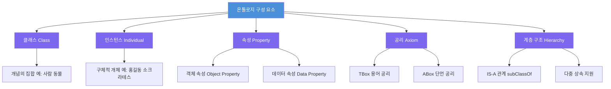

# 2단계: 온톨로지의 구성 요소

## 이 단계에서 배우는 것

1단계에서 우리는 온톨로지가 **무엇인지**, 그리고 왜 필요한지 배웠습니다. 이제 2단계에서는 온톨로지를 **실제로 어떻게 만드는지**를 배웁니다.

집을 짓는다고 상상해 보세요. 집을 짓기 위해서는 벽돌, 시멘트, 창문, 문 같은 재료가 필요합니다. 온톨로지를 만들 때도 마찬가지입니다. 온톨로지를 구성하는 기본 재료들이 있으며, 이 단계에서 그 재료들을 하나씩 배워갑니다.

> **왜 필요한가?** 온톨로지의 구성 요소를 이해하지 못하면 OWL 파일을 읽어도 암호문처럼 보입니다. 구성 요소를 알면 실제 의료, 법률, 금융 온톨로지를 읽고 수정할 수 있게 됩니다.

---

## 이번 단계 전체 그림



---

## 다섯 가지 핵심 구성 요소

### 1. 클래스 (Class)

**클래스**는 공통 특성을 가진 개체들의 집합입니다. "사람(Person)", "동물(Animal)", "도시(City)"와 같이 현실 세계의 개념을 나타냅니다.

OWL에서는 `owl:Class`로 표현합니다.

```
owl:Class
  ↳ Person (사람)
  ↳ Animal (동물)
  ↳ City   (도시)
```

> **연결 포인트:** 클래스는 프로그래밍의 클래스(class)와 비슷하지만, 중요한 차이가 있습니다. 프로그래밍 클래스는 행동(메서드)을 정의하지만, 온톨로지 클래스는 **개념의 의미적 범주**를 정의합니다.

### 2. 인스턴스 (Individual / Instance)

**인스턴스**(또는 개체, Individual)는 클래스의 구체적인 구성원입니다. "홍길동", "서울", "참새"처럼 실제로 존재하는 특정 개체를 나타냅니다.

OWL에서는 `owl:NamedIndividual`로 표현합니다.

```
홍길동  rdf:type  Person
서울    rdf:type  City
참새    rdf:type  Animal
```

### 3. 속성 (Property)

**속성**은 클래스나 인스턴스 사이의 관계 또는 데이터 값을 연결합니다.

- **객체 속성 (Object Property):** 두 개체 사이의 관계. 예: `홍길동 hasParent 홍판서`
- **데이터 속성 (Data Property):** 개체와 데이터 값의 관계. 예: `홍길동 hasAge 30`

### 4. 공리 (Axiom)

**공리**는 온톨로지에서 참으로 가정하는 명제입니다. "모든 인간은 죽는다"처럼 도메인에 대한 지식을 형식화합니다.

공리는 두 가지 종류가 있습니다:
- **TBox (용어 상자, Terminological Box):** 클래스와 속성에 대한 공리. "Person은 Animal의 하위클래스다"
- **ABox (단언 상자, Assertional Box):** 특정 개체에 대한 공리. "홍길동은 Person이다"

### 5. 계층 구조 (Hierarchy)

**계층 구조**는 클래스들 사이의 IS-A 관계를 정의합니다. "개(Dog)는 포유류(Mammal)다"와 같이 더 일반적인 개념에서 더 구체적인 개념으로 구조화합니다.

`rdfs:subClassOf`를 사용하여 표현합니다.

```
Animal
  └── Mammal
        └── Dog
              └── GoldenRetriever
```

---

## 단계 구성

이 단계는 다음 순서로 진행됩니다:

| 회차 | 제목 | 핵심 개념 |
|------|------|-----------|
| 1회차 | 클래스와 인스턴스 | owl:Class, owl:NamedIndividual, rdf:type |
| 2회차 | 속성(Properties) | Object Property, Data Property, Domain, Range |
| 3회차 | 공리(Axioms) | TBox, ABox, subClassOf, equivalentClass |
| 4회차 | 계층 구조 | IS-A, 다중 상속, rdfs:subClassOf |
| 5회차 | DB/KG와 비교 | RDBMS vs 온톨로지, 지식 그래프 |
| 실습 | 종합 실습 | 가족 관계, 학교 도메인 온톨로지 설계 |

---

## 학습 목표

이 단계를 마치면 다음을 할 수 있습니다:

1. 온톨로지의 5가지 핵심 구성 요소를 설명할 수 있다
2. 주어진 도메인에서 클래스, 인스턴스, 속성을 식별할 수 있다
3. OWL 문법(`owl:Class`, `rdf:type`, `rdfs:subClassOf`)을 읽을 수 있다
4. 관계형 데이터베이스와 온톨로지의 차이를 비교 설명할 수 있다
5. 간단한 온톨로지를 직접 설계할 수 있다

---

## 이 단계를 잘 활용하는 방법

> **왜 필요한가?** 온톨로지 학습에서 가장 흔한 실수는 개념을 머릿속으로만 이해하고 실제로 적용해보지 않는 것입니다. 각 회차의 실습 문제를 반드시 직접 풀어보세요.

각 회차를 학습할 때 다음 질문을 스스로에게 던져보세요:

- "이 개념을 내가 아는 도메인(학교, 병원, 회사)에 적용하면 어떻게 될까?"
- "이 개념이 없다면 어떤 문제가 생길까?"
- "이 개념과 프로그래밍의 어떤 개념이 비슷하고, 어떻게 다른가?"

> **연결 포인트:** 2단계의 내용은 3단계(OWL과 추론)의 기반이 됩니다. 클래스와 공리를 잘 이해해야 추론 엔진이 어떻게 새로운 지식을 도출하는지 이해할 수 있습니다.

---

## 사전 지식 확인

다음 질문에 답할 수 있으면 2단계를 시작할 준비가 됐습니다:

1. 온톨로지란 무엇인가? (1단계 1회차)
2. 온톨로지가 왜 필요한가? (1단계 2회차)
3. 그루버(Gruber)의 온톨로지 정의는 무엇인가? (1단계 3회차)

답이 기억나지 않는다면 1단계를 먼저 복습하고 오세요!
