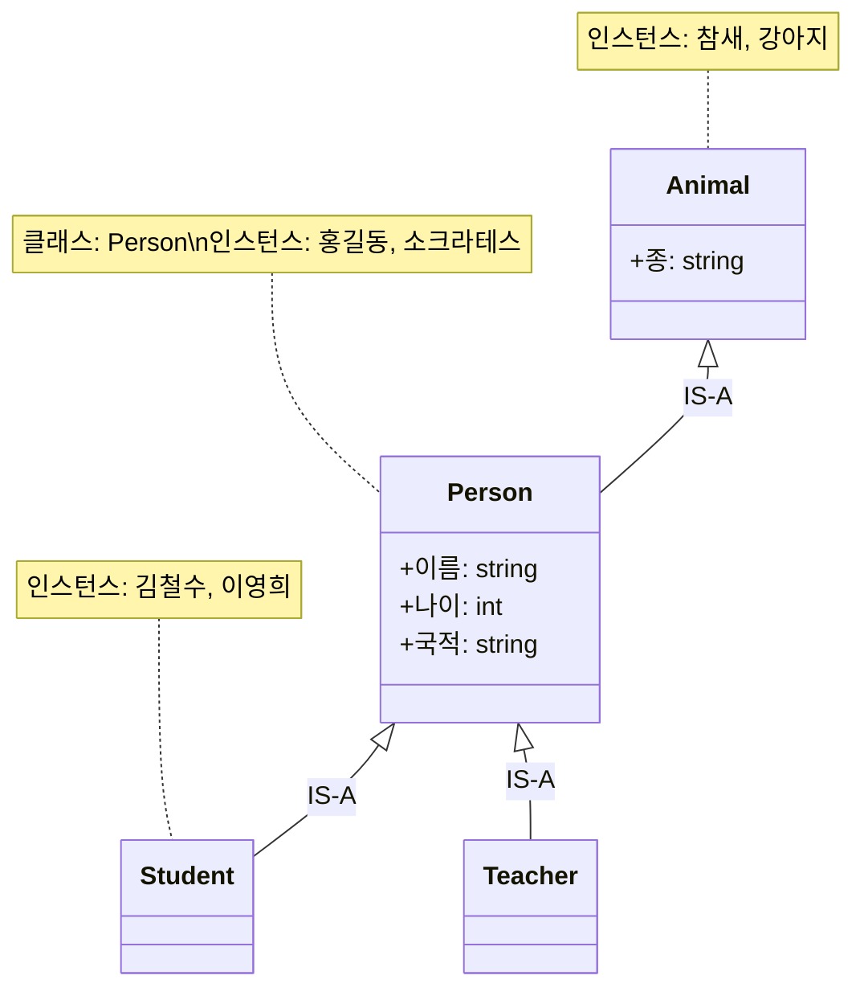

# 1회차: 클래스와 인스턴스

## 학습 목표

이번 회차를 마치면 다음을 할 수 있습니다:

- 클래스(Class)와 인스턴스(Instance/Individual)의 차이를 설명할 수 있다
- 주어진 문장에서 클래스와 인스턴스를 구분할 수 있다
- `owl:Class`, `owl:NamedIndividual`, `rdf:type`의 의미를 이해한다
- UML 클래스 다이어그램과 OWL 클래스의 공통점과 차이점을 설명할 수 있다

---

## 이번 세션 전체 그림



---

## 클래스란 무엇인가?

### 개념의 집합

<strong>클래스(Class)</strong>는 공통 특성을 가진 개체들의 집합 또는 범주입니다. 클래스는 현실 세계나 상상 속의 개념을 형식적으로 나타냅니다.

예를 들어, "사람(Person)"이라는 클래스는:
- 홍길동을 포함합니다
- 소크라테스를 포함합니다
- 마리 퀴리를 포함합니다
- "자동차"는 포함하지 않습니다

> **왜 필요한가?** 클래스가 없으면 모든 개체를 개별적으로 기술해야 합니다. 10억 명의 사람을 표현하려면 10억 개의 독립적인 기술이 필요합니다. 클래스를 사용하면 "사람이라면 누구나 이름, 나이를 가진다"고 한 번만 정의하면 됩니다.

### OWL에서의 클래스 표현

온톨로지 웹 언어(OWL)에서 클래스는 `owl:Class`로 표현합니다. Turtle 문법으로 쓰면:

```turtle
:Person rdf:type owl:Class .
:Animal rdf:type owl:Class .
:City   rdf:type owl:Class .
```

이를 한국어로 읽으면:
- "Person은 OWL 클래스다"
- "Animal은 OWL 클래스다"
- "City는 OWL 클래스다"

> **연결 포인트:** `rdf:type`은 "~은 ~의 종류다" 또는 "~은 ~에 속한다"를 나타냅니다. 이 관계는 온톨로지 전체에서 가장 자주 사용되는 관계입니다.

---

## 인스턴스란 무엇인가?

### 구체적인 개체

**인스턴스(Instance)** 또는 <strong>개체(Individual)</strong>는 클래스의 구체적인 구성원입니다. 추상적인 클래스와 달리, 인스턴스는 실제로 존재하는(또는 존재했던, 또는 상상 속의) 특정 대상입니다.

| 클래스 (추상) | 인스턴스 (구체) |
|--------------|----------------|
| Person (사람) | 홍길동, 소크라테스, 마리 퀴리 |
| City (도시) | 서울, 파리, 뉴욕 |
| Animal (동물) | 참새, 강아지, 독수리 |
| Book (책) | 홍길동전, 파우스트, 1984 |

### OWL에서의 인스턴스 표현

OWL에서 인스턴스는 `owl:NamedIndividual`로 선언합니다:

```turtle
:홍길동    rdf:type owl:NamedIndividual .
:서울      rdf:type owl:NamedIndividual .
:참새      rdf:type owl:NamedIndividual .
```

---

## 멤버십 관계: rdf:type

### "이것은 저 클래스에 속한다"

클래스와 인스턴스를 연결하는 핵심 관계가 <strong>멤버십 관계(membership relation)</strong>이며, OWL/RDF에서는 `rdf:type`으로 표현합니다.

```turtle
:홍길동  rdf:type  :Person .
:서울    rdf:type  :City .
:참새    rdf:type  :Animal .
```

이것은 다음을 의미합니다:
- "홍길동은 Person(사람)이다"
- "서울은 City(도시)이다"
- "참새는 Animal(동물)이다"

> **왜 필요한가?** `rdf:type`이 없으면 온톨로지 추론 엔진은 "홍길동"이 사람인지 도시인지 알 수 없습니다. 이 관계를 통해 시스템은 홍길동이 Person 클래스의 모든 속성(이름, 나이, 주소 등)을 가질 수 있다는 것을 알게 됩니다.

### 하나의 인스턴스, 여러 클래스

OWL에서는 하나의 인스턴스가 여러 클래스에 동시에 속할 수 있습니다:

```turtle
:홍길동  rdf:type  :Person .
:홍길동  rdf:type  :Student .
:홍길동  rdf:type  :Korean .
```

이것은 현실을 정확하게 반영합니다. 홍길동은 동시에 사람이고, 학생이고, 한국인일 수 있습니다.

---

## 클래스 vs 인스턴스: 상황에 따라 달라진다

### 역할은 맥락에 따라 달라진다

흥미롭게도, 어떤 것이 클래스인지 인스턴스인지는 **도메인(관심 영역)에 따라 달라집니다**.

예를 들어, "포유류(Mammal)"를 생각해 봅시다:

**동물학 온톨로지에서:**
- `Mammal`은 클래스 (고양이, 개, 인간을 포함하는 집합)
- `Mammal`의 인스턴스: 개별 동물들

**생물 분류 온톨로지에서:**
- `Mammal`은 인스턴스 (분류 체계라는 클래스의 구성원)
- `Mammal`의 클래스: `TaxonomicRank` (분류 단위)

> **연결 포인트:** 이것은 온톨로지 설계에서 매우 중요한 결정입니다. 어떤 것을 클래스로 모델링할지, 인스턴스로 모델링할지는 **어떤 질문에 답하고 싶은가**에 따라 달라집니다.

---

## UML 클래스 다이어그램과의 비교

소프트웨어 개발자라면 UML 클래스 다이어그램과 비교하면 이해가 빠릅니다.

### 공통점

| 개념 | UML | OWL |
|------|-----|-----|
| 개념 집합 | Class | owl:Class |
| 구체적 대상 | Object/Instance | owl:NamedIndividual |
| 소속 관계 | instanceOf | rdf:type |
| 상속 | extends | rdfs:subClassOf |

### 차이점

| 구분 | UML | OWL |
|------|-----|-----|
| 목적 | 소프트웨어 설계 | 지식 표현 및 추론 |
| 다중 상속 | 언어에 따라 제한 | 항상 지원 |
| 멤버십 | 컴파일 타임 고정 | 런타임에 추론 가능 |
| 닫힌 세계 가정 | 예 | 아니오 (개방 세계) |
| 표준 | ISO 19501 | W3C OWL 2 |

> **왜 필요한가?** OWL은 추론이 가능합니다. "모든 Person은 Animal이다"라는 공리가 있을 때, 온톨로지 추론 엔진은 자동으로 `홍길동 rdf:type Animal`을 도출합니다. UML은 이런 자동 추론을 지원하지 않습니다.

---

## 흔한 오해

### 오해 1: "클래스는 데이터베이스의 테이블과 같다"

**반은 맞고 반은 틀립니다.** 둘 다 개체들의 집합을 나타내지만, 차이가 있습니다:

- 데이터베이스 테이블은 **스키마가 고정**됩니다. 열(column)이 미리 정해져 있어야 합니다.
- OWL 클래스는 **개방적**입니다. 새로운 속성을 언제든지 추가할 수 있고, 추론을 통해 새로운 멤버를 발견할 수 있습니다.

### 오해 2: "인스턴스는 반드시 현실에 존재해야 한다"

**아닙니다.** OWL에서 인스턴스는 현실의 존재뿐만 아니라:
- 역사적 인물 (소크라테스, 나폴레옹)
- 가상의 존재 (홍길동, 해리 포터)
- 추상 개념의 특정 사례 (특정 법률 조항, 특정 음악 작품)

도 인스턴스로 표현할 수 있습니다.

### 오해 3: "클래스의 이름이 인스턴스가 될 수 없다"

**틀립니다.** OWL은 메타 모델링을 지원합니다. "Person"이라는 클래스 자체가 "Concept"이라는 클래스의 인스턴스가 될 수 있습니다. 단, 이는 고급 주제이며 처음에는 이 구분에 집중하세요.

---

## 실습

### 기본 실습 1: 클래스와 인스턴스 분류하기

다음 목록을 클래스와 인스턴스로 분류하세요:

```
서울대학교, 대학교, 교수, 김교수, 강의, 알고리즘론,
학생, 이철수, 도서관, 중앙도서관, 책, 운영체제론
```

**힌트:** "모든 ___은 ___이다"라는 문장이 자연스러우면 하위-상위 관계입니다.

### 기본 실습 2: rdf:type 문장 작성하기

다음 한국어 문장을 Turtle 형식의 `rdf:type` 구문으로 표현하세요:

1. "플라톤은 철학자다"
2. "서울은 도시다"
3. "뉴턴은 과학자다"
4. "해리포터는 마법사다"

**예시:**
```turtle
:홍길동  rdf:type  :Person .
```

### 도전 실습: 의료 도메인 모델링하기

병원 시스템을 위한 간단한 온톨로지를 설계하세요. 다음 문장에서 클래스와 인스턴스를 추출하고, `rdf:type` 관계를 작성하세요:

> "삼성서울병원의 김의사는 심장외과 전문의다. 그는 이환자를 치료하고 있으며, 이환자는 고혈압과 당뇨를 앓고 있다."

추출해야 할 것:
- 클래스 최소 4개
- 인스턴스 최소 3개
- `rdf:type` 관계 최소 5개

---

## 요약

이번 회차에서 배운 핵심 내용:

1. **클래스(Class)** = 공통 특성을 가진 개체들의 집합. OWL에서 `owl:Class`로 표현.
2. **인스턴스(Individual)** = 클래스의 구체적 구성원. OWL에서 `owl:NamedIndividual`로 표현.
3. **멤버십 관계** = `rdf:type`. "홍길동 `rdf:type` Person"은 "홍길동은 사람이다"를 의미.
4. **하나의 인스턴스** = 여러 클래스에 동시에 속할 수 있음.
5. **클래스 vs 인스턴스** = 상황과 도메인에 따라 달라질 수 있음.

다음 회차에서는 클래스와 인스턴스 **사이의 관계**를 표현하는 <strong>속성(Properties)</strong>을 배웁니다.
