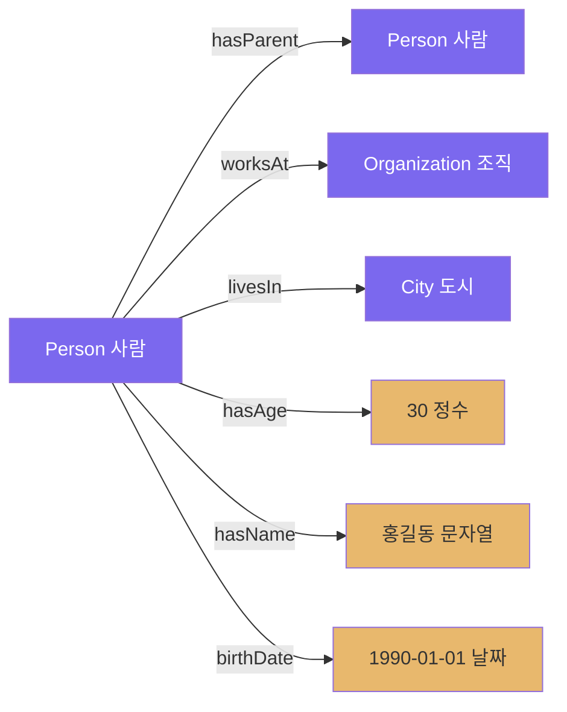

# 2회차: 속성(Properties)

## 학습 목표

이번 회차를 마치면 다음을 할 수 있습니다:

- 객체 속성(Object Property)과 데이터 속성(Data Property)의 차이를 설명할 수 있다
- 속성의 도메인(Domain)과 범위(Range)를 정의할 수 있다
- 속성의 특성(함수적, 대칭적, 추이적)을 이해한다
- 주어진 도메인에서 적절한 속성을 식별하고 정의할 수 있다

---

## 이번 세션 전체 그림



보라색 박스는 클래스(개체), 황색 박스는 리터럴 값(데이터)입니다.
보라색 화살표는 **객체 속성**, 황색 화살표는 **데이터 속성**입니다.

---

## 속성이란 무엇인가?

### 관계와 데이터를 표현하는 방법

1회차에서 우리는 클래스와 인스턴스를 배웠습니다. 그런데 "홍길동은 사람이다"라는 사실만으로는 충분하지 않습니다. 우리는 다음과 같은 것들도 표현해야 합니다:

- 홍길동의 **부모**는 홍판서다 (관계)
- 홍길동은 **조선왕조**에서 일했다 (관계)
- 홍길동의 **나이**는 30이다 (데이터)
- 홍길동의 **이름**은 "홍길동"이다 (데이터)

이러한 관계와 데이터를 표현하기 위해 <strong>속성(Property)</strong>을 사용합니다.

> **왜 필요한가?** 속성이 없으면 온톨로지는 이름 목록에 불과합니다. 속성을 통해 개체들 사이의 의미 있는 관계망이 만들어지고, 이 관계망에서 새로운 지식을 추론할 수 있습니다.

---

## 두 종류의 속성

### 객체 속성 (Object Property)

<strong>객체 속성(Object Property)</strong>은 두 개체(Individual) 사이의 관계를 나타냅니다. 시작점과 끝점이 모두 클래스의 인스턴스입니다.

OWL에서는 `owl:ObjectProperty`로 선언합니다:

```turtle
:hasParent   rdf:type  owl:ObjectProperty .
:worksAt     rdf:type  owl:ObjectProperty .
:livesIn     rdf:type  owl:ObjectProperty .
:marriedTo   rdf:type  owl:ObjectProperty .
```

사용 예시:
```turtle
:홍길동  :hasParent  :홍판서 .
:홍길동  :worksAt    :조선왕조 .
:홍길동  :livesIn    :서울 .
```

이를 그래프로 표현하면:

```
홍길동 ---hasParent---> 홍판서
홍길동 ---worksAt-----> 조선왕조
홍길동 ---livesIn-----> 서울
```

> **연결 포인트:** 객체 속성은 지식 그래프(Knowledge Graph)에서 "엣지(edge)"에 해당합니다. 구글의 지식 그래프, 위키데이터 등에서 수십억 개의 이런 삼중항(트리플)이 모여 방대한 지식 네트워크를 형성합니다.

### 데이터 속성 (Data Property)

<strong>데이터 속성(Data Property)</strong>은 개체와 리터럴 값(문자열, 숫자, 날짜 등) 사이의 관계를 나타냅니다. 끝점이 클래스 인스턴스가 아니라 **데이터 값**입니다.

OWL에서는 `owl:DatatypeProperty`로 선언합니다:

```turtle
:hasAge     rdf:type  owl:DatatypeProperty .
:hasName    rdf:type  owl:DatatypeProperty .
:birthDate  rdf:type  owl:DatatypeProperty .
:hasEmail   rdf:type  owl:DatatypeProperty .
```

사용 예시:
```turtle
:홍길동  :hasAge     30 .
:홍길동  :hasName    "홍길동" .
:홍길동  :birthDate  "1990-01-15"^^xsd:date .
:홍길동  :hasEmail   "hong@example.com" .
```

### 객체 속성 vs 데이터 속성 비교

| 구분 | 객체 속성 | 데이터 속성 |
|------|-----------|-------------|
| 연결 대상 | 클래스 인스턴스 | 리터럴 값 |
| OWL 타입 | `owl:ObjectProperty` | `owl:DatatypeProperty` |
| 예시 | hasParent, worksAt | hasAge, hasName |
| 역방향 가능? | 예 (inverseOf) | 아니오 |
| 추론 활용 | 다양하게 가능 | 제한적 |

---

## 도메인과 범위 제약

### 속성의 적용 범위를 제한하기

속성을 정의할 때 "어떤 클래스의 인스턴스에 이 속성을 적용할 수 있는가?"와 "이 속성의 값은 어떤 클래스나 타입이어야 하는가?"를 제약할 수 있습니다.

**도메인(Domain):** 속성이 적용되는 클래스 (주어 역할)

```turtle
:hasParent  rdfs:domain  :Person .
```

이는 "hasParent 속성은 Person(사람)에게만 적용된다"는 의미입니다.

**범위(Range):** 속성 값의 클래스 또는 데이터 타입 (목적어 역할)

```turtle
:hasParent  rdfs:range   :Person .
:hasAge     rdfs:range   xsd:integer .
:hasName    rdfs:range   xsd:string .
```

이는:
- "hasParent의 값은 반드시 Person이어야 한다"
- "hasAge의 값은 정수여야 한다"
- "hasName의 값은 문자열이어야 한다"

> **왜 필요한가?** 도메인과 범위 제약은 두 가지 역할을 합니다. 첫째, 데이터 품질을 보장합니다 (사람의 부모는 반드시 사람이어야 함). 둘째, 추론 엔진이 새로운 사실을 도출할 수 있게 합니다. 예를 들어, "X hasParent Y"라는 사실만 있어도 추론 엔진은 "X는 Person이다"와 "Y는 Person이다"를 자동으로 도출합니다.

---

## 속성의 특성 (Property Characteristics)

OWL은 속성에 다양한 특성을 부여할 수 있습니다. 이 특성들은 추론 엔진이 새로운 사실을 도출하는 데 사용됩니다.

### 함수적 속성 (Functional Property)

각 인스턴스에 대해 최대 하나의 값만 가질 수 있는 속성입니다.

```turtle
:hasBirthMother  rdf:type  owl:FunctionalProperty .
```

이는 "모든 사람은 생물학적 어머니가 정확히 한 명이다"를 의미합니다. 따라서:
- "X hasBirthMother A" AND "X hasBirthMother B" → A와 B는 동일한 사람이어야 함

### 역함수적 속성 (Inverse Functional Property)

각 값에 대해 최대 하나의 인스턴스만 가질 수 있는 속성입니다.

```turtle
:hasNationalID  rdf:type  owl:InverseFunctionalProperty .
```

주민등록번호는 역함수적입니다. 같은 주민등록번호를 두 사람이 가질 수 없습니다.

### 대칭적 속성 (Symmetric Property)

"A ↔ B" 관계. X에서 Y로의 관계가 있으면, Y에서 X로의 관계도 자동으로 성립합니다.

```turtle
:isSiblingOf  rdf:type  owl:SymmetricProperty .
```

홍길동이 홍길순의 형제라면, 홍길순도 홍길동의 형제입니다.

### 추이적 속성 (Transitive Property)

"A → B → C" 관계. X→Y이고 Y→Z이면, X→Z도 성립합니다.

```turtle
:isAncestorOf  rdf:type  owl:TransitiveProperty .
```

홍판서가 홍길동의 조상이고, 홍길동이 홍철수의 조상이라면, 홍판서는 홍철수의 조상입니다.

> **연결 포인트:** 추이적 속성은 `rdfs:subClassOf`에도 적용됩니다. "개(Dog)는 포유류(Mammal)의 하위클래스이고, 포유류는 동물(Animal)의 하위클래스이면, 개는 동물의 하위클래스"라는 추론이 자동으로 이루어집니다.

### 역관계 속성 (Inverse Property)

두 속성이 서로 반대 방향의 관계임을 선언합니다.

```turtle
:hasParent  owl:inverseOf  :hasChild .
:worksAt    owl:inverseOf  :employs .
```

"홍길동 hasParent 홍판서"로부터 "홍판서 hasChild 홍길동"이 자동으로 추론됩니다.

---

## 속성 상속 (Property Inheritance)

클래스 계층 구조에서 속성은 상속됩니다.

```
Animal ─── hasName (데이터 속성)
  └── Mammal
        └── Person ─── hasJob (데이터 속성)
              └── Student ─── enrolledAt (객체 속성)
```

`Student`의 인스턴스(예: 김철수)는 다음 속성을 모두 사용할 수 있습니다:
- `hasName` (Animal에서 상속)
- `hasJob` (Person에서 상속)
- `enrolledAt` (Student에서 직접 정의)

---

## 흔한 오해

### 오해 1: "속성은 반드시 이름이 명사여야 한다"

**아닙니다.** 속성 이름은 관계의 의미를 명확하게 전달하면 됩니다. 관례적으로:
- 객체 속성: 동사형 (`hasParent`, `worksAt`, `livesIn`)
- 데이터 속성: `has` + 명사형 (`hasAge`, `hasName`) 또는 형용사형 (`isMarried`)

하지만 팀 내에서 일관성을 유지하는 것이 더 중요합니다.

### 오해 2: "도메인과 범위 제약은 데이터를 검증한다"

**부분적으로 맞습니다.** OWL은 데이터베이스와 달리 <strong>개방 세계 가정(Open World Assumption)</strong>을 따릅니다. 도메인과 범위 제약은 추론의 근거가 되지, 데이터베이스의 제약조건(constraint)처럼 위반 시 오류를 내지 않습니다.

예: `hasAge의 범위가 xsd:integer`일 때, 나이가 문자열인 데이터가 있어도 오류가 아닙니다. 대신 추론 엔진은 그 데이터를 `xsd:integer`로 해석하려 시도합니다.

### 오해 3: "객체 속성과 데이터베이스 외래 키는 같다"

**아닙니다.** 외래 키는 테이블 간의 참조 무결성을 위한 구조적 메커니즘입니다. 객체 속성은 **의미론적 관계**를 나타내며, 추론, 질의, 데이터 통합에 사용됩니다.

---

## 실습

### 기본 실습 1: 속성 분류하기

다음 속성들을 객체 속성(O)과 데이터 속성(D)으로 분류하세요:

1. `hasName` - 사람의 이름
2. `teaches` - 교수가 강의를 가르침
3. `bornIn` - 출생 도시
4. `hasGrade` - 학점 (예: 4.5)
5. `friendOf` - 친구 관계
6. `hasEmail` - 이메일 주소
7. `partOf` - 부분-전체 관계
8. `hasSalary` - 급여

### 기본 실습 2: 도메인과 범위 정의하기

다음 속성에 대한 도메인(D)과 범위(R)를 정의하세요. 클래스는 적절히 설계하세요:

1. `teaches` (교수가 과목을 가르침)
   - 도메인: ?
   - 범위: ?

2. `hasBirthDate` (사람의 생년월일)
   - 도메인: ?
   - 범위: ?

3. `memberOf` (사람이 조직에 소속됨)
   - 도메인: ?
   - 범위: ?

### 도전 실습: 가족 관계 속성 설계하기

가족 관계 온톨로지를 위한 속성들을 설계하세요. 다음을 포함해야 합니다:

- 최소 3개의 객체 속성 (역관계 포함)
- 최소 2개의 데이터 속성
- 각 속성의 도메인, 범위, 특성(함수적/대칭적/추이적 중 해당 사항)

**힌트:** hasParent, hasChild, hasSibling, marriedTo, hasName, hasAge를 시작점으로 생각해 보세요.

각 속성에 대해 Turtle 형식으로 작성하세요:
```turtle
:hasParent  rdf:type    owl:ObjectProperty ;
            rdfs:domain :Person ;
            rdfs:range  :Person .
```

---

## 요약

이번 회차에서 배운 핵심 내용:

1. **객체 속성(Object Property):** 두 개체 사이의 관계. `owl:ObjectProperty`로 선언.
2. **데이터 속성(Data Property):** 개체와 리터럴 값 사이의 관계. `owl:DatatypeProperty`로 선언.
3. **도메인(Domain):** 속성이 적용되는 클래스. `rdfs:domain`으로 표현.
4. **범위(Range):** 속성 값의 클래스 또는 데이터 타입. `rdfs:range`으로 표현.
5. **속성 특성:** 함수적, 역함수적, 대칭적, 추이적 특성으로 추론을 풍부하게 한다.
6. **역관계(inverseOf):** 서로 반대 방향의 두 속성을 연결한다.

다음 회차에서는 이 속성들을 사용하여 도메인 지식을 형식화하는 <strong>공리(Axioms)</strong>를 배웁니다.
