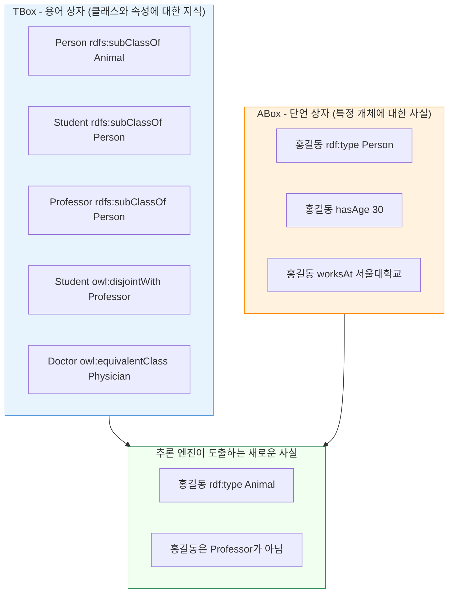

# 3회차: 공리(Axioms)

## 학습 목표

이번 회차를 마치면 다음을 할 수 있습니다:

- 공리(Axiom)의 개념과 온톨로지에서의 역할을 설명할 수 있다
- TBox(용어 상자)와 ABox(단언 상자)의 차이를 구분할 수 있다
- 주요 클래스 공리(subClassOf, equivalentClass, disjointWith)를 이해한다
- 개방 세계 가정(OWA)과 폐쇄 세계 가정(CWA)의 차이를 설명할 수 있다
- 공리가 어떻게 추론을 가능하게 하는지 이해한다

---

## 이번 세션 전체 그림



---

## 공리란 무엇인가?

### 참으로 가정하는 명제

<strong>공리(Axiom)</strong>는 온톨로지에서 **참으로 가정하는 명제**입니다. 수학에서 공리가 증명 없이 참으로 받아들여지는 기본 명제인 것처럼, 온톨로지의 공리도 도메인 전문가들이 합의한 "참인 사실"입니다.

예를 들어, 의학 온톨로지에서:
- "모든 인간은 동물이다" (클래스 포함 관계 공리)
- "의사와 환자는 서로 겹치지 않는다" (분리 공리)
- "심장마비는 심혈관 질환의 일종이다" (하위클래스 공리)

이런 공리들을 명시적으로 정의함으로써, 시스템은 새로운 사실을 자동으로 추론할 수 있습니다.

> **왜 필요한가?** 공리가 없는 온톨로지는 단순한 데이터베이스에 불과합니다. 공리가 있어야 추론(Reasoning)이 가능합니다. 추론을 통해 명시적으로 기술되지 않은 사실을 자동으로 발견할 수 있습니다. 예: "홍길동은 사람이다"와 "모든 사람은 동물이다"라는 공리가 있으면, 시스템이 자동으로 "홍길동은 동물이다"를 도출합니다.

---

## TBox: 용어 상자

### 클래스와 속성에 대한 공리

<strong>TBox(Terminological Box, 용어 상자)</strong>는 클래스, 속성, 그들 사이의 관계에 대한 공리를 담고 있습니다. 도메인의 <strong>개념 체계(schema)</strong>에 해당합니다.

TBox 공리는 주로 다음과 같은 형태입니다:

### 1. 하위클래스 공리 (subClassOf)

"모든 A는 B이다"를 나타냅니다. 가장 기본적인 TBox 공리입니다.

```turtle
:Student   rdfs:subClassOf  :Person .
:Professor rdfs:subClassOf  :Person .
:Mammal    rdfs:subClassOf  :Animal .
:Dog       rdfs:subClassOf  :Mammal .
```

이 공리로부터:
- 모든 Student는 Person이다 (자동)
- 모든 Professor는 Person이다 (자동)
- 모든 Dog는 Animal이다 (추론, 추이성에 의해)

### 2. 동치클래스 공리 (equivalentClass)

"A와 B는 완전히 같은 집합이다"를 나타냅니다. 다른 온톨로지의 개념을 통합할 때 특히 유용합니다.

```turtle
:Doctor       owl:equivalentClass  :Physician .
:Car          owl:equivalentClass  :Automobile .
:University   owl:equivalentClass  :HEI .
```

이 공리는 "모든 Doctor는 Physician이고, 모든 Physician은 Doctor이다"를 의미합니다.

> **연결 포인트:** 동치클래스 공리는 데이터 통합(Data Integration)에서 매우 중요합니다. 미국 온톨로지에서는 "Physician"을 사용하고, 한국 온톨로지에서는 "Doctor"를 사용할 때, 이 공리 하나로 두 온톨로지를 연결할 수 있습니다.

### 3. 분리 공리 (disjointWith)

"A의 구성원은 B의 구성원이 될 수 없다"를 나타냅니다.

```turtle
:Student    owl:disjointWith  :Professor .
:Male       owl:disjointWith  :Female .
:Alive      owl:disjointWith  :Dead .
```

이 공리가 있으면, 누군가를 동시에 Student와 Professor로 분류하려 할 때 추론 엔진이 모순을 감지합니다.

### 4. 제한 공리 (Restriction)

속성의 특정 사용에 대한 제약을 나타냅니다.

```turtle
:Parent  rdfs:subClassOf  [
    rdf:type  owl:Restriction ;
    owl:onProperty  :hasChild ;
    owl:minCardinality  1
] .
```

이는 "부모(Parent)는 최소 한 명의 자녀(hasChild)를 가져야 한다"를 의미합니다.

---

## ABox: 단언 상자

### 특정 개체에 대한 사실

<strong>ABox(Assertional Box, 단언 상자)</strong>는 특정 개체(Individual)에 대한 사실을 담고 있습니다. 데이터베이스의 <strong>데이터(rows)</strong>에 해당합니다.

ABox 공리는 주로 다음과 같은 형태입니다:

### 1. 클래스 단언 (Class Assertion)

```turtle
:홍길동  rdf:type  :Person .
:서울    rdf:type  :City .
:강아지  rdf:type  :Dog .
```

### 2. 속성 단언 (Property Assertion)

```turtle
:홍길동  :hasAge    30 .
:홍길동  :livesIn   :서울 .
:홍길동  :hasParent :홍판서 .
```

### 3. 동일 개체 단언 (Same Individual)

```turtle
:이순신  owl:sameAs  :YiSunsin .
:서울    owl:sameAs  :Seoul .
```

다른 데이터 소스에서 같은 개체를 다른 이름으로 표현했을 때 연결합니다.

### 4. 다른 개체 단언 (Different Individuals)

```turtle
:홍길동  owl:differentFrom  :홍판서 .
```

> **왜 필요한가?** OWL에서는 이름이 달라도 같은 개체일 수 있습니다(개방 세계 가정). "홍길동"과 "Hong Gildong"이 같은 사람인지 다른 사람인지 명시해야 합니다. 데이터 통합에서 중복 제거와 동일 개체 인식(Entity Resolution)에 핵심적입니다.

---

## TBox와 ABox의 관계

```
TBox (개념 체계):
  - Student는 Person의 하위클래스다
  - Student와 Professor는 분리된다

ABox (데이터):
  - 홍길동은 Student다

추론 결과:
  - 홍길동은 Person이다 (TBox + ABox)
  - 홍길동은 Professor가 아니다 (TBox + ABox)
```

TBox는 **영구적인 지식**이고, ABox는 **특정 상황의 사실**입니다. 두 가지가 합쳐져야 완전한 온톨로지가 됩니다.

---

## 개방 세계 가정 vs 폐쇄 세계 가정

### 폐쇄 세계 가정 (Closed World Assumption, CWA)

데이터베이스가 사용하는 가정입니다. "데이터베이스에 없는 것은 거짓이다."

예: 직원 테이블에 홍길동의 전화번호가 없으면, 홍길동은 전화번호가 없다.

### 개방 세계 가정 (Open World Assumption, OWA)

OWL이 사용하는 가정입니다. "모른다는 것이 거짓을 의미하지 않는다."

예: 온톨로지에 홍길동의 전화번호가 없으면, 홍길동이 전화번호를 갖고 있는지 여부를 **알 수 없다**.

> **연결 포인트:** 개방 세계 가정은 온톨로지가 웹의 분산 환경에 적합하도록 설계됐기 때문입니다. 전 세계에 퍼져있는 데이터를 통합할 때, 한 데이터 소스에 정보가 없다고 해서 그 정보가 실제로 없다는 의미가 아닙니다. 다른 데이터 소스에서 그 정보를 찾을 수 있을 수도 있습니다.

### 실용적 함의

| 질문 | CWA (DB) 답변 | OWA (OWL) 답변 |
|------|--------------|----------------|
| "홍길동은 서울에 사는가?" | 데이터 없으면 "아니오" | "알 수 없음" |
| "X는 Doctor인가?" | 레코드 없으면 "아니오" | "증거 없으면 알 수 없음" |
| "A와 B는 다른가?" | 키가 다르면 "예" | 명시적으로 선언해야 "예" |

---

## 속성 공리

클래스 공리 외에도 속성에 대한 공리도 있습니다.

### 하위속성 공리 (subPropertyOf)

```turtle
:isMemberOf  rdfs:subPropertyOf  :isPartOf .
```

"이 조직의 회원이다"는 "이 조직의 일부이다"의 특수한 경우입니다.

### 역관계 공리 (inverseOf)

```turtle
:hasParent  owl:inverseOf  :hasChild .
```

"홍길동 hasParent 홍판서"에서 자동으로 "홍판서 hasChild 홍길동"이 추론됩니다.

### 속성 연결 공리 (Property Chain)

```turtle
:hasGrandparent  owl:propertyChainAxiom  ( :hasParent  :hasParent ) .
```

"X의 부모의 부모"가 "X의 조부모"임을 정의합니다.

---

## 공리가 추론을 가능하게 하는 방법

### 추론 시나리오

다음 온톨로지를 생각해 봅시다:

**TBox 공리:**
```turtle
:GraduateStudent  rdfs:subClassOf  :Student .
:Student          rdfs:subClassOf  :Person .
:Person           rdfs:subClassOf  :Animal .
:Student          owl:disjointWith :Professor .
```

**ABox 사실:**
```turtle
:김철수  rdf:type  :GraduateStudent .
```

**추론 엔진이 자동으로 도출하는 사실:**
```turtle
:김철수  rdf:type  :Student .   # subClassOf 추이성
:김철수  rdf:type  :Person .    # subClassOf 추이성
:김철수  rdf:type  :Animal .    # subClassOf 추이성
# 김철수는 Professor가 아님    # disjointWith
```

### 공리 추론 체인 단계별 분석

이제 추론기가 공리들을 어떻게 체인으로 연결하여 새로운 지식을 도출하는지 단계별로 따라가 보겠습니다. 1회차 기술 논리에서 배운 Tableau 알고리즘이 여기서 실제로 동작합니다.

**시작 상태:**
```
TBox (스키마):
- GraduateStudent ⊑ Student
- Student ⊑ Person
- Person ⊑ Animal
- Student ⊓ Professor ⊑ ⊥ (불가능, disjoint)

ABox (데이터):
- GraduateStudent(김철수)
```

**추론 체인 단계 1: 직접 추론(Direct Inference)**
```
입력: GraduateStudent(김철수)
공리: GraduateStudent ⊑ Student
추론: Student(김철수)
이유: subClassOf 공리에 따라 모든 GraduateStudent는 Student임
```

**추론 체인 단계 2: 추이적 추론(Transitive Inference)**
```
입력: Student(김철수) (단계 1에서 도출)
공리: Student ⊑ Person
추론: Person(김철수)
이유: 체인 계속 - Student는 Person의 하위클래스
```

**추론 체인 단계 3: 다단계 추론(Multi-level Inference)**
```
입력: Person(김철수) (단계 2에서 도출)
공리: Person ⊑ Animal
추론: Animal(김철수)
이유: 최종 체인 - 3단계 계층 구조 완성
```

**추론 체인 단계 4: 부정 추론(Negative Inference)**
```
입력: Student(김철수) (단계 1에서 도출)
공리: Student ⊓ Professor ⊑ ⊥
추론: ¬Professor(김철수)
이유: Student이므로 disjoint인 Professor는 될 수 없음
논리: Student(김철수) ∧ Professor(김철수) → ⊥ (모순)
     따라서 Professor(김철수)는 거짓
```

### 추론 체인 최적화: Smart Forward Chaining

추론기는 모든 가능한 체인을 무작정 탐색하지 않습니다. **Forward Chaining**이라는 전략을 사용하여 효율적으로 추론합니다:

```
최적화된 추론 순서:
1. ABox의 모든 명제 스캔 → [GraduateStudent(김철수)]
2. 관련 TBox 공리만 로드 → GraduateStudent의 상위 클래스만 확인
3. 단계별 추론 → Student → Person → Animal
4. 캐싱 → Animal(김철수) 저장하여 재질의 시 재계산 방지
```

### 복잡한 추론 체인 예시

제한 공리(Restriction)가 포함된 더 복잡한 체인을 살펴보겠습니다:

**TBox 공리:**
```turtle
:Parent  rdfs:subClassOf  [
    rdf:type          owl:Restriction ;
    owl:onProperty    :hasChild ;
    owl:minCardinality  1
] .
:Person  rdfs:subClassOf  :Animal .
```

**ABox 사실:**
```turtle
:홍길동  rdf:type  :Parent .
```

**추론 체인:**
```
단계 1: Parent(홍길동)에서 시작
단계 2: Parent ⊑ ∃hasChild.⊤ 적용 → hasChild(홍길동, ?x) 존재 확인
단계 3: 만약 ABox에 hasChild(홍길동, :김철수)가 있으면:
       → ?x = :김철수로 결정
단계 4: 만약 hasChild 정보가 없으면:
       → OWA에 따라 "자식이 있는지 알 수 없음"
       → "최소 1명의 자식이 있어야 한다"는 제약만 알림
```

### 추론 체인과 모순 감지

공리 체인은 새로운 지식을 도출할 뿐만 아니라, **모순을 감지**하는 데도 사용됩니다:

**시나리오:**
```turtle
# TBox
:Student  owl:disjointWith  :Professor .

# ABox (실수로 잘못 입력됨)
:홍길동  rdf:type  :Student .
:홍길동  rdf:type  :Professor .
```

**추론 체인에 의한 모순 감지:**
```
단계 1: Student(홍길동) ∧ Professor(홍길동) 확인
단계 2: Student ⊓ Professor ⊑ ⊥ 공리 적용
단계 3: ⊥ (모순) 감지!
단계 4: "온톨로지 불일관(Inconsistent)" 오류 발생
```

이 모순 감지 기능이 온톨로지를 "단순한 데이터베이스"와 구별하는 핵심 차이점입니다.

---

## 흔한 오해

### 오해 1: "공리는 프로그래밍의 if-else 문이다"

**아닙니다.** 공리는 단방향이 아니라 다방향으로 작용합니다. 프로그램에서 "if Person then Animal"은 한 방향으로만 실행됩니다. 하지만 OWL의 `equivalentClass` 공리는 양방향으로 작용합니다. 또한 공리들은 조합되어 복잡한 추론 체인을 만들 수 있습니다.

### 오해 2: "TBox는 변하지 않는다"

**반은 맞습니다.** 이론적으로 TBox는 도메인의 개념 체계이므로 안정적이어야 합니다. 그러나 실제로는 도메인 지식이 발전함에 따라 TBox도 업데이트됩니다. 예를 들어, 코로나19의 등장으로 의학 온톨로지의 TBox가 업데이트되었습니다.

### 오해 3: "공리가 많을수록 좋다"

**아닙니다.** 불필요하거나 잘못된 공리는 추론 시간을 늘리고 모순을 일으킬 수 있습니다. 온톨로지 설계의 핵심 원칙은 **필요한 공리만, 정확하게** 정의하는 것입니다.

---

## 실습

### 기본 실습 1: TBox와 ABox 분류하기

다음 명제들을 TBox 공리(T)와 ABox 사실(A)로 분류하세요:

1. "홍길동은 사람이다"
2. "모든 학생은 사람이다"
3. "학생과 교수는 서로 겹치지 않는다"
4. "이순신의 출생연도는 1545이다"
5. "Doctor와 Physician은 동일하다"
6. "서울대학교는 대학교이다"
7. "대학교는 교육기관이다"
8. "홍길동의 부모는 홍판서이다"

### 기본 실습 2: 공리 작성하기

다음 한국어 문장을 OWL 공리(Turtle 형식)로 작성하세요:

1. "대학원생은 학생이다" (subClassOf)
2. "의사와 환자는 서로 다른 종류다" (disjointWith)
3. "물리학자와 과학자는 동일하지 않다. 그렇다면 물리학자와 과학자의 관계는?" (subClassOf)

### 도전 실습: 추론 결과 예측하기

다음 온톨로지가 주어졌을 때, 추론 엔진이 도출할 수 있는 새로운 사실을 최소 5개 작성하세요:

**TBox:**
```turtle
:LivingBeing    rdfs:subClassOf  owl:Thing .
:Animal         rdfs:subClassOf  :LivingBeing .
:Plant          rdfs:subClassOf  :LivingBeing .
:Animal         owl:disjointWith :Plant .
:Mammal         rdfs:subClassOf  :Animal .
:Dog            rdfs:subClassOf  :Mammal .
:Person         rdfs:subClassOf  :Mammal .
:Student        rdfs:subClassOf  :Person .
:hasParent      rdfs:domain  :Animal ;
                rdfs:range   :Animal .
```

**ABox:**
```turtle
:바둑이  rdf:type   :Dog .
:김철수  rdf:type   :Student .
:김철수  :hasParent :김영수 .
```

---

## 요약

이번 회차에서 배운 핵심 내용:

1. **공리(Axiom):** 온톨로지에서 참으로 가정하는 명제. 추론의 기반.
2. **TBox:** 클래스와 속성에 대한 공리. 도메인의 개념 체계.
3. **ABox:** 특정 개체에 대한 사실. 구체적인 데이터.
4. **주요 클래스 공리:**
   - `rdfs:subClassOf` - 하위클래스 관계
   - `owl:equivalentClass` - 동치클래스 관계
   - `owl:disjointWith` - 분리 관계
5. **개방 세계 가정(OWA):** "모른다"는 "거짓"이 아니다. OWL의 핵심 원칙.
6. **추론:** TBox 공리 + ABox 사실 → 새로운 사실 자동 도출.

다음 회차에서는 클래스들 사이의 IS-A 관계를 체계적으로 다루는 <strong>계층 구조(Hierarchy)</strong>를 배웁니다.
