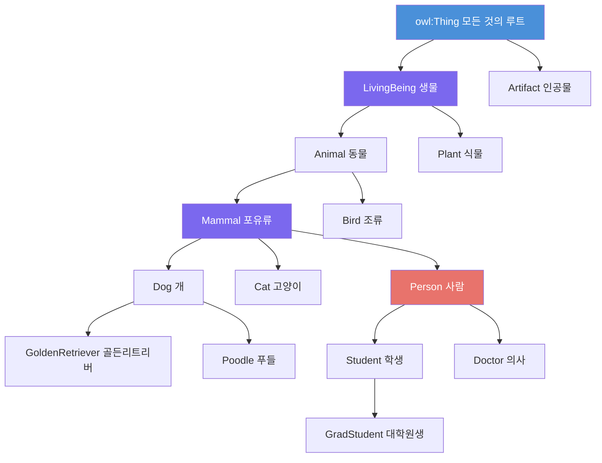
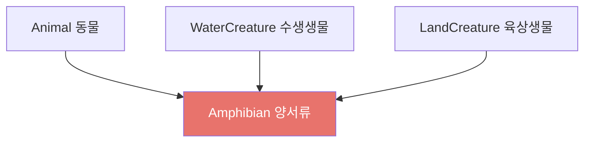
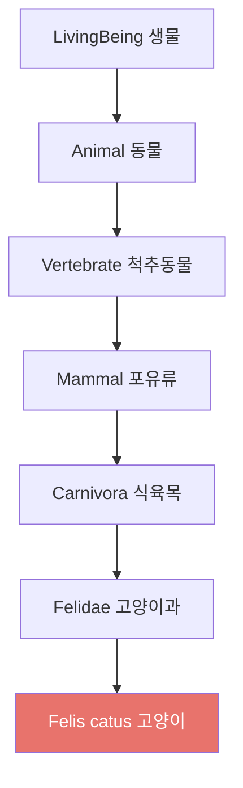

# 4회차: 계층 구조 (Hierarchy)

## 학습 목표

이번 회차를 마치면 다음을 할 수 있습니다:

- IS-A 계층과 `rdfs:subClassOf`의 의미를 설명할 수 있다
- 상위클래스(Superclass)와 하위클래스(Subclass)의 관계를 정의할 수 있다
- OWL에서 다중 상속이 어떻게 지원되는지 이해한다
- 동물 분류와 의료 진단 계층 같은 실제 예시를 읽을 수 있다
- 좋은 계층 구조를 설계하는 원칙을 알고 있다

---

## 이번 세션 전체 그림



---

## IS-A 계층이란 무엇인가?

### 분류 체계의 기본 구조

<strong>IS-A 계층(IS-A Hierarchy)</strong>은 "A는 B다(A IS-A B)"라는 관계로 개념들을 조직화한 구조입니다. 이를 분류 체계(Taxonomy)라고도 부릅니다.

예를 들어:
- 골든리트리버 IS-A 개
- 개 IS-A 포유류
- 포유류 IS-A 동물
- 동물 IS-A 생물

이 관계는 <strong>추이적(Transitive)</strong>입니다. 즉:
- 골든리트리버 IS-A 동물 (자동 추론)
- 골든리트리버 IS-A 생물 (자동 추론)

> **왜 필요한가?** 계층 구조 없이는 "개에 관한 지식"을 "포유류에 관한 지식"과 연결할 수 없습니다. 계층 구조가 있으면, 개에 대해 정의된 규칙이 모든 개의 품종에 자동으로 적용됩니다. 의학에서는 "포유류에게 효과적인 약"이 "인간에게도 효과적일 가능성이 높다"는 추론을 지원합니다.

---

## rdfs:subClassOf

### 공식적인 하위클래스 표현

OWL/RDFS에서 IS-A 관계는 `rdfs:subClassOf`로 표현합니다.

```turtle
:GoldenRetriever  rdfs:subClassOf  :Dog .
:Dog              rdfs:subClassOf  :Mammal .
:Mammal           rdfs:subClassOf  :Animal .
:Animal           rdfs:subClassOf  :LivingBeing .
```

### subClassOf의 의미론적 의미

`A rdfs:subClassOf B`는 정확히 "A의 모든 인스턴스는 B의 인스턴스이기도 하다"를 의미합니다.

```
A의 인스턴스 집합 ⊆ B의 인스턴스 집합
```

따라서:
- `골든리트리버 rdfs:subClassOf 개` → 골든리트리버인 것은 모두 개이기도 하다
- `개 rdfs:subClassOf 포유류` → 개인 것은 모두 포유류이기도 하다

### 최상위 클래스: owl:Thing

OWL에서 모든 클래스의 최상위 조상은 `owl:Thing`입니다. 모든 개체는 자동으로 `owl:Thing`의 인스턴스입니다.

반대로 `owl:Nothing`은 빈 클래스로, 어떤 인스턴스도 가질 수 없습니다. 온톨로지에 모순이 있을 때 추론 엔진이 클래스를 `owl:Nothing`과 동치라고 판단하면, 그 클래스에 모순이 있다는 신호입니다.

---

## 상위클래스와 하위클래스

### 계층의 두 방향

| 용어 | 의미 | 예시 |
|------|------|------|
| 상위클래스(Superclass) | 더 일반적인 클래스 | Animal은 Dog의 상위클래스 |
| 하위클래스(Subclass) | 더 구체적인 클래스 | Dog는 Animal의 하위클래스 |
| 직접 상위클래스 | 바로 위의 상위클래스 | Mammal은 Dog의 직접 상위클래스 |
| 간접 상위클래스 | 여러 단계 위의 상위클래스 | Animal은 Dog의 간접 상위클래스 |

### 속성과 제약의 상속

하위클래스는 상위클래스의 속성과 제약을 상속받습니다.

```turtle
:Animal  rdfs:subClassOf  [
    owl:onProperty   :hasName ;
    owl:cardinality  1
] .
```

이 공리로 인해, Animal의 모든 하위클래스(Mammal, Dog, GoldenRetriever 등)는 정확히 하나의 이름을 가져야 합니다.

> **연결 포인트:** 이것은 객체지향 프로그래밍의 상속과 유사하지만 더 강력합니다. OWL에서는 상속뿐만 아니라 **추론**도 이루어집니다. "GoldenRetriever가 Animal의 hasName 제약을 위반한다"는 사실을 추론 엔진이 자동으로 감지합니다.

---

## 다중 상속 (Multiple Inheritance)

### OWL에서의 다중 상속

OWL은 **다중 상속**을 완전히 지원합니다. 하나의 클래스가 여러 상위클래스를 가질 수 있습니다.

```turtle
:Amphibian  rdfs:subClassOf  :Animal .
:Amphibian  rdfs:subClassOf  :WaterCreature .
:Amphibian  rdfs:subClassOf  :LandCreature .
```

양서류(Amphibian)는 동물이면서, 수생 생물이면서, 육상 생물의 특성을 모두 가집니다.



### 교차 도메인 분류

실제 세계에서 사물은 여러 관점에서 분류될 수 있습니다:

```turtle
:FlyingFish  rdfs:subClassOf  :Fish .
:FlyingFish  rdfs:subClassOf  :FlyingAnimal .
```

날치(FlyingFish)는 물고기의 특성과 날 수 있는 동물의 특성을 모두 가집니다.

> **왜 필요한가?** Java나 C#에서는 단일 상속만 지원합니다. OWL의 다중 상속은 현실 세계의 복잡성을 더 정확하게 표현합니다. 의학에서 "폐렴은 호흡기 질환이면서 감염성 질환이기도 하다"를 표현하려면 다중 상속이 필수적입니다.

---

## 계층 설계 원칙

### 좋은 분류 체계를 만드는 방법

100개 이상의 클래스를 포함한 대형 온톨로지를 설계할 때 적용할 수 있는 원칙들입니다.

### 원칙 1: 하위클래스는 상위클래스보다 더 구체적이어야 한다

모든 하위클래스 인스턴스는 상위클래스 인스턴스이기도 해야 합니다. 역은 성립하지 않습니다.

좋은 예:
```
Animal → Dog ✓ (모든 개는 동물)
```

나쁜 예:
```
Animal → PetOwner ✗ (동물 주인이 반드시 동물은 아님)
```

### 원칙 2: IS-A와 PART-OF를 혼동하지 않는다

- **IS-A:** 개는 포유류다 (하위클래스 관계)
- **PART-OF:** 다리는 개의 일부다 (부분-전체 관계)

이 두 관계를 혼동하면 온톨로지가 잘못됩니다.

```turtle
# 잘못된 예:
:Leg  rdfs:subClassOf  :Dog .     # 다리가 개의 하위클래스? 아닙니다!

# 올바른 예:
:Dog  :hasPart  :Leg .            # 개는 다리를 부분으로 가진다
```

### 원칙 3: 적절한 추상화 수준을 유지한다

너무 세세하게 분류하면:
```
Animal → Dog → GoldenRetriever → YellowGoldenRetriever → ...
```

너무 거칠게 분류하면:
```
Thing → Animal (포유류, 조류, 어류, 파충류, 양서류를 모두 Animal로만 분류)
```

도메인의 목적에 맞는 적절한 수준을 선택해야 합니다.

### 원칙 4: 분리 원칙을 활용한다

관련이 없는 개념들은 분리 클래스로 선언하세요:

```turtle
owl:AllDisjointClasses
    owl:members  ( :Cat  :Dog  :Bird  :Fish ) .
```

이 선언으로 고양이, 개, 새, 물고기는 서로 겹치지 않는 범주임이 명확해집니다.

---

## 실제 예시: 생물 분류 계층

### 린네 분류 체계의 온톨로지화



### 의료 진단 계층

```turtle
:Disease          rdfs:subClassOf  :MedicalCondition .
:InfectiousDisease  rdfs:subClassOf  :Disease .
:ViralDisease     rdfs:subClassOf  :InfectiousDisease .
:COVID19          rdfs:subClassOf  :ViralDisease .
:COVID19          rdfs:subClassOf  :RespiratoryDisease .  # 다중 상속
```

COVID-19는 바이러스성 질환이면서 호흡기 질환이기도 합니다.

---

## 흔한 오해

### 오해 1: "깊은 계층이 좋은 온톨로지다"

**아닙니다.** 너무 깊은 계층은 유지보수를 어렵게 하고 추론 성능을 저하시킵니다. 일반적으로 5-7단계 이상의 계층은 재검토가 필요합니다. 실제 의미 있는 구분이 있을 때만 하위클래스를 추가하세요.

### 오해 2: "subClassOf는 집합의 부분집합과 완전히 같다"

**거의 맞지만, 미묘한 차이가 있습니다.** 수학의 집합론에서는 공집합은 모든 집합의 부분집합입니다. OWL에서도 `owl:Nothing`은 모든 클래스의 하위클래스입니다. 그러나 OWL의 `subClassOf`는 현실의 개념 관계를 표현하므로 수학적 집합보다 더 풍부한 의미를 가집니다.

### 오해 3: "하위클래스에는 상위클래스보다 더 많은 속성이 있어야 한다"

**항상 그렇지는 않습니다.** 하위클래스는 상위클래스를 특수화합니다. 속성을 추가할 수도 있지만, 기존 속성의 **범위를 제한**하는 것만으로도 의미 있는 특수화가 됩니다.

예: `PetDog rdfs:subClassOf Dog`. 반려견은 개의 특수한 경우로, `hasOwner` 속성이 있는 개입니다.

---

## 실습

### 기본 실습 1: 계층 구조 읽기

다음 Turtle 코드를 읽고, 어떤 추론이 가능한지 3가지 이상 제시하세요:

```turtle
:Vehicle      rdfs:subClassOf  owl:Thing .
:MotorVehicle rdfs:subClassOf  :Vehicle .
:Car          rdfs:subClassOf  :MotorVehicle .
:ElectricCar  rdfs:subClassOf  :Car .
:ElectricCar  rdfs:subClassOf  :ElectricVehicle .
:ElectricVehicle  rdfs:subClassOf  :Vehicle .

:테슬라모델3  rdf:type  :ElectricCar .
```

### 기본 실습 2: 계층 구조 설계하기

다음 개념들을 이용해 학교 도메인의 계층 구조를 설계하세요:

```
사람, 학교 구성원, 학생, 교수, 대학원생, 학부생,
학과, 이공계 학과, 인문계 학과, 강의, 필수강의, 선택강의
```

Mermaid 다이어그램 또는 Turtle 코드로 표현하세요.

### 도전 실습: 계층 오류 찾기

다음 온톨로지에는 설계 오류가 있습니다. 오류를 찾고 수정하세요:

```turtle
:Animal  rdfs:subClassOf  owl:Thing .
:Dog     rdfs:subClassOf  :Animal .
:Tail    rdfs:subClassOf  :Dog .        # 문제 1
:Bark    rdfs:subClassOf  :Dog .        # 문제 2
:PetOwner rdfs:subClassOf :Dog .        # 문제 3
:Animal  rdfs:subClassOf  :Dog .        # 문제 4
```

각 오류가 왜 잘못됐는지 설명하고, 올바른 표현 방식을 제안하세요.

---

## 요약

이번 회차에서 배운 핵심 내용:

1. **IS-A 계층:** 개념들 사이의 일반-특수 관계. 분류 체계(Taxonomy)라고도 함.
2. **rdfs:subClassOf:** IS-A 관계를 표현하는 OWL 공리. 추이적 속성을 가짐.
3. **상위클래스/하위클래스:** 더 일반적/구체적인 클래스. 속성과 제약이 상속됨.
4. **다중 상속:** OWL은 여러 상위클래스를 완전히 지원. 현실의 복잡성을 표현 가능.
5. **owl:Thing/owl:Nothing:** 모든 클래스의 루트/빈 클래스.
6. **계층 설계 원칙:** IS-A vs PART-OF 구분, 적절한 추상화 수준, 분리 원칙.

다음 회차에서는 온톨로지를 관계형 데이터베이스, 지식 그래프, UML과 비교하여 각각의 장단점과 사용 시나리오를 이해합니다.
