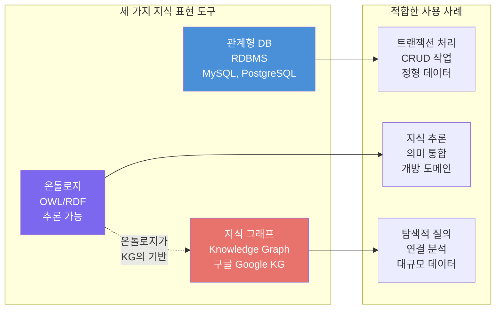

# 5회차: 데이터베이스, 지식 그래프와의 비교

## 학습 목표

이번 회차를 마치면 다음을 할 수 있습니다:

- 관계형 데이터베이스(RDBMS)와 온톨로지의 차이를 설명할 수 있다
- 지식 그래프(Knowledge Graph)와 온톨로지의 관계를 이해한다
- RDF 트리플과 데이터베이스 테이블 행(row)의 차이를 비교할 수 있다
- UML과 OWL의 공통점과 차이점을 알고 있다
- 어떤 상황에서 어떤 도구를 선택해야 하는지 판단할 수 있다

---

## 이번 세션 전체 그림



---

## 관계형 데이터베이스와의 비교

### 관계형 DB의 기본 구조

<strong>관계형 데이터베이스(RDBMS, Relational Database Management System)</strong>는 데이터를 테이블(행과 열)로 구성합니다. 엄격한 스키마(schema)를 미리 정의하고, SQL로 데이터를 조회합니다.

예: 인물 데이터베이스

| id | 이름 | 나이 | 직업 |
|----|------|------|------|
| 1 | 홍길동 | 30 | 학생 |
| 2 | 이순신 | 45 | 장군 |
| 3 | 유관순 | 19 | 학생 |

| person_id | parent_id |
|-----------|-----------|
| 1 | 4 |
| 3 | 5 |

### 온톨로지의 구조

같은 데이터를 온톨로지로 표현하면:

```turtle
:홍길동  rdf:type  :Person ;
         rdf:type  :Student ;
         :hasAge   30 ;
         :hasName  "홍길동" .

:이순신  rdf:type  :Person ;
         rdf:type  :General ;
         :hasAge   45 .

:홍길동  :hasParent  :홍판서 .
```

---

## 상세 비교: RDBMS vs 온톨로지

### 스키마 유연성

**RDBMS:** 스키마가 고정됩니다. 새 열(column)을 추가하려면 `ALTER TABLE` 명령이 필요하고, 기존 데이터에 영향을 줄 수 있습니다.

**온톨로지:** 스키마(TBox)가 유연합니다. 새 속성을 언제든지 추가할 수 있고, 기존 데이터는 새 속성에 대해 단순히 "알 수 없음" 상태가 됩니다(개방 세계 가정).

> **왜 필요한가?** 의료 분야를 예로 들면, 코로나19 같은 새로운 질병이 등장할 때 RDBMS는 스키마를 변경해야 합니다. 온톨로지는 새 클래스와 속성을 기존 구조를 건드리지 않고 추가할 수 있습니다.

### 추론 능력

**RDBMS:** 저장된 데이터만 조회할 수 있습니다. 계산된 값이 필요하면 뷰(view)나 저장 프로시저(stored procedure)를 사용해야 합니다.

**온톨로지:** 공리로부터 새로운 사실을 자동으로 추론합니다. "홍길동은 학생이고, 모든 학생은 사람이다"에서 "홍길동은 사람이다"를 자동으로 도출합니다.

### 데이터 통합

**RDBMS:** 서로 다른 데이터베이스를 통합하려면 ETL(Extract, Transform, Load) 프로세스가 필요합니다. 스키마 변환이 복잡합니다.

**온톨로지:** `owl:equivalentClass`, `owl:sameAs` 같은 공리로 서로 다른 온톨로지를 의미 수준에서 통합할 수 있습니다. 실제 데이터를 이동하지 않아도 됩니다.

### 질의 언어

**RDBMS:** SQL(Structured Query Language)을 사용합니다.

```sql
SELECT p.name, c.name AS city
FROM Person p
JOIN livesIn l ON p.id = l.person_id
JOIN City c ON l.city_id = c.id
WHERE p.age > 25;
```

**온톨로지:** SPARQL(SPARQL Protocol and RDF Query Language)을 사용합니다.

```sparql
SELECT ?name ?cityName
WHERE {
    ?person rdf:type :Person ;
            :hasName ?name ;
            :hasAge ?age ;
            :livesIn ?city .
    ?city :hasName ?cityName .
    FILTER(?age > 25)
}
```

### 비교 요약표

| 특성 | RDBMS | 온톨로지 (OWL) |
|------|-------|----------------|
| 데이터 모델 | 테이블/행/열 | 트리플(주어-술어-목적어) |
| 스키마 | 고정, 사전 정의 | 유연, 점진적 추가 가능 |
| 추론 | 없음 | 자동 추론 |
| 세계 가정 | 폐쇄 세계 | 개방 세계 |
| 데이터 통합 | ETL, 복잡 | 의미 수준 통합 |
| 질의 언어 | SQL | SPARQL |
| 성능 | 최적화됨 | 추론 비용 존재 |
| 사용 사례 | 트랜잭션, 보고서 | 지식 표현, 추론 |

---

## 지식 그래프와의 관계

### 지식 그래프란?

<strong>지식 그래프(Knowledge Graph)</strong>는 실세계의 개체(entity)와 그들 사이의 관계를 그래프 구조로 표현한 것입니다. 구글 지식 패널, 위키데이터, DBpedia 등이 대표적인 지식 그래프입니다.

지식 그래프의 기본 단위는 <strong>트리플(triple)</strong>입니다:

```
주어(Subject) - 술어(Predicate) - 목적어(Object)
홍길동 - hasAge - 30
서울 - isCapitalOf - 대한민국
```

### 온톨로지는 지식 그래프의 기반

**온톨로지는 지식 그래프의 스키마 역할**을 합니다:

```
온톨로지 (TBox) → 개념 체계, 규칙
지식 그래프 (ABox) → 실제 개체와 관계 데이터
```

예: DBpedia
- 온톨로지: `dbpedia-owl:Person`, `dbpedia-owl:birthPlace`, `dbpedia-owl:City` 등의 개념과 속성 정의
- 지식 그래프: 수백만 명의 인물과 그들의 출생지, 직업, 관계 데이터

> **연결 포인트:** 구글의 지식 그래프는 스키마(schema.org)라는 온톨로지를 기반으로 합니다. 검색 결과에서 "측면 패널"에 나타나는 정보(이름, 생년월일, 직업 등)가 바로 이 지식 그래프에서 가져온 것입니다.

### RDF 트리플 vs 테이블 행

**테이블 행:** 특정 개체의 여러 속성을 한 행에 담습니다.

```
| id | name  | age | city |
|  1 | 홍길동 |  30 | 서울  |
```

**RDF 트리플:** 하나의 관계를 하나의 트리플로 표현합니다.

```turtle
:홍길동  :hasName  "홍길동" .
:홍길동  :hasAge   30 .
:홍길동  :livesIn  :서울 .
```

이 유연성 덕분에:
- 같은 개체에 대해 나중에 새 속성(예: `hasPet`)을 쉽게 추가 가능
- 단일 개체가 여러 다른 데이터 소스의 정보를 통합 가능
- 속성 값의 출처(provenance)를 추적 가능

### 대형 지식 그래프 예시

| 지식 그래프 | 트리플 수 | 주요 도메인 |
|------------|-----------|-------------|
| 위키데이터 | 약 100억+ | 일반 지식 |
| DBpedia | 약 30억 | 위키피디아 기반 |
| 구글 지식 그래프 | 약 5000억+ | 웹 전체 |
| SNOMED CT | 약 36만 개념 | 의료 |
| Gene Ontology | 약 4만 개념 | 생물학 |

---

## UML과의 비교

### 소프트웨어 설계의 언어, UML

<strong>UML(Unified Modeling Language)</strong>은 소프트웨어 시스템의 구조와 행동을 시각화하고 명세화하는 언어입니다. 클래스 다이어그램, 시퀀스 다이어그램, 유스케이스 다이어그램 등이 있습니다.

### 유사점

| 개념 | UML | OWL |
|------|-----|-----|
| 개념 집합 | Class | owl:Class |
| 상속 | generalization/extends | rdfs:subClassOf |
| 연관 | Association | owl:ObjectProperty |
| 속성 | Attribute | owl:DatatypeProperty |
| 인스턴스 | Object | owl:NamedIndividual |

### 핵심 차이점

**목적:**
- UML: 소프트웨어 설계 (코드 생성, 개발자 의사소통)
- OWL: 지식 표현 (추론, 데이터 통합, 의미 공유)

**추론 지원:**
- UML: 없음 (설계 도구)
- OWL: 자동 추론 (추론 엔진 필요)

**다중 상속:**
- UML: 지원하지만 복잡성 증가
- OWL: 완전 지원, 기본 설계 원칙

**개방 세계:**
- UML: 폐쇄 세계 가정 (소프트웨어 실행 환경)
- OWL: 개방 세계 가정 (웹 환경)

**표준화:**
- UML: ISO/IEC 19501
- OWL: W3C 권고안

> **왜 필요한가?** 많은 팀이 시스템 설계에 UML을 사용하고, 지식 표현에 OWL을 사용합니다. UML 클래스 다이어그램은 OWL 온톨로지로 변환할 수 있으며, 일부 도구(예: Protégé, TopBraid Composer)는 이 변환을 자동화합니다.

---

## 언제 어떤 도구를 쓸 것인가?

### 의사결정 가이드

**관계형 데이터베이스를 선택할 때:**
- 트랜잭션 처리(CRUD)가 주요 목적
- 엄격한 스키마와 데이터 무결성이 필요
- 고성능 질의가 필요
- 팀이 SQL에 익숙함
- 예: 은행 시스템, 재고 관리, 사용자 인증

**온톨로지를 선택할 때:**
- 자동 추론이 필요
- 이질적인 데이터 소스를 통합해야 함
- 도메인 전문가와 지식을 공유해야 함
- 스키마가 자주 바뀌거나 유연해야 함
- 예: 의학 정보 시스템, 법률 지식 베이스, 과학 데이터 통합

**지식 그래프를 선택할 때:**
- 대규모 연결 데이터를 저장하고 탐색해야 함
- 개체 간의 복잡한 관계를 질의해야 함
- 추천 시스템, 검색 엔진 구축
- 예: 소셜 네트워크 분석, 제품 카탈로그, 규정 준수 검사

---

## 흔한 오해

### 오해 1: "온톨로지는 데이터베이스를 대체한다"

**아닙니다.** 온톨로지와 데이터베이스는 상호 보완적입니다. 많은 현실 시스템에서 관계형 DB가 실제 데이터를 저장하고, 온톨로지가 그 데이터의 의미를 정의합니다. R2RML 같은 표준을 사용하면 관계형 DB를 RDF 형태로 노출할 수 있습니다.

### 오해 2: "지식 그래프는 항상 온톨로지를 사용한다"

**항상 그렇지는 않습니다.** 어떤 지식 그래프는 느슨한 스키마를 사용하거나, 별도의 공식 온톨로지 없이 실용적인 관계만 정의합니다. 그러나 의미 통합과 추론이 필요한 경우에는 온톨로지 기반 설계가 훨씬 효과적입니다.

### 오해 3: "UML로 설계하면 OWL로 쉽게 변환된다"

**비슷하지만 주의가 필요합니다.** UML과 OWL은 비슷한 개념을 공유하지만, 의미론적 차이가 있습니다. 특히 다중 분류(하나의 개체가 여러 클래스에 속함), 개방 세계 가정, 추론 의미론은 UML에서 직접 표현하기 어렵습니다.

---

## 실습

### 기본 실습 1: 도구 선택 판단하기

다음 시나리오에서 관계형 DB, 온톨로지, 또는 지식 그래프 중 무엇이 가장 적합한지 선택하고 이유를 설명하세요:

1. 병원 예약 시스템: 환자, 의사, 예약 시간 관리
2. 의약품 상호작용 확인 시스템: 수천 개의 약품과 그 상호작용
3. 쇼핑몰 제품 추천 시스템: 제품, 사용자, 구매 이력
4. 과학 논문 메타데이터 통합: 다양한 출처의 논문, 저자, 인용 관계

### 기본 실습 2: 표현 방식 변환하기

다음 데이터베이스 스키마를 RDF 트리플로 변환하세요:

**테이블: Person**
| id | name | age | cityId |
|----|------|-----|--------|
| 1 | 홍길동 | 30 | 101 |

**테이블: City**
| id | name |
|----|------|
| 101 | 서울 |

이 두 테이블의 관계를 RDF 트리플로 표현하세요 (Turtle 형식).

### 도전 실습: 통합 시나리오 설계하기

세 가지 데이터 소스가 있습니다:

1. 한국 의학 DB: `의사`, `환자`, `병원` (한국어)
2. 미국 의학 DB: `Physician`, `Patient`, `Hospital` (영어)
3. WHO 질병 분류: `Disease`, `Symptom` (영어)

이 세 데이터 소스를 온톨로지로 통합하는 방안을 설계하세요. 다음을 포함하세요:
- 동치클래스 공리 (`owl:equivalentClass`)
- 동치 속성 공리 (`owl:equivalentProperty`)
- 계층 구조 연결

---

## 요약

이번 회차에서 배운 핵심 내용:

1. **RDBMS vs 온톨로지:**
   - RDBMS: 고정 스키마, 폐쇄 세계, 고성능
   - 온톨로지: 유연 스키마, 개방 세계, 자동 추론

2. **지식 그래프와 온톨로지:** 온톨로지는 지식 그래프의 개념 기반을 제공함. KG는 온톨로지 위에 대규모 데이터를 쌓은 것.

3. **RDF 트리플:** 주어-술어-목적어 형태의 가장 기본적인 지식 단위. 데이터베이스 행보다 유연함.

4. **UML vs OWL:** 목적은 다르지만 개념 구조가 유사함. UML은 소프트웨어 설계, OWL은 지식 표현과 추론.

5. **도구 선택:** 사용 목적에 따라 적합한 도구가 다름. 트랜잭션→DB, 추론·통합→온톨로지, 탐색·연결→KG.

다음 회차는 **종합 실습**입니다. 2단계에서 배운 모든 개념을 통합하여 실제 온톨로지를 설계해 봅시다.
