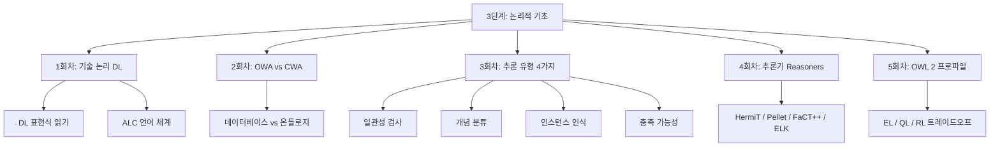

# 3단계: 논리적 기초 소개

## 이 단계에서 배우는 것

온톨로지는 단순히 개념을 나열하는 것이 아닙니다. **컴퓨터가 지식을 추론할 수 있도록** 형식적으로 정의된 체계입니다. 3단계에서는 그 추론을 가능하게 하는 논리적 기반을 다룹니다.

> **왜 논리가 필요한가?**
>
> OWL(Web Ontology Language)로 "고양이는 동물이다"라고 적었다고 가정합시다. 컴퓨터가 "나비는 고양이이다"라는 잘못된 데이터를 받았을 때, 어떻게 이것이 모순임을 탐지할 수 있을까요? 직관이 아니라 **논리적 추론 엔진**이 이를 감지합니다. 논리 없이 온톨로지는 단순한 라벨 모음에 불과합니다.

## 학습 목표

이 단계를 마치면 다음을 할 수 있습니다:

- <strong>기술 논리(Description Logic, DL)</strong>의 핵심 개념을 설명하고 OWL 2와의 관계를 이해합니다
- <strong>개방 세계 가정(OWA)</strong>과 <strong>폐쇄 세계 가정(CWA)</strong>의 차이를 구분하고, 이것이 설계에 미치는 영향을 파악합니다
- 온톨로지의 4가지 추론 유형(일관성 검사, 개념 분류, 인스턴스 인식, 개념 충족 가능성)을 구별합니다
- 주요 추론기(HermiT, Pellet, FaCT++, ELK)의 특성과 적합한 사용 시나리오를 설명합니다
- OWL 2의 세 가지 프로파일(EL, QL, RL)이 각각 어떤 문제를 해결하기 위해 만들어졌는지 이해합니다

## 단계 구성

## 왜 이 순서인가?

> **왜 DL부터 시작하는가?**
>
> OWL 2는 기술 논리(DL)의 구체적인 구현입니다. DL의 문법과 의미론을 먼저 이해하지 않으면, OWL 2 표현식이 왜 그렇게 생겼는지, 왜 어떤 것은 표현할 수 있고 어떤 것은 표현할 수 없는지를 직관적으로 이해하기 어렵습니다. DL은 OWL 2의 수학적 DNA입니다.

## 2단계와의 연결

2단계에서 배운 OWL 2의 클래스, 프로퍼티, 공리(axiom)는 모두 기술 논리의 특정 언어로 표현됩니다. 예를 들어:

- `SubClassOf(Cat Animal)` → DL 표현: `Cat ⊑ Animal`
- `ObjectSomeValuesFrom(hasParent Human)` → DL: `∃hasParent.Human`
- `ObjectAllValuesFrom(hasChild Male)` → DL: `∀hasChild.Male`

이 단계에서 이 표현식들의 의미를 정확히 이해하게 됩니다.

## 이 단계의 핵심 질문

이 단계를 공부하면서 다음 질문들을 염두에 두세요:

1. "컴퓨터는 온톨로지에서 무엇을 *자동으로* 알아낼 수 있는가?"
2. "온톨로지를 더 많이 표현할수록, 왜 더 느려지는가?"
3. "데이터베이스 개발자가 온톨로지를 처음 만질 때 가장 먼저 혼동하는 것은 무엇인가?"

이 질문들에 답할 수 있다면, 3단계를 완전히 이해한 것입니다.

---

> **연결 포인트: 2단계 → 3단계**
>
> 2단계에서 OWL 2 구문(syntax)을 배웠다면, 3단계에서는 그 구문의 의미론(semantics)과 추론 메커니즘을 배웁니다. 구문은 *무엇을 쓰는가*이고, 의미론은 *그것이 무엇을 뜻하는가*입니다. 이 둘을 연결하는 것이 기술 논리입니다.

> **연결 포인트: 3단계 → 4단계**
>
> 3단계의 논리적 기초를 이해하면, 4단계(RDF/SPARQL)에서 왜 쿼리 언어가 OWL 추론의 결과를 활용할 수 있는지, 그리고 왜 SPARQL은 OWL 2 Full을 완전히 지원하지 않는지를 이해할 수 있습니다.
