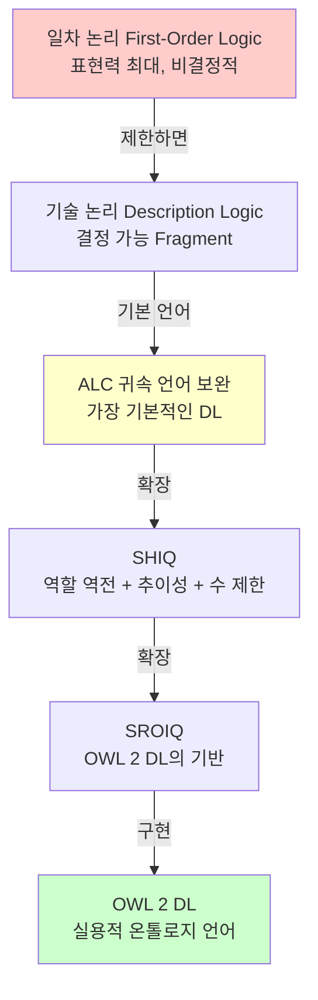

# 1회차: 기술 논리(Description Logic)

## 학습 목표

이번 세션을 마치면 다음을 할 수 있습니다:

- 기술 논리(Description Logic, DL)의 세 가지 기본 구성 요소를 설명할 수 있습니다
- ALC 표현식을 읽고 해석할 수 있습니다
- OWL 2 DL과 DL 언어 계열의 관계를 설명할 수 있습니다
- 표현력과 계산 복잡도의 트레이드오프를 이해합니다

---

## 이번 세션 전체 그림



> **왜 일차 논리(FOL) 대신 DL을 쓰는가?**
>
> 일차 논리는 매우 강력하지만 <strong>결정 불가능(undecidable)</strong>합니다. "이 문장이 참인지 거짓인지 항상 컴퓨터가 판단할 수 있는가?"라는 질문에 FOL은 "항상 가능하지 않다"고 답합니다. 온톨로지에서 추론이 무한히 돌아가면 실용적이지 않습니다. DL은 FOL의 결정 가능한 부분집합으로, 충분한 표현력을 가지면서도 추론이 반드시 끝납니다.

---

## 핵심 개념

### 1. DL의 세 가지 기본 구성 요소

기술 논리는 세 가지 종류의 엔티티를 구분합니다:

| 구성 요소 | 영어 | 설명 | OWL 2에서 |
|-----------|------|------|-----------|
| **개념(Concept)** | Concept / Class | "어떤 종류의 것인가?" | `owl:Class` |
| **역할(Role)** | Role / Property | "어떤 관계를 갖는가?" | `owl:ObjectProperty` |
| **개체(Individual)** | Individual / Instance | "구체적인 존재" | `owl:NamedIndividual` |

예시로 보면:
- `Person` → 개념 (사람이라는 종류)
- `hasParent` → 역할 (부모 관계)
- `:Socrates` → 개체 (소크라테스라는 구체적 존재)

### 2. ALC: 가장 기본적인 DL 언어

ALC(Attributive Language with Complement)는 DL의 가장 기본적인 표현 언어입니다. 다음 연산자를 지원합니다:

| 연산자 | DL 표기 | 의미 | OWL 2 구문 |
|--------|---------|------|-----------|
| 교집합 | A ⊓ B | A이면서 B인 것 | `ObjectIntersectionOf` |
| 합집합 | A ⊔ B | A이거나 B인 것 | `ObjectUnionOf` |
| 부정 | ¬A | A가 아닌 것 | `ObjectComplementOf` |
| 존재 제한 | ∃R.C | R 관계로 C에 속하는 것이 있는 것 | `ObjectSomeValuesFrom` |
| 전칭 제한 | ∀R.C | R 관계로 연결된 모든 것이 C에 속하는 것 | `ObjectAllValuesFrom` |

### 3. DL 표현식 읽기

표현식을 읽는 연습이 가장 중요합니다:

**표현식 1: `∃hasParent.Person`**

> "부모(hasParent)가 적어도 하나 있고, 그 부모가 사람(Person)인 것"

이것은 "부모가 있는 사람"을 표현합니다. 고아(부모 없음)는 이 클래스에 속하지 않습니다.

**표현식 2: `∀hasChild.Male`**

> "자식(hasChild)이 있다면, 그 모든 자식이 남성(Male)인 것"

주의: 이 표현식은 자식이 없는 개체도 포함합니다. "모든 자식이 남성인 것" = "자식이 없거나, 있다면 전부 남성인 것"

**표현식 3: `Person ⊓ ∃hasParent.Person ⊓ ¬Female`**

> "사람이면서, 사람인 부모가 있고, 여성이 아닌 것"

이것은 "남성으로 부모가 있는 사람"을 표현합니다. 자연어로는 "아버지가 있는 남성"에 해당합니다.

**표현식 4: `Human ⊑ ∃hasHeart.Heart`**

> "모든 인간(Human)은 심장(Heart)을 하나 이상 가진다"

`⊑`는 포함 관계(subclass)입니다. Human은 ∃hasHeart.Heart의 부분집합입니다.

### 4. TBox와 ABox: DL 온톨로지의 두 부분

> **왜 TBox와 ABox를 분리하는가?**
>
> TBox(스키마)와 ABox(데이터)를 분리하는 이유는 추론 최적화 때문입니다. TBox는 일반적으로 변경이 적고 공유 가능한 지식이며, ABox는 자주 변경되는 인스턴스 데이터입니다. 많은 추론기는 TBox 추론을 미리 계산하고 캐시하여, ABox가 변경될 때 TBox 추론을 반복하지 않습니다. 이 구분이 대규모 시스템에서 추론 성능을 크게 향상시킵니다.

DL 온톨로지는 두 가지 부분으로 구성됩니다:

**TBox (Terminological Box): 개념 정의**
```
Human ⊑ Animal                    (인간은 동물이다)
Bachelor ≡ Man ⊓ ¬Married         (독신자 = 결혼하지 않은 남성)
Parent ≡ ∃hasChild.⊤              (부모 = 자식이 있는 것)
```

**ABox (Assertional Box): 개체에 대한 사실**
```
Human(:Socrates)                   (소크라테스는 인간이다)
hasTeacher(:Plato, :Socrates)      (플라톤의 선생님은 소크라테스이다)
¬married(:Socrates)                (소크라테스는 결혼하지 않았다)
```

TBox는 "세상이 어떻게 구조화되어 있는가"를 정의하고, ABox는 "이 특정 세계에 무엇이 있는가"를 기술합니다.

### 5. OWL 2 DL과 DL 언어 계열의 관계

OWL 2 DL은 SROIQ(D) 언어를 기반으로 합니다. 각 글자의 의미:

| 글자 | 기능 | 의미 |
|------|------|------|
| **S** | ALC + 추이적 역할 | `owl:TransitiveProperty` |
| **R** | 복잡한 역할 포함 공리 | 역할 체인 등 |
| **O** | 나열(Nominals) | `owl:oneOf` |
| **I** | 역 역할 | `owl:inverseOf` |
| **Q** | 한정 수 제한 | `owl:qualifiedCardinality` |
| **(D)** | 구체적 도메인 | 날짜, 정수 등 |

---

## 흔한 오해

### 오해 1: "∀R.C는 R 관계가 반드시 있어야 한다"

**잘못된 생각:** `∀hasChild.Male`이면 반드시 자식이 있어야 한다.

**올바른 이해:** 전칭 제한(universal restriction)은 <strong>진공적으로 참(vacuously true)</strong>입니다. 자식이 없는 개체도 이 조건을 만족합니다. "모든 자식이 남성이다"는 자식이 없으면 반박할 수 없으므로 참입니다.

"자식이 반드시 있고, 모두 남성이어야 한다"를 표현하려면:
`∃hasChild.⊤ ⊓ ∀hasChild.Male`

### 오해 2: "DL은 일차 논리보다 약하므로 덜 유용하다"

**잘못된 생각:** 표현력이 낮으면 덜 쓸모있다.

**올바른 이해:** DL의 제한이 오히려 강점입니다. FOL은 표현력이 강하지만 추론이 불가능하거나 매우 느립니다. DL은 "충분히 표현력 있고, 충분히 빠른" 균형점을 찾은 결과입니다. 실제 의료 온톨로지(SNOMED CT)는 수백만 개의 개념을 수 분 안에 분류할 수 있는데, 이는 DL의 결정 가능성 덕분입니다.

### 오해 3: "OWL 2 Full이 OWL 2 DL보다 항상 더 좋다"

**잘못된 생각:** 더 많은 것을 표현할 수 있으면 더 좋다.

**올바른 이해:** OWL 2 Full은 결정 불가능합니다. 추론이 무한히 돌아갈 수 있습니다. 실용적인 온톨로지 개발에서 OWL 2 DL(즉, SROIQ 기반)을 사용하는 이유는 추론이 항상 완료됨을 보장하기 때문입니다.

---

## 표현력과 계산 복잡도의 트레이드오프

> **왜 더 많이 표현할수록 더 느려지는가?**
>
> DL 언어에 기능을 추가할수록 추론기가 탐색해야 하는 공간이 기하급수적으로 커집니다. ALC의 일관성 검사는 PSPACE-완전(다항식 공간), OWL 2 DL(SROIQ)은 2-EXPTIME-완전입니다. 이것은 이론적 상한이며, 실제로는 최적화 기법으로 훨씬 빠르게 동작합니다. 그러나 온톨로지가 복잡해질수록 추론 시간은 증가합니다.

| DL 언어 | 기능 | 추론 복잡도 |
|---------|------|------------|
| ALC | 기본 | PSPACE |
| ALCQ | 수 제한 추가 | PSPACE |
| SHIQ | 추이성 + 역할 역전 | EXPTIME |
| SHOIQ | Nominals 추가 | 2-EXPTIME |
| SROIQ | 복잡한 역할 포함 | 2-EXPTIME |

---

## 요약

- <strong>기술 논리(DL)</strong>는 일차 논리의 결정 가능한 부분집합으로, 온톨로지 추론의 수학적 기반입니다
- DL은 **개념(Concept), 역할(Role), 개체(Individual)** 세 가지로 지식을 표현합니다
- **ALC**는 기본 DL 언어로, 교집합(⊓), 합집합(⊔), 부정(¬), 존재 제한(∃), 전칭 제한(∀)을 지원합니다
- **∀R.C (전칭 제한)**: R 관계가 없으면 진공적으로 참 — 주의 필요!
- **OWL 2 DL**은 SROIQ(D) 언어를 기반으로 하며, 이것이 추론 완료성을 보장합니다
- 표현력을 높이면 계산 복잡도가 증가하는 **트레이드오프**가 있습니다

---

> **연결 포인트: DL → 추론**
>
> DL 표현식을 이해했다면, 다음 질문이 자연스럽게 떠오릅니다. "이 표현식들로부터 컴퓨터는 무엇을 자동으로 알아낼 수 있는가?" 이것이 3회차 추론 유형의 핵심입니다. DL의 의미론은 추론기가 작동하는 방식을 직접 결정합니다.

> **연결 포인트: OWA와 DL**
>
> DL의 의미론은 기본적으로 개방 세계 가정(OWA)을 따릅니다. "데이터에 없으면 알 수 없다"는 가정이 DL 추론에 내재되어 있습니다. 다음 세션에서 이것이 실제로 어떤 의미인지 살펴봅니다.

---

## 추론기의 내부 작동 원리

이제까지 배운 DL 표현식과 공리들이 실제로 추론기(Reasoner) 내부에서 어떻게 처리되는지 살펴보겠습니다. 이해를 돕기 위해 "추론 블랙박스"를 열어서 내부 메커니즘을 들여다보겠습니다.

### 추론기의 핵심 작업 4가지

추론기는 주로 4가지 핵심 작업을 수행합니다:

**1. 일관성 검사(Consistency Checking)**
- 온톨로지에 모순이 없는지 확인합니다
- 예: "Student와 Professor는 disjoint"인데 누군가를 동시에 둘 다로 분류하면 모순 감지

**2. 분류(Classification)**
- 모든 클래스의 계층 구조를 계산합니다
- 예: "GraduateStudent ⊑ Student ⊑ Person"에서 전체 계층 자동 계산

**3. 실현(Realization)**
- 각 개체가 어느 클래스에 속하는지 찾습니다
- 예: ":김철수"가 GraduateStudent이므로 자동으로 Student, Person도 됨

**4. 검색(Retrieval)**
- 특정 클래스에 속하는 모든 개체를 찾습니다
- 예: "모든 Person 개체를 찾아라"

### 추론 과정 단계별 예시

다음 온톨로지로 추론 과정을 따라가 보겠습니다:

**입력 온톨로지:**
```
TBox:
1. GraduateStudent ⊑ Student
2. Student ⊑ Person
3. Person ⊑ Animal
4. Student ⊓ Professor ⊑ ⊥ (불가능, disjoint)

ABox:
1. GraduateStudent(:김철수)
```

**추론기 내부 처리 과정:**

**단계 1: 정규화(Normalization)**
- 복잡한 표현식을 단순한 기본 형태로 변환
- 예: `Student ⊓ Professor`를 분리된 공리로 변환

**단계 2: Tableau 알고리즘 실행**
가장 중요한 단계입니다. Tableau 알고리즘은 DL 일관성 검사의 핵심 기법입니다:

1. **초기 모델 생성:** ABox의 모든 명제를 포함하는 초기 모델 만들기
   - 모델 M = { GraduateStudent(김철수) }

2. **추이적 폐쇄(Transitive Closure) 적용:** subClassOf 관계를 따라 모든 상위 클래스 추론
   - GraduateStudent(김철수) + GraduateStudent ⊑ Student
   - → Student(김철수) 추가
   - Student(김철수) + Student ⊑ Person
   - → Person(김철수) 추가
   - Person(김철수) + Person ⊑ Animal
   - → Animal(김철수) 추가

3. **제약 조건 확인:** 모순이 있는지 검사
   - Student(김철수)와 Professor(김철수)가 동시에 있으면 모순
   - 현재는 Student만 있으므로 정상

4. ** clashes 감지:** 충돌이 없는지 확인
   - 예: `Person ⊓ ¬Person` 같은 표현식이 있으면 즉시 모순

**단계 3: 최종 모델 생성**
```
도출된 새로운 사실:
- Student(김철수)
- Person(김철수)
- Animal(김철수)
- (김철수는 Professor가 아님 - disjoint로부터)
```

### 최적화 기법: Lazy Completion추론기는 모든 가능한 추론을 즉시 수행하지 않습니다. 필요한 것만 계산하는 **지연 평가(Lazy Evaluation)** 전략을 사용합니다:

```
사용자 질의: "김철수는 Animal인가?"

추론기 동작:
1. Animal(김철수)가 이미 계산되었는지 확인 (캐시 확인)
2. 없으면 → Person(김철수) 확인 → Student(김철수) 확인
3. GraduateStudent(김철수)에서 시작하여 추이적 폐쇄 실행
4. 결과: Animal(김철수) → 참 반환
```

이 전략은 대규모 온톨로지에서 필수적입니다. SNOMED CT(35만 개 클래스) 전체를 매번 분류하면 너무 느리기 때문입니다.

### 추론 복잡도와 실제 성능이론적 복잡도와 실제 성능은 크게 다를 수 있습니다:

| DL 언어 | 이론적 복잡도 | 실제 성능 (최적화 적용 시) |
|---------|--------------|-------------------------|
| ALC | PSPACE-완전 | 수 밀리초 ~ 수 초 |
| SHIQ | EXPTIME-완전 | 수 초 ~ 수 분 |
| SROIQ (OWL 2 DL) | 2-EXPTIME-완전 | 수 분 ~ 수 시간 |

**실제 성능 향상 기법들:**

1. **추이적 축소(Tracing):** 이미 계산된 경로는 재계산하지 않음
2. **모듈성(Module Extraction):** 관련 있는 부분만 추론
3. **병렬화(Parallelization):** 독립적인 하위 온톨로지를 동시에 처리
4. **캐싱(Caching):** 자주 질의되는 추론 결과를 저장

### 요약: 추론기가 하는 일과 하지 않는 일

**추론기가 하는 일:**
- 정의에서 새로운 분류 관계 도출
- 모순 감지와 일관성 유지
- 명시적으로 표현되지 않은 사실 자동 발견

**추론기가 하지 않는 일 (중요!):**
- 새로운 지식 "창조" — 오직 기존 공리에서 논리적으로 도출 가능한 것만
- 확률적 추론 — "90% 확률로 참" 같은 불확실성 다루지 않음
- 시간 추론 — "과거/미래" 개념은 OWL 2 DL에 없음 (Time Ontology 추가 필요)

이 내부 메커니즘을 이해하면, 왜 특정 온톨로지 설계가 추론 성능에 큰 영향을 미치는지 알게 됩니다.
