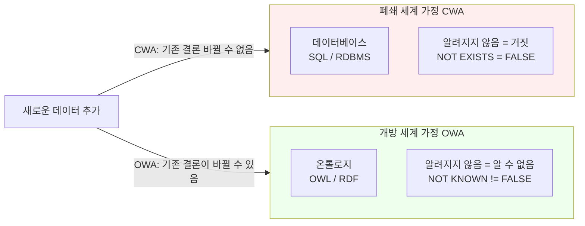

# 2회차: OWA vs CWA — 세계를 보는 두 가지 방식

## 학습 목표

이번 세션을 마치면 다음을 할 수 있습니다:

- 폐쇄 세계 가정(CWA)과 개방 세계 가정(OWA)의 차이를 명확히 설명할 수 있습니다
- 각 가정이 어떤 시스템에서 사용되는지 예시를 들 수 있습니다
- OWA가 온톨로지 설계 결정에 미치는 실질적인 영향을 파악합니다
- OWA에서 흔히 발생하는 설계 실수를 피할 수 있습니다

---

## 이번 세션 전체 그림



---

## 핵심 개념

### 1. 폐쇄 세계 가정(Closed World Assumption, CWA)

**핵심 원칙: "모르면 거짓이다(Unknown = False)"**

데이터베이스와 전통적인 정보 시스템이 사용하는 가정입니다.

> **왜 CWA가 데이터베이스의 기본 가정인가?**
>
> 데이터베이스는 <strong>완전한 정보(complete information)</strong>를 가지고 있다고 가정합니다. 항공권 예약 시스템에 특정 좌석이 없다면, 그 좌석은 "정말로 없는 것"입니다. 데이터베이스는 자신이 아는 것이 전부라고 가정하기 때문에, 기록되지 않은 것은 존재하지 않는 것으로 간주합니다.

**예시: 병원 데이터베이스**

환자 '김철수'의 기록에 알레르기 정보가 없다고 가정합시다.

- **CWA 해석:** "김철수는 알레르기가 없다" (= FALSE)
- **이유:** 데이터베이스에 없으면 존재하지 않는 것으로 간주

SQL로 확인하면:
```sql
SELECT * FROM allergies WHERE patient_id = 'kim-cheolsu';
-- 결과: 0행
-- CWA 결론: 알레르기 없음 (= 없다고 확정)
```

**예시: 비행기 좌석 예약**

1A 좌석 예약 기록이 없으면:
- **CWA 해석:** "1A 좌석은 예약 가능하다"
- 이것이 맞습니다! 예약 시스템에서 없는 예약은 "빈 좌석"을 의미합니다

### 2. 개방 세계 가정(Open World Assumption, OWA)

**핵심 원칙: "모르면 알 수 없다(Unknown = Unknown)"**

온톨로지와 시맨틱 웹 시스템이 사용하는 가정입니다.

> **왜 OWA가 온톨로지의 기본 가정인가?**
>
> 온톨로지는 <strong>불완전한 정보(incomplete information)</strong>를 다룹니다. 특히 웹 환경에서 우리는 세상의 일부만 알고 있습니다. 누군가에 대한 정보가 없다고 해서 그 정보가 존재하지 않는 것이 아닙니다. 어딘가에 더 많은 정보가 있을 수 있습니다. OWA는 이 불확실성을 인정합니다.

**같은 예시: 온톨로지 기반 의료 시스템**

환자 '김철수'의 온톨로지에 알레르기 정보가 없다고 가정합시다.

- **OWA 해석:** "김철수의 알레르기 여부는 알 수 없다"
- **이유:** 데이터에 없다고 해서 없는 것이 아닙니다. 아직 기록되지 않았을 수 있습니다

이것은 의료 분야에서 매우 중요합니다. 알레르기 정보가 없는 것과 알레르기가 없는 것은 전혀 다른 의미입니다!

### 3. 나란히 비교

| 상황 | CWA (데이터베이스) | OWA (온톨로지) |
|------|-----------------|--------------|
| 데이터에 없음 | 거짓으로 간주 | 알 수 없음 |
| 새 데이터 추가 시 | 기존 결론 변경 없음 | 기존 결론이 바뀔 수 있음 |
| 적합한 질문 | "이 항목이 있는가?" | "이 사실이 참인가?" |
| 대표 시스템 | SQL DB, Prolog | OWL, RDF |
| 완전성 가정 | 완전한 정보 | 불완전한 정보 |

### 4. 실제 예시: 두 가지 방식의 차이

**시나리오: "서울에 사는 사람" 질의**

온톨로지에 다음 정보만 있다고 가정합니다:
- `lives-in(:Alice, :Seoul)` → Alice는 서울에 산다

**질문: "서울에 살지 않는 사람을 찾아라"**

- **CWA 결론:** Alice를 제외한 모든 알려진 개체 (Bob, Carol 등)는 서울에 살지 않는다
- **OWA 결론:** Bob, Carol이 서울에 살지 않는다고 말할 수 **없다**. 단지 그 정보가 없을 뿐

**시나리오: 독신자 추론**

TBox: `Bachelor ≡ Man ⊓ ¬Married`

ABox:
- `Man(:John)` → John은 남성
- (Married에 대한 정보 없음)

- **CWA 결론:** John은 결혼하지 않았으므로 독신자다
- **OWA 결론:** John이 결혼했는지 알 수 없으므로 독신자인지 **알 수 없다**

---

> **왜 OWA가 온톨로지 설계를 더 어렵게 만드는가?**
>
> 데이터베이스 개발자들이 온톨로지를 처음 접할 때 가장 많이 혼동하는 부분이 OWA입니다. SQL에서는 `NOT EXISTS`가 "없음"을 의미하지만, OWL에서는 "우리가 모름"을 의미합니다. 이 때문에 OWL에서 "이 클래스는 정확히 이 구성원들만 가진다"고 표현하려면 <strong>열거형(Enumeration)</strong>이나 **닫힌 세계 규칙**을 명시적으로 사용해야 합니다.

### 5. OWA가 온톨로지 설계에 미치는 실질적 영향

**영향 1: 부정(Negation)이 특별해진다**

CWA에서는 "알레르기가 없다"가 기본값입니다.
OWA에서는 "알레르기가 없다"를 명시적으로 써야 합니다:
- `hasAllergy(:Kim, :NoneKnown)` 또는
- `owl:NegativePropertyAssertion`을 사용

**영향 2: 클래스 완전성 표현**

"Animal은 Cat, Dog, Bird만 있다"를 표현하려면:

- CWA: 다른 동물이 없다고 자동으로 가정
- OWA: `Animal ≡ Cat ⊔ Dog ⊔ Bird`처럼 <strong>완전 정의(complete definition)</strong>를 명시해야 함

**영향 3: 추론 결과의 차이**

같은 데이터에서:

- CWA 시스템: "John은 독신자다" (결론을 내림)
- OWA 시스템: "John이 독신자인지 알 수 없다" (추론 보류)

이것이 나쁜 것이 아닙니다. 불확실한 상황에서 틀린 결론을 내리는 것보다 "모른다"고 하는 것이 더 안전합니다.

---

## 흔한 오해

### 오해 1: "OWA가 CWA보다 더 좋다"

**잘못된 생각:** 온톨로지를 쓰면 데이터베이스보다 더 스마트하다.

**올바른 이해:** OWA와 CWA는 서로 다른 목적에 맞는 도구입니다. 항공권 예약 시스템에 OWA를 적용하면 큰 문제가 됩니다. "좌석이 예약됐는지 알 수 없다"는 것은 예약 시스템에서 받아들일 수 없습니다. CWA가 적합한 곳에는 CWA를, OWA가 적합한 곳에는 OWA를 사용해야 합니다.

### 오해 2: "OWL 추론기는 CWA를 지원하지 않는다"

**잘못된 생각:** OWL을 쓰면 반드시 OWA만 써야 한다.

**올바른 이해:** SWRL(Semantic Web Rule Language)이나 특수한 표현을 통해 OWL 환경에서도 CWA적 추론을 일부 구현할 수 있습니다. 또한 SPARQL 쿼리는 기본적으로 CWA를 따릅니다. 시스템 설계 시 두 가정을 함께 사용하는 하이브리드 접근법도 가능합니다.

### 오해 3: "OWA에서는 아무것도 추론할 수 없다"

**잘못된 생각:** OWA이면 "모른다"만 반환한다.

**올바른 이해:** OWA에서도 많은 것을 추론할 수 있습니다. 단지 *명시적으로* 거짓임을 증명하지 않으면 거짓으로 단정하지 않을 뿐입니다. OWL 추론기는 정의에서 새로운 클래스 구성원을 찾거나, 모순을 탐지하거나, 계층을 자동으로 계산하는 등 다양한 추론을 수행합니다.

---

## OWA와 실세계 시나리오

### 시나리오: 의료 온톨로지

```
환자 김민수:
- hasCondition(:MinsuKim, :Diabetes) → 당뇨병 있음
- (고혈압 기록 없음)
```

- **CWA 의사:** "고혈압 없음" → 고혈압 약 처방 안 함
- **OWA 온톨로지:** "고혈압 여부 알 수 없음" → 추가 검사 필요

의료 데이터는 항상 불완전합니다. OWA가 환자 안전에 더 적합합니다.

### 시나리오: 제품 카탈로그

```
제품 X:
- hasColor(:ProductX, :Red) → 빨간색
- (다른 색상 기록 없음)
```

- **CWA 쇼핑몰:** "빨간색만 있음"
- **OWA 온톨로지:** "다른 색상도 있을 수 있음"

쇼핑몰에서는 CWA가 더 적합합니다. "기록된 색상이 전부입니다"가 맞는 가정입니다.

---

## 요약

- **CWA(폐쇄 세계 가정):** "모르면 거짓" — 완전한 정보를 가정, 데이터베이스/SQL의 기본
- **OWA(개방 세계 가정):** "모르면 알 수 없음" — 불완전한 정보를 인정, OWL/RDF의 기본
- OWA는 **의료, 과학, 시맨틱 웹**처럼 세계에 대한 완전한 지식이 불가능한 도메인에 적합
- CWA는 **트랜잭션 시스템, 예약 시스템**처럼 완전한 기록이 유지되는 도메인에 적합
- OWA에서 부정이나 클래스 완전성을 표현하려면 **명시적으로** 작성해야 함

---

## 실습: Protege에서 OWA 직접 경험하기

이제 이론을 넘어서 실제로 OWA를 경험해보겠습니다. Protege 온톨로지 편집기를 사용하여 OWA와 CWA의 차이를 실험해볼 수 있습니다.

### 실험 설정

**단계 1: Protege에서 새 온톨로지 생성**

1. Protege를 실행하고 File → New Ontology 선택
2. IRI로 `http://example.com/owa-experiment` 입력
3. 이제 실험 준비 완료!

**단계 2: 클래스 정의**

Entities 탭에서 다음 클래스들을 생성하세요:

```
Classes:
- Person (사람)
- Student (학생)
- Professor (교수)
- Course (과목)
```

### 실험 1: OWA 기본 동작 확인

**목표:** OWA에서 "정보가 없음"이 어떻게 작동하는지 확인합니다.

**실험 설정:**

1. `Student`와 `Professor`를 **Disjoint Classes**로 설정:
   - Object Properties 탭 → Add new property
   - 이름: `disjointWith`
   - Characteristics: `Symmetric`

2. 또는 더 간단하게:
   - Classes 탭에서 `Student` 선택
   - Disjoint With 클릭 → `Professor` 추가

**ABox 입력:**

Individuals 탭에서 다음 개체를 생성하세요:

```
Individuals:
- hong (홍길동)
  - Types: Student 추가
```

**질의:** "hong은 Professor인가?"

**Protege에서 확인:**
1. DL Query 탭 열기 (Reasoner 메뉴에서)
2. 질의 입력: `Professor and (value hong)` 또는 `Professor`
3. Execute 클릭

**결과:**
- **빈 결과 집합** 반환
- 의미: "hong이 Professor인지 아닌지 알 수 없음"
- OWA에 따라 `Student`로 선언되었어도 `Professor`가 아님을 **보장하지 않음**

> **왜 이런 결과가 나오는가?**
>
> OWA에서는 `Student(hong)`만 있고 `Professor(hong)`에 대한 정보가 없습니다. 따라서 `Professor(hong)`이 참인지 거짓인지 알 수 없습니다. `Student`와 `Professor`가 **disjoint**임에도 불구하고, 추론기는 "확실히 아니다"라고 단정하지 않습니다.

### 실험 2: CWA와 비교

같은 데이터를 SQL数据库에서 실행해보겠습니다.

**SQL 테이블:**
```sql
CREATE TABLE person (
    id INT PRIMARY KEY,
    name VARCHAR(100),
    type VARCHAR(100)
);

INSERT INTO person VALUES (1, '홍길동', 'Student');
```

**SQL 질의:**
```sql
SELECT * FROM person WHERE type = 'Professor' AND name = '홍길동';
```

**결과:** 0행 반환

**의미:** "홍길동은 Professor가 아니다" (= 거짓으로 확정)

### 실험 3: 명시적 부정을 통한 해결

OWA에서 "확실히 아니다"를 표현하려면 **명시적 부정**이 필요합니다.

**Protege에서 수정:**

1. `hong` 개체 선택
2. Types 섹션에서 **Negative Assertions** 추가
3. `Professor` 선택

또는 **완전 정의(Complete Definition)** 사용:

1. `Student` 클래스 정의를 변경:
   - `Student EquivalentTo: (Person) and (not Professor)`

**DL Query 재실행:**
```
질의: Professor and (value hong)
결과: 여전히 빈 결과 집합
```

하지만 이제 추론기는 내부적으로 `¬Professor(hong)`을 알고 있습니다.

### 실험 4: 제한(Restriction)과 OWA

**목표:** OWA가 제한 공리와 어떻게 상호작용하는지 확인합니다.

**TBox 정의:**

1. `Course` 클래스 생성
2. `hasStudent` ObjectProperty 생성:
   - Domain: `Course`
   - Range: `Person`

3. `RequiredCourse` 클래스 정의:
   - SubClass Of: `Course`
   - 추가 제한: `hasStudent min 1` (최소 1명의 학생)

**ABox 입력:**
```
Individuals:
- math101 (수학 101)
  - Types: Course
  - (hasStudent 정보 없음)
```

**DL Query:**
```
질의: RequiredCourse
결과: math101이 반환되지 않음
```

**의미:** `hasStudent` 정보가 없으므로 최소 1명 조건을 만족하는지 알 수 없음

**반대 질의:**
```
질의: Course and (not RequiredCourse)
결과: 빈 결과 집합 (여전히 알 수 없음)
```

### 실험 5: 실제 온톨로지에서의 OWA 활용

**시나리오:** 의료 온톨로지에서 환자 알레르기 기록

**클래스 정의:**
```
- Patient (환자)
- AllergyKnown (알레르기 확인됨)
- NoKnownAllergy (알레르기 없음으로 확인됨)
```

**개체:**
```
- patient_kim
  - Types: Patient
  - (hasAllergy 정보 없음)
```

**질의 결과:**
```
질의: AllergyKnown and (value patient_kim)
결과: 빈 결과 (알레르기 있는지 알 수 없음)

질의: NoKnownAllergy and (value patient_kim)
결과: 빈 결과 (알레르기 없는지도 알 수 없음)
```

**의료적 함의:**
- "알 수 없음"은 의료 결정에 **보수적 접근** 요구
- 알레르기 정보가 없으면 **검사 추가** 필요
- CWA처럼 "없음 = 없다"고 가정하면 위험할 수 있음

### 실험 정리

| 실험 | OWA 결과 | CWA 결과 | 학습 포인트 |
|------|----------|----------|-----------|
| 홍길동의 직업 | 알 수 없음 | Professor 아님 | OWA는 불확실성 인정 |
| 수학 101의 학생 | 필수 조건 충족 여부 알 수 없음 | 학생 없음으로 간주 | 제한 공리와 OWA 상호작용 |
| 환자 알레르기 | 확인 불가 | 알레르기 없음으로 간주 | 의료 분야에서 OWA의 중요성 |

**실습 팁:**
- Protege의 **Reasoner → Start reasoner**로 추론기 실행
- **DL Query 탭**에서 다양한 질의 시도
- **Explanation** 기능으로 추론 근거 확인

> **연결 포인트: Protege 실습 → 실전 온톨로지 설계**
>
> 이 실험에서 경험한 OWA 동작은 실제 온톨로지 설계에 직접 적용됩니다. "이 정보는 필수인가, 선택 사항인가?"를 결정할 때 OWA를 고려해야 합니다. 필수 정보는 제한 공리(Restriction)로 명시하고, 선택 사항은 OWA에 맡기는 것이 일반적인 설계 패턴입니다.

---

> **연결 포인트: OWA → 추론 유형**
>
> OWA를 이해하면 3회차의 추론 유형들이 왜 그렇게 동작하는지 이해하게 됩니다. 예를 들어 "인스턴스 인식(instance recognition)"은 OWA 하에서 동작하기 때문에, 개체가 명시적으로 특정 클래스에 속한다고 선언되지 않더라도 정의에 의해 자동으로 클래스를 결정할 수 있습니다.

> **연결 포인트: OWA → OWL 2 프로파일**
>
> OWL 2 QL 프로파일은 대규모 데이터베이스(CWA 환경) 위에 온톨로지 레이어를 올리는 것을 목표로 합니다. 5회차에서 OWA와 CWA가 어떻게 조화를 이룰 수 있는지 살펴봅니다.
