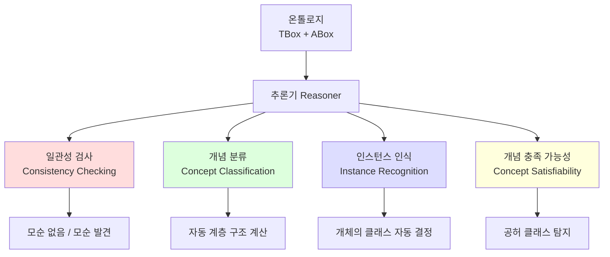

# 3회차: 추론 유형 — 온톨로지의 4가지 핵심 추론 서비스

## 학습 목표

이번 세션을 마치면 다음을 할 수 있습니다:

- 4가지 추론 유형(일관성 검사, 개념 분류, 인스턴스 인식, 개념 충족 가능성)을 구별하고 설명할 수 있습니다
- 각 추론 유형이 실제로 어떤 문제를 해결하는지 예시를 들 수 있습니다
- 추론이 온톨로지를 단순한 데이터 저장소와 다르게 만드는 이유를 설명할 수 있습니다
- Protégé에서 추론기를 실행하는 방법을 이해합니다

---

## 이번 세션 전체 그림



> **왜 추론이 중요한가?**
>
> 온톨로지에 1,000개의 클래스와 100만 개의 개체를 정의했다고 가정합니다. 사람이 직접 모든 클래스 포함 관계와 개체의 소속을 확인하려면 수개월이 걸릴 것입니다. 추론기는 이를 몇 분 안에 자동으로 처리합니다. 추론은 온톨로지를 "살아있는 지식 기반"으로 만드는 엔진입니다.

---

## 핵심 개념

### 추론 유형 1: 일관성 검사(Consistency Checking)

**목적:** 온톨로지에 논리적 모순이 없는지 확인합니다.

**결과:** 일관적(consistent) 또는 비일관적(inconsistent)

**비일관적이 되는 상황:**

예시 1: 직접 모순
```
Man ⊑ ¬Woman          (남성은 여성이 아니다)
Man(:Alex)             (Alex는 남성이다)
Woman(:Alex)           (Alex는 여성이다)
```
→ Alex가 남성이면서 여성일 수 없으므로 비일관적

예시 2: 제한 위반
```
hasNumberOfHeads exactly 1 Head    (머리는 정확히 1개)
hasNumberOfHeads min 2 Head (:Hydra)  (히드라는 머리가 2개 이상)
Human ⊑ hasNumberOfHeads exactly 1 Head
Human(:Hydra)          (히드라는 인간이다)
```
→ 인간은 머리가 1개여야 하는데 히드라는 2개 이상 → 비일관적

**일관성 검사가 중요한 이유:**

> **왜 일관성 검사를 해야 하는가?**
>
> 대규모 온톨로지(수백 개 클래스, 수천 개 공리)를 작성하다 보면 의도치 않게 모순이 생깁니다. 모순이 있는 온톨로지에서는 **모든 것이 참**이 됩니다(논리학의 폭발 원리: ex falso quodlibet). 즉, 아무것도 추론할 수 없게 됩니다. 일관성 검사는 이를 미리 탐지합니다.

**Protégé에서 사용:**
1. Reasoner 메뉴 → HermiT (또는 Pellet) 선택
2. Start Reasoner 클릭
3. 온톨로지가 일관적이면 녹색 체크, 비일관적이면 Unsatisfiable classes 표시

---

### 추론 유형 2: 개념 분류(Concept Classification)

**목적:** 클래스들 사이의 포함 관계(subsumption)를 자동으로 계산합니다.

**결과:** 클래스 계층 구조 자동 완성

**예시: 수동 vs 자동 분류**

수동으로 정의한 TBox:
```
Mother ≡ Woman ⊓ ∃hasChild.⊤
Parent ≡ ∃hasChild.⊤
GrandMother ≡ Woman ⊓ ∃hasChild.Parent
```

추론 전에는 Mother와 Parent 사이의 포함 관계가 명시되어 있지 않습니다. 추론기가 자동으로 계산합니다:
- `Mother ⊑ Parent` (어머니는 부모의 부분집합)
- `GrandMother ⊑ Mother` (할머니는 어머니의 부분집합)
- `GrandMother ⊑ Parent` (전이적으로)

**대규모 온톨로지에서의 힘:**

SNOMED CT처럼 350,000개 이상의 의학 개념을 가진 온톨로지에서 개념 분류는 수동으로 불가능합니다. 추론기가 전체 계층을 자동으로 계산합니다.

> **왜 개념 분류를 자동화해야 하는가?**
>
> 대형 온톨로지에서 한 클래스를 추가하면 수백 개의 기존 클래스와의 관계가 변할 수 있습니다. 이를 수동으로 유지하는 것은 불가능합니다. 추론기는 클래스 정의(필요충분조건)에서 계층을 자동으로 계산하므로, 개발자는 "무엇인가"의 정의에만 집중하면 됩니다. 계층 관리는 추론기의 역할입니다.

---

### 추론 유형 3: 인스턴스 인식(Instance Recognition / Realization)

**목적:** 개체(individual)가 어떤 클래스에 속하는지 자동으로 결정합니다.

**결과:** 개체의 클래스 소속 자동 판단

**예시: 자동 인식**

TBox:
```
Parent ≡ ∃hasChild.⊤        (부모 = 자식이 있는 것)
GrandParent ≡ ∃hasChild.Parent   (조부모 = 부모인 자식이 있는 것)
```

ABox:
```
hasChild(:Mary, :John)    (Mary는 John의 부모)
hasChild(:John, :Sue)     (John은 Sue의 부모)
```

명시된 사실:
- Mary는 Parent라고 선언되지 않았습니다
- John도 Parent라고 선언되지 않았습니다

추론 결과:
- `:John`은 `:Sue`의 부모 → `Parent(:John)` 자동 추론
- `:Mary`는 `Parent`인 John의 부모 → `GrandParent(:Mary)` 자동 추론

**의료 예시:**

TBox:
```
DiabetesPatient ≡ Patient ⊓ ∃hasDiagnosis.Diabetes
```

ABox:
```
Patient(:MinsuKim)
hasDiagnosis(:MinsuKim, :Type2Diabetes)
Type2Diabetes ⊑ Diabetes
```

추론 결과: `DiabetesPatient(:MinsuKim)` — 명시적으로 선언하지 않아도 자동으로 인식됨

> **왜 인스턴스 인식이 강력한가?**
>
> 데이터베이스에서는 어떤 환자가 당뇨병 환자인지 확인하기 위해 명시적인 태그나 플래그가 필요합니다. OWL 온톨로지에서는 진단 데이터(hasDiagnosis 관계)만 있으면 추론기가 자동으로 분류합니다. 이는 새로운 진단 기준이 추가될 때마다 데이터를 재태그할 필요가 없음을 의미합니다. 기준(TBox)을 업데이트하면 모든 개체의 분류가 자동으로 갱신됩니다.

---

### 추론 유형 4: 개념 충족 가능성(Concept Satisfiability)

**목적:** 특정 클래스가 논리적으로 공허(empty)한지 — 즉, 어떤 개체도 속할 수 없는지 — 확인합니다.

**결과:** 충족 가능(satisfiable) 또는 공허(unsatisfiable / empty)

**예시: 공허 클래스**

```
SquareCircle ≡ Square ⊓ Circle
Square ⊑ ¬Circle               (정사각형은 원이 아니다)
```

→ `SquareCircle`은 공허 클래스: 어떤 것도 동시에 정사각형이면서 원일 수 없음

**더 현실적인 예시:**

```
VegetarianMeatEater ≡ Vegetarian ⊓ ∃eats.Meat
Vegetarian ≡ Person ⊓ ∀eats.¬Meat
```

→ `VegetarianMeatEater`는 공허: 채식주의자는 정의상 고기를 먹지 않으므로, 고기를 먹는 채식주의자는 논리적으로 불가능

**유전자 온톨로지 예시:**

```
NuclearMembraneBound ≡ hasMembrane.Nuclear
Prokaryote ⊑ ¬hasMembrane.Nuclear
ProkaryoticNuclearGene ≡ Gene ⊓ locatedIn.Prokaryote ⊓ NuclearMembraneBound
```

→ `ProkaryoticNuclearGene`은 공허: 원핵생물(Prokaryote)에는 핵막이 없으므로 핵막으로 둘러싸인 유전자를 가질 수 없음

이런 공허 클래스는 **온톨로지의 논리적 오류**를 나타냅니다.

---

## 4가지 추론 유형 요약

| 추론 유형 | 입력 | 출력 | 실용적 용도 |
|----------|------|------|-----------|
| 일관성 검사 | 전체 온톨로지 | 일관/비일관 | 온톨로지 개발 중 오류 탐지 |
| 개념 분류 | TBox | 클래스 계층 | 대규모 온톨로지 자동 구조화 |
| 인스턴스 인식 | TBox + ABox | 개체의 클래스 | 지식 기반에서 자동 분류 |
| 개념 충족 가능성 | 개념 표현식 | 가능/공허 | 잘못된 클래스 정의 탐지 |

---

## 흔한 오해

### 오해 1: "추론기는 새로운 사실을 만들어낸다"

**잘못된 생각:** 추론기가 없던 정보를 창조한다.

**올바른 이해:** 추론기는 **이미 암묵적으로 포함된 정보**를 명시적으로 드러낼 뿐입니다. TBox와 ABox에 이미 논리적으로 내포된 결론을 표면으로 끌어올립니다. 이를 "닫힌 추론(deductive closure)"이라고 합니다.

### 오해 2: "일관성 검사가 통과하면 온톨로지가 정확하다"

**잘못된 생각:** 일관적 = 올바름.

**올바른 이해:** 일관성은 논리적 모순이 없다는 의미지, 온톨로지가 도메인을 올바르게 표현한다는 의미가 아닙니다. `Cat ⊑ Fish`라고 써도 일관적일 수 있습니다. 정확성(correctness)과 일관성(consistency)은 다른 개념입니다.

### 오해 3: "인스턴스 인식은 검색이다"

**잘못된 생각:** SPARQL 쿼리와 같다.

**올바른 이해:** SPARQL은 명시적으로 저장된 데이터를 검색합니다(CWA 방식). 인스턴스 인식은 클래스 정의와 논리적 추론을 통해 **암묵적 소속**을 발견합니다. SPARQL이 책의 인덱스라면, 인스턴스 인식은 책을 읽고 결론을 도출하는 독자입니다.

---

## 추론이 온톨로지를 "살아있게" 만드는 방법

추론 없는 온톨로지는 잘 구조화된 데이터베이스일 뿐입니다. 추론이 있어야 온톨로지는:

1. **자기 검증적(self-validating):** 일관성 검사로 오류를 자동 탐지
2. **자동 분류적(auto-classifying):** 새 개체를 추가하면 자동으로 적절한 클래스에 배치
3. **추론적(inferential):** 명시적으로 선언하지 않은 사실도 논리적으로 도출
4. **진화 가능한(evolvable):** 클래스 정의 변경 시 자동으로 모든 분류 갱신

---

## 요약

- **일관성 검사:** 온톨로지에 논리적 모순이 없는지 확인 — 개발 과정의 핵심 검증 도구
- **개념 분류:** 클래스 포함 관계를 자동 계산 — 대규모 온톨로지 관리의 핵심
- **인스턴스 인식:** 개체가 속하는 클래스를 자동 결정 — 명시적 태깅 없이 지식 분류
- **개념 충족 가능성:** 논리적으로 공허한 클래스 탐지 — 온톨로지 설계 오류 탐지
- 이 4가지 서비스가 함께 작동하여 온톨로지를 **살아있는 지식 기반**으로 만듭니다

---

> **연결 포인트: 추론 유형 → 추론기**
>
> 4가지 추론 서비스를 이해했다면, 다음 질문은 "어떤 소프트웨어가 이것을 실행하는가?"입니다. 4회차에서는 HermiT, Pellet, FaCT++, ELK와 같은 실제 추론기를 비교하고, 각각이 어떤 알고리즘으로 이 서비스들을 구현하는지 살펴봅니다.

> **연결 포인트: 추론 복잡도 → OWL 2 프로파일**
>
> 4가지 추론 서비스는 이론적으로는 모두 OWL 2 DL에서 지원됩니다. 그러나 대규모 데이터에서 이 추론들이 너무 느릴 수 있습니다. 5회차의 OWL 2 프로파일은 "어떤 추론 서비스가 필요한가?"를 기준으로 표현력을 제한하여 성능을 확보하는 방법을 제시합니다.
