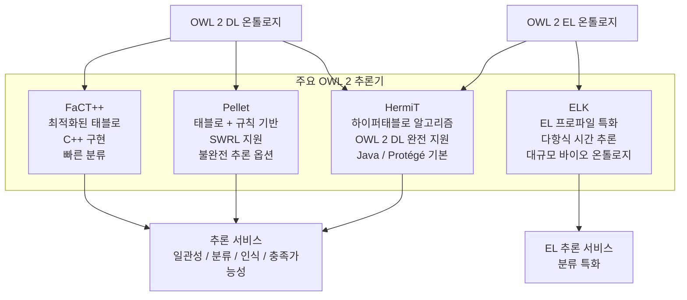

# 4회차: 추론기(Reasoners) — 온톨로지 추론을 실행하는 소프트웨어

## 학습 목표

이번 세션을 마치면 다음을 할 수 있습니다:

- 주요 OWL 2 추론기(HermiT, Pellet, FaCT++, ELK)의 특성을 비교할 수 있습니다
- 각 추론기가 사용하는 핵심 알고리즘의 원리를 이해합니다
- 프로젝트 요구사항에 따라 적합한 추론기를 선택할 수 있습니다
- Protégé에서 추론기를 연동하는 방법을 알 수 있습니다

---

## 이번 세션 전체 그림



> **왜 추론기가 여러 개 존재하는가?**
>
> 온톨로지의 크기, 복잡도, 필요한 추론 서비스, 성능 요구사항에 따라 최적의 추론기가 달라집니다. 10개 클래스의 작은 온톨로지에 최적인 추론기와 30만 개 클래스의 SNOMED CT에 최적인 추론기는 다릅니다. 도구 생태계가 다양한 것은 다양한 요구를 충족하기 위함입니다.

---

## 핵심 개념

### 1. 태블로(Tableau) 알고리즘 — 대부분 추론기의 기반

대부분의 OWL 2 추론기는 **태블로(Tableau) 알고리즘**을 기반으로 합니다.

**기본 원리:**
1. "이 온톨로지가 일관적이다"라고 가정
2. 그 가정이 성립하는 모델(model)을 구성 시도
3. 모순이 발생하면 → 비일관적
4. 모순 없이 모델 구성 성공 → 일관적

**쉬운 비유:** 수독(Sudoku) 퍼즐 풀기와 비슷합니다. "1이 이 칸에 들어갈 수 있다"고 가정하고, 규칙에 따라 나머지를 채워봅니다. 모순이 생기면 가정이 틀린 것입니다.

### 2. HermiT — 가장 널리 사용되는 추론기

**개발:** 옥스퍼드 대학교
**알고리즘:** 하이퍼태블로(Hypertableau)
**구현:** Java
**OWL 2 지원:** 완전 지원(DL, EL, QL, RL 모두)

**하이퍼태블로의 장점:**
- 일반 태블로보다 탐색 공간이 훨씬 작음
- "가능한 모든 상황"을 탐색하는 것이 아니라 필요한 것만 탐색
- 비결정적 선택(non-deterministic choice)을 최소화

**강점:**
- Protégé의 기본 추론기
- OWL 2 DL 스펙에 가장 충실
- 일관성 검사에 특히 강함
- 코너 케이스(corner case) 처리 우수

**약점:**
- 매우 대규모 온톨로지(100만 개 이상 클래스)에서 느릴 수 있음
- 메모리 사용량이 많을 수 있음

**적합한 용도:**
- 일반적인 온톨로지 개발 및 검증
- OWL 2 DL의 모든 기능을 사용하는 온톨로지
- 정확성이 최우선인 경우

### 3. Pellet — 규칙 기반 추론 통합

**개발:** Clark & Parsia (현재 Stardog에 통합)
**알고리즘:** 태블로 + 규칙 기반 추론
**구현:** Java
**OWL 2 지원:** DL, EL, 일부 QL/RL

**고유 기능:**
- **SWRL(Semantic Web Rule Language) 지원:** OWL 추론과 규칙 기반 추론 통합
  ```
  규칙 예시: 부모의 부모는 조부모다
  hasParent(?x, ?y) ∧ hasParent(?y, ?z) → hasGrandParent(?x, ?z)
  ```
- **불완전 추론(Incomplete Reasoning):** 성능을 위해 일부 추론 포기 옵션
- **DL-Safe Rules:** OWL과 규칙을 안전하게 결합

**강점:**
- OWL + 규칙이 필요한 복잡한 시스템
- 비즈니스 규칙을 온톨로지에 통합할 때
- Stardog 등 상용 시스템과 통합

**약점:**
- HermiT에 비해 일관성 검사가 약간 느릴 수 있음
- 일부 OWL 2 DL 기능에서 불완전할 수 있음

**적합한 용도:**
- 비즈니스 규칙과 온톨로지를 결합해야 할 때
- SWRL 규칙을 사용해야 할 때
- Stardog 데이터베이스 환경

### 4. FaCT++ — C++ 기반 고성능 추론기

**개발:** 맨체스터 대학교
**알고리즘:** 최적화된 태블로
**구현:** C++ (성능 최우선)
**OWL 2 지원:** DL 완전 지원

**최적화 기법:**
- **Lazy Unfolding:** 필요할 때만 클래스 정의를 확장
- **Semantic Branching:** 지능적인 분기로 탐색 공간 감소
- **Ordered Disjunction:** 효율적인 합집합(disjunction) 처리

**강점:**
- 개념 분류(classification)에서 매우 빠름
- C++ 구현으로 Java 오버헤드 없음
- 중규모 온톨로지(만~수십만 클래스)에서 탁월

**약점:**
- SWRL 지원 없음
- 최신 OWL 2 기능 일부 미지원
- 현재 개발이 다소 비활성화

**적합한 용도:**
- 개념 분류 속도가 중요한 환경
- 중규모 온톨로지의 빠른 처리

### 5. ELK — 대규모 바이오 온톨로지 특화

**개발:** 울라자우 대학교 + 옥스퍼드
**알고리즘:** EL 추론 전용 (LL 알고리즘)
**구현:** Java
**OWL 2 지원:** EL 프로파일만

> **왜 ELK가 대규모 온톨로지에서 혁명적인가?**
>
> OWL 2 DL 전체를 지원하는 추론기로 SNOMED CT(350,000+ 개념)를 분류하면 시간이 매우 오래 걸립니다. ELK는 OWL 2 EL 프로파일만 지원하는 대신, <strong>다항식 시간(polynomial time)</strong>에 분류를 완료합니다. SNOMED CT를 ELK로 분류하면 수 분 안에 완료됩니다. 이것이 Gene Ontology, SNOMED CT, NCI Thesaurus가 ELK를 채택한 이유입니다.

**강점:**
- OWL 2 EL에서 압도적 속도
- 수백만 클래스도 처리 가능
- 바이오인포매틱스 분야 사실상 표준

**약점:**
- OWL 2 EL만 지원 (DL 기능 사용 불가)
- 수 제한, Nominals, 역 프로퍼티 등 미지원

**적합한 용도:**
- Gene Ontology, SNOMED CT 같은 대규모 바이오 온톨로지
- EL 프로파일 내에서 최대 성능이 필요한 경우

---

## 추론기 비교 요약

| 추론기 | 알고리즘 | 언어 | OWL 2 지원 | 강점 | 주요 사용처 |
|--------|---------|------|-----------|------|-----------|
| **HermiT** | 하이퍼태블로 | Java | DL 완전 | 정확성, 범용 | 일반 온톨로지 개발 |
| **Pellet** | 태블로+규칙 | Java | DL + SWRL | 규칙 통합 | 비즈니스 규칙 결합 |
| **FaCT++** | 최적화 태블로 | C++ | DL | 분류 속도 | 중규모 고성능 |
| **ELK** | LL 알고리즘 | Java | EL만 | 대규모 처리 | 바이오 온톨로지 |

---

## Protégé와 추론기 연동

Protégé는 여러 추론기를 플러그인으로 지원합니다:

**기본 내장:** HermiT (Protégé 5.x에 기본 포함)

**추가 설치 방법:**
1. Protégé 메뉴: File → Check for Plugins
2. 목록에서 Pellet 또는 ELK 선택
3. Install 클릭 후 Protégé 재시작

**추론기 실행:**
1. Reasoner 메뉴 → 추론기 선택
2. Start Reasoner (Ctrl+R)
3. 추론 완료 후 Inferred Class Hierarchy 탭 확인

**추론 결과 확인:**
- Class hierarchy 탭: 자동 계산된 계층 구조
- Inferred properties 탭: 개체에 자동 추론된 프로퍼티
- Explain 기능: 왜 이 추론이 이루어졌는지 증명 제공

---

## 추론기 선택 기준

**질문 1: 온톨로지가 OWL 2 EL 범위 안에 있는가?**
- 예 + 매우 대규모(수만 개 이상) → **ELK**
- 예 + 소규모 → **HermiT** 또는 **Pellet**

**질문 2: SWRL 규칙이 필요한가?**
- 예 → **Pellet**

**질문 3: 개념 분류 속도가 최우선인가?**
- 예 + 중규모 온톨로지 → **FaCT++**

**질문 4: OWL 2 DL의 모든 기능이 필요한가?**
- 예 → **HermiT** (가장 완전한 지원)

**기본 선택:** 특별한 요구사항이 없다면 **HermiT**로 시작하는 것을 권장합니다.

---

## 흔한 오해

### 오해 1: "추론기가 다르면 결과도 다르다"

**잘못된 생각:** HermiT와 Pellet의 추론 결과가 다를 수 있다.

**올바른 이해:** OWL 2 DL을 완전히 지원하는 추론기라면 **동일한 결과**를 반환해야 합니다(사운드니스와 완전성). 결과가 다르다면 온톨로지가 지원되지 않는 OWL 2 Full 기능을 사용하거나, 추론기에 버그가 있는 경우입니다. 성능은 다를 수 있지만 결과는 같아야 합니다.

### 오해 2: "ELK는 HermiT의 빠른 버전이다"

**잘못된 생각:** ELK는 HermiT보다 빠른 같은 종류의 도구다.

**올바른 이해:** ELK는 OWL 2 EL 프로파일**만** 지원합니다. HermiT에서 되는 많은 표현(역 프로퍼티, 수 제한 등)이 ELK에서는 지원되지 않습니다. ELK는 "더 빠른 HermiT"가 아니라 "다른 기능 집합을 가진 추론기"입니다.

### 오해 3: "추론기를 실행하면 온톨로지가 변경된다"

**잘못된 생각:** 추론 실행 후 TBox나 ABox가 수정된다.

**올바른 이해:** 추론기는 온톨로지를 읽기만 합니다(read-only). 추론 결과는 <strong>추론된 온톨로지(inferred ontology)</strong>로 별도 저장하거나 메모리에만 유지됩니다. 원본 온톨로지는 변경되지 않습니다. Protégé에서 "Save inferred axioms"를 선택해야 명시적으로 저장됩니다.

---

## 요약

- **HermiT:** 가장 범용적인 OWL 2 DL 추론기, Protégé 기본, 정확성 최우선
- **Pellet:** SWRL 규칙 지원, 비즈니스 규칙과 온톨로지 통합 시 적합
- **FaCT++:** C++ 기반 고성능, 분류 속도 우수, 중규모 온톨로지
- **ELK:** OWL 2 EL 전용, 다항식 시간 추론, 대규모 바이오 온톨로지의 사실상 표준
- **선택 기준:** 온톨로지 크기, 필요한 OWL 2 기능, 성능 요구사항

---

> **연결 포인트: 추론기 → OWL 2 프로파일**
>
> ELK가 OWL 2 EL만 지원하는 것을 보면서, "왜 EL 프로파일이 더 효율적인가?"라는 질문이 생깁니다. 5회차에서 OWL 2의 세 가지 프로파일(EL, QL, RL)이 각각 어떤 언어적 제한을 두어 추론 효율성을 확보하는지 살펴봅니다.

> **연결 포인트: 추론기 → 실습**
>
> Protégé에서 직접 HermiT와 ELK를 실행해보면, 같은 온톨로지에서 두 추론기가 얼마나 다른 속도로 결과를 반환하는지 체험할 수 있습니다. 6회차 실습에서 이를 직접 경험해봅니다.
