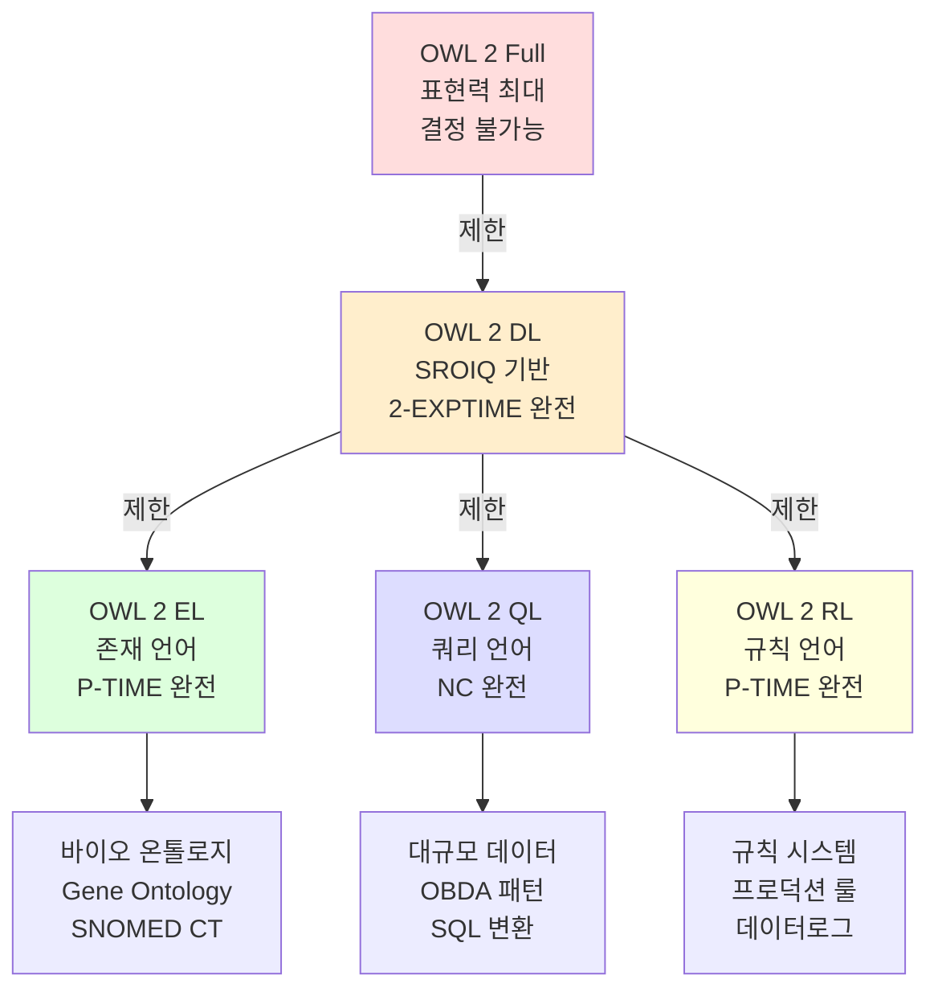
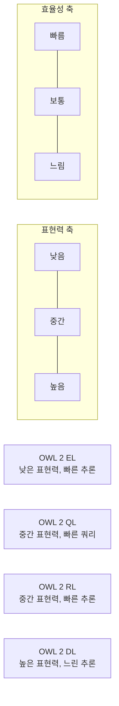

# 5회차: OWL 2 프로파일 — 목적에 맞는 언어 선택

## 학습 목표

이번 세션을 마치면 다음을 할 수 있습니다:

- OWL 2의 세 가지 프로파일(EL, QL, RL)이 각각 해결하려는 문제를 설명할 수 있습니다
- 각 프로파일의 언어적 제한과 그 제한이 가져오는 추론 효율성을 이해합니다
- 실제 사용 사례에서 어떤 프로파일이 적합한지 결정할 수 있습니다
- OWL 2 DL 전체와 각 프로파일의 트레이드오프를 설명할 수 있습니다

---

## 이번 세션 전체 그림



> **왜 OWL 2를 여러 프로파일로 나눴는가?**
>
> OWL 2 DL 전체(SROIQ)는 매우 강력하지만, 실제로 모든 기능이 항상 필요하지는 않습니다. 바이오 온톨로지는 수백만 개의 클래스를 다항식 시간에 분류하길 원하고, 데이터베이스 통합 시스템은 SQL로 변환 가능한 쿼리가 필요하며, 규칙 기반 시스템은 프로덕션 룰 엔진과 호환되기를 원합니다. OWL 2 위원회는 이 세 가지 실용적 요구를 충족하는 세 개의 프로파일을 설계했습니다.

---

## 핵심 개념

### OWL 2 DL 전체 — 기준점

먼저 OWL 2 DL이 제공하는 전체 표현력을 이해해야 프로파일의 제한을 이해할 수 있습니다.

OWL 2 DL(SROIQ)이 지원하는 주요 기능:
- 역 프로퍼티 (`owl:inverseOf`)
- 추이적 프로퍼티 (`owl:TransitiveProperty`)
- 수 제한 (`owl:maxCardinality`, `owl:qualifiedCardinality`)
- Nominals (`owl:oneOf`)
- 역할 체인 (`owl:propertyChainAxiom`)
- Self 제한 (`owl:hasSelf`)

**비용:** 2-EXPTIME 복잡도

---

### OWL 2 EL — 존재 언어(Existential Language)

**설계 목표:** 대규모 TBox(클래스 계층)의 효율적 분류

**이름의 의미:** EL = 존재 제한(Existential restriction)을 중심으로 설계된 언어

**핵심 제한:**

OWL 2 EL에서 **허용되는** 것:
- 클래스 교집합 (`owl:intersectionOf`)
- 존재 제한 (`owl:someValuesFrom`)
- 역할 체인 (`owl:propertyChainAxiom`)
- 데이터 프로퍼티

OWL 2 EL에서 **허용되지 않는** 것:
- 합집합 (`owl:unionOf`) — ABox에서만 허용
- 부정 (`owl:complementOf`)
- 전칭 제한 (`owl:allValuesFrom`)
- 역 프로퍼티 (`owl:inverseOf`)
- 수 제한 (`owl:cardinality`)
- Nominals (`owl:oneOf`) — TBox에서 제한됨

**왜 이런 제한인가?**

이 제한들은 **다항식 시간(polynomial time)** 추론을 가능하게 합니다. 특히 전칭 제한과 합집합의 조합은 비결정적 선택을 폭발적으로 증가시킵니다. EL은 이를 제거하여 추론 복잡도를 극적으로 낮춥니다.

**실제 사용 사례:**

| 온톨로지 | 클래스 수 | 공리 수 | ELK 분류 시간 |
|---------|---------|---------|------------|
| Gene Ontology | ~45,000 | ~100,000 | 수 초 |
| SNOMED CT | ~350,000 | ~1,000,000 | 수 분 |
| NCI Thesaurus | ~150,000 | ~400,000 | 수 분 |

> **왜 SNOMED CT가 OWL 2 EL을 선택했는가?**
>
> SNOMED CT는 2012년 OWL 2 DL에서 OWL 2 EL로 마이그레이션했습니다. 이유는 단순합니다: OWL 2 DL 전체 표현력은 SNOMED CT의 실제 지식 구조에 필요하지 않은 기능(전칭 제한, 수 제한 등)을 포함했고, 이 기능들로 인해 추론기가 실용적인 시간 내에 분류를 완료하지 못했습니다. EL 프로파일로 제한하자 HermiT로 수 시간이 걸리던 분류가 ELK로 수 분 안에 완료되었습니다.

**OWL 2 EL 예시 표현:**

가능한 표현:
```
Disease ⊑ ∃hasSite.BodyStructure      (질병은 신체 부위에 위치한다)
Pneumonia ⊑ Disease ⊓ ∃hasSite.Lung  (폐렴 = 폐에 위치한 질병)
```

불가능한 표현:
```
Person ⊑ ∀hasChild.Human              (전칭 제한 불가)
Adult ≡ Person ⊓ ¬Minor               (부정 불가)
hasParent exactly 2 Person             (수 제한 불가)
```

---

### OWL 2 QL — 쿼리 언어(Query Language)

**설계 목표:** 대규모 데이터베이스 위에서 효율적인 온톨로지 기반 쿼리

**이름의 의미:** QL = 쿼리 언어(Query Language), 특히 SQL과의 통합을 위해 설계

**핵심 아이디어: OBDA(Ontology-Based Data Access)**

```
사용자 SPARQL 쿼리
        ↓
   OWL 2 QL 온톨로지 (매핑 규칙 포함)
        ↓
   SQL 쿼리로 변환 (rewriting)
        ↓
   기존 관계형 데이터베이스
```

OWL 2 QL의 핵심: 사용자는 온톨로지의 개념어로 쿼리하고, 시스템은 이를 SQL로 변환하여 기존 데이터베이스에서 실행합니다.

**핵심 제한:**

OWL 2 QL에서 **허용되는** 것:
- 클래스 포함 (`rdfs:subClassOf`)
- 존재 제한 — 왼쪽(left-hand side)에만
- 역 프로퍼티 (`owl:inverseOf`)
- 프로퍼티 포함 (`rdfs:subPropertyOf`)
- 비대칭 프로퍼티, 비반사 프로퍼티

OWL 2 QL에서 **허용되지 않는** 것:
- 등치 클래스(`owl:equivalentClass`)의 완전한 정의
- 역할 체인 (`owl:propertyChainAxiom`)
- 수 제한
- Nominals

**왜 이런 제한인가?**

SQL 변환(FO rewriting — First-Order Query Rewriting)이 가능하려면 쿼리 재작성이 항상 유한하게 완료되어야 합니다. 역할 체인이나 수 제한이 있으면 SQL 변환이 불가능하거나 매우 복잡해집니다.

**OWL 2 QL 예시 사용 사례:**

정부 데이터 통합:
```
# 온톨로지 (개념 수준)
Person ⊑ ∃hasRegistration.Registration
Employee ⊑ Person

# 기존 DB 테이블 매핑
Employee → person_table (emp_id)
hasRegistration → registration_table (person_id, reg_id)

# 사용자 질의 (SPARQL)
SELECT ?emp WHERE { ?emp a :Employee ; :hasRegistration ?reg }

# 자동 SQL 변환
SELECT p.emp_id FROM person_table p
JOIN registration_table r ON p.emp_id = r.person_id
```

**주요 OBDA 도구:** Ontop (오픈소스, PostgreSQL/MySQL/Oracle 지원)

---

### OWL 2 RL — 규칙 언어(Rule Language)

**설계 목표:** 기존 규칙 기반 추론 시스템과의 통합

**이름의 의미:** RL = 규칙 언어(Rule Language), 데이터로그(Datalog)와 호환

**핵심 아이디어:**

OWL 2 RL 표현식은 <strong>데이터로그 규칙(Datalog rules)</strong>으로 변환될 수 있습니다:

```
OWL 2 RL 공리:
SubClassOf(Dog Animal)

데이터로그 규칙으로 변환:
Animal(x) :- Dog(x)

OWL 2 RL 공리:
ObjectSomeValuesFrom(hasParent Person) ⊑ PersonWithParent

데이터로그 규칙으로 변환:
PersonWithParent(x) :- hasParent(x, y), Person(y)
```

**핵심 제한:**

OWL 2 RL에서 **허용되는** 것:
- 클래스 포함 (정해진 형태)
- 교집합 (`owl:intersectionOf`)
- 존재 제한 (오른쪽에서만: `owl:someValuesFrom`)
- 역 프로퍼티
- 추이적 프로퍼티

OWL 2 RL에서 **허용되지 않는** 것 (TBox에서):
- 합집합 (`owl:unionOf`) — TBox 오른쪽에서 불가
- Nominals 복잡한 사용
- 부정 비원자 사용

**데이터 집약적 온톨로지에 적합:**

OWL 2 RL은 "많은 인스턴스, 단순한 스키마" 패턴에 최적입니다:
- 수백만 개의 개체 데이터
- 상대적으로 단순한 클래스 계층
- 빠른 단건 쿼리 응답이 필요

**주요 사용 도구:**
- Oracle Database (RDF/OWL 지원)
- Stardog (일부 RL 지원)
- Apache Jena (규칙 엔진과 통합)

---

## 세 프로파일 비교

| 특성 | OWL 2 EL | OWL 2 QL | OWL 2 RL |
|------|---------|---------|---------|
| **목표** | 대규모 TBox 분류 | 데이터베이스 통합 | 규칙 시스템 통합 |
| **추론 복잡도** | P-TIME | NC (쿼리 재작성) | P-TIME |
| **핵심 제한** | 전칭 제한 없음 | 역할 체인 없음 | 합집합 제한 |
| **데이터 규모** | 대규모 TBox | 대규모 ABox | 대규모 ABox |
| **주요 도구** | ELK, HermiT | Ontop | Jena, Oracle RDF |
| **대표 사례** | SNOMED CT, GO | 정부 데이터 통합 | 엔터프라이즈 규칙 |

---

## 표현력-효율성 트레이드오프 시각화



---

## 어떤 프로파일을 선택할까?

**선택 결정 체계:**

1. **클래스 수가 수만 개 이상이고, 분류가 핵심 작업인가?**
   → **OWL 2 EL** + ELK 추론기

2. **기존 관계형 데이터베이스 위에 온톨로지를 올려야 하는가?**
   → **OWL 2 QL** + Ontop

3. **기존 프로덕션 규칙 엔진(Drools, JESS 등)과 통합해야 하는가?**
   → **OWL 2 RL** + Jena Rules

4. **위의 경우가 해당하지 않고, OWL 2의 모든 기능이 필요한가?**
   → **OWL 2 DL** + HermiT

5. **프로젝트 초기이고 요구사항이 불명확한가?**
   → **OWL 2 DL**로 시작하고, 성능 문제 발생 시 프로파일 고려

---

## 표현력-효율성 트레이드오프의 연결 고리

지금까지 OWL 2의 세 가지 프로파일(EL, QL, RL)과 OWL 2 DL 전체를 살펴보았습니다. 이제 3단계 전체를 관통하는 핵심 주제인 **표현력과 효율성의 트레이드오프**를 종합적으로 정리해보겠습니다.

### 1회차 기술 논리와의 연결

1회차에서 배운 DL 언어 계열의 복잡도 계층이 실제로 OWL 2 프로파일 설계에 어떻게 반영되었는지 이제 명확해집니다:

```
DL 언어 복잡도:
ALC (기본) → SHIQ (중간) → SROIQ (OWL 2 DL)

OWL 2 프로파일로의 구현:
EL (ALC 제한) → QL (SHIQ 제한) → RL (SROIQ 제한)
```

**구체적 연결 예시:**

| DL 연산자 | OWL 2 DL | OWL 2 EL | OWL 2 QL | OWL 2 RL | 복잡도 영향 |
|----------|----------|----------|----------|----------|-------------|
| 부정 (¬A) | ✓ | ✗ | ✓ (제한적) | ✓ (제한적) | PSPACE → EXPTIME |
| 전칭 제한 (∀R.C) | ✓ | ✗ | ✗ | ✓ | EXPTIME → 2-EXPTIME |
| 역할 체인 | ✓ | ✓ | ✗ | ✗ | 2-EXPTIME 유지 |
| 수 제한 (≥nR) | ✓ | ✗ | ✗ | ✓ | PTIME → EXPTIME |

**핵심 통찰:** DL의 이론적 복잡도 분석이 OWL 2 프로파일의 실무적 설계 결정으로 직접 이어집니다. EL 프로파일이 전침 제한과 부정을 제거하는 이유는 정확히 PTIME 복잡도를 유지하기 위함입니다.

### 2회차 OWA/CWA와 프로파일 선택

OWA/CWA의 선택이 프로파일 선택과 어떻게 연결되는지 살펴보겠습니다:

**OWA 친화적 프로파일:**
- **OWL 2 EL:** OWA에 최적화 - 대규모 TBox 분류에서 OWA가 추론 성능에 미치는 영향 최소화
- **OWL 2 DL:** OWA의 모든 기능 지원 - 불확실성을 완전히 표현 가능

**CWA 친화적 프로파일:**
- **OWL 2 QL:** SQL 데이터베이스(CWA 환경)와 통합 설계 - OWA와 CWA의 하이브리드
- **OWL 2 RL:** 프로덕션 룰 시스템(CWA 기반)과 호환

**실무적 의미:**

```
의료 온톨로지 (OWA 필수):
- EL 프로파일 선택 → 대규모 분류 + OWA 불확실성 표현
- 예: SNOMED CT

정부 데이터 통합 (CWA 환경):
- QL 프로파일 선택 → SQL 변환 + 기존 DB 활용
- 예: OECD 통계 온톨로지
```

### 3회차 공리와 프로파일 제약

3회차에서 배운 공리(Axiom) 유형이 각 프로파일에서 어떻게 제약되는지 정리하면:

**공리 유형별 프로파일 지원:**

| 공리 유형 | OWL 2 EL | OWL 2 QL | OWL 2 RL | OWL 2 DL |
|----------|----------|----------|----------|----------|
| subClassOf | ✓ | ✓ | ✓ | ✓ |
| equivalentClass | ✓ | 제한적 | 제한적 | ✓ |
| disjointWith | ABox만 | ✓ | ✓ | ✓ |
| ∀R.C (전침 제한) | ✗ | ✗ | ✓ | ✓ |
| ∃R.C (존재 제한) | ✓ | 제한적 | ✓ | ✓ |
| 역할 체인 | ✓ | ✗ | ✗ | ✓ |
| 수 제한 | ✗ | ✗ | 제한적 | ✓ |

**설계 시나리오 연결:**

온톨로지를 설계할 때 "어떤 공리가 필수인가?"를 결정하는 것이 프로파일 선택의 핵심입니다:

```
시나리오 1: "우리 온톨로지는 전침 제한이 필수야!"
→ EL 제외 (전침 제한 불가)
→ QL 제외 (전침 제한 불가)
→ RL 또는 DL 선택 가능

시나리오 2: "대규모 TBox를 빠르게 분류해야 해!"
→ EL 최적 (PTIME 분류)
→ DL 부적합 (2-EXPTIME)

시나리오 3: "기존 SQL DB와 통합해야 해!"
→ QL 최적 (SQL rewriting)
→ EL/RL/DL 비효율 (DB 연동 어려움)
```

### 4회차 추론 유형과 프로파일 성능

4회차에서 다룰 추론 유형(분류, 실현, 일관성 검사)이 프로파일별로 어떻게 다르게 수행되는지 미리 살펴보겠습니다:

**추론 유형별 프로파일 성능:**

| 추론 유형 | OWL 2 EL | OWL 2 QL | OWL 2 RL | OWL 2 DL |
|----------|----------|----------|----------|----------|
| TBox 분류 | PTIME (초) | PTIME (초) | PTIME (초) | 2-EXPTIME (분~시) |
| ABox 실현 | PTIME | NC (SQL) | PTIME | EXPTIME |
| 일관성 검사 | PTIME | NC | PTIME | 2-EXPTIME |
| 쿼리 응답 | 느림 | 빠름 (SQL) | 빠름 | 느림 |

**실제 성능 수치 (대략적):**

```
SNOMED CT (35만 클래스):
- EL 추론기: ~5분 (ELK)
- DL 추론기: ~수시간 (HermiT)

정부 DB 통합 (백만 개 row):
- QL + SQL: ~초 (Ontop)
- DL 추론: ~분~시 (일관성 검사 포함)
```

### 종합: 프로파일 선택 의사결정 트리

이제 3단계 전체의 지식을 종합하여 프로파일 선택 의사결정 트리를 완성해보겠습니다:

```
시작: 온톨로지 요구사항 분석
   ↓
질문 1: 클래스 수가 10만 개 이상인가?
   YES → EL 프로파일 고려
   NO  → 다음 질문

질문 2: 기존 RDBMS와 통합해야 하는가?
   YES → QL 프로파일 고려
   NO  → 다음 질문

질문 3: 규칙 엔진과 통합해야 하는가?
   YES → RL 프로파일 고려
   NO  → 다음 질의

질문 4: OWL 2 전체 기능이 필요한가?
   YES → DL 프로파일 선택
   NO  → 요구사항 재분석
```

### 실전 적용: 도메인별 프로파일 선택 가이드

**바이오/의료 도메인:**
- 온톨로지 특성: 대규모 TBox, 복잡한 계층
- 추론 요구사항: 빠른 분류
- 추천 프로파일: **OWL 2 EL**
- 실제 사례: SNOMED CT, Gene Ontology, NCI Thesaurus

**엔터프라이즈 데이터 통합:**
- 온톨로지 특성: 기존 SQL DB 위의 통합 레이어
- 추론 요구사항: 효율적인 쿼리
- 추천 프로파일: **OWL 2 QL**
- 실제 사례: 정부 데이터 포털, OBDA 시스템

**규칙 기반 시스템:**
- 온톨로지 특성: 프로덕션 룰 엔진 연동
- 추론 요구사항: 빠른 인스턴스 추론
- 추천 프로파일: **OWL 2 RL**
- 실제 사례: Oracle RDF, Jena Rules

**연구/범용 온톨로지:**
- 온톨로지 특성: 모든 DL 기능 필요
- 추론 요구사항: 최대 표현력
- 추천 프로파일: **OWL 2 DL**
- 실제 사례: 연구 프로토타입, 소규모 온톨로지

---

## 흔한 오해

### 오해 1: "프로파일을 사용하면 표현력을 포기해야 한다"

**잘못된 생각:** 프로파일은 타협이므로 덜 좋다.

**올바른 이해:** 도메인 지식이 실제로 EL 범위 안에 있다면, EL 프로파일을 사용해도 표현력 손실이 없습니다. SNOMED CT의 모든 의학 지식은 EL로 충분히 표현됩니다. "필요하지 않은 기능을 포기"하는 것은 손실이 아니라 최적화입니다.

### 오해 2: "OWL 2 QL은 온톨로지를 SPARQL로만 쿼리할 수 있다"

**잘못된 생각:** QL은 쿼리 언어이므로 SPARQL만 가능하다.

**올바른 이해:** OWL 2 QL의 핵심은 SPARQL 쿼리를 SQL로 **변환**하는 것입니다. 최종 쿼리는 기존 관계형 데이터베이스에 SQL로 실행됩니다. Ontop 같은 도구를 사용하면 기존 MySQL, PostgreSQL 등을 그대로 유지하면서 온톨로지 기반 쿼리가 가능합니다.

### 오해 3: "세 프로파일은 서로 완전히 분리되어 있다"

**잘못된 생각:** EL, QL, RL은 겹치는 부분이 없다.

**올바른 이해:** 세 프로파일의 교집합(EL ∩ QL ∩ RL)이 존재합니다. 예를 들어 단순한 클래스 포함 공리(`SubClassOf`)는 모든 프로파일에서 허용됩니다. 온톨로지를 설계할 때 세 프로파일 모두에서 허용되는 표현만 사용하면, 세 가지 추론기 모두 적용 가능한 온톨로지가 됩니다.

---

## 요약

- **OWL 2 EL:** 전칭 제한, 합집합, 수 제한 없음 → 다항식 시간 분류 → 대규모 바이오 온톨로지(SNOMED CT, GO)
- **OWL 2 QL:** 단순한 TBox → SQL/SPARQL 변환 → 기존 데이터베이스 통합(OBDA)
- **OWL 2 RL:** 데이터로그 규칙으로 변환 가능 → 규칙 기반 시스템 통합
- 프로파일 선택은 "무엇을 표현해야 하는가"보다 **"어떤 추론 서비스가 필요한가"**를 기준으로 결정
- 특별한 요구사항이 없으면 OWL 2 DL로 시작, 성능 요구사항에 따라 프로파일 고려

---

> **연결 포인트: OWL 2 프로파일 → 실습**
>
> 3단계의 이론적 내용을 마쳤습니다. 6회차 실습에서는 지금까지 배운 개념들을 직접 적용해봅니다: DL 표현식 작성, OWA 추론 예시, 4가지 추론 유형 각각 적용, SNOMED CT의 EL 선택 이유 분석 등을 통해 이론을 실제 경험으로 전환합니다.

> **연결 포인트: 3단계 → 4단계**
>
> 논리적 기초(3단계)를 완성했다면, 4단계에서는 이 지식을 실제 기술 스택으로 연결합니다. RDF, SPARQL, OWL의 구체적인 구문과 도구들이 지금 배운 추론 메커니즘 위에서 어떻게 동작하는지 이해하게 됩니다.
