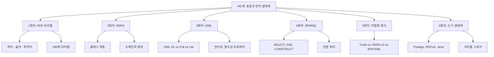

# 4단계: 표준과 언어 생태계 소개

## 이 단계에서 배우는 것

온톨로지를 *이해하는* 것과 온톨로지를 *인터넷에서 사용하는* 것은 다릅니다. 4단계는 후자를 위한 기반을 다집니다. W3C(World Wide Web Consortium)가 표준화한 기술 스택(RDF, RDFS, OWL, SPARQL)과 실제 데이터를 교환하는 직렬화 형식(Turtle, JSON-LD 등), 그리고 개발자가 매일 사용하는 도구들을 학습합니다.

> **왜 표준이 필요한가?**
>
> 서울대학교의 교수 데이터베이스와 MIT의 연구자 데이터베이스가 서로 다른 형식으로 데이터를 저장하고 있다면, 두 시스템 간의 통합은 매번 수동 변환을 필요로 합니다. W3C의 시맨틱 웹 표준은 이 문제를 해결합니다. <strong>공통 언어(RDF)와 공통 쿼리 방법(SPARQL)</strong>이 있으면, 전 세계 어디서든 동일한 방식으로 지식을 표현하고 조회할 수 있습니다.

## 학습 목표

이 단계를 마치면 다음을 할 수 있습니다:

- **RDF(Resource Description Framework)** 트리플의 구조를 이해하고 Turtle 형식으로 직접 작성합니다
- <strong>RDFS(RDF Schema)</strong>가 RDF를 어떻게 확장하여 클래스 계층을 표현하는지 설명합니다
- <strong>OWL(Web Ontology Language)</strong>의 다양한 표현력 수준과 주요 구성 요소를 사용합니다
- **SPARQL** 쿼리를 작성하여 트리플 스토어에서 데이터를 조회합니다
- 주요 직렬화 형식(Turtle, JSON-LD, RDF/XML)의 장단점을 비교하고 적절히 선택합니다
- Protégé, RDFLib, Apache Jena 등 실무 도구를 이해하고 상황에 맞게 선택합니다

## 단계 구성

## 왜 이 순서인가?

> **왜 RDF부터 시작하는가?**
>
> RDFS, OWL, SPARQL은 모두 RDF 위에 쌓아 올린 기술입니다. RDF 트리플의 구조를 먼저 이해하지 않으면, RDFS의 클래스 선언이나 SPARQL의 패턴 매칭이 왜 그런 형태인지 납득하기 어렵습니다. RDF는 이 모든 기술의 공통 데이터 모델입니다.

## 3단계와의 연결

3단계에서 배운 기술 논리(Description Logic)와 OWL 2의 논리적 기반은 이 단계에서 구체적인 구문(syntax)과 연결됩니다.

- 3단계의 `Cat ⊑ Animal` (DL 표현) → 4단계의 Turtle: `ex:Cat rdfs:subClassOf ex:Animal .`
- 3단계의 추론기가 도출하는 결론 → SPARQL SELECT 쿼리로 조회
- OWL 2의 표현력 제한 → 직렬화 형식 선택에 영향

> **연결 포인트: 3단계 → 4단계**
>
> 3단계에서 OWL 2의 논리적 의미를 배웠다면, 4단계에서는 그 의미를 실제 텍스트 파일로 어떻게 표현하는지 배웁니다. 논리학자의 관점에서 엔지니어의 관점으로 전환하는 단계입니다.

## 이 단계의 핵심 질문

이 단계를 공부하면서 다음 질문들을 염두에 두세요:

1. "RDF 트리플과 관계형 데이터베이스의 행(row)은 무엇이 다른가?"
2. "RDFS만으로 충분하지 않을 때 OWL이 무엇을 추가해주는가?"
3. "SPARQL 엔드포인트가 전 세계에 공개되어 있다면, 어떤 지식 네트워크가 가능해지는가?"

이 질문들에 답할 수 있다면, 4단계를 완전히 이해한 것입니다.

---

> **연결 포인트: 4단계 → 5단계**
>
> 4단계에서 표준 기술을 배웠다면, 5단계(온톨로지 설계 방법론)에서는 이 도구들을 사용하여 실제 도메인 온톨로지를 어떻게 체계적으로 설계하는지 배웁니다. 도구를 아는 것과 좋은 온톨로지를 설계하는 것은 다른 역량입니다.
