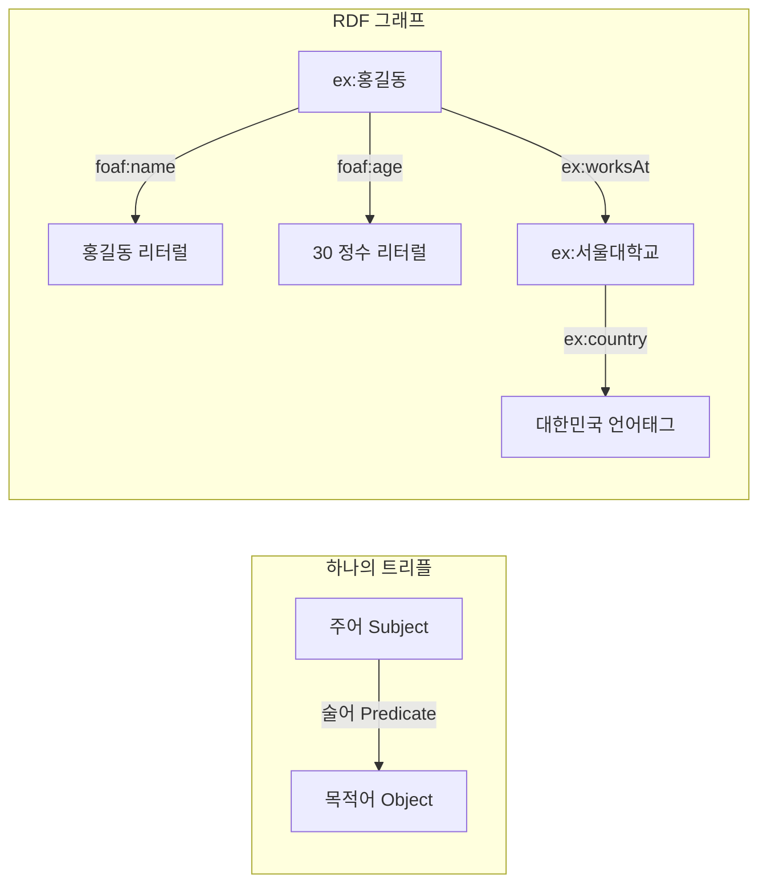

# 1회차: RDF 트리플

## 학습 목표

- RDF(Resource Description Framework)가 무엇이고 왜 만들어졌는지 설명합니다
- 트리플(Triple)의 세 요소인 주어, 술어, 목적어의 역할을 구분합니다
- URI(Uniform Resource Identifier)와 IRI(Internationalized Resource Identifier)의 차이를 이해합니다
- 리터럴(Literal)의 세 종류인 문자열, 타입 리터럴, 언어 태그 리터럴을 사용합니다
- 빈 노드(Blank Node)가 필요한 상황을 파악하고 올바르게 표현합니다
- Turtle 형식으로 간단한 RDF 그래프를 직접 작성합니다

## 이번 세션 전체 그림



## RDF란 무엇인가?

RDF(Resource Description Framework)는 W3C가 1999년에 발표하고 2004년에 표준화한 데이터 모델입니다. 웹에서 자원(Resource)을 **기계가 이해할 수 있는 방식으로 기술**하기 위해 설계되었습니다.

> **왜 새로운 데이터 모델이 필요했는가?**
>
> HTML은 사람이 읽기 위한 문서 형식입니다. "홍길동은 서울대학교에 근무한다"는 문장을 HTML로 쓸 수 있지만, 컴퓨터는 이 문장의 의미를 파악하지 못합니다. 관계형 데이터베이스는 구조화된 데이터를 저장하지만, 데이터베이스마다 스키마가 다르기 때문에 서로 다른 시스템 간의 데이터 교환이 어렵습니다. RDF는 이 두 문제를 해결하는 **전 지구적으로 통일된 의미론적 데이터 모델**입니다.

RDF의 핵심 아이디어는 단순합니다: **모든 지식을 세 개의 요소로 이루어진 문장으로 표현합니다.** 이것을 <strong>트리플(Triple)</strong>이라고 합니다.

## 트리플의 구조: 주어 - 술어 - 목적어

트리플은 자연어 문장과 유사한 구조를 가집니다:

| 자연어 | RDF |
|--------|-----|
| **홍길동**은 | 주어(Subject) |
| **이름이** | 술어(Predicate) |
| **"홍길동"이다** | 목적어(Object) |

트리플의 각 요소는 다음 규칙을 따릅니다:

- **주어**: URI 또는 빈 노드
- **술어**: 반드시 URI (리터럴 불가)
- **목적어**: URI, 빈 노드, 또는 리터럴

여러 트리플이 모이면 <strong>RDF 그래프(Graph)</strong>가 됩니다. 노드는 자원이고, 방향이 있는 엣지는 술어입니다.

## URI와 IRI

<strong>URI(Uniform Resource Identifier)</strong>는 웹의 모든 자원을 전역적으로 유일하게 식별하는 문자열입니다. RDF에서 URI는 두 가지 역할을 합니다:

1. **자원 식별**: `http://example.org/홍길동` - 홍길동이라는 사람을 가리킴
2. **프로퍼티 이름**: `http://xmlns.com/foaf/0.1/name` - "이름"이라는 관계를 가리킴

URI는 HTTP URL일 필요가 없습니다. 존재하지 않는 URL이어도 됩니다. 중요한 것은 전 세계적으로 유일해야 한다는 점입니다.

<strong>IRI(Internationalized Resource Identifier)</strong>는 URI의 확장판으로, ASCII 문자 외에 한국어, 일본어 등 다국어 문자를 포함할 수 있습니다. 현대 RDF 처리기는 대부분 IRI를 지원합니다.

> **왜 URI를 자원 식별에 사용하는가?**
>
> 이름만으로는 충분하지 않습니다. 세상에는 "홍길동"이라는 이름을 가진 사람이 많습니다. "사과"라는 단어는 과일을 뜻하기도 하고 Apple Inc.를 뜻하기도 합니다. URI는 **맥락 없이도 명확하게 무엇을 가리키는지** 결정합니다. `http://example.org/people/hong-gildong-19940315`와 같이 도메인 소유자가 전역적으로 유일한 식별자를 부여할 수 있습니다.

Turtle 형식에서는 긴 URI를 <strong>네임스페이스 프리픽스(prefix)</strong>로 줄여 씁니다:

```turtle
@prefix ex: <http://example.org/> .
@prefix foaf: <http://xmlns.com/foaf/0.1/> .

# ex:홍길동 은 <http://example.org/홍길동> 의 약식 표현
ex:홍길동 foaf:name "홍길동" .
```

## 리터럴: 실제 값을 표현하기

리터럴(Literal)은 RDF 그래프에서 실제 데이터 값을 표현합니다. 리터럴은 세 가지 종류가 있습니다:

### 1. 단순 문자열 리터럴

큰따옴표로 감싸는 가장 기본적인 형태입니다:

```turtle
ex:홍길동 foaf:name "홍길동" .
```

### 2. 타입 리터럴 (Typed Literal)

`^^` 뒤에 데이터 타입 URI를 붙입니다:

```turtle
@prefix xsd: <http://www.w3.org/2001/XMLSchema#> .

ex:홍길동 foaf:age 30 .
ex:홍길동 ex:height 175.5 .
ex:홍길동 ex:birthDate "1994-03-15"^^xsd:date .
ex:홍길동 ex:isStudent false .
```

자주 쓰이는 XSD(XML Schema Datatypes) 타입:
- `xsd:integer` - 정수
- `xsd:decimal`, `xsd:float` - 실수
- `xsd:string` - 문자열
- `xsd:boolean` - 참/거짓
- `xsd:date`, `xsd:dateTime` - 날짜/시간

### 3. 언어 태그 리터럴 (Language-tagged Literal)

`@` 뒤에 BCP 47 언어 코드를 붙입니다:

```turtle
ex:홍길동 rdfs:label "홍길동"@ko .
ex:홍길동 rdfs:label "Hong Gildong"@en .
ex:서울대학교 rdfs:label "서울대학교"@ko .
ex:서울대학교 rdfs:label "Seoul National University"@en .
```

## 빈 노드: 이름 없는 자원

<strong>빈 노드(Blank Node)</strong>는 URI 없이 존재하는 익명의 자원입니다. 특정 개체를 나타내지만, 전역 식별자를 부여할 필요가 없거나 부여할 수 없을 때 사용합니다.

> **빈 노드는 언제 필요한가?**
>
> "홍길동은 주소를 가지고 있는데, 그 주소의 도시는 서울이고 우편번호는 08826이다"라고 표현하고 싶습니다. 이 경우 "주소"라는 복합 정보를 하나의 빈 노드로 묶을 수 있습니다. 주소 자체에 전 세계적으로 유일한 URI를 부여하기 어려울 때 빈 노드가 유용합니다.

```turtle
ex:홍길동 ex:hasAddress _:addr1 .
_:addr1 ex:city "서울" .
_:addr1 ex:postalCode "08826" .
_:addr1 ex:street "관악로 1" .
```

Turtle의 `[]` 문법은 빈 노드를 인라인으로 표현합니다:

```turtle
ex:홍길동 ex:hasAddress [
    ex:city "서울" ;
    ex:postalCode "08826" ;
    ex:street "관악로 1"
] .
```

## Turtle 형식으로 작성하기

Turtle(Terse RDF Triple Language)은 RDF 그래프를 사람이 읽기 좋게 표현하는 형식입니다. 기본 문법:

```turtle
@prefix ex: <http://example.org/> .
@prefix foaf: <http://xmlns.com/foaf/0.1/> .
@prefix rdfs: <http://www.w3.org/2000/01/rdf-schema#> .

# 세미콜론(;)으로 같은 주어에 대한 여러 트리플을 묶음
ex:홍길동 a foaf:Person ;
    foaf:name "홍길동" ;
    foaf:name "Hong Gildong"@en ;
    foaf:age 30 ;
    ex:worksAt ex:서울대학교 .

# 쉼표(,)로 같은 주어-술어 쌍에 대한 여러 목적어를 묶음
ex:홍길동 ex:speaks "한국어"@ko , "영어"@en .

ex:서울대학교 a ex:University ;
    rdfs:label "서울대학교"@ko ;
    rdfs:label "Seoul National University"@en ;
    ex:location "서울특별시 관악구"@ko .
```

`a`는 `rdf:type`의 약자입니다. `ex:홍길동 a foaf:Person`은 `ex:홍길동 rdf:type foaf:Person`과 동일합니다.

## 흔한 오해

**오해 1: "RDF URI는 실제로 접속 가능해야 한다"**

아닙니다. URI는 식별자이지 주소가 아닙니다. `http://example.org/홍길동`에 실제로 HTTP 요청을 보낼 수 없어도, RDF 트리플에서 이 URI는 완전히 유효합니다. 다만, Linked Data 원칙에 따르면 URI에 실제 데이터를 제공하면 더 좋습니다.

**오해 2: "리터럴이 주어가 될 수 있다"**

아닙니다. RDF 표준에서 주어는 반드시 URI 또는 빈 노드여야 합니다. `"홍길동" foaf:knows ex:이순신`은 유효하지 않습니다.

**오해 3: "빈 노드는 특수한 경우에만 사용한다"**

아닙니다. 빈 노드는 목록(rdf:List), 복합 제약, 익명 개체 등 다양한 상황에서 일상적으로 사용됩니다. OWL 표현식(예: `owl:intersectionOf`)은 거의 항상 빈 노드를 사용합니다.

## 실습

### 기본 실습

다음 정보를 Turtle 형식으로 표현해보세요:

1. "홍길동"은 사람이다
2. 홍길동의 이름은 한국어로 "홍길동", 영어로 "Hong Gildong"이다
3. 홍길동은 1994년 3월 15일에 태어났다
4. 홍길동은 "컴퓨터과학과"에 소속되어 있다
5. 컴퓨터과학과는 서울대학교에 속한다

```turtle
# 여기에 작성해보세요
@prefix ex: <http://example.org/> .
@prefix foaf: <http://xmlns.com/foaf/0.1/> .
@prefix xsd: <http://www.w3.org/2001/XMLSchema#> .
@prefix rdfs: <http://www.w3.org/2000/01/rdf-schema#> .
```

### 도전 실습

다음 상황을 Turtle로 표현하되, 빈 노드를 활용해보세요:

"홍길동은 두 개의 연락처를 가지고 있다. 첫 번째는 회사 이메일(hg@snu.ac.kr)이고 두 번째는 개인 전화(010-1234-5678)이다."

## 요약

| 개념 | 설명 | 예시 |
|------|------|------|
| 트리플 | 주어-술어-목적어 구조 | `ex:홍길동 foaf:name "홍길동"` |
| URI | 전역 고유 식별자 | `http://example.org/홍길동` |
| 리터럴 | 실제 데이터 값 | `"홍길동"`, `30`, `"1994-03-15"^^xsd:date` |
| 언어 태그 | 다국어 리터럴 | `"홍길동"@ko`, `"Hong"@en` |
| 빈 노드 | 익명 자원 | `_:addr1`, `[]` |
| Turtle | 사람이 읽기 좋은 RDF 직렬화 | `;`로 같은 주어 묶기 |

다음 회차에서는 RDFS(RDF Schema)를 통해 이 트리플들을 클래스와 프로퍼티로 구조화하는 방법을 배웁니다.

> **연결 포인트: RDF → RDFS**
>
> RDF 트리플은 개별 사실을 표현하지만, "개는 동물의 일종이다"처럼 클래스 간의 관계나 프로퍼티의 의미를 표현할 수 없습니다. 다음 회차의 RDFS는 이 RDF 그래프에 구조(schema)를 추가하여 클래스 계층과 프로퍼티 제약을 정의합니다. RDF가 데이터라면 RDFS는 그 데이터의 메타데이터입니다.

> **연결 포인트: Turtle 형식 → 직렬화 형식 비교**
>
> 이번 회차에서 Turtle 형식을 집중적으로 사용했습니다. 동일한 RDF 그래프를 JSON-LD나 RDF/XML로도 표현할 수 있습니다. 5회차에서는 이 형식들의 차이와 선택 기준을 비교합니다.

## 3계층 비교: RDF - RDFS - OWL

> "RDF는 데이터를 표현하고, RDFS는 그 데이터의 구조를 설명하며, OWL은 복잡한 제약과 추론 규칙을 정의한다. 이 세 계층은 같은 트리플을 점점 더 풍부하게 해석한다."

온톨로지 기술 스택을 이해하려면 **RDF, RDFS, OWL의 3계층**을 비교하는 것이 필수적입니다. 이 세 기술은 **동일한 트리플**을 서로 다른 수준의 해석 능력으로 다룹니다.

### 같은 데이터, 세 가지 해석

다음은 **동일한 트리플 세트**가 RDF, RDFS, OWL에서 어떻게 다르게 해석되는지 보여줍니다.

```turtle
@prefix ex: <http://example.org/> .
@prefix rdfs: <http://www.w3.org/2000/01/rdf-schema#> .
@prefix owl: <http://www.w3.org/2002/07/owl#> .
@prefix xsd: <http://www.w3.org/2001/XMLSchema#> .

# 클래스 선언
ex:Person a rdfs:Class .
ex:Student a rdfs:Class .
ex:Professor a rdfs:Class .

# 클래스 계층
ex:Student rdfs:subClassOf ex:Person .
ex:Professor rdfs:subClassOf ex:Person .

# 프로퍼티 선언
ex:teaches a rdfs:Property ;
    rdfs:domain ex:Professor ;
    rdfs:range ex:Student .

ex:advisor a rdf:Property ;
    rdfs:domain ex:Student ;
    rdfs:range ex:Professor .

# 개체 선언
ex:john a ex:Student ;
    ex:advisor ex:mary .

ex:mary a ex:Professor .
```

### 계층 1: RDF (데이터만 표현)

**RDF만으로 이 데이터를 해석하면:**

- RDF는 트리플을 **있는 그대로** 기록합니다.
- "ex:john은 ex:Student 타입이다"라는 사실을 저장합니다.
- "ex:john의 ex:advisor는 ex:mary이다"라는 관계를 기록합니다.
- **해석 없음**: `rdfs:subClassOf`나 `rdfs:domain` 같은 키워드도 그저 일반 URI로 취급할 뿐, 특별한 의미를 부여하지 않습니다.

**한계:**
- RDF 단독으로는 "ex:Student가 ex:Person의 하위 클래스라는 것"을 이해하지 못합니다
- "ex:john이 ex:Student이므로 ex:Person이기도 하다"는 결론을 내릴 수 없습니다
- `rdfs:domain ex:Professor`라는 선언이 무엇을 의미하는지 모릅니다

### 계층 2: RDFS (구조와 기본 추론)

**RDFS를 추가하면:**

- `rdfs:subClassOf`는 **클래스 계층**을 정의합니다
- `rdfs:domain`과 `rdfs:range`는 **프로퍼티 제약**을 설정합니다
- **기본 추론**이 가능해집니다

**RDFS 추론기가 자동으로 도출할 수 있는 결론:**

```turtle
# 원래 데이터에 없지만, RDFS 규칙으로 도출 가능한 새로운 트리플
ex:john a ex:Person .
ex:mary a ex:Person .
```

**도출 과정:**
1. `ex:john`은 `ex:Student` 타입입니다
2. `ex:Student`는 `ex:Person`의 하위 클래스입니다 (`rdfs:subClassOf`)
3. 따라서 `ex:john`도 `ex:Person` 타입입니다

**RDFS가 제공하는 능력:**
- **계층 추론**: 하위 클래스의 개체는 상위 클래스의 개체이기도 합니다
- **도메인/레인지 검증**: `ex:teaches` 프로퍼티의 주어는 `ex:Professor`여야 하고, 목적어는 `ex:Student`여야 합니다
- **프로퍼티 상속**: 하위 클래스는 상위 클래스의 프로퍼티를 모두 상속합니다

**한계:**
- "모든 교수는 최소 한 명 이상의 학생을 지도한다" 같은 **복잡한 제약**을 표현할 수 없습니다
- "어떤 학생의 지도교수가 여교수이면, 그 학생은 여성 전용 장학금을 신청할 수 있다" 같은 **조건부 추론**이 불가능합니다
- "한 사람은 교수와 학생을 동시에 될 수 없다" 같은 **불일치 감지**를 할 수 없습니다

### 계층 3: OWL (풍부한 추론과 제약)

**OWL을 추가하면:**

- OWL은 RDFS를 **완전히 포함**하면서 훨씬 더 강력한 표현력을 제공합니다
- **제약 조건**, **불일치 감지**, **복잡한 추론**이 가능해집니다

동일한 데이터에 OWL 제약을 추가해보겠습니다:

```turtle
@prefix owl: <http://www.w3.org/2002/07/owl#> .

# OWL 제약 추가
ex:teaches a owl:ObjectProperty ;
    rdfs:domain ex:Professor ;
    rdfs:range ex:Student .

# "모든 교수는 최소 한 명 이상의 학생을 지도한다"
ex:Professor rdfs:subClassOf [
    a owl:Restriction ;
    owl:onProperty ex:teaches ;
    owl:someValuesFrom ex:Student
] .

# "한 사람은 교수와 학생을 동시에 될 수 없다"
ex:Professor owl:disjointWith ex:Student .

# "어떤 학생의 지도교수는 반드시 존재한다"
ex:Student rdfs:subClassOf [
    a owl:Restriction ;
    owl:onProperty ex:advisor ;
    owl:cardinality 1
] .
```

**OWL 추론기가 할 수 있는 것:**

1. **제약 위반 감지 (Inconsistency Detection):**
   ```turtle
   # 만약 다음 데이터가 추가되면:
   ex:bob a ex:Student , ex:Professor .
   ```
   OWL 추론기는 **불일치(Inconsistency)**를 감지합니다: "ex:bob은 Student와 Professor를 동시에 가질 수 없습니다."

2. **암시적 분류 (Automatic Classification):**
   ```turtle
   # 새로운 클래스와 개체
   ex:FullProfessor a rdfs:Class .
   ex:alice a ex:FullProfessor ;
       ex:teaches ex:john .
   ```
   OWL 추론기는 `ex:FullProfessor`가 `ex:Professor`의 하위 클래스임을 추론하고, 따라서 `ex:alice`도 `ex:Person`임을 자동으로 분류합니다.

3. **존재성 추론 (Existential Reasoning):**
   ```turtle
   ex:newStudent a ex:Student .
   ```
   OWL 제약에 따라 "모든 Student는 advisor가 반드시 한 명 있다"는 것을 알고, 아직 advisor를 지정하지 않았더라도 **"어떤 Professor가 존재해서 ex:newStudent의 advisor이다"**라는 사실을 추론합니다.

### 세 계층의 비교 표

| 특성 | RDF (단독) | RDFS | OWL |
|------|-----------|------|-----|
| **데이터 표현** | 트리플 저장 | 트리플 + 클래스/프로퍼티 선언 | 트리플 + 강력한 제약 |
| **추론 능력** | 없음 | 기본 계층 추론 | 복잡한 논리적 추론 |
| **표현력** | 개별 사실 | 클래스 계층, 프로퍼티 제약 | 제약 조건, 불일치 규칙 |
| **rdfs:subClassOf 이해** | ❌ (그냥 URI) | ✅ (계층 정의) | ✅ (확장된 계층) |
| **owl:someValuesFrom** | ❌ | ❌ | ✅ (존재성 제약) |
| **owl:disjointWith** | ❌ | ❌ | ✅ (불일치 감지) |
| **추론 속도** | 매우 빠름 | 빠름 | 느림 (계산 복잡도 높음) |
| **학습 곡선** | 쉬움 | 중간 | 어려움 |
| **적합한 사용 사례** | 단순 데이터 교환 | 분류 체계, 탐색 | 의료, 법률, 과학 지식 |

### 현실적 선택 가이드

> "항상 OWL을 쓰는 것이 정답이 아니다. 문제의 복잡도에 맞는 가장 단순한 계층을 선택해야 한다."

**RDF만 충분한 경우:**
- 단순한 데이터 교환 (예: 웹사이트 메타데이터)
- 스키마가 자주 바뀌는 유연한 환경
- 추론이 전혀 필요 없는 데이터 저장

**RDFS가 적합한 경우:**
- 기본적인 분류 체계 (예: 제품 카탈로그)
- 프로퍼티의 도메인/레인지 검증
- 단순한 계층 탐색 (하위 카테고리 조회)

**OWL이 필요한 경우:**
- 의료 지식 (SNOMED CT처럼 수백만 개의 개념과 복잡한 제약)
- 법률 규칙 (조건부 자격, 상호 배제적 지위)
- 과학 온톨로지 (유전자 기능, 화학 반응)
- 자동 일관성 검증이 중요한 안전 비판적 시스템

### 트리플 재사용: 같은 데이터, 다른 해석

중요한 통찰은 **동일한 트리플**이 세 계층에서 각각 다르게 해석될 수 있다는 점입니다:

```turtle
ex:Student rdfs:subClassOf ex:Person .
ex:john a ex:Student .
```

- **RDF만 보면:** 그냥 두 개의 문장일 뿐입니다
- **RDFS가 보면:** `ex:john`도 `ex:Person`이라는 **새로운 트리플**을 도출합니다
- **OWL이 보면:** 이 계층 관계를 더 복잡한 제약과 연결하여 추론합니다

이것이 온톨로지 기술 스택의 핵심입니다: **하위 호환성**입니다. OWL 시스템은 RDFS 데이터를 완벽하게 이해하고, RDFS 시스템은 순수 RDF 데이터를 처리할 수 있습니다. 반대 방향도 가능하지만, 풍부한 의미가 손실됩니다.

### 연결 포인트

> 이 3계층 비교는 Phase 4의 전체 주제인 "온톨로지 표현력의 스펙트럼"을 완성합니다. 다음 회차들에서는 RDFS의 상속과 프로퍼티 제약(2회차), OWL의 복잡한 제약 표현(3회차)을 심층적으로 다룹니다.

> 8회차(기술 비교)에서 이 계층 구조는 SKOS(가장 단순), RDFS(중간), OWL(가장 복잡)의 표현력 스펙트럼을 이해하는 기초가 됩니다.
