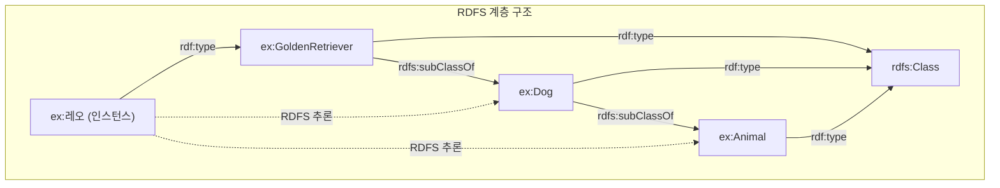

# 2회차: RDFS (RDF Schema)

## 학습 목표

- RDFS가 RDF를 어떻게 확장하는지 설명합니다
- `rdfs:Class`, `rdfs:subClassOf`, `rdfs:subPropertyOf`를 사용하여 계층을 정의합니다
- `rdfs:domain`과 `rdfs:range`로 프로퍼티의 도메인과 범위를 제약합니다
- `rdfs:label`과 `rdfs:comment`로 사람이 읽기 위한 메타데이터를 추가합니다
- RDFS 추론 규칙을 이해하고 추론이 어떤 새로운 트리플을 도출하는지 파악합니다
- RDFS의 표현력 한계를 인식하고 OWL이 왜 필요한지 설명합니다

## 이번 세션 전체 그림



## RDF만으로는 부족한 이유

1회차에서 배운 RDF로 개별 사실(트리플)을 표현할 수 있습니다. 그러나 RDF만으로는 다음을 표현할 수 없습니다:

- "개는 동물의 일종이다" (클래스 계층)
- "hasParent 프로퍼티의 목적어는 반드시 Person이어야 한다" (프로퍼티 제약)
- "worksAt은 employedBy의 하위 프로퍼티이다" (프로퍼티 계층)

> **왜 클래스 계층이 필요한가?**
>
> 생물학 데이터베이스를 구축한다고 가정합시다. "포유류는 척추동물이다"라는 사실을 표현하고 나면, "고래는 포유류이다"를 추가했을 때 컴퓨터가 자동으로 "고래는 척추동물이다"를 알 수 있어야 합니다. 이런 자동 추론이 가능하려면 클래스 계층을 표현할 방법이 필요합니다. RDFS가 이를 제공합니다.

RDFS(RDF Schema)는 RDF 어휘(vocabulary)를 위한 어휘입니다. RDFS 자체도 RDF 트리플로 표현되며, `rdfs:` 네임스페이스(`http://www.w3.org/2000/01/rdf-schema#`)를 사용합니다.

## rdfs:Class와 클래스 정의

`rdfs:Class`는 클래스를 나타내는 자원입니다. 어떤 자원이 클래스라고 선언하려면 `rdf:type rdfs:Class` 트리플을 사용합니다:

```turtle
@prefix rdfs: <http://www.w3.org/2000/01/rdf-schema#> .
@prefix ex: <http://example.org/> .

ex:Animal a rdfs:Class ;
    rdfs:label "동물"@ko ;
    rdfs:label "Animal"@en ;
    rdfs:comment "모든 살아 있는 유기체의 기반 클래스"@ko .

ex:Dog a rdfs:Class ;
    rdfs:label "개"@ko ;
    rdfs:comment "Canis lupus familiaris, 가축화된 늑대의 후손"@ko .

ex:Cat a rdfs:Class ;
    rdfs:label "고양이"@ko .
```

인스턴스(개체)는 `rdf:type`으로 클래스에 속한다고 선언합니다:

```turtle
ex:레오 a ex:Dog ;
    rdfs:label "레오"@ko .
```

## rdfs:subClassOf: 클래스 계층 구성

`rdfs:subClassOf`는 한 클래스가 다른 클래스의 하위 클래스임을 선언합니다. `A rdfs:subClassOf B`는 "A의 모든 인스턴스는 B의 인스턴스이기도 하다"를 의미합니다:

```turtle
ex:Dog rdfs:subClassOf ex:Animal .
ex:Cat rdfs:subClassOf ex:Animal .
ex:GoldenRetriever rdfs:subClassOf ex:Dog .
ex:Mammal rdfs:subClassOf ex:Animal .
ex:Dog rdfs:subClassOf ex:Mammal .
```

이 선언으로부터 RDFS 추론기는 다음을 자동으로 도출합니다:

- `ex:레오 a ex:Dog` + `ex:Dog rdfs:subClassOf ex:Animal` → `ex:레오 a ex:Animal`
- `ex:GoldenRetriever rdfs:subClassOf ex:Dog` + `ex:Dog rdfs:subClassOf ex:Animal` → `ex:GoldenRetriever rdfs:subClassOf ex:Animal` (전이성)

## rdfs:subPropertyOf: 프로퍼티 계층

프로퍼티도 계층을 가질 수 있습니다. `P rdfs:subPropertyOf Q`는 "P 관계가 성립하면 Q 관계도 성립한다"를 의미합니다:

```turtle
ex:hasMother rdfs:subPropertyOf ex:hasParent .
ex:hasFather rdfs:subPropertyOf ex:hasParent .
ex:hasParent rdfs:subPropertyOf ex:hasAncestor .
```

`ex:레오 ex:hasMother ex:벨라` 트리플이 있으면, 추론기는 `ex:레오 ex:hasParent ex:벨라`와 `ex:레오 ex:hasAncestor ex:벨라`도 도출합니다.

## rdfs:domain과 rdfs:range: 프로퍼티 제약

`rdfs:domain`과 `rdfs:range`는 프로퍼티의 사용 범위를 선언합니다.

**rdfs:domain**: 이 프로퍼티의 주어는 해당 클래스의 인스턴스이다.

**rdfs:range**: 이 프로퍼티의 목적어는 해당 클래스의 인스턴스이다.

```turtle
ex:hasOwner a rdf:Property ;
    rdfs:domain ex:Animal ;
    rdfs:range ex:Person ;
    rdfs:label "주인이 있다"@ko .

ex:hasPuppies a rdf:Property ;
    rdfs:domain ex:Dog ;
    rdfs:range ex:Dog .
```

> **중요: domain/range는 제약이 아니라 추론이다**
>
> `ex:hasOwner rdfs:domain ex:Animal`은 "hasOwner를 사용할 수 없는 경우 오류를 발생시켜라"가 아닙니다. 대신 "만약 X hasOwner Y라면, X는 Animal이다"라는 추론 규칙입니다. 따라서 `ex:마루 ex:hasOwner ex:홍길동`을 추가하면 추론기는 `ex:마루 a ex:Animal`을 자동으로 도출합니다. 이 특성은 처음에는 직관에 반할 수 있으므로 주의해야 합니다.

```turtle
# 예시: 다음 세 트리플이 있을 때
ex:마루 ex:hasOwner ex:이순신 .
ex:hasOwner rdfs:domain ex:Animal .
ex:hasOwner rdfs:range ex:Person .

# RDFS 추론기는 이를 자동으로 도출합니다:
# ex:마루 a ex:Animal .
# ex:이순신 a ex:Person .
```

## rdfs:label과 rdfs:comment: 인간 친화적 메타데이터

`rdfs:label`은 자원의 사람이 읽기 좋은 이름을 제공합니다. `rdfs:comment`는 설명을 제공합니다. 두 프로퍼티 모두 다국어 언어 태그와 함께 사용됩니다:

```turtle
ex:hasOwner rdfs:label "주인이 있다"@ko ;
            rdfs:label "has owner"@en ;
            rdfs:comment "동물과 그 동물의 법적 주인 사이의 관계"@ko .
```

이 메타데이터는 Protégé 같은 온톨로지 편집기에서 표시되며, SPARQL 쿼리 결과를 사용자에게 보여줄 때도 활용됩니다.

## RDFS 추론 규칙 요약

RDFS는 총 13개의 추론 규칙을 정의합니다. 가장 중요한 규칙들:

| 규칙 | 전제 | 결론 |
|------|------|------|
| rdfs2 | `P rdfs:domain C`, `X P Y` | `X rdf:type C` |
| rdfs3 | `P rdfs:range C`, `X P Y` | `Y rdf:type C` |
| rdfs9 | `C rdfs:subClassOf D`, `X rdf:type C` | `X rdf:type D` |
| rdfs11 | `A rdfs:subClassOf B`, `B rdfs:subClassOf C` | `A rdfs:subClassOf C` |

## RDFS의 한계: 왜 OWL이 필요한가?

RDFS는 단순하고 직관적이지만, 표현할 수 없는 것들이 있습니다:

- "미혼은 기혼의 반대이다" (서로소 클래스, disjoint)
- "한 사람은 정확히 하나의 생물학적 어머니를 가진다" (카디널리티 제약)
- "hasParent의 역관계는 hasChild이다" (역관계, inverse)
- "A가 B의 조상이고 B가 C의 조상이면, A는 C의 조상이다" (전이성 선언)

> **왜 RDFS만으로는 부족한가?**
>
> 의료 온톨로지에서 "심장 이식은 최대 하나의 심장 기증자를 가진다"라는 제약을 표현해야 합니다. 또는 "어떤 사람도 동시에 살아 있는 사람(LivingPerson)이면서 사망한 사람(DeceasedPerson)일 수 없다"는 배타성을 선언해야 합니다. RDFS는 이런 제약을 표현할 어휘를 제공하지 않습니다. 다음 회차에서 배울 OWL이 이를 가능하게 합니다.

## 흔한 오해

**오해 1: "rdfs:domain은 사용 제한이다"**

앞에서 설명했듯, `rdfs:domain`은 추론 규칙입니다. "이 프로퍼티는 이 클래스의 인스턴스만 사용할 수 있다"가 아니라 "이 프로퍼티를 사용하는 주어는 이 클래스의 인스턴스로 추론된다"입니다. 강한 제약을 원한다면 OWL의 `owl:Restriction`을 사용해야 합니다.

**오해 2: "rdfs:subClassOf는 집합의 부분집합과 동일하다"**

수학적으로 동일하게 처리되는 경우가 많지만, 주의할 점이 있습니다. 개방 세계 가정(OWA)에서는 어떤 인스턴스가 두 클래스 모두에 속할 수 있습니다. `ex:Dog rdfs:subClassOf ex:Animal`이라고 해서 개가 고양이가 될 수 없다는 것이 자동으로 추론되지 않습니다. 이를 명시하려면 `owl:disjointWith`가 필요합니다.

**오해 3: "RDFS는 OWL의 구식 버전이다"**

아닙니다. RDFS와 OWL은 표현력 수준이 다른 보완적 도구입니다. 간단한 어휘(vocabulary) 정의에는 RDFS로 충분하며, 복잡한 제약이 필요할 때만 OWL을 사용합니다. 실제로 FOAF, Dublin Core 같은 널리 사용되는 어휘들은 RDFS 기반입니다.

## 실습

### 기본 실습

다음 클래스 계층을 Turtle/RDFS로 표현하세요:

- 자동차(Car)는 운송수단(Vehicle)의 하위 클래스
- 전기차(ElectricCar)는 자동차의 하위 클래스
- 운전자(Driver)는 사람(Person)의 하위 클래스
- `drives` 프로퍼티: 주어는 Driver, 목적어는 Vehicle
- 한국어와 영어 레이블을 모두 추가

### 도전 실습

다음 전제에서 RDFS 추론으로 도출할 수 있는 트리플을 모두 나열하고, 어떤 추론 규칙이 적용되었는지 설명하세요:

```turtle
ex:GoldenRetriever rdfs:subClassOf ex:Dog .
ex:Dog rdfs:subClassOf ex:Animal .
ex:버디 a ex:GoldenRetriever .
ex:hasPet rdfs:range ex:Animal .
ex:홍길동 ex:hasPet ex:버디 .
```

## 요약

| 어휘 | 역할 | 예시 |
|------|------|------|
| `rdfs:Class` | 클래스 선언 | `ex:Dog a rdfs:Class` |
| `rdfs:subClassOf` | 클래스 계층 | `ex:Dog rdfs:subClassOf ex:Animal` |
| `rdfs:subPropertyOf` | 프로퍼티 계층 | `ex:hasMother rdfs:subPropertyOf ex:hasParent` |
| `rdfs:domain` | 주어 클래스 추론 | `ex:hasPet rdfs:domain ex:Person` |
| `rdfs:range` | 목적어 클래스 추론 | `ex:hasPet rdfs:range ex:Animal` |
| `rdfs:label` | 사람용 이름 | `rdfs:label "개"@ko` |
| `rdfs:comment` | 설명 | `rdfs:comment "포유류 반려동물"@ko` |

> **연결 포인트: RDFS → OWL**
>
> RDFS는 클래스 계층과 프로퍼티 제약의 기반을 제공하지만, 카디널리티, 서로소, 역관계, 전이성 같은 표현은 할 수 없습니다. 다음 회차에서 배울 OWL은 RDFS를 포함하면서 이런 풍부한 표현을 추가합니다.
