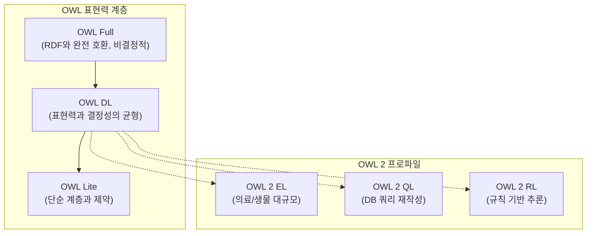

# 3회차: OWL (Web Ontology Language)

## 학습 목표

- OWL(Web Ontology Language)이 RDFS를 어떻게 확장하는지 설명합니다
- OWL Full, OWL DL, OWL Lite의 차이와 OWL 2의 위치를 이해합니다
- `owl:ObjectProperty`, `owl:DatatypeProperty`, `owl:AnnotationProperty`를 구분합니다
- `owl:TransitiveProperty`, `owl:FunctionalProperty`, `owl:InverseFunctionalProperty`를 사용합니다
- `owl:equivalentClass`, `owl:disjointWith`로 클래스 간 관계를 선언합니다
- `owl:someValuesFrom`, `owl:allValuesFrom`으로 존재 제약과 보편 제약을 표현합니다
- OWL로 표현 가능한 것과 그렇지 않은 것의 경계를 파악합니다

## 이번 세션 전체 그림



## OWL이란 무엇인가?

OWL(Web Ontology Language)은 W3C가 2004년에 권고안으로 발표한 온톨로지 언어입니다. RDFS보다 훨씬 풍부한 표현력을 제공하여, 클래스와 프로퍼티에 대한 복잡한 제약과 논리적 관계를 명시할 수 있습니다.

OWL은 기술 논리(Description Logic, DL)에 기반하여 설계되었습니다. 이는 OWL로 표현된 온톨로지가 자동화된 추론기(reasoner)에 의해 검증(consistency check)되고 새로운 지식을 도출할 수 있다는 뜻입니다.

> **왜 OWL이 필요한가?**
>
> 의료 정보 시스템에서 "심근경색(Myocardial Infarction)은 심장 질환(HeartDisease)의 일종이며, 동시에 혈관 질환(VascularDisease)의 일종이다"라고 정의하고 싶습니다. 그리고 "어떤 환자도 동시에 살아 있는 환자(LivingPatient)이면서 사망한 환자(DeceasedPatient)일 수 없다"는 배타성도 필요합니다. RDFS로는 이런 복잡한 의미를 표현할 수 없지만, OWL은 가능합니다. 이 표현력이 실제 의료, 생물, 법률 온톨로지에서 OWL을 선택하는 이유입니다.

## OWL의 종류: Full, DL, Lite

OWL 1.0에는 세 가지 하위 언어가 있습니다. 표현력이 높아질수록 추론이 어렵거나 불가능해집니다.

| 언어 | 특징 | 결정성 |
|------|------|--------|
| **OWL Lite** | 단순 계층과 카디널리티 제약만 허용 | 결정적(decidable) |
| **OWL DL** | 기술 논리(SHOIN(D)) 기반, 완전한 추론 가능 | 결정적(decidable) |
| **OWL Full** | RDF와 완전히 통합, 제약 없음 | 비결정적(undecidable) |

현실에서는 대부분 **OWL DL**을 사용합니다. OWL Full은 이론적으로 더 표현력이 높지만, 완전한 추론을 보장할 수 없습니다.

<strong>OWL 2 (2009년 표준화)</strong>는 OWL DL을 확장하여 다음을 추가했습니다:
- 새로운 프로퍼티 특성: 비대칭성, 반사성, 비반사성
- 키(key) 선언
- 데이터 범위(data range) 표현
- 세 가지 프로파일(EL, QL, RL)

## OWL의 프로퍼티 종류

OWL은 세 종류의 프로퍼티를 구분합니다:

```turtle
@prefix owl: <http://www.w3.org/2002/07/owl#> .
@prefix ex: <http://example.org/> .

# ObjectProperty: 개체(자원)를 연결하는 관계
ex:hasParent a owl:ObjectProperty ;
    rdfs:domain ex:Person ;
    rdfs:range ex:Person .

# DatatypeProperty: 개체와 리터럴(데이터 값)을 연결
ex:hasAge a owl:DatatypeProperty ;
    rdfs:domain ex:Person ;
    rdfs:range xsd:integer .

# AnnotationProperty: 메타데이터 (추론에 사용되지 않음)
ex:authorNote a owl:AnnotationProperty .
```

## 프로퍼티 특성

OWL은 프로퍼티에 특별한 논리적 성질을 부여할 수 있습니다:

### 전이성 (TransitiveProperty)

```turtle
ex:hasAncestor a owl:ObjectProperty ,
               owl:TransitiveProperty .

# 결과: A hasAncestor B, B hasAncestor C → A hasAncestor C
ex:isLocatedIn a owl:ObjectProperty ,
               owl:TransitiveProperty .
# 서울 isLocatedIn 대한민국, 대한민국 isLocatedIn 아시아 → 서울 isLocatedIn 아시아
```

### 함수성 (FunctionalProperty)

```turtle
# 각 주어는 최대 하나의 목적어를 가진다
ex:hasBiologicalMother a owl:ObjectProperty ,
                        owl:FunctionalProperty .

# 각 주어는 최대 하나의 값을 가진다
ex:hasSocialSecurityNumber a owl:DatatypeProperty ,
                            owl:FunctionalProperty .
```

### 역함수성 (InverseFunctionalProperty)

```turtle
# 각 목적어에 대해 최대 하나의 주어만 존재한다
ex:hasSocialSecurityNumber a owl:InverseFunctionalProperty .
# 두 다른 사람이 같은 주민등록번호를 가질 수 없음
```

### 역관계 (inverseOf)

```turtle
ex:hasChild owl:inverseOf ex:hasParent .
# X hasParent Y ↔ Y hasChild X
```

### 대칭성 (SymmetricProperty)

```turtle
ex:isMarriedTo a owl:SymmetricProperty .
# A isMarriedTo B → B isMarriedTo A
```

## 클래스 표현식

OWL의 강력한 기능은 <strong>익명 클래스 표현식(anonymous class expression)</strong>입니다.

### 클래스 동치 (equivalentClass)

```turtle
ex:Single owl:equivalentClass [
    a owl:Class ;
    owl:intersectionOf (ex:Adult ex:Unmarried)
] .
# Single = Adult AND Unmarried
```

### 클래스 분리 (disjointWith)

```turtle
ex:Male owl:disjointWith ex:Female .
ex:LivingPerson owl:disjointWith ex:DeceasedPerson .

# OWL 2 방식: 세 개 이상의 클래스를 한 번에 선언
[] a owl:AllDisjointClasses ;
   owl:members (ex:Child ex:Adult ex:Senior) .
```

### 존재 제약 (someValuesFrom)

```turtle
# "부모"는 적어도 하나의 자녀를 가진 사람이다
ex:Parent owl:equivalentClass [
    a owl:Restriction ;
    owl:onProperty ex:hasChild ;
    owl:someValuesFrom ex:Person
] .
# "최소한 하나의 hasChild 관계가 있고, 그 자녀는 Person이어야 한다"
```

### 보편 제약 (allValuesFrom)

```turtle
# "채식주의자"는 모든 음식이 식물성이어야 한다
ex:Vegetarian owl:equivalentClass [
    a owl:Restriction ;
    owl:onProperty ex:eats ;
    owl:allValuesFrom ex:PlantBasedFood
] .
# "eats 관계가 있다면, 그 목적어는 모두 PlantBasedFood여야 한다"
```

### 카디널리티 제약

```turtle
# 정확히 하나의 생물학적 어머니
ex:HumanBeing rdfs:subClassOf [
    a owl:Restriction ;
    owl:onProperty ex:hasBiologicalMother ;
    owl:cardinality 1
] .

# 최소 두 명의 부모
ex:HumanBeing rdfs:subClassOf [
    a owl:Restriction ;
    owl:onProperty ex:hasParent ;
    owl:minCardinality 2
] .
```

## 개체 동일성과 상이성

```turtle
# 두 URI가 같은 개체를 가리킨다
ex:홍길동 owl:sameAs <http://dbpedia.org/resource/Hong_Gildong> .

# 두 개체는 서로 다른 개체이다
ex:홍길동 owl:differentFrom ex:이순신 .

# 목록의 모든 개체가 서로 다르다 (대규모 데이터에서 유용)
[] a owl:AllDifferent ;
   owl:distinctMembers (ex:홍길동 ex:이순신 ex:세종대왕) .
```

## OWL로 표현할 수 없는 것

OWL은 강력하지만 다음과 같은 것은 표현하기 어렵거나 불가능합니다:

**표현하기 어려운 것들:**

- **메타클래스(metaclass)**: "모든 클래스는 크기를 가진다" - OWL Full에서만 가능
- **숫자 패턴**: "소수(prime number)이다" - OWL DatatypeProperty로 직접 표현 불가
- **시간 변화**: "홍길동은 2020년에 교수였다가 2022년에 명예교수가 되었다" - 시제 논리 필요
- **예외(exception)**: "조류는 날 수 있다, 단 펭귄을 제외하고" - 비단조 추론 필요

> **OWL의 한계를 아는 것이 왜 중요한가?**
>
> 도구의 한계를 모르면 적합하지 않은 상황에서 사용하게 됩니다. 예를 들어, "대부분의 학생은 장학금을 받지 못한다"는 예외 규칙을 OWL 온톨로지에 표현하려다가 실패하는 경우가 있습니다. OWL은 단조 논리(monotonic logic) 기반이므로, 지식이 추가될수록 더 많은 사실이 참이 될 수 있지만 이미 참인 사실이 거짓이 될 수 없습니다. 예외 처리는 OWL의 설계 범위 밖입니다.

## 흔한 오해

**오해 1: "OWL은 프로그래밍 언어다"**

아닙니다. OWL은 지식 표현 언어이지 절차적 프로그래밍 언어가 아닙니다. "if-then" 규칙을 직접 쓸 수 없습니다. 대신 클래스와 프로퍼티의 선언적 의미를 통해 추론기가 자동으로 결론을 도출합니다.

**오해 2: "owl:allValuesFrom은 해당 프로퍼티가 반드시 존재해야 함을 의미한다"**

아닙니다. `owl:allValuesFrom`은 "만약 해당 프로퍼티 관계가 있다면, 목적어는 지정된 클래스여야 한다"입니다. 프로퍼티가 전혀 없어도 이 제약은 위반되지 않습니다. 반드시 존재해야 한다면 `owl:someValuesFrom`을 사용합니다.

**오해 3: "OWL 2 DL은 OWL DL의 단순한 개선이다"**

OWL 2 DL은 SROIQ(D)라는 더 표현력이 높은 기술 논리를 사용합니다. 새로운 기능(역할 체인, 역할 범위 등)이 추가되었지만, 추론 복잡도도 증가했습니다. 무조건 OWL 2를 사용하는 것이 항상 좋은 것은 아닙니다.

## 실습

### 기본 실습

다음을 OWL/Turtle로 표현하세요:

1. `ex:Parent`는 `ex:Person`의 하위 클래스이면서, 적어도 하나의 `ex:hasChild` 관계를 가진 사람이다
2. `ex:hasBiologicalMother`는 함수성 객체 프로퍼티이다
3. `ex:isMarriedTo`는 대칭적 객체 프로퍼티이다
4. `ex:Male`과 `ex:Female`은 서로소 클래스이다

### 도전 실습

다음 OWL 표현식을 자연어로 설명하세요:

```turtle
ex:HappyPerson owl:equivalentClass [
    a owl:Class ;
    owl:intersectionOf (
        ex:Person
        [
            a owl:Restriction ;
            owl:onProperty ex:hasHobby ;
            owl:minCardinality 3
        ]
        [
            a owl:Restriction ;
            owl:onProperty ex:livesIn ;
            owl:someValuesFrom ex:CoastalCity
        ]
    )
] .
```

## 요약

| OWL 구성 | 용도 | 예시 |
|----------|------|------|
| `owl:ObjectProperty` | 개체 간 관계 | `ex:hasParent` |
| `owl:DatatypeProperty` | 개체-리터럴 관계 | `ex:hasAge` |
| `owl:TransitiveProperty` | 전이적 관계 | `ex:hasAncestor` |
| `owl:FunctionalProperty` | 유일 목적어 | `ex:hasBiologicalMother` |
| `owl:SymmetricProperty` | 대칭 관계 | `ex:isMarriedTo` |
| `owl:inverseOf` | 역관계 선언 | `ex:hasChild owl:inverseOf ex:hasParent` |
| `owl:equivalentClass` | 클래스 동치 | `ex:Bachelor = ex:Adult AND ex:Unmarried` |
| `owl:disjointWith` | 클래스 배타 | `ex:Male owl:disjointWith ex:Female` |
| `owl:someValuesFrom` | 존재 제약 | 적어도 하나는 이 클래스의 인스턴스 |
| `owl:allValuesFrom` | 보편 제약 | 모두 이 클래스의 인스턴스 |
| `owl:cardinality` | 정확한 개수 | 정확히 N개 |

> **연결 포인트: OWL → SPARQL**
>
> OWL 추론기가 도출한 새로운 트리플들은 트리플 스토어(triple store)에 저장되거나 즉석에서 추론됩니다. 다음 회차에서 배울 SPARQL은 이 데이터를 조회하는 도구입니다. OWL이 "무엇이 참인지"를 정의한다면, SPARQL은 "어떤 참인 것을 가져올지"를 지정합니다.
