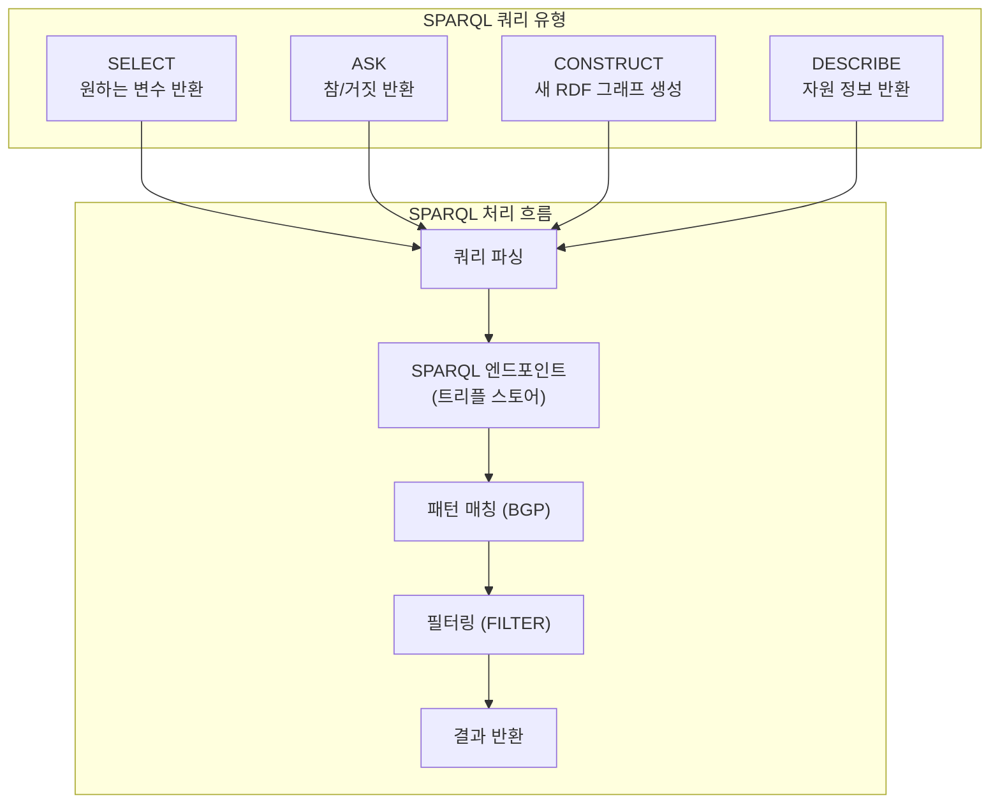

# 4회차: SPARQL (RDF 쿼리 언어)

## 학습 목표

- SPARQL(SPARQL Protocol and RDF Query Language)의 역할과 구조를 이해합니다
- SELECT, ASK, CONSTRUCT, DESCRIBE 네 가지 쿼리 유형을 구분하여 사용합니다
- 기본 그래프 패턴(BGP, Basic Graph Pattern)으로 원하는 트리플을 매칭합니다
- OPTIONAL, FILTER, GROUP BY, ORDER BY로 쿼리를 세밀하게 제어합니다
- DBpedia, Wikidata 같은 공개 SPARQL 엔드포인트에서 실제 데이터를 조회합니다
- SERVICE 키워드로 연합 쿼리(Federated Query)를 실행합니다

## 이번 세션 전체 그림



## SPARQL이란 무엇인가?

SPARQL은 W3C가 표준화한 RDF 데이터를 위한 쿼리 언어이자 프로토콜입니다. SQL이 관계형 데이터베이스를 위한 쿼리 언어라면, SPARQL은 RDF 그래프 데이터베이스(트리플 스토어)를 위한 쿼리 언어입니다.

> **왜 SQL이 아니라 SPARQL인가?**
>
> SQL은 테이블(행과 열)을 기준으로 설계되었습니다. RDF 데이터는 그래프 구조여서 SQL로 조회하면 복잡한 JOIN 연산을 반복해야 합니다. 예를 들어 "홍길동의 친구의 친구 중 서울에 사는 사람"을 SQL로 조회하려면 여러 개의 중첩 JOIN이 필요합니다. SPARQL은 그래프 패턴 매칭으로 이를 자연스럽게 표현합니다.

SPARQL의 기본 구조:

```sparql
PREFIX ex: <http://example.org/>
PREFIX foaf: <http://xmlns.com/foaf/0.1/>

SELECT ?name ?age
WHERE {
    ?person a foaf:Person ;
            foaf:name ?name ;
            ex:age ?age .
    FILTER (?age >= 20)
}
ORDER BY ASC(?age)
LIMIT 10
```

## SELECT 쿼리: 변수 값 검색

SELECT는 조건에 맞는 RDF 데이터를 테이블 형태로 반환합니다. `?` 또는 `$`로 시작하는 식별자가 변수입니다.

```sparql
PREFIX ex: <http://example.org/>
PREFIX foaf: <http://xmlns.com/foaf/0.1/>

SELECT ?person ?name ?worksAt
WHERE {
    ?person a foaf:Person ;
            foaf:name ?name ;
            ex:worksAt ?worksAt .
}
```

**SELECT DISTINCT**: 중복 제거

```sparql
SELECT DISTINCT ?country
WHERE {
    ?city ex:locatedIn ?country .
}
```

**SELECT (집계 함수)**: GROUP BY와 함께 사용

```sparql
SELECT ?department (COUNT(?employee) AS ?headcount)
WHERE {
    ?employee ex:worksIn ?department .
}
GROUP BY ?department
HAVING (COUNT(?employee) > 5)
ORDER BY DESC(?headcount)
```

## OPTIONAL: 없어도 되는 패턴

SQL의 LEFT OUTER JOIN과 유사합니다. OPTIONAL 블록 안의 패턴이 매칭되지 않아도 결과가 반환됩니다.

```sparql
SELECT ?person ?name ?email
WHERE {
    ?person a foaf:Person ;
            foaf:name ?name .
    OPTIONAL {
        ?person foaf:mbox ?email .
    }
}
```

이메일이 없는 사람도 결과에 포함되며, `?email`이 미바인딩(unbound) 상태로 반환됩니다.

## FILTER: 조건 필터링

FILTER는 변수나 값에 조건을 적용합니다. SPARQL 1.1에서는 다양한 내장 함수를 지원합니다:

```sparql
SELECT ?person ?name ?age
WHERE {
    ?person a foaf:Person ;
            foaf:name ?name ;
            ex:age ?age .

    # 수치 비교
    FILTER (?age BETWEEN 20 AND 30)

    # 문자열 함수
    FILTER (LANG(?name) = "ko")
    FILTER (CONTAINS(STR(?name), "김"))

    # 타입 체크
    FILTER (DATATYPE(?age) = xsd:integer)

    # 정규 표현식
    FILTER (REGEX(?name, "^홍", "i"))
}
```

## UNION: 여러 패턴 합치기

```sparql
SELECT ?contact
WHERE {
    {
        ?person foaf:mbox ?contact .
    }
    UNION
    {
        ?person ex:phone ?contact .
    }
}
```

## CONSTRUCT: 새 RDF 그래프 생성

CONSTRUCT는 쿼리 결과를 새로운 RDF 트리플 집합으로 반환합니다. 데이터 변환에 유용합니다.

```sparql
CONSTRUCT {
    ?person schema:name ?name .
    ?person schema:email ?email .
}
WHERE {
    ?person foaf:name ?name ;
            foaf:mbox ?email .
}
```

## ASK: 참/거짓 확인

ASK는 패턴이 데이터에 존재하는지 여부만 확인합니다.

```sparql
ASK {
    ex:홍길동 ex:worksAt ex:서울대학교 .
}
# 결과: true 또는 false
```

## DESCRIBE: 자원 정보 조회

DESCRIBE는 지정된 자원에 대한 모든 관련 트리플을 반환합니다. 정확한 결과는 구현에 따라 다를 수 있습니다.

```sparql
DESCRIBE ex:홍길동
```

## DBpedia SPARQL 실전 예시

DBpedia는 위키피디아의 구조화된 데이터를 RDF 형태로 제공하는 공개 SPARQL 엔드포인트입니다. 엔드포인트 주소: `https://dbpedia.org/sparql`

```sparql
PREFIX dbo: <http://dbpedia.org/ontology/>
PREFIX foaf: <http://xmlns.com/foaf/0.1/>
PREFIX rdfs: <http://www.w3.org/2000/01/rdf-schema#>

SELECT ?scientist ?name ?birthDate ?birthPlace
WHERE {
    ?scientist a dbo:Scientist ;
               foaf:name ?name ;
               dbo:birthDate ?birthDate .
    OPTIONAL {
        ?scientist dbo:birthPlace ?birthPlace .
    }
    FILTER (LANG(?name) = "ko")
}
ORDER BY ?birthDate
LIMIT 10
```

**한국의 도시 목록 조회:**

```sparql
PREFIX dbo: <http://dbpedia.org/ontology/>
PREFIX dbr: <http://dbpedia.org/resource/>
PREFIX rdfs: <http://www.w3.org/2000/01/rdf-schema#>

SELECT ?city ?name ?population
WHERE {
    ?city a dbo:City ;
          dbo:country dbr:South_Korea ;
          rdfs:label ?name ;
          dbo:populationTotal ?population .
    FILTER (LANG(?name) = "ko")
}
ORDER BY DESC(?population)
LIMIT 20
```

## Wikidata SPARQL 예시

Wikidata는 위키미디어 재단의 구조화 데이터 저장소로, 독자적인 SPARQL 엔드포인트를 제공합니다: `https://query.wikidata.org/`

```sparql
SELECT ?item ?itemLabel ?birthDate
WHERE {
    ?item wdt:P31 wd:Q5 ;       # 인간(human)
          wdt:P27 wd:Q884 ;     # 대한민국 시민권
          wdt:P569 ?birthDate . # 생년월일
    FILTER (YEAR(?birthDate) = 1950)
    SERVICE wikibase:label {
        bd:serviceParam wikibase:language "ko,en" .
    }
}
ORDER BY ?birthDate
LIMIT 50
```

## SERVICE: 연합 쿼리 (Federated Query)

SERVICE 키워드는 외부 SPARQL 엔드포인트를 쿼리에 포함시킵니다. 여러 데이터 소스를 단일 쿼리로 연결합니다.

```sparql
PREFIX owl: <http://www.w3.org/2002/07/owl#>
PREFIX foaf: <http://xmlns.com/foaf/0.1/>

SELECT ?localPerson ?name ?wikiPage
WHERE {
    # 로컬 트리플 스토어에서 사람 조회
    ?localPerson a foaf:Person ;
                 foaf:name ?name ;
                 owl:sameAs ?dbpediaPerson .

    # DBpedia에서 추가 정보 조회
    SERVICE <https://dbpedia.org/sparql> {
        ?dbpediaPerson foaf:page ?wikiPage .
    }
}
```

> **왜 연합 쿼리가 강력한가?**
>
> 시맨틱 웹의 핵심 비전은 전 세계의 데이터가 연결된 "지식 그래프(Knowledge Graph)"입니다. 연합 쿼리를 통해 내 트리플 스토어의 데이터와 DBpedia, Wikidata, UniProt(단백질 데이터) 등 전 세계 공개 데이터를 단일 쿼리로 결합할 수 있습니다. 이는 기존 데이터베이스 시스템에서는 불가능했던 범지구적 데이터 통합입니다.

## 흔한 오해

**오해 1: "SPARQL은 SQL과 거의 같다"**

기본 구조가 유사해 보이지만 근본적인 차이가 있습니다. SQL은 스키마를 가정하고 닫힌 세계에서 동작합니다. SPARQL은 스키마가 없어도 동작하며, 개방 세계 가정(OWA)하에서 변수에 매칭되는 패턴을 찾습니다. 특히 OPTIONAL과 NULL 처리 방식이 SQL의 LEFT JOIN과 미묘하게 다릅니다.

**오해 2: "FILTER는 SQL의 WHERE처럼 결과를 제한하는 주 조건이다"**

SPARQL에서 WHERE 절 전체가 패턴 매칭 조건입니다. FILTER는 이미 매칭된 결과에 추가적인 조건을 적용합니다. 패턴이 먼저 매칭된 후 FILTER가 적용됩니다. 따라서 FILTER를 WHERE 대신 사용하면 성능이 저하될 수 있습니다.

**오해 3: "SPARQL은 OWL 추론을 자동으로 수행한다"**

기본 SPARQL은 명시적으로 저장된 트리플만 조회합니다. 추론된 트리플을 포함하려면 트리플 스토어가 추론을 미리 실행하여 확장된 데이터를 저장하거나, 추론 엔진과 연동된 설정이 필요합니다. 모든 SPARQL 엔드포인트가 OWL 추론을 지원하는 것은 아닙니다.

## 실습

### 기본 실습

다음 질문에 답하는 SPARQL SELECT 쿼리를 작성하세요 (prefix는 이미 정의되어 있다고 가정):

1. `foaf:Person` 타입인 모든 개체의 이름(`foaf:name`)을 조회하세요
2. 30세 이상의 사람 중 `ex:worksAt` 정보가 있는 사람을 이름과 직장 순으로 조회하세요
3. 이메일이 없는 사람만 조회하세요 (FILTER NOT EXISTS 또는 OPTIONAL 활용)

### 도전 실습

**DBpedia 쿼리 (실제 실행 가능):**

DBpedia SPARQL 엔드포인트(`https://dbpedia.org/sparql`)에서 다음을 조회하세요:

1. 한국 태생의 노벨상 수상자 목록 (이름, 수상 연도, 수상 분야)
2. 서울에 있는 대학교 목록 (한국어 이름, 설립 연도)

## 요약

| 쿼리 유형 | 반환 형식 | 주요 용도 |
|----------|----------|----------|
| SELECT | 테이블 (변수-값 바인딩) | 데이터 조회 |
| ASK | true / false | 존재 확인 |
| CONSTRUCT | RDF 그래프 | 데이터 변환 |
| DESCRIBE | RDF 그래프 | 자원 탐색 |

| 절 / 키워드 | 역할 |
|------------|------|
| WHERE `{ }` | 그래프 패턴 정의 |
| OPTIONAL `{ }` | 선택적 패턴 (LEFT JOIN) |
| FILTER | 조건 필터링 |
| UNION | 패턴 합집합 |
| GROUP BY / HAVING | 집계 |
| ORDER BY | 정렬 |
| LIMIT / OFFSET | 페이징 |
| SERVICE | 연합 쿼리 |

> **연결 포인트: SPARQL → 직렬화 형식**
>
> SPARQL 쿼리를 SPARQL 엔드포인트에 전송할 때, 결과는 다양한 형식으로 반환될 수 있습니다(SPARQL-XML, SPARQL-JSON, CSV 등). 또한 CONSTRUCT 쿼리의 결과인 RDF 그래프는 Turtle, JSON-LD, RDF/XML 등으로 직렬화(serialize)됩니다. 다음 회차에서는 이 직렬화 형식들을 자세히 살펴봅니다.
