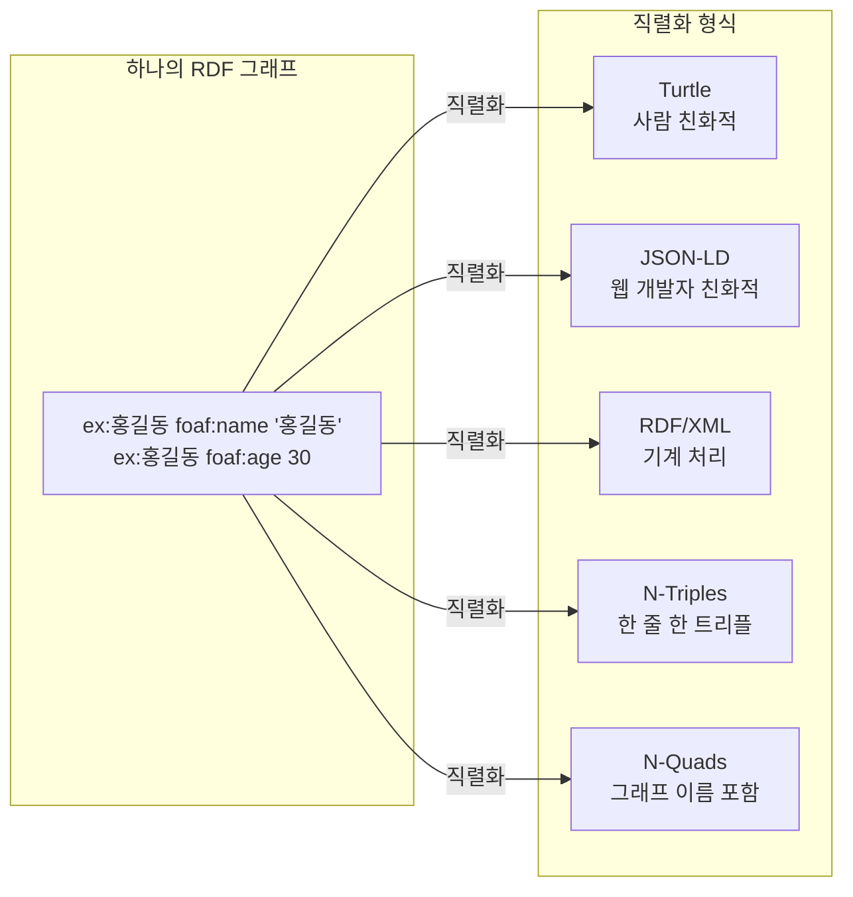

# 5회차: 직렬화 형식 (Serialization Formats)

## 학습 목표

- RDF 직렬화 형식이 무엇이고 왜 여러 종류가 필요한지 설명합니다
- Turtle 형식의 문법과 장점을 이해하고 직접 작성합니다
- RDF/XML이 필요한 상황과 기본 구조를 파악합니다
- JSON-LD를 통해 JSON과 RDF를 연결하는 방법을 이해합니다
- N-Triples와 N-Quads의 특징과 용도를 설명합니다
- 상황에 맞는 직렬화 형식을 선택하는 기준을 적용합니다

## 이번 세션 전체 그림



## 직렬화란 무엇인가?

RDF 그래프는 추상적인 데이터 구조입니다. 이것을 파일이나 네트워크로 전송하려면 텍스트나 바이트 형태로 변환해야 합니다. 이 변환 과정을 <strong>직렬화(serialization)</strong>라고 하고, 그 결과물의 형식을 <strong>직렬화 형식(serialization format)</strong>이라고 합니다.

동일한 RDF 그래프를 Turtle로 쓰든 JSON-LD로 쓰든, 의미는 동일합니다. 형식은 용도와 환경에 따라 선택합니다.

> **왜 직렬화 형식이 여러 개인가?**
>
> HTML도 XML 형태(XHTML)와 HTML5 형태가 공존하듯, RDF도 다양한 커뮤니티의 필요에 따라 여러 형식이 발전했습니다. 기업 Java 개발자는 XML이 친숙하고, 웹 프론트엔드 개발자는 JSON이 자연스럽습니다. 데이터 과학자는 한 줄 한 트리플의 N-Triples를 스크립트로 처리하기 쉽습니다. 이런 다양한 수요를 충족하기 위해 여러 형식이 존재합니다.

## Turtle: 사람이 읽기 좋은 형식

<strong>Turtle(Terse RDF Triple Language)</strong>은 가장 널리 사용되는 사람 친화적 직렬화 형식입니다. W3C 표준이며, 파일 확장자는 `.ttl`입니다.

```turtle
@prefix ex: <http://example.org/> .
@prefix foaf: <http://xmlns.com/foaf/0.1/> .
@prefix rdfs: <http://www.w3.org/2000/01/rdf-schema#> .
@prefix xsd: <http://www.w3.org/2001/XMLSchema#> .

# 세미콜론으로 같은 주어에 여러 트리플을 묶음
ex:홍길동 a foaf:Person ;
    foaf:name "홍길동"@ko ;
    foaf:name "Hong Gildong"@en ;
    foaf:age 30 ;
    ex:worksAt ex:서울대학교 ;
    ex:speaks "한국어"@ko , "영어"@en .

# 빈 노드 (인라인)
ex:홍길동 ex:hasAddress [
    ex:city "서울"@ko ;
    ex:postalCode "08826"
] .

ex:서울대학교 a ex:University ;
    rdfs:label "Seoul National University"@en ;
    ex:location "관악구"@ko .
```

**Turtle의 장점:**
- 프리픽스로 가독성 높은 약식 표현
- 세미콜론(`;`), 쉼표(`,`)로 반복 주어/술어 생략
- 주석(`#`) 지원
- 들여쓰기로 구조 표현

**Turtle의 단점:**
- 파싱이 JSON이나 XML보다 복잡
- 기존 XML 도구와 통합 어려움

## RDF/XML: XML 기반 형식

**RDF/XML**은 RDF의 최초 공식 직렬화 형식입니다. XML 문서로 표현되므로 기존 XML 도구(XSLT, XPath, SAX 파서 등)와 통합이 용이합니다. 파일 확장자는 `.rdf`입니다.

```xml
<?xml version="1.0" encoding="UTF-8"?>
<rdf:RDF
    xmlns:rdf="http://www.w3.org/1999/02/22-rdf-syntax-ns#"
    xmlns:foaf="http://xmlns.com/foaf/0.1/"
    xmlns:ex="http://example.org/"
    xmlns:rdfs="http://www.w3.org/2000/01/rdf-schema#">

    <foaf:Person rdf:about="http://example.org/홍길동">
        <foaf:name xml:lang="ko">홍길동</foaf:name>
        <foaf:name xml:lang="en">Hong Gildong</foaf:name>
        <foaf:age rdf:datatype="http://www.w3.org/2001/XMLSchema#integer">30</foaf:age>
        <ex:worksAt rdf:resource="http://example.org/서울대학교"/>
    </foaf:Person>

    <ex:University rdf:about="http://example.org/서울대학교">
        <rdfs:label xml:lang="en">Seoul National University</rdfs:label>
    </ex:University>
</rdf:RDF>
```

**RDF/XML의 장점:**
- XML 생태계와 완벽한 통합
- 구형 시스템과의 호환성
- XML 스키마 검증 가능

**RDF/XML의 단점:**
- 사람이 읽기 어려움
- 같은 정보를 훨씬 더 많은 텍스트로 표현
- 일부 RDF 구조(특히 빈 노드가 많은 경우)를 표현하기 복잡

## JSON-LD: 웹 개발자 친화적 형식

<strong>JSON-LD(JSON for Linked Data)</strong>는 JSON 형식에 Linked Data 의미를 추가한 W3C 표준입니다. 일반 JSON처럼 보이면서도 RDF 트리플로 변환 가능합니다. 파일 확장자는 `.jsonld`입니다.

```json
{
  "@context": {
    "@vocab": "http://example.org/",
    "foaf": "http://xmlns.com/foaf/0.1/",
    "rdfs": "http://www.w3.org/2000/01/rdf-schema#",
    "xsd": "http://www.w3.org/2001/XMLSchema#",
    "name": "foaf:name",
    "age": {
      "@id": "foaf:age",
      "@type": "xsd:integer"
    },
    "worksAt": {
      "@id": "worksAt",
      "@type": "@id"
    }
  },
  "@id": "http://example.org/홍길동",
  "@type": "foaf:Person",
  "name": [
    {"@value": "홍길동", "@language": "ko"},
    {"@value": "Hong Gildong", "@language": "en"}
  ],
  "age": 30,
  "worksAt": "http://example.org/서울대학교"
}
```

**JSON-LD의 강점: @context 분리**

`@context`를 별도 URL로 외부화할 수 있습니다:

```json
{
  "@context": "https://schema.org/",
  "@type": "Person",
  "name": "홍길동",
  "birthDate": "1994-03-15",
  "email": "hg@example.org"
}
```

이것은 이미 `schema.org`를 컨텍스트로 사용하는 완전한 JSON-LD 문서입니다. 구글, 빙 같은 검색 엔진은 웹 페이지의 JSON-LD를 인식하여 구조화된 검색 결과(리치 스니펫)를 제공합니다.

> **왜 JSON-LD가 웹에서 중요한가?**
>
> 현대 웹 개발의 대부분은 JSON API를 기반으로 합니다. JSON-LD를 사용하면 기존 JSON API에 최소한의 수정(`@context` 추가)으로 시맨틱 웹의 이점을 얻을 수 있습니다. Schema.org는 JSON-LD를 주요 형식으로 채택했고, 구글의 지식 그래프(Knowledge Graph)도 JSON-LD를 활용합니다. 이는 RDF/OWL 기술이 실제 웹 생태계에 통합되는 가장 실용적인 방식입니다.

## N-Triples: 가장 단순한 형식

**N-Triples**는 한 줄에 하나의 트리플을 표현하는 가장 단순한 형식입니다. 프리픽스나 약식 표현 없이 모든 URI를 완전한 형태로 씁니다. 파일 확장자는 `.nt`입니다.

```text
<http://example.org/홍길동> <http://www.w3.org/1999/02/22-rdf-syntax-ns#type> <http://xmlns.com/foaf/0.1/Person> .
<http://example.org/홍길동> <http://xmlns.com/foaf/0.1/name> "홍길동"@ko .
<http://example.org/홍길동> <http://xmlns.com/foaf/0.1/name> "Hong Gildong"@en .
<http://example.org/홍길동> <http://xmlns.com/foaf/0.1/age> "30"^^<http://www.w3.org/2001/XMLSchema#integer> .
<http://example.org/홍길동> <http://example.org/worksAt> <http://example.org/서울대학교> .
```

**N-Triples의 장점:**
- 파싱이 매우 단순 (한 줄 = 하나의 트리플)
- 스트리밍 처리 가능 (파일 전체를 메모리에 올릴 필요 없음)
- 대용량 데이터 처리에 적합
- 스크립트(awk, grep, Python)로 쉽게 처리

**N-Triples의 단점:**
- 사람이 읽기 어려움
- 파일 크기가 큼

## N-Quads: 그래프 이름 포함

**N-Quads**는 N-Triples에 <strong>네 번째 요소(Named Graph, 명명된 그래프)</strong>를 추가한 형식입니다. 여러 RDF 그래프를 하나의 파일에 저장할 때 유용합니다. 파일 확장자는 `.nq`입니다.

```text
<http://example.org/홍길동> <http://www.w3.org/1999/02/22-rdf-syntax-ns#type> <http://xmlns.com/foaf/0.1/Person> <http://example.org/graph/people> .
<http://example.org/서울대학교> <http://www.w3.org/1999/02/22-rdf-syntax-ns#type> <http://example.org/University> <http://example.org/graph/orgs> .
```

네 번째 요소가 없으면 기본 그래프에 속합니다. RDF 데이터셋을 덤프할 때 주로 사용됩니다.

## TriG: Turtle의 Named Graph 확장

**TriG**는 Turtle의 문법을 사용하면서 Named Graph를 지원합니다:

```turtle
@prefix ex: <http://example.org/> .
@prefix foaf: <http://xmlns.com/foaf/0.1/> .

# Named Graph 선언
ex:graph/people {
    ex:홍길동 a foaf:Person ;
        foaf:name "홍길동"@ko .
}

ex:graph/orgs {
    ex:서울대학교 a ex:University .
}

# 기본 그래프
{
    ex:metadata ex:created "2024-01-01"^^xsd:date .
}
```

## 형식 선택 기준

| 상황 | 권장 형식 |
|------|----------|
| 사람이 읽고 편집하는 온톨로지 파일 | **Turtle** |
| 웹 페이지에 구조화 데이터 삽입 | **JSON-LD** |
| JSON REST API에 RDF 의미 추가 | **JSON-LD** |
| 기존 XML 파이프라인과 통합 | **RDF/XML** |
| 대용량 RDF 데이터 처리/파이프라인 | **N-Triples** |
| 여러 Named Graph를 포함한 데이터셋 | **N-Quads 또는 TriG** |
| Protégé에서 온톨로지 저장 | **RDF/XML 또는 Turtle** |
| 트리플 스토어 데이터 로딩 | **N-Triples 또는 N-Quads** |
| 검색 엔진 최적화(SEO) | **JSON-LD (Schema.org)** |

> **형식보다 의미가 중요하다**
>
> 어떤 형식을 사용하든 표현되는 RDF 그래프는 동일합니다. Turtle로 작성한 온톨로지를 RDFLib나 Apache Jena로 불러서 JSON-LD로 변환하거나 N-Triples로 내보낼 수 있습니다. 형식 간 변환은 대부분의 RDF 라이브러리에서 기본으로 지원됩니다. 따라서 **처음 작성하는 사람이 읽기 편한 형식**으로 시작하고, 필요할 때 다른 형식으로 변환하는 전략이 실용적입니다.

## 흔한 오해

**오해 1: "JSON-LD는 JSON의 하위 집합이다"**

반대입니다. JSON-LD는 JSON의 상위 집합입니다. 모든 유효한 JSON 문서는 `@context`를 추가하면 JSON-LD가 됩니다. 기존 JSON API를 JSON-LD로 업그레이드할 때 이 특성을 활용합니다.

**오해 2: "Turtle은 RDF/XML보다 표현력이 낮다"**

아닙니다. 모든 유효한 RDF 그래프는 Turtle로 표현할 수 있고, 반대도 마찬가지입니다. Turtle이 더 간결하게 보일 뿐, 표현 가능한 정보의 범위는 동일합니다.

**오해 3: "N-Triples는 소규모 데이터에만 적합하다"**

오히려 반대입니다. DBpedia나 Wikidata 같은 수십억 개의 트리플을 포함하는 대규모 데이터셋은 N-Triples 형식으로 배포됩니다. 한 줄씩 스트리밍 처리가 가능해서 메모리 효율이 높습니다.

## 실습

### 기본 실습

동일한 RDF 정보를 세 가지 형식으로 표현해보세요:

다음 정보:
- 이순신(http://example.org/이순신)은 군인(ex:Military)이자 역사적 인물(ex:HistoricalFigure)이다
- 이름은 한국어로 "이순신", 영어로 "Yi Sun-sin"
- 1545년 4월 28일 출생

각각 Turtle, JSON-LD, N-Triples로 작성하세요.

### 도전 실습

schema.org를 컨텍스트로 사용하는 JSON-LD로 다음을 표현하세요:

한 레스토랑의 메뉴 정보:
- 레스토랑 이름, 주소, 평점
- 메뉴 아이템 3개 (이름, 가격, 설명)
- 개장 시간

힌트: `https://schema.org/Restaurant`, `https://schema.org/MenuItem` 참조

## 요약

| 형식 | MIME 타입 | 확장자 | 특징 |
|------|----------|--------|------|
| Turtle | `text/turtle` | `.ttl` | 사람 친화적, 간결 |
| RDF/XML | `application/rdf+xml` | `.rdf` | XML 호환 |
| JSON-LD | `application/ld+json` | `.jsonld` | JSON 개발자 친화적 |
| N-Triples | `application/n-triples` | `.nt` | 단순, 대용량 처리 |
| N-Quads | `application/n-quads` | `.nq` | Named Graph 포함 |
| TriG | `application/trig` | `.trig` | Turtle + Named Graph |

> **연결 포인트: 직렬화 형식 → 도구 생태계**
>
> 각 도구는 특정 직렬화 형식을 선호합니다. Protégé는 RDF/XML과 Turtle을 주로 사용합니다. Apache Jena는 모든 형식을 지원합니다. 웹 개발 환경에서는 JSON-LD가 표준입니다. 다음 회차에서는 이 형식들을 실제로 다루는 도구들을 살펴봅니다.
