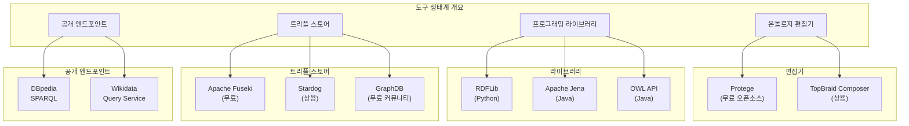

# 6회차: 도구 생태계 (Tools Ecosystem)

## 학습 목표

- Protégé의 핵심 기능을 이해하고 온톨로지 편집에 활용할 수 있습니다
- RDFLib(Python)으로 RDF 데이터를 프로그래밍 방식으로 처리할 수 있습니다
- Apache Jena의 역할과 구성 요소를 설명합니다
- 트리플 스토어(Triple Store)의 개념과 대표적인 제품들을 비교합니다
- 공개 SPARQL 엔드포인트(DBpedia, Wikidata)의 활용법을 파악합니다
- 작업 목적에 맞는 도구를 선택하는 기준을 적용합니다

## 이번 세션 전체 그림



## Protégé: 온톨로지 편집기의 표준

**Protégé**는 스탠퍼드 대학교에서 개발한 무료 오픈소스 온톨로지 편집기입니다. OWL 온톨로지를 시각적으로 작성하고 편집하는 가장 널리 사용되는 도구입니다.

### Protégé의 핵심 기능

**클래스 계층 편집:**
- 클래스와 하위 클래스를 트리 구조로 시각화
- 드래그 앤 드롭으로 계층 구조 변경
- 클래스 표현식(class expression) 시각 편집기

**프로퍼티 관리:**
- ObjectProperty, DatatypeProperty, AnnotationProperty 구분
- 도메인/범위 설정
- 프로퍼티 특성(전이성, 함수성 등) 체크박스로 설정

**추론기 연동:**
- HermiT, Pellet, FaCT++ 추론기를 직접 실행
- 추론 결과를 온톨로지에 반영
- 일관성 검사(consistency check) 즉시 실행

**SPARQL 쿼리 실행:**
- Protégé 내에서 직접 SPARQL 쿼리 테스트
- 현재 편집 중인 온톨로지에 대한 쿼리 실행

**다양한 직렬화 형식 지원:**
- RDF/XML, Turtle, OWL/XML, Manchester Syntax 등
- 형식 간 변환 및 내보내기

> **왜 Protégé를 먼저 배워야 하는가?**
>
> 텍스트 편집기로 OWL을 처음 작성하는 것은 마치 메모장으로 HTML을 처음 배우는 것과 같습니다. Protégé는 OWL 구문의 실수를 즉각 표시하고, 클래스 계층을 시각적으로 보여주며, 추론 결과를 실시간으로 확인할 수 있게 합니다. 온톨로지의 구조와 의미를 직관적으로 이해하는 가장 빠른 방법입니다.

### 설치 및 시작

1. `https://protege.stanford.edu`에서 다운로드
2. Java 11 이상 필요
3. Pellet 추론기 플러그인은 별도 설치 가능

### Manchester Syntax

Protégé의 클래스 표현식 편집기는 **Manchester Syntax**를 사용합니다. Turtle보다 자연어에 가까운 표현입니다:

```
# Turtle/OWL 표현:
ex:Parent owl:equivalentClass [
    owl:onProperty ex:hasChild ;
    owl:someValuesFrom ex:Person
]

# Manchester Syntax:
hasChild some Person
```

복잡한 표현:
```
Adult and (hasHobby min 3) and (livesIn some CoastalCity)
```

## RDFLib: Python으로 RDF 다루기

**RDFLib**는 Python에서 RDF 데이터를 처리하는 가장 인기 있는 라이브러리입니다. `pip install rdflib`로 설치합니다.

### 기본 사용법

```python
from rdflib import Graph, Namespace, Literal, URIRef
from rdflib.namespace import RDF, RDFS, OWL, XSD, FOAF

# 그래프 생성
g = Graph()

# 네임스페이스 정의
EX = Namespace("http://example.org/")
g.bind("ex", EX)
g.bind("foaf", FOAF)

# 트리플 추가
hong = EX.홍길동
g.add((hong, RDF.type, FOAF.Person))
g.add((hong, FOAF.name, Literal("홍길동", lang="ko")))
g.add((hong, FOAF.name, Literal("Hong Gildong", lang="en")))
g.add((hong, FOAF.age, Literal(30, datatype=XSD.integer)))
g.add((hong, EX.worksAt, EX.서울대학교))

# Turtle로 직렬화
print(g.serialize(format="turtle"))

# RDF/XML로 저장
g.serialize(destination="output.rdf", format="xml")

# JSON-LD로 저장
g.serialize(destination="output.jsonld", format="json-ld")
```

### 파일에서 불러오기 및 쿼리

```python
# 파일 불러오기
g = Graph()
g.parse("ontology.ttl", format="turtle")
g.parse("https://foaf-project.org/ns/foaf.rdf")  # 원격 파일도 가능

# SPARQL 쿼리 실행
query = """
PREFIX foaf: <http://xmlns.com/foaf/0.1/>
PREFIX ex: <http://example.org/>

SELECT ?name ?worksAt
WHERE {
    ?person a foaf:Person ;
            foaf:name ?name ;
            ex:worksAt ?worksAt .
    FILTER (LANG(?name) = "ko")
}
"""

for row in g.query(query):
    print(f"이름: {row.name}, 직장: {row.worksAt}")
```

### 온톨로지 분석

```python
# 모든 클래스 나열
for cls in g.subjects(RDF.type, OWL.Class):
    label = g.value(cls, RDFS.label)
    print(f"클래스: {cls} | 레이블: {label}")

# 특정 클래스의 인스턴스 조회
for instance in g.subjects(RDF.type, FOAF.Person):
    names = list(g.objects(instance, FOAF.name))
    print(f"인스턴스: {instance} | 이름들: {names}")
```

## Apache Jena: Java 기반 RDF 프레임워크

**Apache Jena**는 Java 생태계에서 가장 완성도 높은 RDF 프레임워크입니다. TDB2 트리플 스토어, SPARQL 엔진, 추론기를 모두 포함합니다.

### 주요 구성 요소

**Jena Core:**
- Java API로 RDF 그래프 조작
- 다양한 직렬화 형식 지원
- 내장 추론기(RDFS, OWL)

**ARQ (SPARQL 쿼리 엔진):**
- SPARQL 1.1 완전 지원
- Federation(연합 쿼리) 지원
- 커스텀 함수 확장 가능

**TDB2 (트리플 스토어):**
- 파일 기반 영구 저장소
- 수십억 개 트리플 처리 가능
- 트랜잭션 지원

**Apache Fuseki:**
- Jena 기반 SPARQL HTTP 서버
- REST API로 SPARQL 쿼리 제공
- 웹 UI 포함

### Apache Fuseki 사용 예시

```bash
# Fuseki 서버 시작 (인메모리 데이터셋)
java -jar fuseki-server.jar --mem /mydata

# 또는 TDB 영구 저장소 사용
java -jar fuseki-server.jar --tdb2 --loc=/data/tdb /mydata
```

HTTP로 SPARQL 쿼리 실행:

```bash
curl -X POST https://localhost:3030/mydata/query \
  -H "Content-Type: application/sparql-query" \
  -H "Accept: application/sparql-results+json" \
  -d 'SELECT * WHERE { ?s ?p ?o } LIMIT 10'
```

## 트리플 스토어: RDF 전용 데이터베이스

<strong>트리플 스토어(Triple Store)</strong>는 RDF 트리플을 저장하고 SPARQL 쿼리를 처리하도록 최적화된 데이터베이스입니다.

### Apache Fuseki (무료 오픈소스)

- Apache Jena 기반
- 소규모 프로젝트 및 개발/테스트 환경에 적합
- 단일 서버로 운영
- SPARQL 1.1 완전 지원

### GraphDB (무료 커뮤니티 버전 있음)

- Ontotext 개발
- OWL 추론 내장 (RDFox 추론 엔진 사용)
- 유저 친화적 웹 UI
- RDF4J API 지원

### Stardog (상용, 14일 무료 체험)

- 엔터프라이즈급 성능
- OWL 2 추론, SPARQL, 가상 그래프(Virtual Graphs)
- 관계형 DB, CSV를 RDF로 가상 매핑
- 강력한 보안 및 접근 제어

### Amazon Neptune (클라우드)

- AWS 완전 관리형 그래프 데이터베이스
- SPARQL 1.1 지원 (Gremlin도 지원)
- 서버리스 옵션 제공

> **트리플 스토어가 필요한 경우는 언제인가?**
>
> RDFLib나 Jena만으로도 파일 기반 온톨로지 작업은 충분합니다. 그러나 1) 여러 사용자가 동시에 접근해야 하거나, 2) 데이터가 수백만 트리플 이상이거나, 3) HTTP SPARQL 엔드포인트로 데이터를 공개해야 하거나, 4) 실시간 업데이트가 필요한 경우에는 트리플 스토어가 필요합니다. 소규모 연구 프로젝트라면 Apache Fuseki로 시작하는 것을 권장합니다.

## 공개 SPARQL 엔드포인트

### DBpedia

- URL: `https://dbpedia.org/sparql`
- 데이터: 위키피디아 구조화 데이터 (수십억 트리플)
- 특징: `dbo:`, `dbr:`, `dbc:` 프리픽스 사용
- 무료 공개 접근

### Wikidata Query Service

- URL: `https://query.wikidata.org/`
- 데이터: 위키미디어 프로젝트의 구조화 데이터
- 특징: 내장 시각화 도구, 자동완성
- 무료 공개 접근

### UniProt (생물정보학)

- URL: `https://sparql.uniprot.org/`
- 데이터: 단백질 데이터베이스 (수억 트리플)
- 생물학/의학 온톨로지 연구에 유용

### Linked Data 브라우저

**LodView, Linked Data Validator** 같은 도구로 RDF 자원을 시각적으로 탐색할 수 있습니다. DBpedia의 어떤 자원이든 URL의 `http://dbpedia.org/resource/`를 `http://dbpedia.org/page/`로 바꾸면 웹 브라우저로 볼 수 있습니다.

## 도구 선택 기준

| 작업 | 권장 도구 |
|------|----------|
| OWL 온톨로지 시각적 편집 | **Protégé** |
| Python에서 RDF 파싱 및 쿼리 | **RDFLib** |
| Java 프로젝트에서 RDF 처리 | **Apache Jena** |
| 로컬 SPARQL 서버 운영 | **Apache Fuseki** |
| 엔터프라이즈 추론 및 검색 | **Stardog 또는 GraphDB** |
| 공개 지식 그래프 탐색 | **DBpedia / Wikidata** |
| 클라우드 환경 | **Amazon Neptune** |

## 흔한 오해

**오해 1: "Protégé만 있으면 온톨로지 개발이 모두 가능하다"**

Protégé는 훌륭한 편집기이지만 프로그래밍 인터페이스가 아닙니다. 대량 데이터 처리, 자동화, CI/CD 파이프라인에는 RDFLib나 Jena 같은 라이브러리가 필요합니다. 실무에서는 Protégé로 편집하고 RDFLib로 데이터를 처리하는 방식을 자주 사용합니다.

**오해 2: "트리플 스토어는 항상 관계형 DB보다 느리다"**

잘 설계된 트리플 스토어(Stardog, GraphDB)는 복잡한 그래프 탐색 쿼리에서 관계형 DB보다 훨씬 빠를 수 있습니다. 특히 "N단계 연결 관계 찾기" 같은 쿼리는 JOIN을 반복해야 하는 관계형 DB가 훨씬 불리합니다.

**오해 3: "DBpedia 데이터는 항상 최신이다"**

DBpedia는 위키피디아 덤프를 주기적으로 처리하므로 최신 위키피디아 편집 내용이 즉시 반영되지 않습니다. 항상 최신 데이터가 필요하다면 Wikidata가 더 적합합니다.

## 실습

### 기본 실습

Python RDFLib를 사용하여 다음을 구현하세요:

1. 빈 RDF 그래프를 생성하고 5개의 트리플을 추가하세요
2. Turtle 형식으로 출력하세요
3. SPARQL SELECT 쿼리로 추가한 데이터를 조회하세요

```python
# 시작 코드
from rdflib import Graph, Namespace, Literal
from rdflib.namespace import RDF, FOAF, XSD

g = Graph()
EX = Namespace("http://example.org/")
g.bind("ex", EX)
g.bind("foaf", FOAF)

# 여기에 트리플을 추가하세요
```

### 도전 실습

DBpedia SPARQL 엔드포인트(`https://dbpedia.org/sparql`)를 사용하여 다음을 조회하고 결과를 정리하세요:

1. 한국 출생 노벨상 수상자 목록 (이름, 수상 연도, 분야)
2. 서울에 있는 박물관 목록 (이름, 개관 연도)
3. 한국어 위키피디아 문서가 있는 유네스코 세계문화유산 (한반도 및 한국 관련)

SPARQL 엔드포인트 테스트: `https://dbpedia.org/sparql?query=SELECT+...`

## 요약

| 도구 | 유형 | 주요 용도 | 가격 |
|------|------|----------|------|
| Protégé | 편집기 | OWL 온톨로지 시각적 편집 | 무료 |
| RDFLib | Python 라이브러리 | 프로그래밍 방식 RDF 처리 | 무료 |
| Apache Jena | Java 프레임워크 | Java 기반 RDF/SPARQL | 무료 |
| Apache Fuseki | SPARQL 서버 | 로컬 SPARQL 엔드포인트 | 무료 |
| GraphDB | 트리플 스토어 | 추론 내장 그래프 DB | 무료(커뮤니티) |
| Stardog | 트리플 스토어 | 엔터프라이즈 온톨로지 | 상용 |
| DBpedia | SPARQL 엔드포인트 | 위키피디아 RDF 데이터 | 공개 무료 |
| Wikidata | SPARQL 엔드포인트 | 위키미디어 구조화 데이터 | 공개 무료 |

> **연결 포인트: 도구 생태계 → 5단계 온톨로지 설계**
>
> 이제 RDF, RDFS, OWL, SPARQL, 직렬화 형식, 도구까지 4단계의 모든 내용을 배웠습니다. 5단계에서는 이 도구들을 사용하여 실제 도메인 온톨로지를 어떻게 체계적으로 설계하는지(METHONTOLOGY, 역량 질문, 설계 패턴) 배웁니다. 도구를 아는 것에서 잘 설계하는 것으로 나아갑니다.
