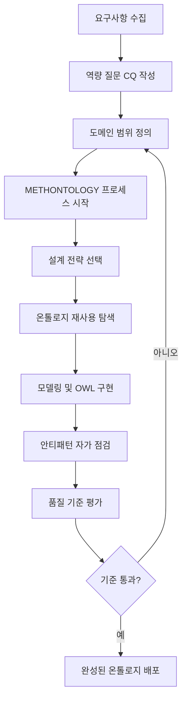

# 5단계: 설계 방법론 — 왜 "방법"이 중요한가

## 이 단계에서 배우는 것

온톨로지를 올바르게 만드는 것은 OWL 문법을 아는 것으로 충분하지 않습니다. 경험 많은 온톨로지 엔지니어와 초보자의 차이는 바로 <strong>체계적인 방법론(Design Methodology)</strong>을 아느냐에 있습니다. 이번 단계에서는 현장에서 검증된 방법론적 도구들을 배웁니다.

## 학습 목표

이 단계를 마치면 다음을 할 수 있습니다.

- 온톨로지 설계 방법론의 필요성을 구체적인 사례로 설명할 수 있다.
- METHONTOLOGY, 역량 질문(CQ), 설계 전략, 재사용, 안티패턴, 품질 기준의 상호 관계를 도식으로 표현할 수 있다.
- 실제 프로젝트에서 적절한 방법론을 선택하고 적용할 수 있다.
- 동료의 온톨로지에서 안티패턴을 발견하고 개선안을 제안할 수 있다.

## 이번 단계 전체 그림

## 왜 방법론이 필요한가?

> **왜 필요한가?** 온톨로지를 "그냥 만들면" 안 되는 이유는 무엇인가?
>
> 소프트웨어 개발에서 설계 패턴이나 개발 방법론(예: Agile, TDD)이 없으면 결과물이 제각각이 되고, 유지보수가 어려워지며, 팀원 간 소통이 단절됩니다. 온톨로지도 마찬가지입니다. 방법론 없이 만든 온톨로지는 일관성(Consistency)이 없고, 다른 시스템과 통합하기 어려우며, 작성자 혼자만 이해하는 "개인 사전"이 되어버립니다.

초창기 온톨로지 개발은 종종 "전문가의 직관"에 의존했습니다. 지식 공학자(Knowledge Engineer)가 도메인 전문가와 인터뷰하여 개념들을 직접 OWL로 변환하는 방식이었습니다. 이 방식의 문제점은 다음과 같습니다.

- **범위 폭발(Scope Creep)**: 어디서 멈춰야 할지 몰라 온톨로지가 걷잡을 수 없이 커짐
- **재현 불가능성**: 다른 팀이 같은 도메인을 다시 모델링하면 완전히 다른 결과 생성
- **검증 어려움**: "이 온톨로지가 올바른가?"를 판단할 기준이 없음
- **재사용 불가**: 이미 존재하는 온톨로지를 모르고 처음부터 다시 만드는 중복 작업 반복

1990년대 중반부터 연구자들은 소프트웨어 공학의 교훈을 온톨로지 개발에 적용하기 시작했습니다. 그 결과물이 METHONTOLOGY, On-To-Knowledge, NeOn 같은 <strong>온톨로지 방법론(Ontology Engineering Methodology)</strong>입니다.

## 연결 포인트: 이전 단계와의 연결

> **연결 포인트 1**: 4단계에서 배운 OWL/RDF 문법은 "무엇을 만드는가"의 도구입니다. 이번 5단계는 "어떻게 만드는가"의 방법을 다룹니다. 도구를 알아도 방법이 없으면 좋은 집을 지을 수 없듯이, OWL 문법을 알아도 방법론 없이는 좋은 온톨로지를 만들기 어렵습니다.

## 단계 구성

이 단계는 총 6개의 세션과 1개의 실습 세션으로 구성됩니다.

| 세션 | 제목 | 핵심 질문 |
|------|------|-----------|
| 1회차 | METHONTOLOGY | 온톨로지 개발의 표준 프로세스는 무엇인가? |
| 2회차 | 역량 질문(CQ) | 내 온톨로지가 무엇을 답해야 하는가? |
| 3회차 | 설계 전략 | Top-down? Bottom-up? 어느 방향으로 모델링하는가? |
| 4회차 | 온톨로지 재사용 | 이미 있는 온톨로지를 어떻게 활용하는가? |
| 5회차 | 안티패턴 | 흔히 저지르는 실수를 어떻게 피하는가? |
| 6회차 | 품질 기준 | 내 온톨로지의 품질을 어떻게 측정하는가? |
| 실습 | 통합 실습 | 배운 것을 직접 적용할 수 있는가? |

## 왜 이 순서인가?

> **왜 필요한가?** 세션의 순서 자체가 실제 온톨로지 개발 프로세스를 반영합니다.
>
> 먼저 방법론(METHONTOLOGY)으로 전체 프레임을 잡고, 역량 질문으로 범위를 확정하며, 설계 전략으로 방향을 정하고, 재사용으로 효율성을 높이고, 안티패턴으로 실수를 피하고, 마지막으로 품질 기준으로 결과를 검증합니다. 이것이 바로 실제 온톨로지 프로젝트의 흐름입니다.

## 왜 각 세션이 연결되어 있는가?

> **왜 필요한가?** 이 단계의 각 세션은 독립적으로 배울 수 있지만, 가장 큰 효과는 순서대로 학습할 때 나타납니다.
>
> METHONTOLOGY는 전체 프레임워크를 제공하고, CQ는 그 프레임워크 내에서 구체적인 목표를 설정하며, 설계 전략은 CQ를 달성하는 방법을 안내합니다. 재사용은 설계를 효율화하고, 안티패턴은 흔한 실수를 방지하며, 품질 기준은 모든 것을 검증합니다. 이 체인이 끊어지면 방법론의 효과가 반감됩니다.

## 흔한 오해

### 오해 1: "방법론은 큰 프로젝트에만 필요하다"

소규모 온톨로지도 방법론을 따르면 이점이 있습니다. 역량 질문 5개만 먼저 작성해도, 불필요한 클래스를 크게 줄일 수 있다는 연구 결과가 있습니다. 규모와 관계없이 명시적인 의사결정 과정은 결과물의 품질을 높입니다.

### 오해 2: "방법론을 따르면 창의성이 제한된다"

방법론은 "무엇을 모델링할지"를 제한하는 것이 아니라, "어떻게 결정을 내릴지"에 대한 가이드라인을 제공합니다. 역량 질문은 창의적 발상을 가로막는 것이 아니라, 도메인 전문가와의 대화를 구조화하는 도구입니다.

### 오해 3: "방법론을 배우면 즉시 완벽한 온톨로지를 만들 수 있다"

방법론은 좋은 온톨로지를 만드는 방향을 제시하지만, 도메인 지식과 실습 없이는 충분하지 않습니다. 이번 단계의 실습이 중요한 이유가 바로 여기에 있습니다. 방법론은 나침반이지 자동 항법 장치가 아닙니다.

## 연결 포인트: 다음 단계 예고

> **연결 포인트 2**: 이 단계를 마치면 6단계(추론과 SPARQL)로 이어집니다. 방법론을 따라 잘 설계된 온톨로지는 자동 추론(Automated Reasoning)과 복잡한 SPARQL 쿼리의 기반이 됩니다. 설계가 잘못된 온톨로지는 추론 엔진이 무한 루프에 빠지거나, 쿼리 결과가 예상과 다르게 나오는 원인이 됩니다. 지금 방법론을 배우는 것이 나중의 추론을 성공시키는 열쇠입니다.

## 요약

온톨로지 설계 방법론은 직관적인 모델링의 한계를 극복하기 위해 등장했습니다. 체계적인 방법론은 범위를 통제하고, 재현 가능성을 높이며, 팀 협업을 가능하게 하고, 품질을 검증할 수 있게 합니다. 이번 단계에서는 현장에서 가장 많이 사용되는 방법론적 도구들을 순서대로 학습합니다. 시작은 온톨로지 엔지니어링의 고전적인 방법론인 METHONTOLOGY입니다.
