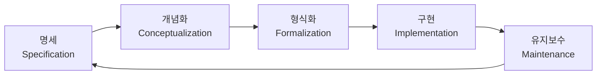

# 1회차: METHONTOLOGY

## 학습 목표

이 세션을 마치면 다음을 할 수 있습니다.

- METHONTOLOGY의 탄생 배경과 핵심 철학을 설명할 수 있다.
- 5단계 프로세스(명세, 개념화, 형식화, 구현, 유지보수)를 각각 수행할 수 있다.
- METHONTOLOGY와 다른 방법론을 비교하여 적절한 방법론을 선택할 수 있다.

## 이번 세션 전체 그림

## METHONTOLOGY란 무엇인가?

METHONTOLOGY는 1997년 스페인 마드리드 폴리테크닉 대학교(Universidad Politecnica de Madrid, UPM)의 Asuncion Gomez-Perez 교수 연구팀이 개발한 온톨로지 엔지니어링(Ontology Engineering) 방법론입니다. 이름은 "Method for Ontology"의 약자입니다.

> **왜 필요한가?** METHONTOLOGY가 등장하기 전에는 온톨로지 개발이 완전히 비형식적이었습니다. 각 팀이 자신만의 방식으로 온톨로지를 만들었기 때문에, 같은 도메인을 다른 팀이 모델링하면 완전히 다른 결과가 나왔습니다. METHONTOLOGY는 소프트웨어 공학의 생명주기(Lifecycle) 개념을 온톨로지 개발에 적용하여 이 문제를 해결했습니다.

METHONTOLOGY의 핵심 특징은 다음과 같습니다.

- **활동 기반(Activity-Based)**: 개발 과정을 명확한 활동(Activity)들로 분해
- **반복적(Iterative)**: 개발이 선형이 아닌 순환 구조로 지속적으로 개선
- **문서화 중심**: 각 단계마다 구체적인 산출물(Deliverable) 정의
- **독립적 표현**: 특정 온톨로지 언어에 종속되지 않음 (OWL 이전에 개발됨)

## METHONTOLOGY의 3가지 활동 그룹

METHONTOLOGY는 활동을 3개 그룹으로 분류합니다.

### 1. 관리 활동(Management Activities)

- **스케줄링(Scheduling)**: 작업 계획 수립
- **제어(Control)**: 진행 상황 모니터링
- **품질 보증(Quality Assurance)**: 결과물 검증

### 2. 개발 활동(Development Activities)

핵심 5단계 프로세스입니다.

| 단계 | 이름 | 한국어 | 주요 산출물 |
|------|------|--------|------------|
| 1 | Specification | 명세 | 명세 문서 |
| 2 | Conceptualization | 개념화 | 개념 모델 |
| 3 | Formalization | 형식화 | 형식 모델 |
| 4 | Implementation | 구현 | OWL/RDF 파일 |
| 5 | Maintenance | 유지보수 | 업데이트된 온톨로지 |

### 3. 지원 활동(Support Activities)

- **지식 습득(Knowledge Acquisition)**: 도메인 전문가로부터 지식 수집
- **평가(Evaluation)**: 온톨로지의 정확성, 완전성 검사
- **통합(Integration)**: 다른 온톨로지와 결합
- **문서화(Documentation)**: 온톨로지와 개발 과정 문서화
- **형상 관리(Configuration Management)**: 버전 관리

## 5단계 개발 프로세스 상세

### 1단계: 명세(Specification)

> **왜 필요한가?** 명세 단계 없이 바로 모델링을 시작하면, 온톨로지의 목적, 범위, 대상 사용자가 불명확해집니다. 마치 건축 설계도 없이 집을 짓는 것과 같습니다. 범위가 불명확하면 온톨로지는 끝없이 커지며 결코 완성되지 않습니다.

명세 단계에서는 **무엇을 만들 것인가**를 문서화합니다.

명세 문서에 포함되는 항목:
- **목적(Purpose)**: 이 온톨로지를 왜 만드는가?
- **범위(Scope)**: 어떤 도메인을 다루는가? 어디까지 포함하는가?
- **수준(Level of Formality)**: 비형식적인가, 반형식적인가, 형식적인가?
- **대상(Intended Users)**: 누가 사용하는가?
- **사용 시나리오**: 어떻게 사용될 것인가?

예시 — 도서관 온톨로지 명세:

- 목적: 대학 도서관 자료 관리 및 검색 지원
- 범위: 도서, 논문, 저자, 출판사, 대출 정보 포함 / 개인 소장 도서 및 전자책은 제외
- 수준: 형식적 (OWL DL 사용)
- 대상: 도서관 사서 및 검색 시스템

### 2단계: 개념화(Conceptualization)

개념화 단계에서는 도메인 지식을 **비형식적인 개념 모델**로 표현합니다. 아직 특정 온톨로지 언어를 사용하지 않습니다.

주요 산출물:
- **용어 목록(Glossary of Terms)**: 도메인 핵심 용어 정의
- **개념 분류표(Concept Classification Tree)**: 개념 간의 계층 관계
- **이진 관계 표(Binary Relation Table)**: 개념 간의 관계 목록
- **인스턴스 속성 표(Instance Attribute Table)**: 각 개념의 속성

예시 — "책(Book)" 개념의 인스턴스 속성 표:

| 속성 이름 | 데이터 타입 | 카디널리티 | 예시 값 |
|-----------|------------|-----------|---------|
| ISBN | 문자열 | 정확히 1개 | "978-3-16-148410-0" |
| 제목(title) | 문자열 | 정확히 1개 | "온톨로지 입문" |
| 출판연도(year) | 정수 | 최대 1개 | 2020 |
| 페이지수(pages) | 정수 | 최대 1개 | 350 |

### 3단계: 형식화(Formalization)

> **왜 필요한가?** 자연어로 표현된 개념 모델은 여전히 모호성(Ambiguity)을 가집니다. "책은 저자가 있다"라는 문장에서 저자가 1명인가 여러 명인가? 형식화는 이러한 모호성을 제거하고 논리적으로 정확한 모델을 만듭니다. 컴퓨터가 자동 추론을 수행하려면 반드시 형식화된 표현이 필요합니다.

형식화 단계에서는 개념 모델을 **반형식적 또는 형식적 표현**으로 변환합니다. 현대에는 주로 OWL DL이 사용됩니다.

형식화에서 명확히 해야 할 것들:
- 클래스 간의 포함 관계 (rdfs:subClassOf)
- 속성의 도메인(Domain)과 범위(Range)
- 카디널리티 제약 (최소 1개, 정확히 1개 등)
- 분리 조건 (disjoint: 두 클래스에 동시에 속할 수 없음)
- 전이성, 대칭성 등 속성의 특성

### 4단계: 구현(Implementation)

구현 단계에서는 형식 모델을 **실제 온톨로지 언어**로 인코딩합니다. 현대 온톨로지 프로젝트에서는 OWL 2와 Turtle 또는 RDF/XML 직렬화를 사용합니다.

이 단계에서는 Protege 같은 온톨로지 편집기를 사용하거나, 직접 Turtle 형식으로 작성합니다. 자동 추론기(Reasoner)로 일관성을 검사하는 것도 이 단계에서 수행합니다.

### 5단계: 유지보수(Maintenance)

유지보수 단계에서는 온톨로지를 **최신 상태로 유지**하고 개선합니다.

> **왜 필요한가?** 온톨로지는 정적인 산출물이 아닙니다. 도메인 지식이 변하고, 새로운 사용 사례가 생기고, 오류가 발견됩니다. 유지보수가 없으면 온톨로지는 금방 현실을 반영하지 못하는 "화석"이 됩니다. 살아있는 온톨로지는 지속적인 유지보수를 필요로 합니다.

유지보수 활동:
- **수정(Correction)**: 발견된 오류 수정
- **적응(Adaptation)**: 도메인 변화 반영
- **개선(Improvement)**: 성능, 가독성, 재사용성 향상
- **버전 관리**: 변경 이력 추적 (Git 등 활용)

## METHONTOLOGY vs 다른 방법론

| 방법론 | 개발 기관 | 특징 | 적합한 경우 |
|--------|----------|------|------------|
| METHONTOLOGY | 마드리드 폴리테크닉 (1997) | 생명주기 기반, 문서화 중심 | 대규모, 장기 프로젝트 |
| On-To-Knowledge | EU 프로젝트 (2000) | 비즈니스 프로세스 중심 | 기업 지식 관리 |
| NeOn Methodology | EU 프로젝트 (2006) | 재사용과 협업 중심 | 온톨로지 네트워크 구축 |
| UPON | IBM (2005) | UML 기반, 애자일 친화적 | 소프트웨어 개발 통합 |

## 연결 포인트

> **연결 포인트 1**: METHONTOLOGY의 명세(Specification) 단계는 다음 세션에서 배울 역량 질문(Competency Questions, CQ)과 직접 연결됩니다. CQ는 명세 단계에서 온톨로지의 목적과 범위를 구체화하는 가장 효과적인 도구입니다. METHONTOLOGY가 "무엇을 해야 하는가"를 정의한다면, CQ는 "어떻게 범위를 잡는가"의 구체적인 방법입니다.

> **연결 포인트 2**: METHONTOLOGY의 개념화(Conceptualization) 단계는 3회차의 설계 전략(Top-down, Bottom-up, Middle-out)과 연결됩니다. 개념화 단계에서 어떤 전략을 선택하느냐가 온톨로지의 전체 구조를 결정합니다.

## 흔한 오해

### 오해 1: "METHONTOLOGY는 순차적이고 엄격한 방법론이다"

METHONTOLOGY는 워터폴(Waterfall) 방식처럼 보이지만, 실제로는 반복적(Iterative)입니다. 구현 단계에서 문제를 발견하면 개념화 단계로 되돌아갈 수 있습니다. 유지보수 단계가 명세 단계로 이어지는 순환 구조도 반복적 특성을 보여줍니다.

### 오해 2: "METHONTOLOGY는 구식이라 현재는 사용되지 않는다"

1997년에 개발되었지만, METHONTOLOGY의 핵심 개념들은 여전히 현대 온톨로지 개발에 유효합니다. 특히 명세, 개념화, 형식화의 3단계 구분은 모든 현대 온톨로지 방법론에서 공통적으로 채택된 개념입니다. Protege, OWL API 등 현대 도구와 함께 사용됩니다.

### 오해 3: "명세 문서가 완벽해야 다음 단계로 넘어갈 수 있다"

완벽한 명세는 존재하지 않습니다. METHONTOLOGY는 초기 명세가 불완전해도 개발을 시작하고, 개발 과정에서 명세를 지속적으로 개선할 것을 권장합니다. 중요한 것은 명세를 문서화하는 행위 자체이며, "완벽한 명세"를 기다리다 프로젝트가 시작도 못하는 분석 마비(Analysis Paralysis)를 피해야 합니다.

## 실습

### 기본 실습

**실습 1-1**: 다음 시나리오를 읽고 METHONTOLOGY의 명세 문서를 작성하시오.

시나리오: 우리 대학교 학과에서 교수진의 연구 관심 분야와 학생들의 수강 과목을 연결하는 온톨로지를 만들려고 합니다. 학생들이 자신의 관심 연구 분야와 관련된 교수를 찾을 수 있게 하려는 목적입니다.

작성 항목:
- 목적 (1-2문장)
- 범위 (포함/제외 목록 각 3개 이상)
- 수준 (형식성 정도와 이유)
- 대상 사용자 (2가지 이상)
- 예상 사용 시나리오 (2가지 이상)

### 도전 실습

**실습 1-2**: 위 시나리오의 명세를 기반으로 개념화 단계의 용어 목록(Glossary)을 작성하시오. 최소 10개의 핵심 용어를 포함하고, 각 용어에 대해 정의와 예시를 제공하시오. 또한 적어도 3개의 이진 관계(Binary Relation)를 식별하고 도메인과 범위를 명시하시오.

## 요약

METHONTOLOGY는 온톨로지 개발을 5단계(명세, 개념화, 형식화, 구현, 유지보수)의 반복적 프로세스로 구조화한 방법론입니다. 1997년에 개발되었지만, 핵심 원칙들은 현대 온톨로지 엔지니어링에서도 유효합니다. 각 단계는 명확한 산출물을 가지며, 이전 단계로 되돌아갈 수 있는 반복적 구조를 통해 점진적으로 온톨로지를 완성합니다. 다음 세션에서는 명세 단계를 더 구체화하는 도구인 역량 질문(Competency Questions, CQ)을 배웁니다.
