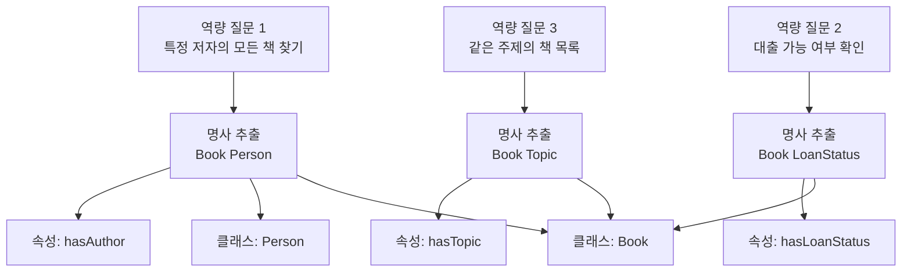

# 2회차: 역량 질문(Competency Questions)

## 학습 목표

이 세션을 마치면 다음을 할 수 있습니다.

- 역량 질문(Competency Questions, CQ)의 개념과 역할을 설명할 수 있다.
- 좋은 CQ와 나쁜 CQ를 구별하고, 올바른 CQ를 작성할 수 있다.
- CQ에서 온톨로지의 클래스와 속성을 도출하는 방법을 적용할 수 있다.
- 실제 도메인에서 CQ 집합을 설계할 수 있다.

## 이번 세션 전체 그림



## 역량 질문이란 무엇인가?

역량 질문(Competency Questions, CQ)은 온톨로지가 반드시 답할 수 있어야 하는 질문들의 집합입니다. 1994년 Tom Gruber의 정의를 발전시킨 개념으로, 온톨로지의 **요구사항 명세(Requirement Specification)** 도구입니다.

CQ의 핵심 아이디어는 다음과 같습니다:
- 온톨로지를 만들기 전에, 그 온톨로지로 무엇을 할 것인지 먼저 정의한다.
- 사용자가 실제로 물어볼 질문들을 목록으로 만든다.
- 온톨로지는 이 질문들 모두에 답할 수 있어야 한다.
- CQ에 답하지 못하는 온톨로지는 미완성이다.

> **왜 필요한가?** CQ가 없으면 온톨로지 개발자는 "무엇이 충분한가"를 알 수 없습니다. 명세는 추상적인 목적을 정의하지만, CQ는 구체적이고 측정 가능한 성공 기준을 제공합니다. CQ는 온톨로지의 단위 테스트(Unit Test)와 같습니다. 소프트웨어 개발에서 TDD(Test-Driven Development)가 테스트를 먼저 작성하듯, 온톨로지 개발도 CQ를 먼저 작성하고 시작합니다.

## CQ의 역할: 세 가지 기능

### 1. 범위 정의(Scope Definition)

CQ는 온톨로지의 경계를 설정합니다. CQ에 없는 질문에 대한 답은 온톨로지의 범위 밖입니다. 이것은 의도적인 결정입니다.

예: 도서관 온톨로지에서 "이 책의 표지 색깔은 무엇인가?"라는 질문이 CQ 목록에 없다면, 책의 물리적 외형은 이 온톨로지의 범위가 아닙니다.

### 2. 요구사항 명세(Requirement Specification)

CQ는 온톨로지가 반드시 표현해야 할 지식 구조를 간접적으로 명시합니다. 각 CQ를 분석하면 필요한 클래스와 속성이 자연스럽게 도출됩니다.

### 3. 평가 기준(Evaluation Criterion)

개발 완료 후, CQ를 SPARQL 쿼리로 변환하여 온톨로지를 테스트합니다. 모든 CQ를 SPARQL로 표현하고 올바른 결과가 나오면 온톨로지가 충분함을 의미합니다.

## 좋은 CQ의 특성

좋은 CQ는 다음 5가지 특성을 가집니다.

| 특성 | 설명 | 나쁜 예 | 좋은 예 |
|------|------|---------|---------|
| 구체성 | 답이 하나로 결정됨 | "책에 대해 뭘 알 수 있나?" | "특정 ISBN의 책 제목은?" |
| 도메인 관련성 | 온톨로지 범위 내 질문 | "책의 무게는 얼마인가?" | "이 책의 저자는 누구인가?" |
| SPARQL 표현 가능 | 쿼리로 변환 가능 | "이 책이 좋은가?" | "이 책의 출판연도는?" |
| 단일 관심사 | 한 번에 하나의 정보 요청 | "저자와 출판사와 연도는?" | "이 책의 저자는 누구인가?" |
| 검증 가능 | 정답이 존재함 | "이 저자가 유명한가?" | "이 저자가 쓴 책은 몇 권인가?" |

> **왜 필요한가?** CQ를 잘 작성하는 것이 중요한 이유는, 나쁜 CQ는 온톨로지 설계를 잘못된 방향으로 이끌기 때문입니다. 모호한 CQ는 불필요하게 크거나 작은 온톨로지를 만드는 원인이 됩니다. CQ 작성에 투자하는 시간은 나중의 설계 오류를 수정하는 시간보다 훨씬 적습니다.

## 실제 CQ 예시: 도서관 온톨로지

다음은 도서관 온톨로지를 위한 역량 질문 집합입니다.

### 기본 CQ (Basic Competency Questions)

**CQ1**: 특정 저자(예: 홍길동)가 쓴 모든 책을 찾을 수 있는가?
- 필요한 클래스: Book, Person
- 필요한 속성: hasAuthor

**CQ2**: 특정 ISBN(예: 978-3-16-148410-0)을 가진 책의 제목은 무엇인가?
- 필요한 클래스: Book
- 필요한 속성: isbn, title (데이터 속성)

**CQ3**: 특정 주제(예: "온톨로지")에 관한 책 목록을 검색할 수 있는가?
- 필요한 클래스: Book, Topic
- 필요한 속성: hasTopic

**CQ4**: 현재 대출 가능한 책 목록을 알 수 있는가?
- 필요한 클래스: Book, LoanStatus
- 필요한 속성: hasLoanStatus

**CQ5**: 특정 출판사(예: "정보문화사")에서 출판한 책 목록은 무엇인가?
- 필요한 클래스: Book, Publisher
- 필요한 속성: hasPublisher

### 심화 CQ (Advanced Competency Questions)

**CQ6**: 특정 학생(예: 김학생)이 지난 1년 동안 대출한 책은 무엇인가?
- 필요한 클래스: Book, Student, LoanRecord
- 필요한 속성: borrowedBy, loanDate

**CQ7**: 5회 이상 대출된 인기 도서 목록을 알 수 있는가?
- 필요한 클래스: Book, LoanRecord
- 필요한 속성: loanCount 또는 집계(COUNT)

**CQ8**: 같은 저자가 쓴 다른 책을 추천받을 수 있는가?
- 필요한 클래스: Book, Person
- 필요한 속성: hasAuthor (역방향 추론 필요)

## CQ에서 클래스와 속성 도출하기

CQ에서 온톨로지의 클래스와 속성을 체계적으로 도출하는 방법은 다음과 같습니다.

### 단계 1: 명사 추출 → 클래스 후보

CQ의 명사구(Noun Phrase)는 클래스 후보입니다.

- "저자가 쓴 **책**" → Book 클래스
- **"저자"**가 쓴 책 → Person 또는 Author 클래스
- "특정 **주제**에 관한" → Topic 클래스
- "**대출** 가능한" → LoanStatus 또는 LoanRecord 클래스

### 단계 2: 동사 추출 → 속성 후보

CQ의 동사구(Verb Phrase)는 속성 후보입니다.

- "저자가 **썼다**" → hasAuthor (객체 속성, Object Property)
- "ISBN을 **가지다**" → isbn (데이터 속성, Data Property)
- "주제에 **관하다**" → hasTopic (객체 속성)
- "대출을 **했다**" → borrowedBy (객체 속성)

### 단계 3: 관계 방향 결정

각 속성의 도메인(Domain)과 범위(Range)를 결정합니다.

| 속성 | 도메인 | 범위 | 카디널리티 |
|------|--------|------|-----------|
| hasAuthor | Book | Person | 1 이상 |
| hasTopic | Book | Topic | 0 이상 |
| hasPublisher | Book | Publisher | 정확히 1 |
| borrowedBy | LoanRecord | Student | 정확히 1 |

## CQ를 SPARQL로 변환하기

CQ는 개발 완료 후 SPARQL로 변환하여 온톨로지를 검증합니다.

예시 — CQ1 "저자 홍길동이 쓴 모든 책":

자연어: "저자 홍길동이 쓴 모든 책의 제목을 알려주세요"

SPARQL 쿼리로는: Book 타입의 변수를 선택하여 hasAuthor 속성이 홍길동과 연결된 것들을 조회하는 패턴으로 표현됩니다. PREFIX를 선언하고, SELECT에서 원하는 변수를 지정하고, WHERE 절에서 조건을 명시합니다.

만약 이 쿼리가 결과를 반환하지 않는다면, 온톨로지에 hasAuthor 속성이 없거나, Person 인스턴스가 올바르게 추가되지 않은 것입니다.

> **왜 필요한가?** CQ를 SPARQL로 변환하는 연습이 중요한 이유는, 이 과정에서 온톨로지 설계의 오류를 조기에 발견할 수 있기 때문입니다. "SPARQL로 표현할 수 없는 CQ"가 발견되면, 온톨로지 설계 또는 CQ 자체를 수정해야 합니다.

## 연결 포인트

> **연결 포인트 1**: CQ는 METHONTOLOGY의 명세(Specification) 단계와 개념화(Conceptualization) 단계를 연결하는 다리 역할을 합니다. 명세에서 "무엇을 만들지"를 정했다면, CQ는 "그 목적을 달성했는지"를 구체적으로 측정하는 도구입니다.

> **연결 포인트 2**: CQ에서 도출된 클래스 목록은 다음 세션의 설계 전략(Top-down, Bottom-up)을 적용하는 출발점이 됩니다. 어떤 클래스가 더 추상적이고 어떤 클래스가 더 구체적인지 파악하면, 계층 구조를 어떤 방향으로 구성할지 결정할 수 있습니다.

## 흔한 오해

### 오해 1: "CQ가 많을수록 좋은 온톨로지가 된다"

CQ는 품질이 더 중요합니다. 10개의 명확하고 검증 가능한 CQ가 100개의 모호한 CQ보다 훨씬 가치 있습니다. CQ의 수보다는 온톨로지의 핵심 사용 시나리오를 모두 포괄하는가가 중요합니다.

### 오해 2: "CQ는 시스템 개발자만 작성할 수 있다"

CQ는 도메인 전문가(Domain Expert)와 함께 작성해야 합니다. 도메인 전문가만이 실제로 필요한 질문이 무엇인지 알고 있습니다. 온톨로지 엔지니어의 역할은 도메인 전문가의 질문을 형식화하는 것입니다.

### 오해 3: "CQ는 구현 후에도 변경할 수 없다"

CQ는 살아있는 문서입니다. 구현 과정에서 새로운 사용 사례가 발견되거나, 기존 CQ가 불명확하다는 것이 드러나면 적극적으로 수정해야 합니다. CQ의 변경은 온톨로지 설계의 변경을 의미하므로, 변경 이유를 문서화하는 것이 중요합니다.

## 실습

### 기본 실습

**실습 2-1**: "대학교" 도메인에서 다음 조건을 만족하는 CQ 5개를 작성하시오.

조건:
- 각 CQ는 하나의 명확한 질문이어야 한다.
- 각 CQ에서 필요한 클래스를 1-3개 식별하시오.
- 각 CQ에서 필요한 속성을 1-2개 식별하시오.

힌트가 되는 사용 시나리오:
- 교수가 강의하는 과목 찾기
- 학생이 수강 신청한 과목 확인
- 같은 전공의 학생 목록 검색
- 특정 건물에 있는 강의실 조회
- 졸업 요건 확인

### 도전 실습

**실습 2-2**: 실습 2-1에서 작성한 CQ 5개 중 2개를 선택하여, 각각에 대해 다음을 수행하시오.

1. CQ에서 도출된 클래스와 속성을 표 형식으로 정리하시오.
2. 해당 CQ를 SPARQL 쿼리로 (가상의 URI를 사용하여) 작성하시오.
3. 이 SPARQL이 실제로 동작하려면 어떤 데이터가 온톨로지에 있어야 하는지 설명하시오.

## 완전한 온톨로지 설계 워크스루

이 섹션에서는 CQ부터 시작하여 완성된 온톨로지까지의 전체 과정을 실제로 walkthrough해 보겠습니다. 이 과정은 앞으로 모든 온톨로지 프로젝트에서 따르게 될 표준 워크플로우입니다.

### 시나리오: 대학 강의 평가 시스템

**배경**: 우리 대학은 강의 평가 시스템을 구축하려 합니다. 학생들은 수강한 강의에 대해 평가를 남기고, 다른 학생들은 이 평가를 참고하여 수강 신청을 결정합니다.

#### STEP 1: 도메인 분석 및 이해관계자 식별

먼저 시스템의 이해관계자(Stakeholders)를 명확히 합니다.

- **학생**: 강의 평가 작성, 다른 학생의 평가 조회
- **교수**: 본인 강의에 대한 평가 확인, 평가 통계 분석
- **행정처**: 전체 강의 만족도 모니터링, 강의 개선 지원
- **시스템 관리자**: 평가 데이터 관리, 사용자 계정 관리

> **왜 필요한가?** 이해관계자를 명확히 식별하지 않으면, 어떤 질문을 CQ로 포함해야 할지 결정할 수 없습니다. 교수에게 중요한 질문과 학생에게 중요한 질문은 다릅니다. 모든 이해관계자의 요구를 균형 있게 반영해야 합니다.

#### STEP 2: 초기 역량 질문 수집

각 이해관계자에게 "이 시스템으로 무엇을 알고 싶은가?"라고 질문하여 초기 CQ를 수집합니다.

**학생 중심 CQ**:
- "홍길동 교수님의 '온톨로지 개론' 강의는 만족도가 어떤가?"
- "컴퓨터공학과의 3학년 전공 과목 중 평점이 4.0 이상인 강의는?"
- "이번 학기에 개설된 인기 강의 Top 10은?"

**교수 중심 CQ**:
- "내 강의의 평균 평점은 학과 평균과 비교해서 어느 정도인가?"
- "내 강의에 대한 평가 추이(최근 3년)는 어떠한가?"
- "어떤 평가 항목(성적, 내용, 태도 등)에서 점수가 가장 낮은가?"

**행정처 중심 CQ**:
- "학과별 평균 강의 만족도는?"
- "평가 참여율이 가장 낮은 강의는?"
- "학기별 전체 평균 평점의 변화 추이는?"

#### STEP 3: CQ 정제 및 개념 추출

수집된 CQ를 분석하여 중복을 제거하고, 모호한 표현을 명확히 합니다. 그리고 각 CQ에서 필요한 개념을 추출합니다.

예시 — CQ 분석 결과:

**CQ1**: "홍길동 교수님의 '온톨로지 개론' 강의 만족도는?"
- 추출된 명사: 교수(Person), 강의(Course), 만족도(Rating)
- 추출된 동사: 가르치다(teaches), 평가하다(rates)

**CQ2**: "컴퓨터공학과 3학년 전공 과목 중 평점 4.0 이상 강의는?"
- 추출된 명사: 학과(Department), 학년(Year), 강의(Course), 평점(Rating)
- 추출된 동사: 개설하다(offeredBy), 속하다(belongsTo)

**CQ3**: "이번 학기 인기 강의 Top 10"
- 추출된 명사: 학기(Semester), 강의(Course), 수강 인원(Enrollment)
- 추출된 동사: 수강하다(enrollsIn)

정제된 개념 목록 (첫 번째 버전):

**클래스 후보**:
- Person (사람: 학생, 교수)
- Course (강의)
- Department (학과)
- Rating (평가)
- Semester (학기)
- Enrollment (수강 신청)

**속성 후보**:
- teaches (교수가 강의를 가르침): Course → Person
- rates (학생이 강의를 평가함): Rating → Person
- hasRating (강의가 평가를 가짐): Course → Rating
- offeredBy (강의가 학과에서 개설됨): Course → Department
- belongsTo (사람이 학과에 속함): Person → Department
- enrollsIn (학생이 강의를 수강함): Enrollment → Course, Enrollment → Person

#### STEP 4: 초기 클래스 계층 설계 (Middle-out 전략)

Middle-out 전략으로 핵심 클래스인 Course를 중심으로 계층을 확장합니다.

```
상위 추상화:
Course → LearningActivity (학습 활동) → Event (사건)

하위 구체화:
Course → UndergraduateCourse (학부 과목)
         → GraduateCourse (대학원 과목)
         → ElectiveCourse (교양 과목)
```

**설계 결정**:
- Person 클래스: 학생과 교수를 하나의 Person 클래스로 통합
  - 이유: 한 사람이 학생이자 동시에 조교인 경우가 있음
  - 역할(Role)로 구분: hasRole 속성으로 "Student", "Professor" 등의 Role 개체 연결
- Course와 Department: 강의는 학과에 속함 (offeredBy 속성)
- Rating: 독립된 클래스로 설계
  - 이유: 단순한 숫자가 아니라, 평가자, 평가 시점, 평가 항목별 점수 등을 포함해야 함

#### STEP 5: 속성 상세 설계

추출한 속성 후보를 OWL 속성으로 정교화합니다.

**객체 속성(Object Properties)**:
1. teaches (교수 → 강의)
   - 도메인: Person
   - 범위: Course
   - 제약: 교수만 가르칠 수 있음 (SubPropertyOf: involvedIn)

2. enrolledIn (학생 → 강의)
   - 도메인: Person
   - 범위: Course
   - 제약: 학생만 수강 가능

3. hasRating (강의 → 평가)
   - 도메인: Course
   - 범위: Rating
   - 카디널리티: 0 이상 (한 강의에 여러 평가 가능)

4. hasAuthor (평가 → 평가자)
   - 도메인: Rating
   - 범위: Person

5. offeredBy (강의 → 학과)
   - 도메인: Course
   - 범위: Department
   - 카디널리티: 정확히 1 (모든 강의는 하나의 학과에서 개설)

**데이터 속성(Data Properties)**:
1. ratingScore (평가 점수)
   - 도메인: Rating
   - 범위: decimal (0.0 ~ 5.0)
   - 기능성(Functional): True (한 평가는 하나의 점수)

2. courseTitle (강의 제목)
   - 도메인: Course
   - 범위: string

3. courseCode (강의 코드)
   - 도메인: Course
   - 범위: string (예: "CS101")

#### STEP 6: CQ를 SPARQL로 변환하여 검증

설계한 온톨로지가 CQ에 답할 수 있는지 SPARQL 쿼리로 검증합니다.

예시 — CQ: "홍길동 교수가 가르치는 모든 강의의 평균 평점은?"

SPARQL 쿼리 (개념적):
- 변수 선언: ?course (강의), ?rating (평가)
- 패턴 매칭: ?course teaches 홍길동, ?course hasRating ?rating
- 집계: AVG(?rating.ratingScore)

만약 이 쿼리가 실패한다면:
- teaches 속성이 누락되었는가?
- ratingScore 데이터 속성이 있는가?
- Person 클래스의 인스턴스 "홍길동"이 있는가?

이 과정을 통해 온톨로지 설계의 각 단계에서 오류를 조기에 발견하고 수정합니다.

#### STEP 7: 반복 및 정제

설계는 한 번에 완성되지 않습니다. CQ를 추가하고, SPARQL로 검증하고, 필요하면 설계를 수정하는 과정을 반복합니다.

**반복 과정 예시**:
1. 새로운 CQ 추가: "평가 참여율이 50% 미만인 강의는?"
2. 이 CQ를 답하려면 Enrollment 클래스와 enrollmentCount 데이터 속성이 필요함을 발견
3. Enrollment 추가: 수강 신청 기록을 나타내는 독립 클래스
4. 다시 SPARQL로 검증

> **연결 포인트**: 이 완전한 워크스루는 앞으로 우리가 온톨로지를 설계할 때마다 따르게 될 표준 프로세스입니다. CQ → 개념 추출 → 계층 설계 → 속성 설계 → SPARQL 검증 → 반복 정제의 6단계를 모든 프로젝트에 적용할 수 있습니다. 각 단계는 서로 강하게 결합되어 있으며, 한 단계에서의 결정은 이전 단계로 돌아가게 됩니다. 이것이 애자일(Agile) 방법론의 반복 원칙을 온톨로지 설계에 적용한 것입니다.

## 요약

역량 질문(CQ)은 온톨로지가 반드시 답해야 하는 질문들의 집합으로, 온톨로지의 범위를 정의하고, 클래스와 속성 도출의 기반이 되며, 완성 후 검증의 기준이 됩니다. 좋은 CQ는 구체적이고, 도메인과 관련되어 있으며, SPARQL로 표현 가능해야 합니다. CQ 작성 시 도메인 전문가와의 협력이 필수적이며, CQ는 구현 과정에서도 지속적으로 개선될 수 있습니다. 완전한 온톨로지 설계 워크스루는 도메인 분석, CQ 수집, 개념 추출, 계층 설계, 속성 설계, SPARQL 검증, 반복 정제의 7단계로 구성되며, 이것은 모든 온톨로지 프로젝트의 표준 프로세스가 됩니다. 다음 세션에서는 CQ에서 도출된 클래스들을 어떻게 계층적으로 구성할지, 즉 설계 전략을 배웁니다.
