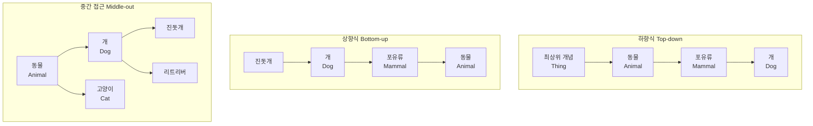

# 3회차: 설계 전략

## 학습 목표

이 세션을 마치면 다음을 할 수 있습니다.

- 하향식(Top-down), 상향식(Bottom-up), 중간 접근(Middle-out) 전략의 차이를 설명할 수 있다.
- 각 전략의 장단점을 비교하고 상황에 맞는 전략을 선택할 수 있다.
- 온톨로지 설계의 7가지 핵심 원칙을 적용할 수 있다.
- 개념 정규화(Concept Normalization)를 수행할 수 있다.

## 이번 세션 전체 그림



## 왜 설계 전략이 필요한가?

> **왜 필요한가?** 클래스 계층 구조를 어떤 방향으로 만들지는 온톨로지의 전체 구조에 영향을 미칩니다. 방향이 잘못되면 추가해야 할 개념을 찾기 어렵고, 다른 온톨로지와 통합하기 어려우며, 추론기가 의도하지 않은 결과를 내놓을 수 있습니다. 전략적 선택이 온톨로지의 장기적인 유지보수성을 결정합니다.

온톨로지를 설계할 때 가장 먼저 직면하는 질문은 "어디서부터 시작할 것인가?"입니다. 세 가지 주요 전략이 있습니다.

## 전략 1: 하향식(Top-down)

하향식 전략은 **가장 추상적인 개념에서 시작하여 점차 구체화**합니다.

### 진행 방식

1. 최상위 개념(Thing 또는 도메인의 루트 클래스)을 정의
2. 이를 하위 개념으로 분류
3. 각 하위 개념을 다시 더 구체적인 개념으로 분류
4. 충분히 구체적인 수준에 도달하면 멈춤

예시 — 동물 온톨로지:
- 생물(LivingThing)
  - 동물(Animal)
    - 포유류(Mammal)
      - 개(Dog)
        - 진돗개(JindogDog)
        - 리트리버(GoldenRetriever)
    - 조류(Bird)
      - 독수리(Eagle)

### 장점

- 전체 구조에 대한 일관성 유지가 용이
- 상위 클래스의 속성이 하위 클래스에 상속되어 중복 감소
- 철학적, 개념적으로 명확한 분류 가능
- 상위 온톨로지(Upper Ontology)와 연결하기 쉬움

### 단점

- 도메인의 세부 지식이 부족할 때 올바른 최상위 개념을 정하기 어려움
- 구체적인 사례(인스턴스)에서 발견되는 특성을 놓칠 수 있음
- 추상화 수준이 높아 도메인 전문가와 소통하기 어려울 수 있음

### 적합한 경우

- 철학적, 과학적 분류 체계가 이미 잘 정립된 도메인 (생물학, 의학)
- 상위 온톨로지(DOLCE, BFO)를 기반으로 확장할 때
- 범용적으로 사용될 기반 온톨로지를 만들 때

## 전략 2: 상향식(Bottom-up)

상향식 전략은 **가장 구체적인 개념에서 시작하여 점차 추상화**합니다.

### 진행 방식

1. 실제 사례(인스턴스)나 구체적인 개념을 수집
2. 공통점을 가진 개념들을 묶어 상위 클래스 생성
3. 계속 묶어 올라가며 계층 구조 구성
4. 충분히 추상적인 수준에 도달하면 멈춤

예시 — 구체적 개념에서 시작:
- 진돗개, 리트리버, 치와와 → 공통점: 모두 개 → Dog 클래스
- 개, 고양이, 말 → 공통점: 모두 포유류 → Mammal 클래스
- 포유류, 조류, 어류 → 공통점: 모두 동물 → Animal 클래스

### 장점

- 실제 데이터나 사례에서 출발하므로 도메인 정확성이 높음
- 도메인 전문가와 소통하기 쉬움 (구체적인 예시 사용)
- 필요한 것만 만들어 불필요한 추상화를 피할 수 있음
- 기존 데이터베이스나 데이터셋을 온톨로지로 변환할 때 유리

### 단점

- 개념 간 중복(Redundancy) 발생 가능
- 일관성 유지가 어려움 (서로 다른 사람이 비슷한 개념을 다르게 묶을 수 있음)
- 전체 구조의 균형을 맞추기 어려움
- 나중에 범위를 확장할 때 기존 계층 구조를 크게 수정해야 할 수 있음

### 적합한 경우

- 구체적인 사례 데이터가 풍부하게 존재하는 경우
- 특정 응용 프로그램을 위한 특화된 온톨로지
- 기존 데이터를 온톨로지로 마이그레이션하는 경우
- 도메인 전문가의 참여가 많고 추상화에 익숙하지 않은 경우

## 전략 3: 중간 접근(Middle-out) — 가장 권장되는 방법

> **왜 필요한가?** 하향식과 상향식 모두 단독으로 사용하면 한계가 있습니다. 하향식은 지나친 추상화로 도메인을 놓칠 수 있고, 상향식은 일관성이 부족할 수 있습니다. 중간 접근은 두 방법의 장점을 결합합니다.

중간 접근 전략은 **도메인에서 가장 핵심적인 중간 수준의 개념에서 시작하여 위아래로 확장**합니다.

### 진행 방식

1. CQ(역량 질문)에서 핵심 개념 식별 (주로 중간 수준의 구체성)
2. 이 핵심 개념들 간의 관계 정의
3. 필요에 따라 상위 개념으로 추상화 (Top-down 방향)
4. 필요에 따라 하위 개념으로 구체화 (Bottom-up 방향)
5. CQ를 모두 충족할 때까지 반복

예시 — 도서관 온톨로지에서 "Book"에서 시작:
- 상향: Book → Resource(자료) → Entity
- 하향: Book → Monograph(단행본), SerialPublication(연속간행물)
- 옆으로: Book과 Author, Publisher 연결

### 장점

- 도메인의 핵심 개념에서 출발하여 실용적
- 위아래 균형 있게 확장 가능
- 도메인 전문가와 온톨로지 엔지니어 모두가 이해하기 쉬운 중간 수준 개념 사용
- CQ와 자연스럽게 연결됨

### 단점

- 초기에 "핵심 중간 개념"을 찾는 것이 쉽지 않음
- 경험과 도메인 지식이 필요
- 상향식보다 더 많은 계획이 필요

## 7가지 설계 원칙

좋은 온톨로지 설계를 위한 7가지 핵심 원칙입니다.

### 원칙 1: 명확성(Clarity)

모든 클래스와 속성은 명확한 자연어 정의를 가져야 합니다. 정의는 객관적이어야 하며, 정의되는 용어를 포함하지 않아야 합니다. rdfs:comment와 rdfs:label을 적극 활용합니다.

### 원칙 2: 일관성(Coherence)

온톨로지의 공리(Axiom)들이 서로 모순되지 않아야 합니다. 추론기(Reasoner)를 실행했을 때 일관성 오류(Inconsistency)가 없어야 합니다.

### 원칙 3: 확장성(Extendibility)

새로운 클래스나 속성을 추가할 때 기존 구조를 변경하지 않아도 되어야 합니다. 잘 설계된 온톨로지는 확장 시 기존 공리들이 그대로 유효합니다.

### 원칙 4: 최소 인코딩 편향(Minimal Encoding Bias)

온톨로지의 개념화(Conceptualization)는 특정 구현 언어에 종속되지 않아야 합니다. OWL에서 표현하기 쉬운 방식이 아닌, 도메인을 정확히 표현하는 방식을 선택해야 합니다.

### 원칙 5: 최소 온톨로지 공약(Minimal Ontological Commitment)

온톨로지는 사용 목적에 필요한 최소한의 지식만 인코딩해야 합니다. 과도한 제약은 나중에 온톨로지를 재사용하거나 확장하는 것을 어렵게 만듭니다.

### 원칙 6: 단일 책임(Single Responsibility)

각 클래스는 하나의 명확한 개념만 표현해야 합니다. "자동차이면서 트럭"인 클래스는 설계 오류의 신호입니다.

### 원칙 7: 이름 부여 규칙(Naming Convention)

일관된 이름 부여 규칙을 사용합니다.
- 클래스: PascalCase (예: LibraryBook, PublicationDate)
- 객체 속성: camelCase로 시작, 동사구 (예: hasAuthor, isLocatedIn)
- 데이터 속성: camelCase (예: isbn, publicationYear)
- 개인(Individual): camelCase 또는 구체적 이름 (예: book123, honggildong)

## 개념 정규화(Concept Normalization)

> **왜 필요한가?** 온톨로지를 설계하다 보면 같은 개념을 다르게 표현하거나, 중복된 개념을 만들기 쉽습니다. 개념 정규화는 이런 중복과 불일치를 제거하여 온톨로지를 깔끔하게 유지합니다.

개념 정규화의 주요 과정:

**1. 동의어 통합**: "저자(Author)"와 "작성자(Writer)"를 하나의 클래스로 통합하고, 다른 하나는 별칭(skos:altLabel)으로 처리

**2. 모호성 제거**: "검색(Search)"이 행위인지 결과인지 명확히 구분

**3. 적절한 추상화 수준**: 너무 구체적인 클래스(예: "2024년에 출판된 한국 소설")는 클래스가 아닌 인스턴스나 SPARQL 쿼리로 표현

**4. 역할 vs 개체 구분**: "사서(Librarian)"는 Person 클래스의 역할(Role)인가, 독립된 클래스인가?

## 연결 포인트

> **연결 포인트 1**: 설계 전략에서 도출된 클래스 계층 구조는 다음 세션(온톨로지 재사용)과 직접 연결됩니다. 이미 잘 설계된 상위 온톨로지(예: DOLCE, BFO)가 있다면, 그것을 최상위 계층으로 사용하고 우리 도메인의 클래스를 그 아래에 추가할 수 있습니다. 이것이 Middle-out 전략과 재사용의 시너지입니다.

> **연결 포인트 2**: 7가지 설계 원칙, 특히 일관성(Coherence) 원칙은 5회차의 안티패턴과 연결됩니다. 안티패턴은 이 원칙들을 위반하는 흔한 실수들입니다. 원칙을 알면 안티패턴을 더 쉽게 인식할 수 있습니다.

## 흔한 오해

### 오해 1: "하향식이 가장 체계적이므로 항상 최선이다"

하향식은 도메인의 개념적 분류가 이미 잘 알려진 경우에만 효과적입니다. 실제 온톨로지 개발 프로젝트에서는 Middle-out이 가장 많이 사용됩니다. 완벽한 최상위 개념을 찾으려다 프로젝트가 지연되는 것이 더 큰 문제입니다.

### 오해 2: "전략을 하나 선택하면 끝까지 그것만 사용해야 한다"

실제 온톨로지 개발에서는 전략을 혼합합니다. 핵심 도메인에는 Middle-out을 사용하고, 특정 세부 영역에서는 Bottom-up을, 상위 온톨로지와 연결 시에는 Top-down 방향으로 확장할 수 있습니다.

### 오해 3: "계층이 깊을수록 온톨로지가 더 정밀하다"

계층이 너무 깊으면 오히려 온톨로지를 이해하고 사용하기 어려워집니다. 일반적으로 6-8 수준 이상의 계층은 재검토가 필요합니다. 깊은 계층보다 올바른 속성(Property)을 통한 구분이 더 효과적일 수 있습니다.

## 실습

### 기본 실습

**실습 3-1**: "대학교 온톨로지"를 위해 다음 개념들을 가지고 세 가지 전략 각각으로 클래스 계층을 설계하시오.

주어진 개념: 교수, 학생, 강의, 학과, 건물, 강의실, 시험, 학점

각 전략에 대해:
1. 계층도(트리 구조)를 작성하시오.
2. 이 전략을 선택했을 때의 장단점을 해당 도메인에서 설명하시오.
3. 어떤 전략이 이 도메인에 가장 적합한지 이유와 함께 결론을 내리시오.

### 도전 실습

**실습 3-2**: 실습 3-1에서 선택한 최적의 전략으로 설계한 온톨로지에서 7가지 설계 원칙 각각이 어떻게 적용되었는지 점검하시오. 원칙을 위반하는 부분이 있다면 수정안을 제시하시오.

## 실전 전략: Middle-out 접근법 시나리오 연구

이 섹션에서는 실제 프로젝트에서 Middle-out 전략을 적용하는 구체적인 시나리오를 통해, 이론을 실전에 어떻게 적용하는지 학습합니다.

### 시나리오: 스마트 시티 IoT 데이터 통합 온톨로지

**프로젝트 배경**:
- 대전광역시가 스마트 시티 프로젝트를 진행 중
- 다양한 IoT 센서(공기질, 교통, 주차, 날씨, 에너지)에서 데이터 수집
- 서로 다른 형식의 데이터를 통합하여 분석하려 함
- 도시 계획, 실시간 모니터링, 시민 정보 서비스 등 다양한 응용 필요

### STEP 1: 초기 CQ 수집 및 분석

**이해관계자 인터뷰 결과**:

도시 계획가:
- "중앙로의 평균 대기질은?"
- "어느 구역에서 교통 체증이 가장 심한가?"
- "주차장 이용륨이 80% 이상인 곳은?"

시민 서비스 팀:
- "내 집 근처 공원의 현재 날씨는?"
- "지금 오후 5시에 용두동에서 주차할 수 있는가?"
- "서구 청사大楼 현재 전력 사용량은?"

데이터 엔지니어:
- "센서별 데이터 수집 주기는?"
- "어떤 센서가 오작동을 보이는가?"
- "실시간 스트림 데이터의 볼륨은?"

> **왜 필요한가?** CQ 수집 단계에서 다양한 이해관계자의 질문을 확인하면, 온톨로지가 어떻게 사용될지 명확해집니다. 도시 계획가는 통계와 집계에 관심이 있고, 시민은 실시간 정보를 원하며, 엔지니어는 데이터 관리에 관심이 있습니다. 이 모든 요구를 하나의 온톨로지로 충족시켜야 합니다.

### STEP 2: 핵심 중간 개념 식별

CQ 분석 결과, 가장 자주 등장하는 핵심 개념들을 식별합니다:

**반복적으로 등장하는 명사**:
- Sensor (센서): 모든 CQ의 데이터 출처
- Location (위치): 센서가 설치된 장소
- Observation (관측값): 센서가 수집한 데이터
- MeasurementTime (측정 시간): 데이터의 시간 정보

**Middle-out 결정**:
- **센서(Sensor)**를 핵심 중간 개념으로 선택
- 이유: 모든 CQ가 센서에서 시작하거나 센서 데이터를 필요로 함
- 너무 추상적이지 않음(Thing, Entity 등)
- 너무 구체적이지 않음(AirQualitySensor, TrafficSensor 등)

### STEP 3: 핵심 개념에서 위아래로 확장

**상위 추상화 (Top-down 방향)**:

```turtle
# 1단계 상위: 추상화
:Sensor rdfs:subClassOf :Device .
:Device rdfs:subClassOf :PhysicalEntity .

# 2단계 상위: 기능별 분류
:Sensor rdfs:subClassOf [
    owl:unionOf (:EnvironmentalSensor :InfrastructureSensor)
] .
```

**하위 구체화 (Bottom-up 방향)**:

```turtle
# 1단계 하위: 센서 유형
:EnvironmentalSensor rdfs:subClassOf :AirQualitySensor .
:EnvironmentalSensor rdfs:subClassOf :WeatherSensor .
:InfrastructureSensor rdfs:subClassOf :TrafficSensor .
:InfrastructureSensor rdfs:subClassOf :ParkingSensor .

# 2단계 하위: 특정 센서 모델
:AirQualitySensor rdfs:subClassOf :PM25Sensor .
:AirQualitySensor rdfs:subClassOf :NO2Sensor .
```

### STEP 4: 옆으로(Lateral) 확장 - 연관 개념 추가

핵심 센서 개념과 직접 연결된 관련 개념들을 추가합니다.

```turtle
# 센서의 위치
:locatedAt a owl:ObjectProperty ;
    rdfs:domain :Sensor ;
    rdfs:range :Location .

# 센서의 관측값
:makesObservation a owl:ObjectProperty ;
    rdfs:domain :Sensor ;
    rdfs:range :Observation .

# 관측값의 속성
:Observation a owl:Class ;
    :hasMeasurementValue a owl:DatatypeProperty ;
    :hasMeasurementTime a owl:DatatypeProperty ;
    :hasMeasurementUnit a owl:DatatypeProperty .
```

### STEP 5: CQ 검증 및 반복 정제

초기 설계를 CQ로 검증합니다.

**검증 CQ**: "중앙로의 평균 대기질은?"

SPARQL 개념적 쿼리:
```
PREFIX : <http://smartcity.example.org/>

SELECT AVG(?pm25Value)
WHERE {
  ?sensor a :PM25Sensor ;
          :locatedAt :중앙로 ;
          :makesObservation ?obs .
  ?obs :hasMeasurementValue ?pm25Value ;
       :hasMeasurementTime ?time .
  FILTER (?time > "2025-03-01T00:00:00"^^xsd:dateTime)
}
```

**발견된 문제**:
- "중앨로"라는 Location 인스턴스를 어떻게 정의할 것인가?
- Location도 계층이 필요한가? (예: Location → District → Street)

**확장 설계**:
```turtle
:Location a owl:Class .
:District rdfs:subClassOf :Location .
:Street rdfs:subClassOf :Location .
:중앙로 a :Street ;
    :partOf :중구 .
```

### STEP 6: 재사용 기회 식별

기존 온톨로지를 재사용할 기회를 찾습니다.

**SOSA (Sensor, Observation, Sample, and Actuator)**:
- W3C 표준 센서 온톨로지
- Sensor, Observation, Measurement 클래스 재사용 가능
- 우리 설계의 Sensor, Observation와 유사

**재사용 결정**:
- SOSA의 sosa:Sensor를 최상위 클래스로 사용
- 우리의 센서들은 sosa:Sensor의 하위 클래스
- SOSA의 sosa:observedProperty 속성 재사용
- 시간 정보는 sosa:resultTime 재사용

**통합 설계**:
```turtle
@prefix sosa: <http://www.w3.org/ns/sosa/> .

:AirQualitySensor rdfs:subClassOf sosa:Sensor .
:Observation rdfs:subClassOf sosa:Observation .
:observedProperty rdfs:subPropertyOf sosa:observedProperty .
```

> **연결 포인트**: 이것이 Middle-out 전략과 온톨로지 재사용의 시너지입니다. 4회차에서 배울 owl:imports를 사용하여 SOSA를 가져오면, 우리의 센서 온톨로지는 W3C 표준과 호환됩니다. 다른 스마트 시티 프로젝트와 데이터 교환이 가능해집니다.

### Middle-out 전략의 실전 효과

**전통적 Top-down의 문제**:
- 최상위 개념(Thing, Entity)에서 시작하면 도메인 특성을 놓치기 쉬움
- "무엇이 센서인가?"를 정의하느라 실제 요구사항을 놓침

**전통적 Bottom-up의 문제**:
- 구체적 센서(PM25Sensor, TrafficCamera)에서 시작하면 일관성 부족
- "센서"라는 상위 개념을 나중에 통합하려면 많은 수정 필요

**Middle-out의 장점**:
1. **실용적 시작**: Sensor라는 도메인 핵심 개념에서 바로 시작
2. **균형 확장**: 위로 Device, PhysicalEntity 추상화
3. **균형 확장**: 아래로 PM25Sensor, TrafficSensor 구체화
4. **자연스러운 통합**: SOSA 재사용도 자연스럽게 통합
5. **CQ와 연결**: 모든 CQ가 센서에서 시작하므로 자연스러운 흐름

### Middle-out 전략 성공의 핵심 요소

1. **올바른 "중간" 찾기**:
   - 너무 추상적이지 않아야 함 (Thing, Entity 등 회피)
   - 너무 구체적이지 않아야 함 (특정 센서 모델명 등 회피)
   - 도메인 전문가에게 "가장 자연스러운 개념"이어야 함
   - CQ에서 반복적으로 등장하는 개념이어야 함

2. **위아래 균형**:
   - 위로만 가면 너무 추상화되어 실용성 상실
   - 아래로만 가면 일관성 상실
   - 위아래 번갈아 가며 확장

3. **재사용 기회 활용**:
   - 핵심 개념을 정의한 후 기존 온톨로지 검색
   - 유사한 개념이 있으면 재사용 또는 확장
   - 표준(SOSA, Schema.org, FOAF) 우선 고려

4. **반복적 정제**:
   - 한 번에 완벽한 계층을 만들려 하지 말기
   - CQ로 검증하고 부족하면 추가 확장
   - 너무 깊은 계층(8수준 이상)은 재검토

> **핵심 교훈**: Middle-out은 "단 한 번의 계획"이 아니라 "반복적인 발견 과정"입니다. 초기 핵심 개념이 잘못되었다면 언제든 다시 시작할 수 있습니다. 그러나 일단 핵심 개념을 잡으면, 위아래로 균형 있게 확장하는 것이 무작정 Top-down이나 Bottom-up으로 가는 것보다 훨씬 효율적입니다.

## 요약

온톨로지 설계 전략은 크게 하향식(Top-down), 상향식(Bottom-up), 중간 접근(Middle-out)의 세 가지입니다. 현실적으로는 Middle-out이 가장 많이 권장되며, 핵심 도메인 개념에서 시작하여 위아래로 균형 있게 확장합니다. 스마트 시티 IoT 데이터 통합 시나리오를 통해 Middle-out 전략의 실제 적용 방법을 확인했습니다. CQ 수집, 핵심 개념 식별(Sensor), 위아래 확장, 옆으로 연관 개념 추가, CQ 검증 및 반복 정제, 재사용 기회 식별의 6단계를 따르면 실용적이고 확장 가능한 온톨로지를 설계할 수 있습니다. 어떤 전략을 선택하든 명확성, 일관성, 확장성, 최소 인코딩 편향, 최소 온톨로지 공약, 단일 책임, 이름 부여 규칙의 7가지 원칙을 따라야 합니다. 다음 세션에서는 이미 존재하는 잘 설계된 온톨로지를 활용하는 방법인 온톨로지 재사용을 배웁니다.
