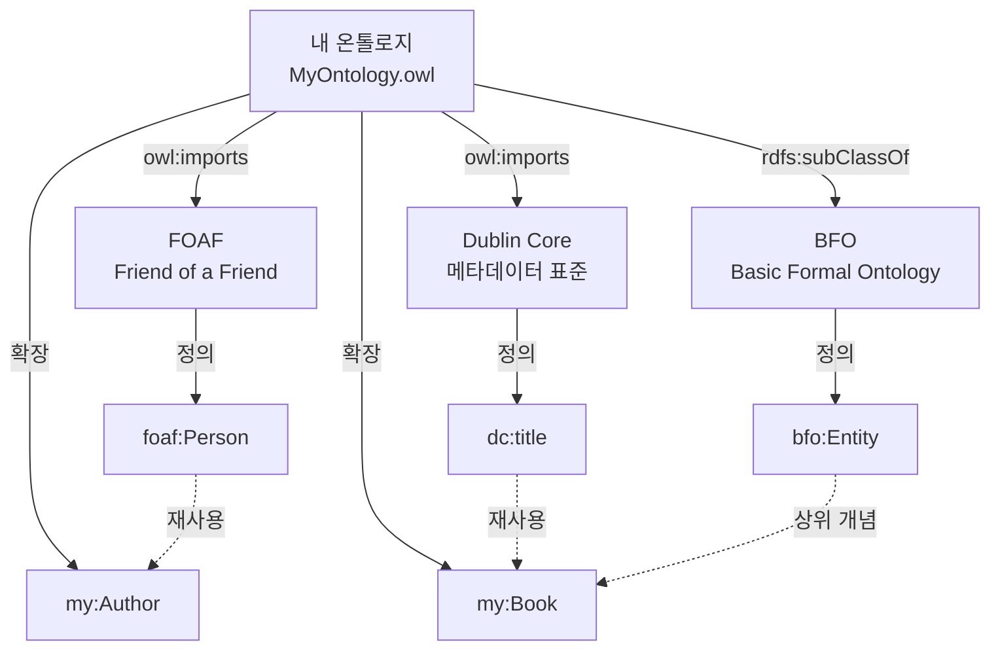

# 4회차: 온톨로지 재사용

## 학습 목표

이 세션을 마치면 다음을 할 수 있습니다.

- 온톨로지 재사용의 이점과 위험을 균형 있게 평가할 수 있다.
- Bioportal, LOV, OntoHub 등 주요 온톨로지 저장소에서 적합한 온톨로지를 찾을 수 있다.
- owl:imports를 사용하여 외부 온톨로지를 가져올 수 있다.
- DOLCE, BFO 같은 상위 온톨로지를 이해하고 활용 시나리오를 설명할 수 있다.
- 온톨로지 모듈화(Modularization)의 필요성과 방법을 이해할 수 있다.

## 이번 세션 전체 그림



## 왜 온톨로지를 재사용하는가?

> **왜 필요한가?** 온톨로지를 처음부터 만드는 것(Building from Scratch)은 시간과 비용이 많이 들고, 이미 검증된 개념들을 다시 만드는 낭비가 됩니다. 더 중요한 것은, 재사용하지 않으면 시맨틱 웹(Semantic Web)의 핵심 목표인 상호운용성(Interoperability)을 달성할 수 없다는 것입니다. 같은 "사람(Person)" 개념을 모든 온톨로지가 다르게 정의하면, 서로 다른 시스템 간 데이터 교환이 불가능해집니다.

온톨로지 재사용의 주요 이점:

- **시간 절약**: 이미 검증된 개념을 다시 정의하는 작업 생략
- **품질 향상**: 커뮤니티에서 오랫동안 검토된 온톨로지 활용
- **상호운용성**: 표준 어휘를 사용하여 다른 시스템과 데이터 교환 가능
- **추론 지원**: 검증된 공리들을 그대로 상속하여 강력한 추론 가능
- **커뮤니티 신뢰**: 널리 사용되는 온톨로지 사용으로 신뢰성 확보

## 온톨로지 저장소

### Bioportal (bioportal.bioontology.org)

**분야**: 생명과학, 의학, 생물학

Bioportal은 NCBO(National Center for Biomedical Ontology)에서 운영하는 세계 최대의 생명과학 온톨로지 저장소입니다. 900개 이상의 온톨로지와 수백만 개의 개념을 포함합니다.

주요 온톨로지:
- **GO(Gene Ontology)**: 유전자 기능 분류의 세계 표준
- **SNOMED CT**: 의료 용어 온톨로지
- **MeSH**: 의학 주제 표목 (MEDLINE/PubMed에서 사용)
- **CHEBI**: 화학 물질 온톨로지

사용 시나리오: 바이오의학 연구 데이터 온톨로지를 개발할 때, 질병 분류는 SNOMED CT를, 유전자는 GO를, 화학물질은 CHEBI를 재사용합니다.

### LOV (Linked Open Vocabularies, lov.linkeddata.es)

**분야**: 웹 데이터, Linked Open Data

LOV는 시맨틱 웹 커뮤니티가 관리하는 어휘 저장소입니다. 여기서 "어휘(Vocabulary)"는 온톨로지와 같은 의미로 사용됩니다. 700개 이상의 어휘를 포함하며, 각 어휘의 사용 횟수와 상호 연결 관계를 시각화합니다.

주요 어휘:
- **FOAF(Friend of a Friend)**: 사람, 조직, 소셜 관계 표현
- **Schema.org**: Google, Microsoft, Yahoo가 공동 개발한 웹 어휘
- **Dublin Core(DC)**: 문서 메타데이터 표준
- **SKOS**: 분류 체계와 통제 어휘 표현

사용 시나리오: 웹 애플리케이션에서 사용자 프로필 온톨로지를 만들 때, 사람(Person)은 foaf:Person을, 이름은 foaf:name을, 이메일은 foaf:mbox를 재사용합니다.

### OntoHub (ontohub.org)

**분야**: 형식적 온톨로지, 이질적 온톨로지 관리

OntoHub는 서로 다른 논리 언어로 작성된 온톨로지들을 관리하고 연결하는 플랫폼입니다.

## owl:imports 메커니즘

OWL 2는 외부 온톨로지를 가져오는 표준 메커니즘인 owl:imports를 제공합니다.

### 작동 방식

owl:imports는 지정된 URI의 온톨로지를 현재 온톨로지에 포함시킵니다. 가져온 온톨로지의 모든 클래스, 속성, 개인, 공리가 자동으로 사용 가능해집니다. 이것은 전이적(Transitive)입니다: A가 B를 import하고 B가 C를 import하면, A는 자동으로 C도 포함합니다.

예시 — 도서관 온톨로지에서 FOAF import:

Turtle 형식으로 작성 시: 온톨로지 헤더에 owl:imports 문장을 추가하여 FOAF 온톨로지를 가져옵니다. 이후 foaf:Person 클래스를 Author의 상위 클래스로 사용하거나, foaf:name을 저자 이름 속성으로 사용할 수 있습니다.

### 주의사항

- **버전 관리**: 가져오는 온톨로지의 버전이 변경되면 예상치 못한 영향을 받을 수 있음
- **오프라인 사용**: 외부 URI의 온톨로지는 인터넷 연결이 없으면 로드 불가
- **순환 참조**: A가 B를 import하고 B가 A를 import하면 순환 참조 오류 발생
- **네임스페이스 충돌**: 같은 이름의 클래스나 속성이 충돌할 수 있음

## 재사용 시 고려사항

### 1. 언어/직렬화 호환성

가져올 온톨로지가 OWL 2 DL로 작성되었는지 확인합니다. OWL Full이나 다른 언어로 작성된 경우 추론기가 처리하지 못할 수 있습니다.

### 2. 추론 복잡도 증가

> **왜 필요한가?** 온톨로지를 더 많이 가져올수록 추론기의 처리 시간이 기하급수적으로 증가할 수 있습니다. OWL DL의 복잡도가 추가될수록 의사결정 절차(Decision Procedure)의 복잡도가 높아집니다. 재사용의 이점과 성능 저하를 균형 있게 고려해야 합니다.

대응 방법:
- 필요한 부분만 모듈(Module)로 추출하여 사용
- 복잡한 공리는 로컬에 복사하여 수정
- 적절한 OWL 2 프로파일(EL, QL, RL) 선택

### 3. 버전 관리 문제

외부 온톨로지는 시간이 지남에 따라 변경됩니다. 의존하는 버전을 고정(Pinning)하는 것이 중요합니다.

방법:
- 특정 버전의 URI 사용 (예: owl:versionIRI 포함된 URI)
- 로컬에 복사본을 보관
- 변경 사항을 모니터링하는 자동화 설정

### 4. 도메인 적합성

가져오는 온톨로지가 우리 도메인의 의미를 올바르게 포착하는지 확인합니다. 비슷해 보이지만 다른 의미를 가진 클래스를 사용하면 의미적 오류가 발생합니다.

예시: foaf:Person은 자연인(Natural Person)을 의미합니다. 법인(Legal Entity)을 표현하려면 org:Organization이나 다른 클래스가 필요합니다.

## 모듈화(Modularization)

> **왜 필요한가?** 큰 온톨로지를 작은 모듈로 나누는 모듈화는 현대 온톨로지 엔지니어링의 핵심 원칙입니다. 큰 온톨로지는 이해하기 어렵고, 특정 부분만 수정하기 어려우며, 재사용하기도 어렵습니다. 모듈화된 온톨로지는 필요한 부분만 가져다 쓸 수 있습니다.

### 모듈 분리 기준

- **도메인 기반**: 각 도메인(예: 인물, 조직, 출판물)을 별도 모듈로
- **추상화 수준**: 상위 온톨로지 모듈과 도메인 모듈 분리
- **사용 빈도**: 자주 재사용되는 핵심 모듈을 분리
- **변경 빈도**: 자주 변경되는 부분을 별도 모듈로 분리

### 모듈 설계 예시: 도서관 온톨로지

- library-core.owl: Book, Author, Publisher 핵심 클래스
- library-loan.owl: LoanRecord, LoanStatus (library-core.owl import)
- library-search.owl: SearchTopic, Classification (library-core.owl import)
- library-user.owl: LibraryUser, Membership (library-core.owl, FOAF import)

## 상위 온톨로지(Upper Ontology) 활용

상위 온톨로지는 모든 도메인에 걸쳐 공통으로 사용되는 최상위 개념들을 정의합니다.

### BFO (Basic Formal Ontology)

**사용처**: 생명과학, 의학 분야에서 광범위하게 사용

BFO는 "지속자(Continuant)"와 "발생자(Occurrent)"의 근본적 구분을 제공합니다.
- Continuant: 시간에 걸쳐 지속하는 개체 (예: 사람, 책)
- Occurrent: 시간의 특정 구간에만 존재하는 과정 (예: 수업, 대출)

이 구분을 사용하면 온톨로지에서 개체와 사건의 의미적 차이가 명확해집니다.

### DOLCE (Descriptive Ontology for Linguistic and Cognitive Engineering)

**사용처**: 언어학, 인지과학, 인문학 분야

DOLCE는 인간의 언어적, 인지적 범주를 반영한 상위 온톨로지입니다. "물리적 개체(Physical Endurant)", "추상(Abstract)", "품질(Quality)" 등의 개념을 정의합니다.

### 적용 예시

내 도서관 온톨로지에서 Book을 BFO의 Continuant의 하위 클래스로 정의하면, BFO를 사용하는 다른 온톨로지(예: Gene Ontology)와 상위 수준에서 연결 가능해집니다. 이것이 시맨틱 웹 상호운용성의 실제 모습입니다.

## 연결 포인트

> **연결 포인트 1**: 온톨로지 재사용은 3회차에서 배운 Middle-out 설계 전략과 시너지를 냅니다. 중간 수준의 핵심 개념을 찾을 때, 이미 존재하는 온톨로지(예: Schema.org의 Book 클래스)를 참고하면 설계 시간을 크게 줄일 수 있습니다.

> **연결 포인트 2**: 재사용된 온톨로지가 많아질수록 6회차의 품질 평가가 더 복잡해집니다. 외부 온톨로지에서 온 공리들이 우리 온톨로지의 일관성에 영향을 미칠 수 있기 때문입니다. 재사용은 편리하지만, 그만큼 품질 관리가 중요합니다.

## 흔한 오해

### 오해 1: "유명한 온톨로지는 무조건 재사용하는 것이 좋다"

재사용 자체보다 중요한 것은 "도메인 적합성"입니다. Schema.org의 Book 클래스는 상업적 전자상거래 컨텍스트에서 정의되었습니다. 학술 도서관 온톨로지에 그대로 사용하면 의미적 부정확성이 발생할 수 있습니다. 재사용 전에 반드시 의미를 확인하세요.

### 오해 2: "온톨로지를 많이 가져올수록 온톨로지가 강력해진다"

불필요한 온톨로지를 가져오면 추론 복잡도가 증가하고, 이해하기 어려워지며, 유지보수가 복잡해집니다. 재사용은 신중하게, 필요한 것만 가져오는 것이 원칙입니다.

### 오해 3: "owl:imports는 복사(Copy)와 같다"

owl:imports는 참조(Reference)이지 복사가 아닙니다. 가져온 온톨로지가 변경되면 내 온톨로지도 영향을 받습니다. 안정적인 배포 환경을 위해서는 로컬 미러(Local Mirror)를 유지하거나 버전을 고정하는 것이 좋습니다.

## 실습

### 기본 실습

**실습 4-1**: LOV(lov.linkeddata.es)에 접속하여 다음 개념들에 해당하는 기존 어휘를 찾으시오.

찾을 개념:
1. 사람(Person)
2. 문서/출판물
3. 날짜/시간
4. 조직(Organization)
5. 위치/장소

각 개념에 대해:
- 어떤 어휘(Vocabulary)에서 찾았는가?
- 해당 클래스/속성의 전체 URI는 무엇인가?
- LOV에서 이 어휘가 몇 번 사용(재사용)되었는가?

### 도전 실습

**실습 4-2**: 2회차에서 설계한 대학교 온톨로지를 모듈화하시오.

1. 최소 3개의 모듈로 분리하고 각 모듈의 목적과 내용을 설명하시오.
2. 각 모듈 간의 의존 관계(어떤 모듈이 어떤 모듈을 import하는가)를 다이어그램으로 표현하시오.
3. 외부에서 재사용할 수 있는 기존 어휘를 최소 2개 이상 식별하고, 어떤 모듈에 어떻게 통합할지 설명하시오.

## 실전 시나리오: 온톨로지 재사용 충돌 탐지 및 해결

이 섹션에서는 온톨로지 재사용 시 발생할 수 있는 충돌(Conflict)을 어떻게 탐지하고 해결하는지 실제 시나리오를 통해 학습합니다.

### 시나리오: 다중 온톨로지 통합 프로젝트

**프로젝트 배경**:
- 연구소에서 "학술 출판물 통합 분석 시스템" 개발 중
- 세 가지 외부 온톨로지를 재사용하기로 결정:
  1. **FOAF (Friend of a Friend)**: 저자 정보 표현
  2. **BIBO (Bibliographic Ontology)**: 출판물 메타데이터
  3. **Schema.org**: Google이 검색 엔진 최적화를 위해 제공하는 웹 어휘

### STEP 1: 재사용 온톨로지 분석

**FOAF 분석**:
- 클래스: foaf:Person, foaf:Organization, foaf:Document
- 속성: foaf:name, foaf:mbox, foaf:knows
- URI: http://xmlns.com/foaf/0.1/

**BIBO 분석**:
- 클래스: bibo:Document, bibo:Article, bibo:Book, bibo:Agent
- 속성: bibo:authorList, bibo:editorList, bibo:asin
- URI: http://purl.org/ontology/bibo/

**Schema.org 분석**:
- 클래스: schema:Person, schema:Organization, schema:CreativeWork
- 속성: schema:name, schema:author, schema:datePublished
- URI: https://schema.org/

### STEP 2: 충돌 탐지 — 네임스페이스 분석

> **왜 필요한가?** 다른 온톨로지를 가져올 때 가장 먼저 발생하는 문제는 "네임스페이스 충돌"입니다. 서로 다른 온톨로지에서 같은 이름을 사용하지만 다른 의미를 가진 클래스들이 충돌합니다. 이것을 탐지하지 않으면 추론기가 의도하지 않은 결과를 낼 수 있습니다.

**충돌 1: Person 클래스 중복**

- FOAF: foaf:Person — "사람, 사람 개체, 인간"
- Schema.org: schema:Person — "사람 (생존자, 사망자, 가상)"
- 차이점: FOAF는 자연인(Natural Person)에 집중, Schema.org는 더 포괕적

**충돌 2: Document/Work 클래스 중복**

- BIBO: bibo:Document — "문서, 출판물"
- Schema.org: schema:CreativeWork — "창작물"
- FOAF: foaf:Document — "문서"
- 차이점: BIBO는 학술 출판물에 특화, Schema.org는 모든 창작물 포괄

**충돌 3: name 속성 중복**

- FOAF: foaf:name — 문자열
- Schema.org: schema:name — 문자열
- 기술적으로 동일하지만, URI가 다름

### STEP 3: 충돌 해결 전략

#### 해결 1: Person 클래스 통합

**문제**: 우리 온톨로지에 Person 클래스를 하나만 만들어야 하는가?

**해결 옵션**:

**Option A: FOAF Person만 사용**
```turtle
:Author rdfs:subClassOf foaf:Person .
```
- 장점: FOAF는 시맨틱 웹에서 가장 널리 사용되는 사람 어휘
- 단점: 법인(Legal Entity)을 표현할 때 어려움

**Option B: Schema.org Person만 사용**
```turtle
:Author rdfs:subClassOf schema:Person .
```
- 장점: Google 검색 엔진 최적화에 유리
- 단점: FOAF 기반 시스템과의 호환성 저하

**Option C: owl:equivalentClass로 동등 선언 (권장)**
```turtle
foaf:Person owl:equivalentClass schema:Person .
```
- 장점: 두 클래스가 의미적으로 동등함을 선언
- 추론기는 foaf:Person 인스턴스를 자동으로 schema:Person으로도 인식
- 단점: 미세한 의미 차이가 있을 경우 주의 필요

**최종 결정**:
- 저자(Author)는 FOAF와 Schema.org 모두와 호환되도록 설계
- owl:equivalentClass는 사용하지 않음 (미세한 의미 차이 존재)
- 대신 우리의 Author 클래스를 만들고 rdfs:subClassOf로 두 온톨로지 연결

```turtle
:Author a owl:Class ;
    rdfs:subClassOf foaf:Person ;
    rdfs:subClassOf schema:Person .
```

#### 해결 2: Document/Work 클래스 통합

**문제**: 출판물을 표현할 클래스를 선택

**해결**: BIBO의 bibo:Document를 메인으로 사용

```turtle
:AcademicPaper a owl:Class ;
    rdfs:subClassOf bibo:Document ;
    rdfs:subClassOf schema:CreativeWork .
```

**이유**:
- BIBO는 학술 출판물에 특화되어 있어 더 적합
- Schema.org는 검색 엔진 최적화를 위해 추가
- rdfs:subClassOf로 다중 상속을 사용하여 두 온톨로지의 장점 모두 활용

#### 해결 3: 속성 충돌 해결

**문제**: foaf:name과 schema:name 중 어느 것을 사용할 것인가?

**해결**: 두 속성 모두 재사용하고, 우리의 속성을 추가

```turtle
# 기존 속성 재사용
foaf:name rdfs:domain :Author .
schema:name rdfs:domain :Author .

# 우리 온톨로지 전용 속성 추가
:fullName a owl:DatatypeProperty ;
    rdfs:subPropertyOf foaf:name ;
    rdfs:domain :Author ;
    rdfs:range xsd:string .
```

**설명**:
- foaf:name과 schema:name은 그대로 사용
- fullName은 우리 온톨로지 전용 속성으로 정의
- rdfs:subPropertyOf로 foaf:name의 하위 속성임을 선언
- 추론기는 fullName을 foaf:name으로도 인식

### STEP 4: owl:imports를 사용한 통합

**최통합 온톨로지 구조**:

```turtle
@prefix foaf: <http://xmlns.com/foaf/0.1/> .
@prefix bibo: <http://purl.org/ontology/bibo/> .
@prefix schema: <https://schema.org/> .

# 온톨로지 헤더
<http://example.org/publication-ontology> a owl:Ontology ;
    owl:imports foaf: ;
    owl:imports <http://purl.org/ontology/bibo/> ;
    owl:imports schema: .

# 저자 클래스
:Author a owl:Class ;
    rdfs:label "저자"@ko ;
    rdfs:comment "학술 출판물의 저자"@ko ;
    rdfs:subClassOf foaf:Person ;
    rdfs:subClassOf schema:Person ;
    rdfs:subClassOf bibo:Agent .

# 출판물 클래스
:Paper a owl:Class ;
    rdfs:label "학술 논문"@ko ;
    rdfs:subClassOf bibo:Document ;
    rdfs:subClassOf schema:CreativeWork .

# 속성 정의
:hasAuthor a owl:ObjectProperty ;
    rdfs:domain :Paper ;
    rdfs:range :Author ;
    rdfs:subPropertyOf bibo:authorList ;
    rdfs:subPropertyOf schema:author .
```

> **연결 포인트**: 이 통합 구조는 3회차의 Middle-out 전략과 연결됩니다. 우리의 핵심 개념(Author, Paper)을 중간에 두고, 상위로 FOAF, BIBO, Schema.org를 가져옵니다. 이것이 재사용과 Middle-out의 시너지입니다.

### STEP 5: 충돌 탐지 자동화 — SHACL 검증

수동으로 충돌을 탐지하는 것은 어렵습니다. SHACL (Shapes Constraint Language)를 사용하여 자동화할 수 있습니다.

**SHACL 규칙 예시 — Person 클래스 중복 탐지**:

```turtle
@prefix sh: <http://www.w3.org/ns/shacl#> .

:PersonConflictShape a sh:NodeShape ;
    sh:targetClass foaf:Person ;
    sh:property [
        sh:path schema:name ;
        sh:severity sh:Warning ;
        sh:message "foaf:Person 인스턴스에 schema:name이 사용됨. 네임스페이스 혼동 주의."@ko
    ] .
```

이 SHACL 규칙을 실행하면:
- foaf:Person 인스턴스에 schema:name이 사용되면 경고
- 개발자가 네임스페이스를 혼용하고 있는 것을 알림

### STEP 6: 최종 검증 — SPARQL 쿼리 테스트

통합된 온톨로지가 CQ에 답할 수 있는지 검증합니다.

**검증 CQ**: "홍길동 교수가 쓴 모든 논문의 제목은?"

```sparql
PREFIX foaf: <http://xmlns.com/foaf/0.1/>
PREFIX bibo: <http://purl.org/ontology/bibo/>
PREFIX : <http://example.org/publication-ontology>

SELECT ?paperTitle
WHERE {
  ?author a :Author ;
           foaf:name "홍길동" .
  ?paper a :Paper ;
         bibo:authorList ?author ;
         bibo:title ?paperTitle .
}
```

**성공 조건**:
- 쿼리가 결과를 반환하면 통합 성공
- foaf:name(Foaf)과 bibo:authorList(BIBO)가 동시에 사용됨
- 두 온톨로지의 속성이 충돌 없이 작동

### 온톨로지 재사용 충돌 해결의 핵심 교훈

1. **사전 분석 필수**:
   - 재사용 전에 반드시 온톨로지의 클래스, 속성, 공리를 분석
   - 문서(Documentation)와 예시(Examples)를 확인

2. **네임스페이스 관리**:
   - 명확한 prefix 사용 (foaf:, bibo:, schema:)
   - 혼동을 피하기 위해 전체 URI를 주석에 기록

3. **다중 상속 전략**:
   - rdfs:subClassOf를 사용하여 여러 온톨로지의 클래스를 동시에 상속
   - owl:equivalentClass는 미세한 의미 차이가 없을 때만 사용

4. **속성 계층 활용**:
   - rdfs:subPropertyOf로 새 속성을 기존 속성의 하위 속성으로 정의
   - 추론기가 자동으로 하위 속성을 상위 속성으로 인식

5. **자동화 도구 활용**:
   - SHACL로 네임스페이스 혼용 탐지
   - Protégé의 OWL Validator로 일관성 검증

6. **점진적 통합**:
   - 한 번에 여러 온톨로지를 가져오지 말고 하나씩 통합
   - 각 단계에서 SPARQL로 검증

> **핵심 교훈**: 온톨로지 재사용은 "무조건 좋은 것"이 아닙니다. 충돌을 신중하게 탐지하고 해결해야 합니다. 그러나 충돌을 해결하고 통합하면, 단독으로 개발하는 것보다 훨씬 강력한 온톨로지를 만들 수 있습니다. 이것이 시맨틱 웹의 힘입니다.

## 요약

온톨로지 재사용은 개발 시간 절약, 품질 향상, 상호운용성 확보의 이점을 제공합니다. Bioportal, LOV, OntoHub 같은 저장소에서 적합한 온톨로지를 찾고, owl:imports 메커니즘으로 가져올 수 있습니다. 재사용 시에는 도메인 적합성, 추론 복잡도, 버전 관리, 네임스페이스 충돌을 고려해야 합니다. 다중 온톨로지 통합 시나리오를 통해 FOAF, BIBO, Schema.org를 동시에 재사용할 때 발생하는 충돌(Person, Document, name 속성 중복)을 탐지하고 해결하는 방법을 확인했습니다. rdfs:subClassOf를 사용한 다중 상속, rdfs:subPropertyOf를 사용한 속성 계층, SHACL을 사용한 자동 탐지, SPARQL을 사용한 최종 검증의 4단계 프로세스를 따르면 충돌을 최소화할 수 있습니다. 모듈화는 온톨로지를 관리 가능한 크기로 유지하는 중요한 전략입니다. DOLCE, BFO 같은 상위 온톨로지를 활용하면 더 넓은 시맨틱 웹 생태계와 연결할 수 있습니다. 다음 세션에서는 온톨로지 설계에서 흔히 저지르는 실수들인 안티패턴을 배웁니다.
