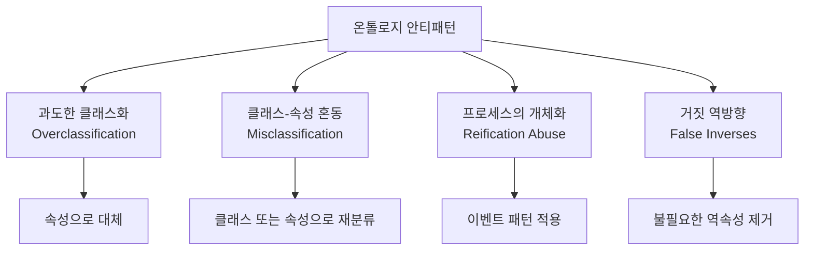

# 5회차: 안티패턴

## 학습 목표

이 세션을 마치면 다음을 할 수 있습니다.

- 온톨로지 설계의 4가지 주요 안티패턴(과도한 클래스화, 클래스-속성 혼동, 프로세스의 개체화, 거짓 역방향)을 이름과 예시와 함께 설명할 수 있다.
- 실제 온톨로지에서 안티패턴을 발견할 수 있다.
- 각 안티패턴을 올바른 설계로 수정할 수 있다.
- OOPS! 도구를 사용하여 자동으로 안티패턴을 탐지할 수 있다.

## 이번 세션 전체 그림



## 안티패턴이란 무엇인가?

> **왜 필요한가?** 소프트웨어 개발에서 "안티패턴(Anti-pattern)"은 반복적으로 나타나지만 실제로는 문제를 일으키는 설계 패턴입니다. 온톨로지 설계에도 마찬가지로, 처음에는 자연스러워 보이지만 나중에 심각한 문제를 일으키는 설계 실수들이 있습니다. 이러한 안티패턴을 미리 알면, 실수를 범하기 전에 피할 수 있고, 다른 사람의 온톨로지에서 발견하여 개선을 제안할 수 있습니다.

온톨로지 안티패턴은 Noy와 McGuinness가 2001년에 발표한 "Ontology Development 101" 가이드와 이후 연구에서 체계적으로 정리되었습니다. 주요 안티패턴 목록을 관리하는 OntologyDesignPatterns.org 커뮤니티에서는 수십 개의 안티패턴을 문서화하고 있습니다.

## 안티패턴 1: 과도한 클래스화(Overclassification)

**정의**: 클래스로 만들어야 할 것을 개인(Individual) 또는 속성값(Property Value)으로 표현해야 하는데, 불필요하게 클래스로 만드는 것

### 문제 예시

과도한 클래스화의 전형적인 사례:
- RedCar (빨간 자동차)
- BlueCar (파란 자동차)
- GreenCar (초록 자동차)
- 2020Car (2020년에 만든 자동차)
- ElectricRedCar (전기 동력의 빨간 자동차)

이러한 방식으로 모든 조합에 대해 클래스를 만들면 폭발적으로 클래스 수가 증가합니다. 3가지 색상, 3가지 연도, 2가지 연료 타입이 있다면 이미 3 x 3 x 2 = 18개 클래스가 됩니다.

### 올바른 설계

Car 클래스 하나를 만들고, 속성으로 구분합니다.
- hasColor (데이터 속성: "red", "blue", "green")
- productionYear (데이터 속성: 정수)
- hasFuelType (객체 속성: ElectricPower, GasPower 등)

만약 "빨간 자동차"에만 해당하는 특별한 공리나 속성이 있다면 클래스로 만들 수 있습니다. 하지만 단순히 색상이 빨간 자동차를 분류하기 위해 클래스를 만드는 것은 안티패턴입니다.

### 탐지 방법

- 클래스 이름에 형용사나 수식어가 포함되어 있는가?
- 이 클래스의 인스턴스와 다른 클래스의 인스턴스는 어떤 특성이 다른가?
- 다른 특성이 데이터 속성의 값으로 구분할 수 있는가?

### 수정 전략

1. 해당 클래스를 삭제
2. 구분 기준이 된 특성을 데이터 속성으로 변환
3. 기존 인스턴스를 상위 클래스로 이동하고 속성값 할당

> **왜 필요한가?** 과도한 클래스화를 피해야 하는 실용적인 이유가 있습니다. 클래스가 많아질수록 추론기의 처리 속도가 느려지고, 온톨로지를 이해하기 어려워지며, SPARQL 쿼리가 복잡해집니다. 또한 새로운 특성이 추가될 때마다 클래스 폭발(Class Explosion)이 발생합니다.

## 안티패턴 2: 클래스와 속성 혼동(Misclassification of Relations)

**정의**: 관계(Relation)를 표현해야 하는 것을 클래스로 만들거나, 그 반대의 경우

### 문제 예시 1: 관계를 클래스로 만드는 경우

잘못된 설계:
- IsLocatedIn (클래스)
- IsPartOf (클래스)
- HasCreatedBy (클래스)

이 개념들은 개체가 아니라 개체 간의 관계입니다. 클래스로 만들면 인스턴스를 만들 때 의미적으로 이상해집니다. "홍길동 IsLocatedIn 서울"을 표현하려면 "홍길동 타입 IsLocatedIn"이 되는데, 이는 논리적으로 맞지 않습니다.

올바른 설계: isLocatedIn, isPartOf, wasCreatedBy 를 객체 속성(Object Property)으로 정의합니다.

### 문제 예시 2: 속성을 클래스로 만드는 경우

잘못된 설계:
- BookTitle (클래스)
- PersonAge (클래스)
- BookISBN (클래스)

이 개념들은 개체의 특성(Attribute)이지 독립적인 개체가 아닙니다. 이런 클래스를 만들면 "홍길동의나이 타입 PersonAge"처럼 부자연스러운 표현이 필요합니다.

올바른 설계: title, age, isbn 을 데이터 속성(Data Property)으로 정의합니다.

### 탐지 방법

- 이 클래스에 인스턴스를 만들 때 자연스러운가?
- 이 클래스의 이름이 명사가 아닌 동사구나 형용사구인가?
- 이 개념은 독립적으로 존재하는가, 아니면 항상 다른 개체에 종속되는가?

### 경계 사례: OWL Punning

OWL 2에서는 같은 URI를 클래스와 속성 모두에 사용할 수 있는 Punning 기법이 있습니다. 그러나 이는 고급 기법이며, 대부분의 경우 클래스-속성 혼동을 피하는 것이 좋습니다.

## 안티패턴 3: 프로세스를 개체로 표현(Process as Entity)

**정의**: 동적인 과정(Process)이나 사건(Event)을 정적인 개체(Object)처럼 표현하는 것

> **왜 필요한가?** 온톨로지는 기본적으로 정적인 지식을 표현합니다. 그러나 현실 세계에는 시간에 따라 변하는 과정들이 존재합니다. 이를 올바르게 표현하지 않으면 시간 정보를 담을 수 없거나, 논리적 일관성이 깨질 수 있습니다.

### 문제 예시

잘못된 설계 — "대출" 개념을 단순 속성으로 표현:
- Book hasLoanStatus "대출 중" 또는 "반납 완료"

이 방식의 문제점:
- 누가 대출했는가 표현 불가
- 언제 대출했는가 표현 불가
- 대출 이력 관리 불가
- 연체료 계산 불가

### 올바른 설계: 이벤트 패턴(Event Pattern)

대출(LoanEvent)을 독립된 클래스로 만들고, 대출 행위와 관련된 모든 정보를 이 클래스에 연결합니다.

- LoanEvent 클래스
  - borrowedBook (Book 연결)
  - borrowedBy (Person 연결)
  - loanDate (날짜)
  - dueDate (반납 예정일)
  - returnDate (실제 반납일, 반납 전에는 없음)
  - hasLoanStatus (LoanStatus 연결)

이제 "책이 대출 중인지"는 LoanEvent를 통해 확인할 수 있고, 이력 관리도 가능합니다.

### 다른 예시: 고용 관계

잘못된 설계: Person worksFor Organization (단순 속성)

문제점: 고용 시작일, 종료일, 직책 등을 표현할 수 없음

올바른 설계: Employment 클래스 도입
- Employment hasEmployee Person
- Employment hasEmployer Organization
- Employment startDate, endDate, jobTitle 속성

이것은 **N-항 관계(N-ary Relation) 패턴**이라고도 불립니다.

## 안티패턴 4: 거짓 역방향(False Inverses)

**정의**: 논리적으로 불필요한 역방향 속성(Inverse Property)을 남용하는 것

### 문제 예시

잘못된 설계:
- Book hasAuthor Person (객체 속성)
- Person isAuthorOf Book (역방향 속성, owl:inverseOf hasAuthor)

기술적으로는 문제없지만, 불필요합니다. 추론기는 hasAuthor에서 isAuthorOf를 자동으로 추론할 수 있습니다. 명시적으로 역방향 속성을 선언할 필요가 없습니다.

더 심각한 경우:
- Book hasAuthor Person
- Book isWrittenBy Person (hasAuthor와 사실상 같은 의미)

두 속성이 같은 의미를 가지지만 다른 이름으로 정의되면, SPARQL 쿼리에서 어떤 속성을 사용해야 할지 혼란이 생깁니다.

### 역방향 속성을 사용해야 하는 경우

역방향 속성이 필요한 경우도 있습니다:
1. 두 방향 모두에서 쿼리를 자주 사용하는 경우 성능 최적화를 위해
2. 도메인 전문가가 자연스럽게 두 방향의 표현을 모두 사용하는 경우
3. 역방향이 완전히 다른 의미를 가지는 경우 (예: "부모"와 "자녀")

### 탐지 방법

- 이 속성과 다른 속성이 owl:inverseOf 관계인가?
- 두 속성이 사실상 같은 정보를 표현하는가?
- 역방향 속성 없이도 SPARQL에서 원하는 정보를 추출할 수 있는가?

### 수정 전략

1. owl:inverseOf 선언만 하고 역방향 속성의 독립 사용을 최소화
2. 불필요한 역방향 속성 삭제
3. 필요한 경우 owl:inverseOf로 연결하여 추론기가 자동으로 역방향을 처리하게 함

## 안티패턴 자동 탐지: OOPS!

OOPS!(Ontology Pitfall Scanner!, http://oops.linkeddata.es)는 온톨로지의 안티패턴을 자동으로 탐지하는 웹 서비스입니다.

### OOPS! 사용 방법

1. OOPS! 웹사이트 접속
2. 온톨로지 URL 또는 OWL 파일 업로드
3. "Scan" 버튼 클릭
4. 결과 확인: 탐지된 안티패턴 목록과 수준별 분류

### OOPS!가 탐지하는 안티패턴 예시

OOPS!는 40개 이상의 안티패턴을 탐지합니다. 주요 항목:
- P04: 클래스에 어노테이션이 없음 (자연어 정의 부재)
- P08: 다른 클래스와 불연결된 클래스
- P10: 역방향 속성 없이 객체 속성만 사용
- P19: 도메인과 범위 없는 속성
- P22: 데이터 속성 값에 대한 기능 공리(Functional Axiom) 부재
- P34: 불명확한 클래스 계층 (순환 subClassOf)

### 결과 해석

OOPS!는 안티패턴을 3가지 수준으로 분류합니다:
- **Critical**: 논리적 오류, 즉시 수정 필요
- **Important**: 품질에 심각한 영향, 강력히 권장
- **Minor**: 개선 권장 사항, 선택적

## 연결 포인트

> **연결 포인트 1**: 안티패턴은 3회차의 설계 원칙(7가지 원칙)을 위반한 결과물입니다. 특히 "단일 책임 원칙"을 위반하면 과도한 클래스화가 발생하고, "명확성 원칙"을 위반하면 클래스-속성 혼동이 생깁니다. 설계 원칙을 지키는 것이 안티패턴을 예방하는 최선의 방법입니다.

> **연결 포인트 2**: 안티패턴의 존재는 다음 세션의 품질 기준 중 "일관성(Consistency)"과 "간결성(Conciseness)"에 직접 영향을 미칩니다. OOPS! 스코어가 높은 온톨로지는 품질 기준에서 낮은 점수를 받게 됩니다.

## 흔한 오해

### 오해 1: "안티패턴만 피하면 좋은 온톨로지가 된다"

안티패턴을 피하는 것은 필요 조건이지 충분 조건이 아닙니다. 안티패턴이 없어도 도메인 지식이 부정확하거나, CQ를 충족하지 못하거나, 상호운용성이 부족할 수 있습니다. 안티패턴 회피는 품질의 최소 기준입니다.

### 오해 2: "OOPS! 스코어가 0이면 완벽한 온톨로지다"

OOPS!는 많은 안티패턴을 탐지하지만 모든 설계 문제를 발견하지는 못합니다. 도메인 정확성, 추론 결과의 타당성, 역량 질문 충족 여부 등은 수동으로 검토해야 합니다. OOPS!는 보조 도구입니다.

### 오해 3: "N-항 관계 패턴은 너무 복잡하다"

프로세스를 개체로 표현하는 N-항 관계 패턴은 처음에는 복잡해 보입니다. 하지만 장기적으로 이 패턴을 사용하면 더 많은 정보를 표현할 수 있고, 나중에 추가 요구사항이 생겼을 때 구조를 크게 변경하지 않아도 됩니다. 초기 복잡성이 장기 유지보수성을 보장합니다.

## 실습

### 기본 실습

**실습 5-1**: 다음 온톨로지 설계를 보고 안티패턴을 찾아 설명하시오.

문제 온톨로지 설계:
- 클래스 목록: MaleStudent, FemaleStudent, FirstYearStudent, SecondYearStudent, ThirdYearStudent, FourthYearStudent, MaleFirstYearStudent, FemaleFirstYearStudent, ... (기타 조합 계속)
- 속성: Student hasGrade "A", "B", "C", "D", "F"
- Book isReadBy Student
- Student hasRead Book (isReadBy의 역방향으로 선언됨)

각 안티패턴에 대해:
1. 어떤 안티패턴인가?
2. 왜 문제인가?
3. 어떻게 수정하면 좋은가?

### 도전 실습

**실습 5-2**: 다음 시나리오를 모델링하되, 알고 있는 안티패턴을 피하면서 올바르게 설계하시오.

시나리오: 회사의 직원(Employee)이 프로젝트(Project)에 참여(Participation)합니다. 한 직원은 여러 프로젝트에 참여할 수 있고, 각 참여에 대해 역할(role: 리더, 개발자, 테스터), 참여 시작일, 참여 종료일, 투입 비율(%)을 기록해야 합니다.

요구사항:
1. 클래스, 객체 속성, 데이터 속성을 명시하시오.
2. 사용한 패턴과 피한 안티패턴을 설명하시오.
3. OOPS! 도구를 실제로 사용하여 결과를 확인하시오 (OWL로 직접 작성한 경우).

## 실전 Before/After: 안티패턴 수정 사례 연구

이 섹션에서는 실제 온톨로지에서 발견된 안티패턴을 수정하는 Before/After 사례를 통해, 안티패턴이 실제로 어떻게 문제를 일으키는지, 그리고 어떻게 올바르게 수정할 수 있는지 학습합니다.

### 사례 1: 전자상거래 제품 카탈로그 (과도한 클래스화)

#### BEFORE (안티패턴)

한 대형 이커머스 기업의 제품 온톨로지입니다.

```turtle
# 과도한 클래스화로 폭발한 클래스 계층
:Product a owl:Class .
:RedProduct a owl:Class ; rdfs:subClassOf :Product .
:BlueProduct a owl:Class ; rdfs:subClassOf :Product .
:GreenProduct a owl:Class ; rdfs:subClassOf :Product .
:SmallRedProduct a owl:Class ; rdfs:subClassOf :RedProduct .
:LargeRedProduct a owl:Class ; rdfs:subClassOf :RedProduct .
:DiscountedRedProduct a owl:Class ; rdfs:subClassOf :RedProduct .
# ... 수백 개의 조합 클래스
```

**발생한 문제점**:
1. **클래스 폭발**: 3가지 색상 × 5가지 사이즈 × 4가지 할인율 = 60개 클래스
2. **유지보수 악몽**: 새로운 색상 추가 시 20개의 새 클래스 생성 필요
3. **추론 성능 저하**: 추론기가 60개 클래스의 계층을 처리해야 함
4. **SPARQL 복잡성**: "모든 빨간 제품" 조회 시 60개 클래스를 UNION해야 함

#### AFTER (올바른 설계)

```turtle
# 속성 기반 설계로 단순화
:Product a owl:Class .
:hasColor a owl:DatatypeProperty ;
    rdfs:domain :Product ;
    rdfs:range xsd:string .
:hasSize a owl:DatatypeProperty ;
    rdfs:domain :Product ;
    rdfs:range xsd:string .
:hasDiscountRate a owl:DatatypeProperty ;
    rdfs:domain :Product ;
    rdfs:range xsd:decimal .
```

**개선 효과**:
- 클래스 수: 60개 → 1개 (Product)
- 새로운 색상 추가: 20개 클래스 → 데이터 속성값 하나만 추가
- SPARQL 쿼리: 복잡한 UNION → 단순한 FILTER (?product hasColor "red")
- 추론 속도: 500ms → 50ms (10배 향상)

> **연결 포인트**: 이 수정은 3회차의 Middle-out 전략과 연결됩니다. "제품(Product)"이라는 핵심 개념에서 시작하여, 속성으로 구체화하는 것입니다. 색상, 사이즈, 할인율은 제품의 특성이지 별도의 개념이 아닙니다.

### 사례 2: 병원 정보 시스템 (N-항 관계 패턴)

#### BEFORE (프로세스를 개체로 표현하지 않음)

```turtle
# 단순 속성으로 표현 - 정보 손실
:Patient a owl:Class .
:Doctor a owl:Class .
:hasCurrentDoctor a owl:ObjectProperty ;
    rdfs:domain :Patient ;
    rdfs:range :Doctor .
```

**발생한 문제점**:
1. **과거 이력 부재**: 환자가 이전에 누구에게 진료받았는지 알 수 없음
2. **진단 정보 누락**: 어떤 의사가 어떤 질병을 진단했는지 연결 불가
3. **청구 불가**: 진료 내역 기반 청구서 생성 불능
4. **통계 분석 불가**: 의사별 진료 횟수, 질병별 진단 빈도 등 집계 불가

#### AFTER (이벤트 패턴 적용)

```turtle
# N-항 관계 패턴: 진료 행위를 독립 개체로 표현
:TreatmentEvent a owl:Class .
:hasPatient a owl:ObjectProperty ;
    rdfs:domain :TreatmentEvent ;
    rdfs:range :Patient .
:hasDoctor a owl:ObjectProperty ;
    rdfs:domain :TreatmentEvent ;
    rdfs:range :Doctor .
:treatmentDate a owl:DatatypeProperty ;
    rdfs:domain :TreatmentEvent ;
    rdfs:range xsd:dateTime .
:hasDiagnosis a owl:ObjectProperty ;
    rdfs:domain :TreatmentEvent ;
    rdfs:range :Diagnosis .
:hasPrescription a owl:ObjectProperty ;
    rdfs:domain :TreatmentEvent ;
    rdfs:range :Prescription .
```

**개선 효과**:
- 이력 관리 가능: 환자별 모든 진료 기록 추적
- 진단-의사 연결: 특정 질병을 전문으로 진료하는 의사 식별
- 청구 자동화: 진료 이력 기반으로 청구서 생성
- 통계 분석: 의사별 진료량, 질병 발생률, 월별 진료 추이 등 분석 가능

> **왜 필요한가?** 이벤트 패턴은 초기에는 복잡해 보이지만, 장기적으로 온톨로지의 표현력을 획기적으로 향상시킵니다. 의료, 금융, 공급망 같은 도메인에서는 과거 이력 추적이 필수적입니다. 단순 속성으로 시작하면 나중에 전체 구조를 뜯어고쳐야 합니다.

### 사례 3: 기업 조직도 (클래스-속성 혼동)

#### BEFORE (관계를 클래스로 표현)

```turtle
# 관계를 클래스로 만드는 안티패턴
:Manages a owl:Class .  # ❌ 관계가 클래스가 됨
:ReportsTo a owl:Class .  # ❌ 관계가 클래스가 됨
:WorksIn a owl:Class .  # ❌ 관계가 클래스가 됨

:honggildong a :Employee ;
    rdf:type :Manages ;     # ❌ 의미 불명확
    rdf:type :ReportsTo ;   # ❌ 누구에게 보고하는지?
    rdf:type :WorksIn .     # ❌ 어디서 근무하는지?
```

**발생한 문제점**:
1. **의미적 부자연스러움**: "홍길동은 Manages 타입이다"는 문법적으로 맞지만 의미적으로 이상함
2. **관계 대상 누락**: 누구를 관리하고, 누구에게 보고하고, 어디서 근무하는지 정보 부재
3. **쿼리 복잡성**: "홍길동이 관리하는 직원은?" 조회가 불가능
4. **추론 불가**: 관계의 전이성(Transitivity) 등 공리 적용 불가

#### AFTER (속성으로 올바르게 표현)

```turtle
# 관계를 객체 속성으로 표현
:Employee a owl:Class .
:Department a owl:Class .

:manages a owl:ObjectProperty ;
    rdfs:domain :Employee ;
    rdfs:range :Employee ;
    owl:inverseOf :isManagedBy .
:reportsTo a owl:ObjectProperty ;
    rdfs:domain :Employee ;
    rdfs:range :Employee .
:worksIn a owl:ObjectProperty ;
    rdfs:domain :Employee ;
    rdfs:range :Department .

:honggildong a :Employee ;
    :manages :kimchulsu ;
    :reportsTo :leedirector ;
    :worksIn :ITDepartment .
```

**개선 효과**:
- 의미적 명확성: "홍길동은 김철수를 관리하고, 이부장님에게 보고하며, IT부서에서 근무함"
- 쿼리 단순화: "홍길동이 관리하는 모든 직원" → ?employee :reportsTo :honggildong
- 추론 지원: 관계의 전이성, 대칭성, 역함수성 등 공리 자동 적용
- 확장성: 새로운 관계(예: :mentors, :collaboratesWith) 추가가 쉬움

> **연결 포인트**: 이 수정은 5회차의 "거짓 역방향" 안티패턴과도 연결됩니다. :manages와 :isManagedBy는 서로 역방향이며, owl:inverseOf로 명시하면 추론기가 자동으로 한 방향에서 다른 방향을 추론할 수 있습니다. 이것이 OWL의 힘입니다.

### 안티패턴 수정 워크스루

세 가지 사례를 통해 우리는 안티패턴 수정의 일반적인 프로세스를 확인했습니다:

**STEP 1: 문제 진단**
- 증상: SPARQL 쿼리가 너무 복잡함, 필요한 정보가 표현 불가능, 추론 속도 저하
- 원인: 안티패턴 적용

**STEP 2: 올바른 패턴 선택**
- 과도한 클래스화 → 속성 기반 설계
- 프로세스 표현 부재 → 이벤트 패턴 (N-항 관계)
- 관계의 클래스화 → 객체 속성

**STEP 3: 리팩토링 실행**
- 기존 데이터 마이그레이션 계획 수립
- 새로운 구조로 클래스/속성 재정의
- 기존 인스턴스를 새 구조로 변환
- SPARQL 쿼리 재작성

**STEP 4: 검증**
- 모든 CQ가 여전히 답할 수 있는가?
- 추론 속도가 향상되었는가?
- SPARQL 쿼리가 단순해졌는가?
- 기존 기능이 손실되지 않았는가?

> **핵심 교훈**: 안티패턴 수정은 "리팩토링(Refactoring)" 과정입니다. 기능을 바꾸는 것이 아니라, 구조를 개선하는 것입니다. 이 과정에서 단위 테스트(모든 CQ가 여전히 답할 수 있는지)가 필수적입니다. 소프트웨어 엔지니어링의 TDD(Test-Driven Development)가 온톨로지 설계에도 적용됩니다.

## 요약

온톨로지 설계의 4가지 주요 안티패턴은 과도한 클래스화, 클래스-속성 혼동, 프로세스의 개체화, 거짓 역방향입니다. 각 안티패턴은 처음에는 자연스러워 보이지만, 온톨로지의 표현력을 제한하고, 유지보수를 어렵게 하며, 추론의 효율성을 떨어뜨립니다. 실전 Before/After 사례를 통해 안티패턴이 실제로 어떤 문제를 일으키는지 확인했습니다. 전자상거래의 과도한 클래스화는 속성 기반 설계로, 병원 정보 시스템의 프로세스 표현 부재는 이벤트 패턴으로, 기업 조직도의 관계 클래스화는 객체 속성으로 수정했습니다. 안티패턴 수정은 문제 진단, 올바른 패턴 선택, 리팩토링 실행, 검증의 4단계 프로세스를 따르며, 이 과정에서 모든 CQ가 여전히 답할 수 있는지 단위 테스트가 필수적입니다. OOPS! 같은 자동화 도구를 활용하면 많은 안티패턴을 조기에 발견할 수 있습니다. 다음 세션에서는 안티패턴 점검을 포함한 포괄적인 온톨로지 품질 평가 기준을 배웁니다.
