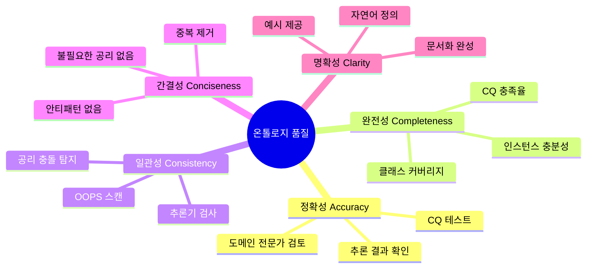

# 6회차: 품질 기준

## 학습 목표

이 세션을 마치면 다음을 할 수 있습니다.

- 온톨로지 품질의 5가지 차원을 설명하고 각각을 평가할 수 있다.
- OOPS! 도구를 사용하여 자동화된 품질 검사를 수행할 수 있다.
- 역량 질문(CQ) 기반 평가 프로세스를 적용할 수 있다.
- 온톨로지의 품질 보고서를 작성할 수 있다.

## 이번 세션 전체 그림

## 왜 품질 기준이 필요한가?

> **왜 필요한가?** "좋은 온톨로지"를 만들었다고 어떻게 확신할 수 있습니까? 직관이나 경험만으로는 충분하지 않습니다. 체계적인 품질 기준은 온톨로지의 품질을 객관적으로 측정하고, 부족한 부분을 발견하며, 개선의 방향을 제시합니다. 품질 기준 없는 온톨로지 개발은 결과물을 검증할 방법이 없습니다.

온톨로지 품질에 관한 연구는 Gruber(1995), Guarino(1998), Noy와 McGuinness(2001) 등의 선구적 연구에서 시작되었습니다. 현재 가장 널리 사용되는 품질 프레임워크는 5가지 차원으로 구성됩니다.

## 차원 1: 정확성(Accuracy)

**정의**: 온톨로지가 도메인의 지식을 올바르게 표현하는가?

정확성은 온톨로지의 내용이 실제 도메인 지식과 얼마나 일치하는가를 측정합니다.

### 정확성 평가 방법

**방법 1: 도메인 전문가 검토(Expert Review)**
- 해당 분야 전문가가 클래스, 속성, 관계의 의미적 정확성 검토
- 정의(rdfs:comment)가 전문가 관점에서 올바른지 확인
- 공리(Axiom)가 실제 도메인 규칙을 올바르게 반영하는지 확인

**방법 2: 추론 결과 확인**
- 추론기(Reasoner)를 실행하여 예상치 못한 클래스 분류 확인
- 가상의 인스턴스를 추가하고 추론 결과가 올바른지 테스트
- 일관성(Consistency) 검사 통과 확인

**방법 3: 역량 질문 기반 테스트**
- 각 CQ를 SPARQL로 변환하여 올바른 결과 반환 확인
- 정확히 예상된 인스턴스들이 반환되는지 확인
- 예상치 못한 결과(False Positive, False Negative) 탐지

### 정확성 메트릭

- CQ 충족률: (올바르게 답한 CQ 수) / (전체 CQ 수)
- 전문가 동의율: 전문가 검토에서 "동의"를 받은 항목의 비율
- 추론 오류율: 예상치 못한 추론 결과 수 / 전체 추론 결과 수

## 차원 2: 완전성(Completeness)

**정의**: 온톨로지가 다루어야 하는 도메인의 모든 중요한 개념을 포함하는가?

> **왜 필요한가?** 정확한 온톨로지도 필요한 개념이 빠져 있으면 사용할 수 없습니다. 완전성은 "필요한 것이 모두 있는가?"를 측정합니다. 완전성이 부족하면 쿼리 결과가 부정확하고, 시스템이 정보를 찾지 못하는 상황이 발생합니다.

### 완전성의 두 가지 측면

**1. 구조적 완전성(Structural Completeness)**
- 모든 CQ에 필요한 클래스와 속성이 정의되어 있는가?
- 각 클래스의 필수 속성이 모두 정의되어 있는가?
- 도메인의 핵심 관계가 모두 표현되어 있는가?

**2. 내용 완전성(Content Completeness)**
- 온톨로지에 충분한 수의 인스턴스가 있는가?
- 모든 중요한 예시 개체가 포함되어 있는가?
- 주요 분류(Classification) 체계가 완전한가?

### 완전성 평가 방법

- CQ 커버리지: 모든 CQ를 SPARQL로 표현하고 각각이 실행 가능한지 확인
- 클래스 커버리지: 도메인 전문가가 누락된 클래스를 검토
- 인스턴스 샘플링: 도메인의 대표적인 개체들이 모두 표현될 수 있는지 확인

## 차원 3: 일관성(Consistency)

**정의**: 온톨로지에 논리적 모순이 없는가?

일관성은 온톨로지의 공리들이 서로 충돌하지 않고, 추론기가 정상적으로 작동할 수 있는지를 의미합니다.

### 일관성의 종류

**1. 논리적 일관성(Logical Consistency)**
- 추론기를 실행했을 때 일관성 오류(Inconsistency)가 없음
- 어떤 클래스도 owl:Nothing(빈 클래스)으로 판정되지 않음
- 예: "Book은 Person이 아니다"와 "Book은 Person이다"를 동시에 정의하면 일관성 오류

**2. 개념적 일관성(Conceptual Consistency)**
- 같은 개념을 다른 방식으로 표현하는 불일치가 없음
- 이름 부여 규칙이 일관되게 적용됨
- 같은 도메인 지식에 대해 서로 다른 표현이 충돌하지 않음

### 일관성 검사 방법

**자동화 도구 사용**:
- Protege에서 HermiT 또는 Pellet 추론기 실행
- "Start Reasoner" → 일관성 오류 메시지 없음 확인
- Inferred Class Hierarchy 검토: 예상치 못한 분류 변화 확인

**일관성 오류 디버깅**:
- 오류 발생 시 "Explain Inconsistency" 기능 사용
- SPARQL로 충돌 가능한 공리 탐색
- 반례(Counterexample) 인스턴스를 이용한 오류 격리

## 차원 4: 간결성(Conciseness)

**정의**: 온톨로지에 불필요한 중복이 없는가?

> **왜 필요한가?** 중복된 정보는 불필요한 복잡성을 추가하고, 일관성 유지를 어렵게 하며, 추론기의 효율성을 낮춥니다. 간결한 온톨로지는 이해하기 쉽고, 유지보수하기 쉬우며, 더 효율적입니다.

### 간결성 위반의 예시

- 같은 의미의 클래스 두 개 (Author와 Writer)
- 필요 없는 역방향 속성 (hasAuthor와 isWrittenBy가 동시에 존재)
- 상위 클래스에서 이미 정의된 속성을 하위 클래스에서 중복 정의
- 공리에서 중복된 제약 (이미 rdfs:subClassOf로 포함된 관계를 다시 명시)

### 간결성 평가 방법

- 동의어 탐지: 같은 의미의 클래스나 속성이 있는가?
- 중복 공리 탐지: 이미 다른 공리에서 유추 가능한 공리가 있는가?
- OOPS! 스캔 결과의 중복 관련 항목 확인

## 차원 5: 명확성(Clarity)

**정의**: 온톨로지의 의미가 명확하게 전달되는가?

명확성은 온톨로지를 읽는 사람이 각 요소의 의미를 쉽게 이해할 수 있는지를 측정합니다.

### 명확성 구성 요소

**1. 자연어 정의(Natural Language Definition)**
- 모든 클래스에 rdfs:comment로 정의가 있는가?
- 정의가 정확하고 모호하지 않은가?
- 정의에 순환(Circularity)이 없는가? (예: "Dog은 Dogs의 개다")

**2. 레이블(Label) 제공**
- 모든 클래스와 속성에 rdfs:label이 있는가?
- 다국어 레이블이 필요한가?
- 레이블이 클래스 이름을 직관적으로 표현하는가?

**3. 예시(Example)**
- 각 클래스에 대한 대표적인 인스턴스 예시가 있는가?
- 복잡한 공리에 대한 설명 예시가 있는가?

**4. 문서화(Documentation)**
- 온톨로지의 목적, 범위, 사용 방법이 문서화되어 있는가?
- 변경 이력(Changelog)이 관리되고 있는가?
- 접촉할 수 있는 온톨로지 관리자 정보가 있는가?

### 명확성 메트릭

- 정의 커버리지: rdfs:comment가 있는 클래스 비율
- 레이블 커버리지: rdfs:label이 있는 클래스/속성 비율
- 문서화 점수: 문서화 체크리스트 충족 비율

## 통합 품질 평가 프로세스

다음은 온톨로지의 품질을 체계적으로 평가하는 6단계 프로세스입니다.

### 1단계: 자동 스캔

OOPS!(http://oops.linkeddata.es)를 사용하여 자동 안티패턴 탐지를 실행합니다. 결과를 Critical, Important, Minor로 분류합니다.

### 2단계: 일관성 검사

Protege에서 HermiT 추론기를 실행합니다. 오류가 없으면 일관성 확인. 오류가 있으면 원인을 추적하고 수정합니다.

### 3단계: CQ 기반 테스트

모든 역량 질문(CQ)을 SPARQL로 변환합니다. SPARQL 엔드포인트에서 실행하여 각 CQ의 답을 확인합니다. 예상된 결과와 실제 결과를 비교합니다.

### 4단계: 전문가 검토

도메인 전문가에게 온톨로지를 검토하도록 요청합니다. 정확성과 완전성을 중심으로 피드백을 수집합니다. 피드백을 바탕으로 수정합니다.

### 5단계: 명확성 체크

모든 클래스와 속성에 레이블과 정의가 있는지 확인합니다. 정의가 순환적이지 않고 명확한지 검토합니다. 예시 인스턴스가 적절한지 확인합니다.

### 6단계: 품질 보고서 작성

평가 결과를 문서화합니다. 발견된 문제와 수정 내용을 기록합니다. 미해결 이슈와 향후 개선 계획을 명시합니다.

## 품질 메트릭 요약표

| 차원 | 핵심 메트릭 | 목표 수준 | 주요 도구 |
|------|------------|-----------|-----------|
| 정확성 | CQ 충족률 | 90% 이상 | SPARQL, 전문가 검토 |
| 완전성 | CQ 커버리지 | 100% | CQ 목록 대조 |
| 일관성 | 추론기 오류 수 | 0 | Protege/HermiT |
| 간결성 | OOPS! Critical 수 | 0 | OOPS! |
| 명확성 | rdfs:comment 커버리지 | 100% | 수동 검토 |

## 연결 포인트

> **연결 포인트 1**: 품질 평가는 METHONTOLOGY의 전체 생명주기와 연결됩니다. 품질 평가는 구현 단계 직후뿐만 아니라, 명세 단계(CQ 완전성), 개념화 단계(명확성), 형식화 단계(일관성)에서도 지속적으로 수행되어야 합니다.

> **연결 포인트 2**: 품질 평가의 결과는 다음 단계인 6단계(추론)에 직접적인 영향을 미칩니다. 일관성이 확보된 온톨로지만 추론기에서 의미 있는 결과를 생성할 수 있습니다. 품질이 낮은 온톨로지로 추론하면 잘못된 결론이 도출될 위험이 있습니다.

## 흔한 오해

### 오해 1: "추론기가 오류 없이 실행되면 온톨로지 품질이 좋다"

추론기의 일관성 검사는 5가지 품질 차원 중 하나(일관성)만 확인합니다. 정확성, 완전성, 명확성은 추론기로 확인할 수 없습니다. 온톨로지가 논리적으로 일관되지만 도메인을 잘못 표현할 수 있습니다.

### 오해 2: "품질 평가는 개발 완료 후에 한 번만 하면 된다"

품질 평가는 반복적 프로세스입니다. METHONTOLOGY의 각 단계에서 해당 차원의 품질을 확인하고, 수정하고, 다시 확인합니다. 개발 완료 후 한 번의 대규모 평가보다 개발 중 소규모 반복 평가가 더 효과적입니다.

### 오해 3: "모든 품질 차원을 동시에 완벽히 달성할 수 있다"

품질 차원 간에는 때로 트레이드오프가 있습니다. 완전성을 높이려면 더 많은 클래스와 속성을 추가해야 하는데, 이는 간결성을 낮출 수 있습니다. 프로젝트의 목적에 따라 어떤 차원을 우선시할지 결정해야 합니다.

## 실습

### 기본 실습

**실습 6-1**: 다음 간단한 온톨로지를 5가지 품질 차원으로 평가하시오.

평가할 온톨로지: "음악 스트리밍 서비스 온톨로지"
- 클래스: Song, Artist, Album, User
- 속성: hasArtist (Song → Artist), partOf (Song → Album), listenedBy (Song → User)
- 공리: 없음
- 레이블/정의: 없음
- 인스턴스: 없음
- CQ: "특정 아티스트의 모든 노래를 찾을 수 있는가?", "사용자가 들은 앨범은?"

각 차원에서:
1. 현재 수준을 평가하시오 (높음/중간/낮음)
2. 부족한 이유를 구체적으로 설명하시오
3. 개선 방안을 제시하시오

### 도전 실습

**실습 6-2**: 이 단계에서 설계한 온톨로지(실습 2-1의 대학교 온톨로지 또는 자신이 만든 온톨로지)를 대상으로 통합 품질 평가를 수행하시오.

평가 단계:
1. OOPS! 도구로 자동 스캔 후 결과 캡처
2. Protege에서 추론기 실행 결과 확인
3. 모든 CQ에 대한 SPARQL 쿼리 작성 및 실행 (또는 시뮬레이션)
4. 5가지 차원 각각에 대한 평가 점수 (1-5점) 및 근거 작성
5. 가장 시급히 개선해야 할 차원과 구체적인 개선 방안 제시

## 요약

온톨로지 품질은 정확성, 완전성, 일관성, 간결성, 명확성의 5가지 차원으로 평가합니다. 각 차원은 서로 다른 측면의 품질을 측정하며, 모두 중요합니다. OOPS! 같은 자동화 도구와 추론기를 활용하면 일관성과 안티패턴을 효율적으로 검사할 수 있습니다. 그러나 정확성과 완전성은 도메인 전문가의 검토와 CQ 기반 테스트를 통해서만 평가할 수 있습니다. 품질 평가는 개발 완료 후가 아닌, 개발 전 과정에서 지속적으로 수행되어야 합니다. 이것으로 5단계의 세션 학습을 마칩니다. 다음은 통합 실습으로, 이 단계에서 배운 모든 것을 종합하여 적용합니다.
