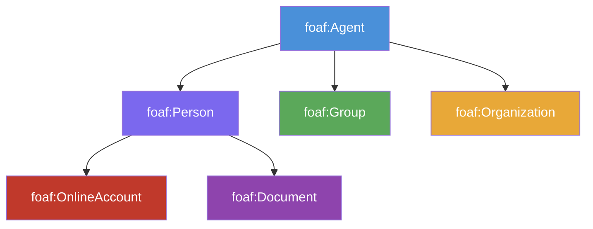

# 1회차: FOAF (Friend of a Friend)

## 학습 목표

이 세션을 마치면 다음을 할 수 있습니다:

- FOAF 온톨로지의 역사적 배경과 설계 목표를 설명할 수 있다
- FOAF의 핵심 클래스(foaf:Person, foaf:Agent, foaf:Organization 등)를 구분할 수 있다
- FOAF의 핵심 속성(foaf:knows, foaf:name, foaf:mbox 등)을 실제 트리플로 작성할 수 있다
- Turtle 형식으로 본인의 FOAF 프로필을 만들 수 있다
- FOAF의 한계와 Schema.org로의 이행 과정을 이해한다

## 이번 세션 전체 그림



> **왜 FOAF가 필요했는가?**
> 2000년대 초, 웹에는 개인 홈페이지가 넘쳐났지만 "이 사람이 저 사람을 안다"는 관계를 컴퓨터가 자동으로 이해할 방법이 없었습니다. HTML은 사람이 읽을 수 있는 텍스트를 위한 것이었고, 링크는 단순히 페이지 간의 연결이었습니다. FOAF는 이 문제를 해결하기 위해 RDF로 소셜 그래프를 표현하는 어휘(vocabulary)를 제안했습니다.

## FOAF의 역사

FOAF(Friend of a Friend) 프로젝트는 2000년 <strong>댄 브릭리(Dan Brickley)</strong>와 <strong>리베카 랍(Libby Miller)</strong>이 시작했습니다. 이들은 팀 버너스-리의 **시맨틱 웹(Semantic Web)** 비전을 실현하기 위한 첫 번째 실용적인 시도를 했습니다.

FOAF의 핵심 아이디어는 단순했습니다: "내 홈페이지에 나 자신에 대한 기계가 읽을 수 있는 파일을 넣고, 내가 아는 사람들의 FOAF 파일을 링크로 연결하자." 이렇게 하면 웹 전체에 걸쳐 분산된 소셜 그래프가 자동으로 구성됩니다.

FOAF는 **링크드 데이터(Linked Data)** 운동의 선구자였습니다. 팀 버너스-리가 2009년 TED 강연에서 "원시 데이터를 지금 공개하세요(Raw Data Now)"를 외쳤을 때, FOAF는 그 실천 사례 중 하나였습니다.

## 핵심 클래스

### foaf:Agent

모든 행위자(사람, 그룹, 소프트웨어 에이전트)의 최상위 클래스입니다.

```
foaf:Agent
├── foaf:Person      (사람)
├── foaf:Group       (그룹, 위원회, 팀 등)
└── foaf:Organization (법인, 기관, 회사)
```

### foaf:Person

FOAF에서 가장 중요한 클래스입니다. 실존하는 사람을 나타냅니다.

중요한 점은 `foaf:Person`이 **개인 홈페이지**나 **온라인 계정**이 아니라 **사람 자체**를 나타낸다는 것입니다. 이것이 FOAF 설계의 핵심 원칙 중 하나입니다.

### foaf:OnlineAccount

페이스북, 트위터, 깃허브 같은 온라인 플랫폼의 계정을 나타냅니다. `foaf:Person`과 구별됩니다.

### foaf:Document

웹 페이지, PDF 등 디지털 문서를 나타냅니다.

## 핵심 속성

### 식별 속성

| 속성 | 의미 | 예시 값 |
|------|------|---------|
| `foaf:name` | 사람의 이름 | "홍길동" |
| `foaf:givenName` | 이름(성 제외) | "길동" |
| `foaf:familyName` | 성 | "홍" |
| `foaf:nick` | 닉네임 | "gildong" |
| `foaf:mbox` | 이메일 주소 (해시 또는 원본) | mailto:hong@example.com |
| `foaf:mbox_sha1sum` | 이메일의 SHA1 해시 | "a3d9..." |

### 관계 속성

| 속성 | 의미 |
|------|------|
| `foaf:knows` | 이 사람이 다른 사람을 안다 (약한 의미의 지인) |
| `foaf:member` | 어떤 그룹의 구성원 |

### 온라인 속성

| 속성 | 의미 |
|------|------|
| `foaf:homepage` | 개인 홈페이지 URL |
| `foaf:weblog` | 블로그 URL |
| `foaf:depiction` | 사람의 이미지 |
| `foaf:account` | 온라인 계정 연결 |

### 관심사/작업 속성

| 속성 | 의미 |
|------|------|
| `foaf:interest` | 관심 주제 (웹 페이지로 표현) |
| `foaf:topic_interest` | 관심 주제 (개념으로 표현) |
| `foaf:made` | 이 사람이 만든 것 |
| `foaf:maker` | 어떤 것을 만든 사람 |
| `foaf:currentProject` | 현재 진행 중인 프로젝트 |
| `foaf:pastProject` | 과거에 진행한 프로젝트 |

## 실제 FOAF 파일 예시

다음은 Turtle 형식의 FOAF 파일 예시입니다:

```turtle
@prefix foaf: <http://xmlns.com/foaf/0.1/> .
@prefix rdf:  <http://www.w3.org/1999/02/22-rdf-syntax-ns#> .
@prefix rdfs: <http://www.w3.org/2000/01/rdf-schema#> .
@prefix xsd:  <http://www.w3.org/2001/XMLSchema#> .

# 나 자신에 대한 기술
<https://example.com/people/hong>
    a foaf:Person ;
    foaf:name "홍길동" ;
    foaf:givenName "길동" ;
    foaf:familyName "홍" ;
    foaf:nick "gildong" ;
    foaf:mbox <mailto:hong@example.com> ;
    foaf:homepage <https://hong.example.com> ;
    foaf:depiction <https://hong.example.com/photo.jpg> ;
    foaf:interest <https://dbpedia.org/resource/Semantic_Web> ;
    foaf:interest <https://dbpedia.org/resource/Knowledge_Graph> ;
    foaf:knows <https://example.com/people/kim> ;
    foaf:knows <https://example.com/people/lee> ;
    foaf:currentProject <https://example.com/projects/ontology-study> .

# 내가 아는 사람 - 김씨
<https://example.com/people/kim>
    a foaf:Person ;
    foaf:name "김철수" ;
    foaf:mbox <mailto:kim@example.com> ;
    foaf:knows <https://example.com/people/hong> .

# 소속 조직
<https://example.com/org/university>
    a foaf:Organization ;
    foaf:name "예시 대학교" ;
    foaf:homepage <https://example-university.ac.kr> .
```

> **왜 이메일을 직접 노출하지 않는가?**
> `foaf:mbox_sha1sum`이 존재하는 이유가 있습니다. FOAF 파일을 공개 웹에 올리면 스팸 봇이 이메일 주소를 수집할 위험이 있습니다. 따라서 이메일을 SHA1 해시로 변환해 노출하는 방법이 제안되었습니다. 이는 FOAF 설계자들이 프라이버시를 얼마나 고민했는지 보여줍니다. 하지만 SHA1이 약해진 오늘날에는 이 방법도 완전하지 않습니다.

## FOAF가 링크드 데이터에서 하는 역할

FOAF는 <strong>링크드 데이터(Linked Data)</strong>의 4원칙을 실천하는 선구자였습니다:

1. **URI로 사물을 명명하라** — 사람을 `<https://example.com/people/hong>`으로 식별
2. **HTTP URI를 사용하라** — 웹에서 조회 가능
3. **URI를 조회하면 RDF 정보를 반환하라** — FOAF 파일을 해당 URI에서 제공
4. **다른 URI로 링크를 포함하라** — `foaf:knows`로 다른 사람의 URI 연결

이 원칙들이 결합되면, 웹 크롤러는 한 사람의 FOAF 파일에서 시작해 `foaf:knows` 링크를 따라가며 전체 소셜 그래프를 자동으로 탐색할 수 있습니다. 이것이 **시맨틱 웹의 첫 번째 실용적 구현**이었습니다.

> **연결 포인트: FOAF와 DBpedia/Wikidata**
> 오늘날 DBpedia와 Wikidata는 FOAF를 사용해 사람 엔티티를 표현합니다. 예를 들어, DBpedia의 알베르트 아인슈타인 페이지는 `foaf:name "Albert Einstein"`을 포함합니다. FOAF를 이해하면 이 거대한 지식 그래프 생태계를 이해하는 데 도움이 됩니다.

## FOAF의 한계와 Schema.org로의 이행

### FOAF의 한계

1. **프라이버시 문제**: 이메일, 관계 정보를 공개 웹에 노출하는 것이 현대의 프라이버시 관점과 충돌
2. **소셜 미디어의 등장**: 페이스북, 트위터가 중앙화된 소셜 그래프를 독점하면서 분산 FOAF 파일의 필요성이 줄어듦
3. **형식적 엄밀성 부족**: FOAF는 OWL보다 RDFS 수준에서 정의되어 강력한 추론 지원이 제한적
4. **채택 인센티브 부족**: 일반 사용자가 FOAF 파일을 직접 관리하기에는 너무 기술적

### Schema.org로의 흡수

2011년 구글, 마이크로소프트, 야후, 얀덱스가 공동으로 Schema.org를 출시하면서, Schema.org는 `Person` 타입에 FOAF의 개념 대부분을 흡수했습니다. 주요 FOAF 속성과 Schema.org의 대응 관계:

| FOAF | Schema.org |
|------|-----------|
| `foaf:name` | `schema:name` |
| `foaf:mbox` | `schema:email` |
| `foaf:homepage` | `schema:url` |
| `foaf:depiction` | `schema:image` |
| `foaf:knows` | `schema:knows` |
| `foaf:member` | `schema:memberOf` |

### FOAF의 현재

FOAF 사양은 2014년 이후 업데이트가 없습니다. 그러나 FOAF는 여전히 의미 있습니다:

- DBpedia, Wikidata 등 링크드 데이터 생태계에서 광범위하게 사용
- `foaf:Person`, `foaf:knows` 등 기본 어휘는 수십억 개의 RDF 트리플에서 활용
- 시맨틱 웹의 역사적 선구자로서 교육적 가치

## 흔한 오해

**오해: "foaf:knows는 친구를 의미한다"**

`foaf:knows`는 **약한 지인 관계**를 나타냅니다. 사양에 따르면, 이 속성은 두 사람이 서로 안다는 것을 암시하지만, "친구"나 "동료"처럼 구체적인 관계 유형은 정의하지 않습니다. 실제로 두 사람이 오프라인에서 만난 적이 없어도 온라인에서 알고 있다면 `foaf:knows`를 사용할 수 있습니다.

**오해: "foaf:Person은 온라인 계정이다"**

`foaf:Person`은 **실존하는 사람**을 나타냅니다. 온라인 계정은 `foaf:OnlineAccount`입니다. 이 구별은 철학적으로 중요합니다. 트위터 계정과 그 계정을 사용하는 사람은 서로 다른 존재입니다.

> **연결 포인트: 열린 세계 가정(Open World Assumption)**
> FOAF 파일에서 누군가의 `foaf:knows`가 리스트되지 않았다고 해서 그 사람이 아무도 모른다는 것은 아닙니다. OWL과 RDF는 열린 세계 가정(OWA)을 따릅니다. 정보가 없으면 "거짓"이 아니라 "알 수 없음"입니다. 이것이 FOAF와 일반 관계형 데이터베이스의 근본적인 차이입니다.

## 요약

FOAF는 소셜 네트워크를 RDF로 표현하는 최초의 실용적 온톨로지였습니다. `foaf:Person`, `foaf:knows` 같은 개념은 지금도 링크드 데이터 생태계의 근간이 됩니다. 비록 소셜 미디어의 중앙화와 프라이버시 우려로 인해 FOAF의 원래 비전은 실현되지 못했지만, 그 개념은 Schema.org로 계승되었고 시맨틱 웹 운동의 중요한 이정표로 남아있습니다.

**다음 세션 예고**: Dublin Core — 도서관학에서 탄생한 15개의 메타데이터 요소가 인터넷 시대의 디지털 아카이빙 표준이 되기까지의 이야기를 탐구합니다.
