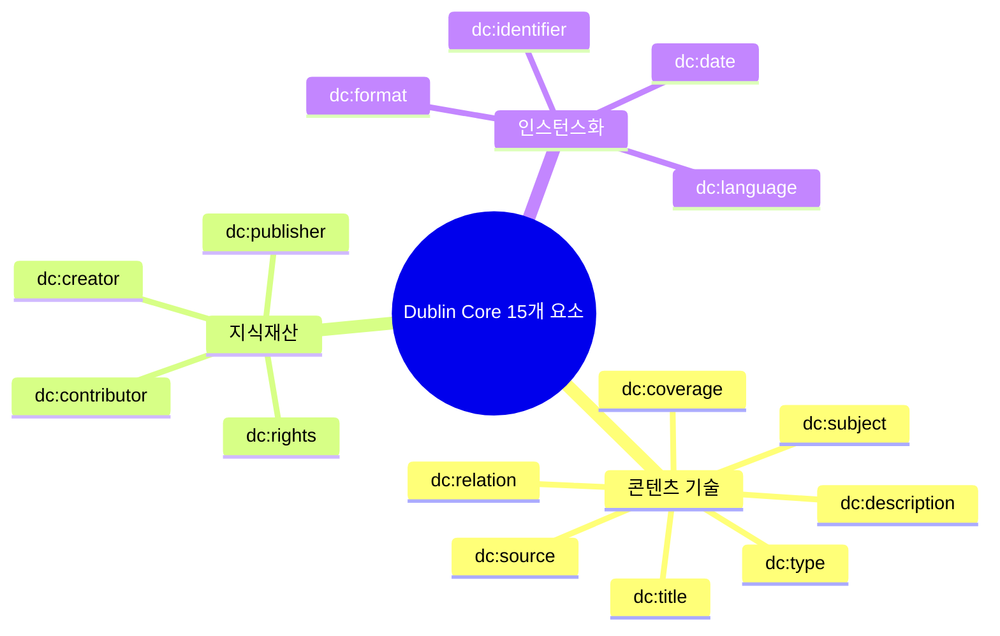

# 2회차: Dublin Core (더블린 코어)

## 학습 목표

이 세션을 마치면 다음을 할 수 있습니다:

- Dublin Core의 역사적 탄생 배경과 "더블린(Dublin)"이 어디서 왔는지 알 수 있다
- 15개 핵심 메타데이터 요소 각각의 의미와 사용법을 설명할 수 있다
- Dublin Core Terms(dcterms)와 기존 DC 요소의 차이를 이해한다
- 도서관, 뮤지엄, 디지털 아카이브에서 Dublin Core가 어떻게 활용되는지 설명할 수 있다
- Turtle 형식으로 학술 논문이나 디지털 자원의 메타데이터를 기술할 수 있다

## 이번 세션 전체 그림



> **왜 Dublin Core가 필요했는가?**
> 1990년대 중반, 인터넷이 폭발적으로 성장하면서 방대한 양의 디지털 문서가 만들어졌습니다. 문제는 이 문서들을 어떻게 찾고 분류하느냐였습니다. 각 기관마다 서로 다른 메타데이터 체계를 사용하다 보니, 대학 도서관에서 만든 디지털 자료와 박물관에서 만든 디지털 유물을 함께 검색할 수 없었습니다. Dublin Core는 "최소한 이 15개 요소만큼은 공통으로 쓰자"는 글로벌 합의였습니다.

## Dublin Core의 탄생

### "더블린"의 유래

Dublin Core의 "Dublin"은 아일랜드의 더블린이 아닙니다. 1995년 3월, 미국 오하이오 주 <strong>더블린(Dublin, Ohio)</strong>에 위치한 OCLC(Online Computer Library Center) 본부에서 첫 번째 워크숍이 개최되었습니다. 이 워크숍에서 메타데이터 전문가 52명이 모여 공통 메타데이터 요소를 정의하기 시작했습니다.

### 설계 철학

Dublin Core의 핵심 설계 철학은 **"충분히 좋은(good enough)" 메타데이터**입니다:

- **간단함(Simplicity)**: 비전문가도 이해하고 사용할 수 있어야 한다
- **의미적 상호운용성(Semantic Interoperability)**: 다양한 도메인에서 공통으로 사용 가능해야 한다
- **국제적 합의(International Consensus)**: 특정 국가나 기관의 관행에 편향되지 않아야 한다
- **확장성(Extensibility)**: 기본 15개 요소를 시작점으로 도메인별 확장이 가능해야 한다

이 철학 때문에 Dublin Core는 때로 "너무 단순하다"는 비판을 받기도 합니다. 하지만 이 단순함이 바로 글로벌 채택의 원동력이 되었습니다.

## 15개 핵심 메타데이터 요소

Dublin Core는 정확히 **15개**의 핵심 요소를 정의합니다. 이를 세 그룹으로 분류할 수 있습니다:

### 그룹 1: 콘텐츠 기술 (Content)

자원의 내용 자체를 설명합니다.

**dc:title** — 자원에 주어진 이름

```turtle
dc:title "온톨로지 공학 입문" .
```

도서, 논문, 웹페이지, 음악 등 모든 유형의 자원에 이름을 부여합니다.

**dc:subject** — 자원의 주제나 키워드

```turtle
dc:subject "온톨로지" ;
dc:subject "지식 표현" ;
dc:subject "시맨틱 웹" .
```

자유 형식 키워드 또는 주제 분류 체계(Library of Congress Subject Headings 등)의 용어를 사용할 수 있습니다.

**dc:description** — 자원에 대한 설명

```turtle
dc:description "이 책은 온톨로지의 기본 개념부터 고급 설계 방법론까지 다루는 교재입니다." .
```

초록(abstract), 목차(table of contents), 내용 요약 등이 여기에 포함됩니다.

**dc:type** — 자원의 성격이나 유형

```turtle
dc:type "Text" .
dc:type "Dataset" .
dc:type "Image" .
```

Dublin Core Type Vocabulary에 정의된 값: Collection, Dataset, Event, Image, InteractiveResource, Service, Software, Sound, Text, PhysicalObject 등

**dc:source** — 현재 자원이 파생된 원본 자원

```turtle
dc:source "Gruber, T. R. (1993). A translation approach to portable ontology specifications." .
```

**dc:relation** — 관련된 다른 자원

```turtle
dc:relation <https://doi.org/10.1016/0950-7051(93)90269-8> .
```

**dc:coverage** — 자원의 공간적·시간적 범위

```turtle
dc:coverage "대한민국, 조선시대, 1392-1897" .
```

### 그룹 2: 지식재산 (Intellectual Property)

**dc:creator** — 자원의 주 창작자

```turtle
dc:creator "홍길동" .
dc:creator <https://orcid.org/0000-0002-1825-0097> .
```

**dc:contributor** — 자원에 기여한 사람(창작자 외)

```turtle
dc:contributor "김철수" ;
dc:contributor "이영희" .
```

**dc:publisher** — 자원을 사용 가능하게 만든 주체

```turtle
dc:publisher "한국과학기술정보연구원(KISTI)" .
```

**dc:rights** — 자원과 관련된 권리 정보

```turtle
dc:rights "CC BY 4.0 https://creativecommons.org/licenses/by/4.0/" .
```

### 그룹 3: 인스턴스화 (Instantiation)

**dc:date** — 자원 생애주기의 날짜

```turtle
dc:date "2024-03-15" .
```

**dc:format** — 자원의 물리적·디지털 형식

```turtle
dc:format "application/pdf" .
dc:format "2.4 MB" .
```

**dc:identifier** — 자원의 명확한 식별자

```turtle
dc:identifier "ISBN 978-89-12345-67-8" .
dc:identifier <https://doi.org/10.1000/xyz123> .
```

**dc:language** — 자원의 언어

```turtle
dc:language "ko-KR" .
dc:language "en" .
```

## 완전한 Dublin Core 예시

학술 논문의 메타데이터를 Dublin Core로 기술한 예시입니다:

```turtle
@prefix dc:      <http://purl.org/dc/elements/1.1/> .
@prefix dcterms: <http://purl.org/dc/terms/> .
@prefix xsd:     <http://www.w3.org/2001/XMLSchema#> .

<https://doi.org/10.1000/example-paper>
    dc:title "한국어 의료 온톨로지 구축 방법론 연구" ;
    dc:creator "홍길동" ;
    dc:creator "김연구" ;
    dc:contributor "이편집" ;
    dc:subject "의료 온톨로지" ;
    dc:subject "OWL" ;
    dc:subject "SNOMED CT" ;
    dc:description "본 논문은 한국 의료 환경에 적합한 온톨로지 구축 방법론을 제안한다." ;
    dc:publisher "한국정보과학회" ;
    dc:date "2024-09-15" ;
    dc:type "Text" ;
    dc:format "application/pdf" ;
    dc:identifier "doi:10.1000/example-paper" ;
    dc:language "ko" ;
    dc:rights "CC BY 4.0" ;
    dc:coverage "대한민국, 2020-2024" .
```

## Dublin Core Terms (dcterms) 확장

기본 15개 요소(dc 네임스페이스)의 의미가 너무 모호한 경우를 위해 <strong>Dublin Core Terms(dcterms)</strong>가 개발되었습니다.

> **왜 dcterms를 사용하는가?**
> 기본 DC 요소의 `dc:date`는 자원이 어느 날짜에 관한 것인지, 언제 만들어졌는지, 언제 출판되었는지 구분하지 않습니다. dcterms를 사용하면 이런 날짜들을 명확하게 구분할 수 있어 데이터의 의미가 더 정밀해집니다. 현재 신규 프로젝트에서는 dc 대신 dcterms 사용이 권장됩니다.

### 날짜 세분화

| DC 요소 | dcterms 세분화 |
|---------|----------------|
| `dc:date` | `dcterms:created` — 생성일 |
| | `dcterms:modified` — 수정일 |
| | `dcterms:issued` — 발행일 |
| | `dcterms:valid` — 유효 기간 |
| | `dcterms:dateAccepted` — 수락일 |

### 관계 세분화

| DC 요소 | dcterms 세분화 |
|---------|----------------|
| `dc:relation` | `dcterms:hasPart` — 이 자원의 일부인 자원 |
| | `dcterms:isPartOf` — 이 자원이 일부인 자원 |
| | `dcterms:hasVersion` — 이 자원의 버전 |
| | `dcterms:references` — 참고한 자원 |
| | `dcterms:replaces` — 이 자원이 대체하는 자원 |

## 실제 활용 사례

### 도서관 및 아카이브

국립중앙도서관, 국회도서관, 국립문화유산연구원 등은 Dublin Core를 OAI-PMH(Open Archives Initiative Protocol for Metadata Harvesting) 기반의 메타데이터 교환 표준으로 사용합니다.

### 학술 저널

PubMed, arXiv, RISS 등 학술 데이터베이스는 Dublin Core를 사용해 논문 메타데이터를 제공합니다.

### 전자정부

한국의 공공 데이터 포털(data.go.kr)은 데이터셋 메타데이터를 Dublin Core 기반으로 제공합니다.

> **연결 포인트: OAI-PMH와 Dublin Core**
> OAI-PMH(Open Archives Initiative Protocol for Metadata Harvesting)는 Dublin Core를 기본 메타데이터 형식으로 사용합니다. 도서관, 아카이브, 학술 저장소들은 OAI-PMH를 통해 Dublin Core 메타데이터를 교환하여 분산된 디지털 자원을 통합 검색할 수 있게 합니다. 이것이 Dublin Core가 수십 년간 살아남은 핵심 이유 중 하나입니다.

## Dublin Core vs 다른 메타데이터 표준 비교

| 기준 | Dublin Core | MARC 21 | Schema.org |
|------|------------|---------|-----------|
| 복잡도 | 낮음 (15개 요소) | 매우 높음 | 중간 |
| 도서관 특화 | 아니오 | 예 | 아니오 |
| 웹 친화성 | 높음 | 낮음 | 매우 높음 |
| SEO 활용 | 가능 | 불가 | 주목적 |
| RDF 지원 | 기본 | 변환 필요 | JSON-LD |

> **연결 포인트: Dublin Core와 Schema.org의 공존**
> Dublin Core는 Schema.org와 경쟁하지 않습니다. Dublin Core는 전통적인 문서 메타데이터 생태계(도서관, 아카이브)에서, Schema.org는 웹 콘텐츠 마크업과 SEO에서 각각 강점을 발휘합니다. 많은 기관이 내부적으로는 Dublin Core를 사용하면서 웹 공개 시에는 Schema.org로 변환하는 방식을 채택합니다.

## 흔한 오해

**오해 1: "Dublin Core는 도서만을 위한 것이다"**

Dublin Core는 도서관학에서 출발했지만, 모든 유형의 디지털 자원(논문, 이미지, 비디오, 소프트웨어, 데이터셋, 웹페이지 등)에 적용할 수 있습니다. "자원(Resource)"이라는 포괄적 개념을 사용하기 때문입니다.

**오해 2: "dc:creator와 dc:contributor는 구분이 불명확하다"**

둘 다 사람을 가리키지만 역할이 다릅니다. `dc:creator`는 자원의 지적 내용에 일차적 책임이 있는 주체(저자, 작곡가, 사진가)이고, `dc:contributor`는 보조적 기여를 한 사람(편집자, 번역자)입니다. 이 구분은 학술 인용 관행과 일치합니다.

**오해 3: "15개 요소를 모두 사용해야 한다"**

Dublin Core는 **선택적(optional)** 사용을 기본으로 합니다. 모든 요소를 반드시 채울 필요가 없고, 각 요소는 반복 사용(복수의 주제, 복수의 저자 등)이 가능합니다.

## 요약

Dublin Core는 1995년에 탄생한 15개 메타데이터 요소의 집합입니다. 그 단순함이 도리어 강점이 되어 도서관, 뮤지엄, 학술 데이터베이스, 전자정부 등 다양한 분야에서 30년 가까이 사용되고 있습니다.

**다음 세션 예고**: Schema.org — 구글, 마이크로소프트, 야후가 함께 만든 웹 콘텐츠 마크업 표준. 검색 엔진이 웹페이지를 더 잘 이해하도록 만드는 방법을 실습합니다.
