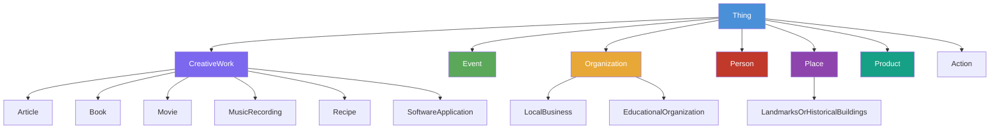

# 3회차: Schema.org

## 학습 목표

이 세션을 마치면 다음을 할 수 있습니다:

- Schema.org의 탄생 배경과 Google, Microsoft, Yahoo, Yandex가 왜 공동으로 만들었는지 설명할 수 있다
- Schema.org의 핵심 타입 계층 구조(Thing, CreativeWork, Person 등)를 이해한다
- JSON-LD로 웹 페이지에 구조화 데이터(Structured Data)를 마크업할 수 있다
- 구글 리치 결과(Rich Results)를 달성하기 위한 마크업 방법을 알 수 있다
- Schema.org의 강점과 약점을 균형 있게 평가할 수 있다

## 이번 세션 전체 그림



> **왜 Schema.org가 필요했는가?**
> 2011년 이전, 웹페이지는 사람이 읽기 위한 HTML로만 작성되었습니다. 구글의 검색 엔진은 "이 페이지가 영화 리뷰인지, 식당 소개인지, 아니면 상품 판매 페이지인지" 자동으로 알기 어려웠습니다. 검색 엔진이 웹의 의미를 이해하기 위해 메타 태그, 마이크로포맷, 각자의 독자적인 구조화 데이터 형식을 쓰다 보니 혼란이 생겼습니다. Schema.org는 "검색 엔진들이 공통으로 이해하는 어휘를 하나 만들자"는 발상에서 출발했습니다.

## Schema.org의 역사

2011년 6월, **구글(Google)**, **마이크로소프트(Microsoft, Bing)**, **야후(Yahoo)**, **얀덱스(Yandex, 러시아 검색 엔진)** 네 회사가 공동으로 Schema.org를 발표했습니다.

이 협력은 매우 이례적인 것이었습니다. 서로 치열하게 경쟁하는 검색 엔진들이 공통 표준을 만들기로 합의했다는 것은, 검색 품질 향상이 개별 회사의 경쟁력보다 중요한 공공재적 가치가 있다는 인식을 보여줍니다.

Schema.org는 W3C 표준이 아니며, 네 회사가 공동으로 운영하는 커뮤니티 표준입니다. 그러나 검색 엔진들이 직접 지원하기 때문에 사실상의 웹 표준(de facto standard)이 되었습니다.

## Schema.org의 구조

### 기본 원칙

Schema.org는 <strong>타입(Type)</strong>과 <strong>속성(Property)</strong>의 두 가지 기본 요소로 구성됩니다.

- **타입(Type)**: 사물의 종류를 나타냅니다. 예: `Person`, `Article`, `Restaurant`
- **속성(Property)**: 타입의 특성을 기술합니다. 예: `name`, `description`, `url`

모든 타입은 `Thing`을 최상위 타입으로 하는 계층 구조를 가집니다.

### 핵심 타입 계층

**Thing** (모든 것의 최상위)
- `name`, `description`, `url`, `image`, `sameAs` 등 기본 속성

**CreativeWork** (창작물)
- Article, Book, Movie, MusicRecording, Recipe, SoftwareApplication, WebPage 등
- `author`, `datePublished`, `headline`, `publisher` 등의 속성

**Event** (이벤트)
- `startDate`, `endDate`, `location`, `organizer` 등

**Organization** (조직)
- LocalBusiness, EducationalOrganization, GovernmentOrganization 등
- `address`, `telephone`, `employee`, `foundingDate` 등

**Person** (사람)
- `givenName`, `familyName`, `email`, `jobTitle`, `affiliation` 등

**Place** (장소)
- `address`, `geo`, `containedInPlace` 등

**Product** (상품)
- `sku`, `offers`, `aggregateRating`, `brand` 등

## JSON-LD로 마크업 추가하기

Schema.org 마크업을 웹페이지에 추가하는 방법에는 세 가지가 있습니다: JSON-LD, 마이크로데이터(Microdata), RDFa. 구글은 **JSON-LD**를 공식 권장합니다.

### JSON-LD란?

JSON-LD(JavaScript Object Notation for Linked Data)는 JSON 형식으로 링크드 데이터를 표현하는 방법입니다. HTML의 `<script>` 태그 안에 삽입되므로, 기존 HTML 구조를 변경하지 않아도 됩니다.

### 기본 JSON-LD 구조

```html
<script type="application/ld+json">
{
  "@context": "https://schema.org",
  "@type": "Article",
  "headline": "온톨로지란 무엇인가",
  "author": {
    "@type": "Person",
    "name": "홍길동"
  },
  "datePublished": "2024-03-15",
  "publisher": {
    "@type": "Organization",
    "name": "온톨로지 교육 센터",
    "logo": {
      "@type": "ImageObject",
      "url": "https://example.com/logo.png"
    }
  },
  "image": "https://example.com/ontology-article.jpg",
  "description": "온톨로지의 기본 개념과 활용 방법을 소개하는 글입니다."
}
</script>
```

### 다양한 타입별 마크업 예시

**이벤트(Event) 마크업**

```json
{
  "@context": "https://schema.org",
  "@type": "Event",
  "name": "2024 온톨로지 여름학교",
  "startDate": "2024-07-15T09:00:00+09:00",
  "endDate": "2024-07-19T18:00:00+09:00",
  "eventStatus": "https://schema.org/EventScheduled",
  "eventAttendanceMode": "https://schema.org/OfflineEventAttendanceMode",
  "location": {
    "@type": "Place",
    "name": "KAIST 본원",
    "address": {
      "@type": "PostalAddress",
      "streetAddress": "대학로 291",
      "addressLocality": "유성구",
      "addressRegion": "대전광역시",
      "postalCode": "34141",
      "addressCountry": "KR"
    }
  },
  "organizer": {
    "@type": "Organization",
    "name": "한국인공지능학회",
    "url": "https://www.kiise.or.kr"
  },
  "offers": {
    "@type": "Offer",
    "price": "200000",
    "priceCurrency": "KRW",
    "validFrom": "2024-06-01",
    "url": "https://example.com/register"
  }
}
```

**상품(Product) 마크업**

```json
{
  "@context": "https://schema.org",
  "@type": "Product",
  "name": "온톨로지 공학 교재 (3판)",
  "image": "https://example.com/book-cover.jpg",
  "description": "OWL 2와 시맨틱 웹 기술을 다루는 전문 교재",
  "sku": "OE-2024-001",
  "brand": {
    "@type": "Brand",
    "name": "온톨로지 출판사"
  },
  "offers": {
    "@type": "Offer",
    "url": "https://example.com/book/ontology-engineering",
    "priceCurrency": "KRW",
    "price": "45000",
    "availability": "https://schema.org/InStock"
  },
  "aggregateRating": {
    "@type": "AggregateRating",
    "ratingValue": "4.8",
    "reviewCount": "127"
  }
}
```

**사람(Person) 마크업**

```json
{
  "@context": "https://schema.org",
  "@type": "Person",
  "name": "홍길동",
  "givenName": "길동",
  "familyName": "홍",
  "jobTitle": "온톨로지 엔지니어",
  "affiliation": {
    "@type": "Organization",
    "name": "KAIST 인공지능연구소"
  },
  "email": "hong@example.com",
  "url": "https://hong.example.com",
  "sameAs": [
    "https://github.com/hong-gildong",
    "https://scholar.google.com/citations?user=example"
  ]
}
```

> **왜 JSON-LD가 마이크로데이터보다 선호되는가?**
> 마이크로데이터는 HTML 태그에 `itemtype`과 `itemprop` 속성을 직접 추가합니다. 이는 HTML 구조와 의미 정보가 뒤섞여 유지보수가 어렵습니다. JSON-LD는 `<script>` 블록으로 분리되므로 HTML과 구조화 데이터를 독립적으로 관리할 수 있습니다. 또한 React, Vue 같은 현대 프레임워크에서도 동적으로 생성하기 쉽습니다.

## 구글 리치 결과(Rich Results) 달성하기

구글은 Schema.org 마크업을 인식하면 검색 결과에 풍부한 시각적 정보를 표시합니다. 이를 **리치 결과(Rich Results)** 또는 <strong>리치 스니펫(Rich Snippets)</strong>이라고 합니다.

### 리치 결과 유형

| 타입 | 검색 결과 표시 |
|------|---------------|
| Article | 날짜, 저자, 이미지 표시 |
| Event | 날짜, 장소, 가격 표시 |
| Recipe | 조리 시간, 칼로리, 별점 표시 |
| Product | 가격, 재고 여부, 별점 표시 |
| FAQ | 접을 수 있는 Q&A 목록 표시 |
| HowTo | 단계별 안내 표시 |
| LocalBusiness | 영업 시간, 주소, 전화번호 표시 |
| Review | 별점 표시 |

### 리치 결과 테스트

마크업을 추가한 후 구글의 **리치 결과 테스트 도구**를 사용해 올바르게 인식되는지 확인할 수 있습니다:
- 도구 URL: https://search.google.com/test/rich-results
- Google Search Console의 Enhancement 보고서

## Schema.org의 장점과 약점

### 장점

1. **SEO 직접 연계**: 구글, 빙, 야후 등 주요 검색 엔진이 직접 지원
2. **방대한 어휘**: 800개 이상의 타입, 900개 이상의 속성 (2024년 기준)
3. **활발한 커뮤니티**: 지속적으로 새로운 타입 추가 (e.g., Legislation, HealthTopicContent)
4. **JSON-LD 지원**: 현대 웹 개발 워크플로와 잘 통합됨
5. **FOAF 개념 흡수**: 기존 FOAF 사용자들이 쉽게 전환 가능

### 약점

**형식적 엄밀성 부족**이 Schema.org의 가장 큰 학술적 한계입니다.

Schema.org는 OWL이나 RDF Schema 수준의 엄격한 형식 정의를 제공하지 않습니다. 예를 들어:
- 어떤 속성이 어떤 타입에만 사용될 수 있는지 강제하지 않음
- 값의 범위(range)가 느슨하게 정의됨
- 추론(reasoning)을 지원하는 공리(axiom)가 충분하지 않음

이 때문에 Schema.org는 **"검색 엔진을 위한 힌트"**에 가깝고, **"형식적 지식 표현"**으로는 부족하다는 평가를 받습니다.

### 설계 결정: 왜 OWL이 아닌 RDFS인가?

> **왜 필요한가?**
> 형식 언어(formal language)의 선택은 온톨로지 채택률에 결정적인 영향을 미칩니다. OWL의 강력한 추론 능력이 유혹적이지만, 그 대가로 복잡성과 진입 장벽이 높아집니다. Schema.org 설계자들은 "완벽한 형식성"보다 "실제로 널리 쓰이는 것"을 선택했습니다. 이 결정이 왜 합리적이었는지 살펴보겠습니다.

**고려된 대안들**

Schema.org 설계 시 다음 형식 언어 대안들이 있었습니다:

| 대안 | 특징 | Schema.org에서의 실패 모드 |
|------|------|-------------------------|
| **RDFS** (실제 선택) | 단순한 계층 구조, 속성 정의 | ✅ 웹 개발자에게 친숙함 |
| **OWL-Lite** | 중간 수준의 형식성, 카디널리티 제약 | ⚠️ 여전히 진입 장벽 높음 |
| **OWL-DL** | 완전한 형식적 추론, 복잡한 공리 | ❌ 마크업 작성 불가능 |
| **OWL-Full** | 제한 없는 표현력, 최대 자유도 | ❌ 웹 규모에서 실행 불가 |

**각 대안이 실제로 어떻게 보이는지**

동일한 `Person` 타입과 `knows` 속성을 각 대안으로 표현해보겠습니다:

**RDFS (실제 선택)**
```turtle
@prefix schema: <https://schema.org/> .
@prefix rdfs: <http://www.w3.org/2000/01/rdf-schema#> .

schema:Person a rdfs:Class ;
    rdfs:label "Person" ;
    rdfs:comment "A person (living, dead, undead, or fictional)." .

schema:knows a rdf:Property ;
    rdfs:label "knows" ;
    rdfs:domain schema:Person ;
    rdfs:range schema:Person .
```
✅ 웹 개발자가 보기에 친숙하고 이해하기 쉽습니다.

**OWL-DL (거부된 대안)**
```turtle
@prefix owl: <http://www.w3.org/2002/07/owl#> .

schema:Person a owl:Class ;
    rdfs:subClassOf [
        a owl:Restriction ;
        owl:onProperty schema:knows ;
        owl:someValuesFrom schema:Person ;
    ] .

schema:knows a owl:ObjectProperty ;
    rdfs:domain schema:Person ;
    rdfs:range schema:Person ;
    owl:inverseProperty schema:knownBy .
```
❌ 웹 개발자에게 `owl:Restriction`, `owl:someValuesFrom` 같은 개념은 생소합니다.

**거부된 대안의 구체적 실패 모드**

**OWL-DL/Full을 선택했을 경우:**

1. **마크업 작성 불가**: 800개 이상의 Schema.org 타입에 대해 웹 개발자가 OWL 공리를 직접 작성하는 것은 현실적으로 불가능합니다.
2. **추론 엔진 필요**: OWL-DL의 형식적 의미론을 활용하려면 추론 엔진(reasoner)이 필수입니다. 검색 엔진이 모든 웹페이지의 마크업을 추론해야 하는데, 이는 웹 규모에서 비실용적입니다.
3. **JSON-LD 호환성 복잡**: JSON-LD와 OWL-DL의 통합은 기술적으로 복잡하여, 웹 개발 프레임워크(React, Vue 등)에서 쉽게 생성하기 어렵습니다.

**RDFS 선택이 Schema.org를 구한 이유**

Schema.org의 핵심 목표는 두 가지였습니다:

1. **웹 규모 채택**: 수백만 개의 웹사이트가 실제로 사용할 수 있어야 함
2. **검색 엔진 통합**: 구글, 빙, 야후가 기존 인프라를 크게 변경하지 않고 통합할 수 있어야 함

RDFS는 이 두 목표에 완벽하게 부합했습니다:

- **단순성**: 웹 개발자가 HTML과 유사한 수준의 학습 곡선으로 마크업 작성 가능
- **가벼움**: 검색 엔진이 추론 엔진 없이도 파싱和处理 가능
- **JSON-LD 친화적**: 현대 웹 개발 워크플로에 자연스럽게 통합

형식적 엄밀성을 포기한 대가로, Schema.org는 **채택률이라는 더 큰 가치**를 얻었습니다. 오늘날 수백만 개의 웹사이트가 Schema.org를 사용하는 것은 이 설계 결정이 성공적이었음을 증명합니다.

> **연결 포인트: Schema.org와 OWL의 관계**
> Schema.org는 내부적으로 RDFa와 RDF Schema를 기반으로 하지만, OWL 2처럼 완전한 형식 의미론(formal semantics)을 갖추지는 않습니다. 반면 Gene Ontology나 SNOMED CT는 OWL 2를 사용해 자동 추론이 가능합니다. Schema.org는 웹 규모의 채택을 위해 형식적 엄밀성을 의도적으로 타협한 것입니다.

## Next.js에서 Schema.org 활용하기

현대 웹 프레임워크에서 Schema.org를 활용하는 방법을 봅시다:

```typescript
// Next.js App Router에서 JSON-LD 추가
export default function ArticlePage({ article }) {
  const jsonLd = {
    "@context": "https://schema.org",
    "@type": "Article",
    "headline": article.title,
    "datePublished": article.publishedAt,
    "author": {
      "@type": "Person",
      "name": article.author.name,
    },
    "publisher": {
      "@type": "Organization",
      "name": "온톨로지 교육 센터",
    },
  };

  return (
    <article>
      <script
        type="application/ld+json"
        dangerouslySetInnerHTML={{ __html: JSON.stringify(jsonLd) }}
      />
      <h1>{article.title}</h1>
      {/* 나머지 콘텐츠 */}
    </article>
  );
}
```

## 흔한 오해

**오해 1: "Schema.org 마크업을 추가하면 검색 순위가 올라간다"**

Schema.org 마크업은 검색 순위(ranking)에 직접적인 영향을 주지 않습니다. 대신, 검색 결과의 <strong>표시 방식(presentation)</strong>을 개선하여 클릭률(CTR)을 높이는 데 도움을 줍니다. 리치 스니펫은 사용자의 눈에 더 잘 띄기 때문에 간접적으로 트래픽 증가에 기여할 수 있습니다.

**오해 2: "Schema.org는 OWL 온톨로지다"**

Schema.org는 RDF Schema(RDFS) 수준의 타입 계층을 가지고 있지만, OWL 온톨로지는 아닙니다. OWL처럼 자동 추론을 지원하거나 닫힌 세계 가정(CWA)을 적용할 수 없습니다. Schema.org는 보다 실용적인 목적으로 설계된 어휘(vocabulary)입니다.

**오해 3: "모든 Schema.org 속성을 채워야 한다"**

리치 결과를 얻기 위해 필요한 속성은 각 타입별로 구글이 명시합니다. 필수(required)와 권장(recommended) 속성만 정확하게 채우는 것이 좋습니다. 부정확한 정보를 추가하는 것보다 적은 속성을 정확하게 기술하는 것이 낫습니다.

> **연결 포인트: FOAF와 Schema.org의 관계**
> Schema.org의 `Person` 타입은 FOAF의 `foaf:Person`과 같은 개념을 표현합니다. 실제로 Schema.org는 FOAF의 주요 속성들(name, email, knows, homepage 등)을 흡수했습니다. 기존 FOAF 기반 데이터를 Schema.org로 변환할 때는 대부분의 속성이 1:1 매핑됩니다.

## 요약

Schema.org는 2011년 구글, 마이크로소프트, 야후, 얀덱스가 공동으로 만든 웹 구조화 데이터 어휘입니다. 800개 이상의 타입을 통해 사람, 장소, 이벤트, 상품, 창작물 등 다양한 사물을 기술할 수 있습니다. JSON-LD 형식으로 HTML에 추가하면 검색 엔진이 웹페이지의 의미를 더 잘 이해하고 리치 결과를 표시할 수 있습니다.

**다음 세션 예고**: Gene Ontology — 생물학 데이터의 표준화를 위해 탄생한 온톨로지. 수백만 개의 유전자 데이터를 통일된 언어로 기술하는 DAG 구조의 특별한 설계를 탐구합니다.
