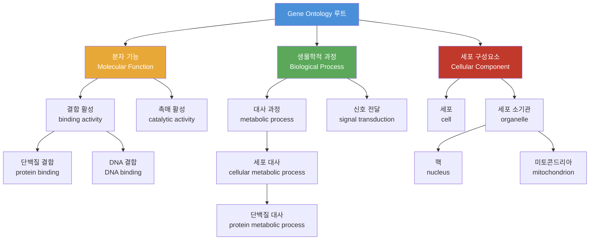
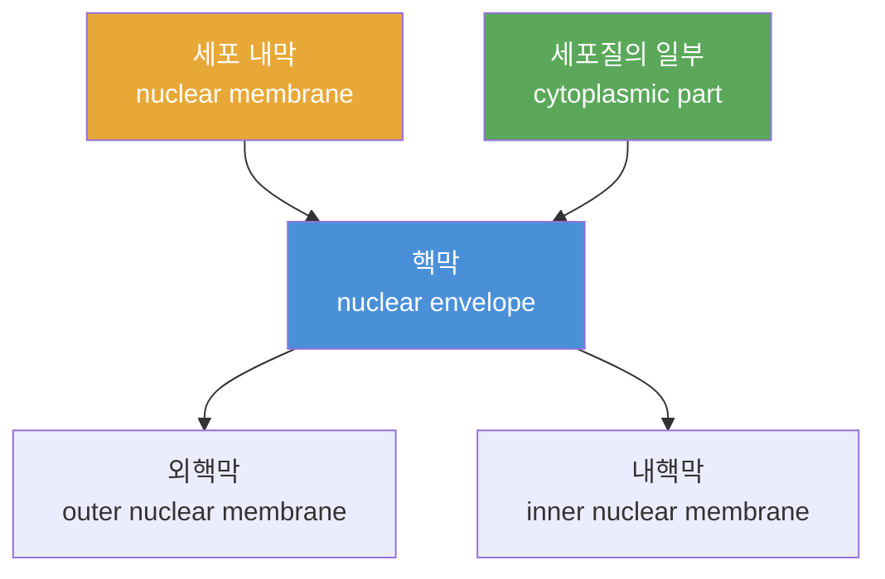
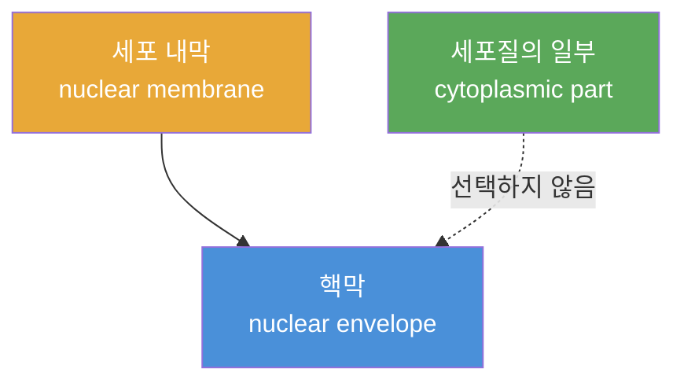

# 4회차: Gene Ontology (유전자 온톨로지)

## 학습 목표

이 세션을 마치면 다음을 할 수 있습니다:

- Gene Ontology(GO)의 탄생 배경과 해결하고자 했던 문제를 설명할 수 있다
- GO의 세 가지 독립적인 측면(Aspect)을 구분하고 각각의 의미를 이해한다
- DAG(Directed Acyclic Graph) 구조와 다중 부모(multiple parents)의 의미를 설명할 수 있다
- GO 용어(GO Terms)와 GO 어노테이션(GO Annotations)의 차이를 이해한다
- GO가 OWL 2 EL 프로파일을 사용하는 이유를 설명할 수 있다

## 이번 세션 전체 그림



> **왜 Gene Ontology가 필요했는가?**
> 1990년대 말, 인간 게놈 프로젝트(Human Genome Project)가 진행되면서 대규모 유전자 시퀀싱 데이터가 쏟아지기 시작했습니다. 문제는 각 연구 기관, 모델 생물(model organism) 데이터베이스가 유전자 기능을 각자 다른 용어로 기술한다는 것이었습니다. 쥐의 유전자와 효모의 유사한 유전자를 비교하려면 용어 자체가 달라 불가능했습니다. GO는 이 "바벨탑" 문제를 해결하기 위해 탄생했습니다.

## Gene Ontology의 역사

1998년, 세 개의 모델 생물 데이터베이스 — **FlyBase**(초파리), **Saccharomyces Genome Database**(효모), **Mouse Genome Database**(쥐) — 의 연구자들이 협력하여 Gene Ontology Consortium을 설립했습니다.

GO 프로젝트의 목표는 단순했지만 야심 찼습니다: 모든 생물 종에 걸쳐 유전자 및 단백질 기능을 일관되게 기술할 수 있는 <strong>공유 어휘(shared vocabulary)</strong>를 만들자.

오늘날 GO는 생명과학에서 가장 광범위하게 사용되는 바이오인포매틱스(Bioinformatics) 자원 중 하나가 되었습니다. 2,000개 이상의 종에 걸쳐 **수백만 개의 유전자 어노테이션**이 GO로 기술되고 있습니다.

## 세 가지 독립적인 측면(Aspect)

GO는 단일한 온톨로지가 아닙니다. **세 개의 독립적인 온톨로지**로 구성되며, 각각 다른 생물학적 질문에 답합니다.

### 1. 분자 기능 (Molecular Function, MF)

**질문: 이 단백질은 분자 수준에서 무엇을 하는가?**

분자 기능은 유전자 산물(대부분 단백질)이 수행하는 기본적인 생화학적 활성을 설명합니다. 이는 무엇을 하는지(what)이지, 어디서 하는지(where)나 어떤 맥락에서(when) 하는지가 아닙니다.

예시:
- GO:0005488 — binding (결합 활성)
- GO:0003677 — DNA binding (DNA 결합)
- GO:0004672 — protein kinase activity (단백질 인산화 효소 활성)
- GO:0016491 — oxidoreductase activity (산화환원효소 활성)

### 2. 생물학적 과정 (Biological Process, BP)

**질문: 이 단백질은 어떤 생물학적 목적에 기여하는가?**

생물학적 과정은 유전자 산물이 기여하는 더 큰 생물학적 프로그램이나 과정을 설명합니다. 하나의 생물학적 과정에는 보통 여러 분자 활성이 관여합니다.

예시:
- GO:0008152 — metabolic process (대사 과정)
- GO:0007049 — cell cycle (세포 주기)
- GO:0006915 — apoptotic process (세포 자살 과정)
- GO:0006355 — regulation of transcription (전사 조절)

### 3. 세포 구성요소 (Cellular Component, CC)

**질문: 이 단백질은 세포 내 어디에 위치하는가?**

세포 구성요소는 유전자 산물이 존재하거나 기능하는 세포 내 위치를 설명합니다.

예시:
- GO:0005634 — nucleus (핵)
- GO:0005737 — cytoplasm (세포질)
- GO:0005739 — mitochondrion (미토콘드리아)
- GO:0016020 — membrane (세포막)

> **왜 세 개의 독립적인 측면인가?**
> 같은 단백질이 여러 분자 기능을 가질 수 있고, 여러 생물학적 과정에 관여할 수 있으며, 여러 세포 구성요소에 위치할 수 있습니다. 이 세 가지는 서로 독립적으로 어노테이션되어야 합니다. 예를 들어, 핵에 있는(CC) 단백질이 DNA 결합 활성(MF)을 가지고, 전사 조절(BP)에 관여한다는 것을 독립적으로 기술합니다.

## DAG (Directed Acyclic Graph) 구조

GO의 가장 독특한 특징은 **DAG 구조**입니다. 일반적인 온톨로지는 트리 구조(각 개념이 정확히 하나의 부모를 가짐)를 가지지만, GO는 <strong>다중 부모(multiple parents)</strong>를 허용합니다.

### 다중 부모의 의미

생물학적 현실에서 하나의 개념이 여러 상위 개념에 동시에 속하는 경우가 많습니다.

예시: `GO:0005635 — nuclear envelope (핵막)`은 다음 두 개념의 자식입니다:
- `GO:0031965 — nuclear membrane` (핵막으로서)
- `GO:0044444 — cytoplasmic part` (세포질의 일부로서)



이처럼 하나의 GO 용어가 두 가지 다른 분류 체계에서 각각 자신의 위치를 갖는 것이 DAG 구조의 핵심입니다.

### 관계 유형

GO에서 GO 용어 간의 관계는 두 가지 주요 유형이 있습니다:

**is_a (종류이다)**: 하위 개념이 상위 개념의 특수한 형태
```
protein kinase activity is_a kinase activity
DNA binding is_a nucleic acid binding
```

**part_of (일부이다)**: 하위 개념이 상위 개념의 구성 요소
```
nucleus part_of cell
mitochondrial matrix part_of mitochondrion
```

### 왜 트리가 아닌 DAG인가?

> **연결 포인트: Phase 3 OWL와 다중 상속**
> Phase 3에서 배운 것처럼, OWL 클래스 계층에서는 하나의 클래스가 여러 부모를 가질 수 있습니다. 이것은 상속(inheritance)을 통해 속성을 물려받는 객체지향 프로그래밍의 다중 상속과 유사합니다. GO의 DAG 구조도 생물학적 개념이 여러 분류 체계에 동시에 속할 수 있음을 반영합니다.

**트리 구조의 한계: nuclear envelope 문제**

일반적인 분류 체계(taxonomy)는 **트리 구조**를 가집니다. 트리에서는 각 노드가 정확히 하나의 부모만 가질 수 있습니다.

하지만 생물학적 현실에서 `nuclear envelope` (핵막)은:

- **핵막으로서**: `nuclear membrane` (세포 내막의 일종)
- **세포질의 일부로서**: `cytoplasmic part` (세포질의 구성 요소)

두 가지 분류 체계에 동시에 속합니다.

**트리에서의 강제 선택**

만약 GO가 트리 구조를 사용했다면:



트리 구조에서는 `nuclear envelope`을 두 부모 중 **하나만 선택**해야 합니다. 이것은 정보의 손실을 의미합니다:

- 선택 A: 핵막의 물리적 위치를 설명하지만, 세포질과의 관계를 잃음
- 선택 B: 세포질과의 관계를 설명하지만, 핵막으로서의 특성을 잃음

**DAG에서의 해결**

GO의 DAG 구조는 이 **다중 부모(multiple parents)** 문제를 우아하게 해결합니다:


DAG에서는 `nuclear envelope`이 두 부모 모두에 연결됩니다. 이것이 생물학적 현실을 온전히 반영합니다.

**관계 타입이 의미하는 것**

GO의 세 가지 주요 관계 타입은 각각 다른 생물학적 의미를 전달합니다:

**is_a (종류이다)**: 하위 개념이 상위 개념의 특수한 형태
```
protein kinase activity is_a kinase activity
DNA binding is_a nucleic acid binding
```
- **의미**: 하위 개념의 모든 특성이 상위 개념에도 적용
- **빠지면 깨지는 것**: 없으면 개념 간의 일반화-특수화 관계를 표현할 수 없음

**part_of (일부이다)**: 물리적/기능적 구성 관계
```
nucleus part_of cell
mitochondrial matrix part_of mitochondrion
```
- **의미**: 물리적 구성 요소이거나 기능적 단위의 일부
- **빠지면 깨지는 것**: 없으면 세포 구조의 계층적 조직을 표현할 수 없음

**regulates (조절한다)**: 하나의 과정이 다른 과정을 제어
```
DNA repair regulates DNA damage response
cell proliferation regulates cell growth
```
- **의미**: 인과 관계 또는 조절 기전
- **빠지면 깨지는 것**: 없으면 생물학적 과정 간의 동적 상호작용을 표현할 수 없음

**트리만 사용했을 때 깨지는 것**

실제 검색 시나리오를 생각해봅시다:

연구자가 "세포질의 일부인 모든 세포 소기관"을 찾으려고 합니다.

- **트리 구조에서**: `nuclear envelope`이 `nuclear membrane` 아래에만 있으면, 세포질 관련 검색에서 누락됨
- **DAG 구조에서**: `cytoplasmic part`를 통한 검색 경로가 존재하므로 정확히 검색됨

이것이 GO가 트리 대신 DAG를 선택한 **결정적 이유**입니다: 생물학적 현실은 단일 경로의 분류 체계에 담을 수 없을 만큼 풍부하고 복잡합니다.

## GO 용어 (GO Terms)

각 GO 용어(GO Term)는 다음 요소로 구성됩니다:

| 요소 | 설명 | 예시 |
|------|------|------|
| GO ID | 고유 식별자 | GO:0006915 |
| Name | 용어 이름 | apoptotic process |
| Namespace | 소속 측면 | biological_process |
| Definition | 용어의 정의 | "A programmed cell death process..." |
| Synonyms | 동의어 목록 | programmed cell death, cell suicide |
| Relationships | 다른 용어와의 관계 | is_a, part_of, regulates |
| Annotation | 관련 유전자/단백질 | P53(TP53), Bcl-2... |

## GO 어노테이션 (GO Annotations)

GO 용어는 <strong>어노테이션(annotation)</strong>을 통해 실제 유전자 및 단백질 데이터와 연결됩니다.

하나의 GO 어노테이션은 다음을 말합니다: "유전자 X는 GO 용어 Y로 특성화되며, 이는 증거 코드 Z(실험적 증거)에 의해 지지된다."

### 증거 코드 (Evidence Codes)

어노테이션이 어떤 증거에 기반했는지를 나타냅니다:

| 코드 | 의미 |
|------|------|
| EXP | 실험적 증거 (Experiment) |
| IDA | 직접 분석 증거 (Direct Assay) |
| IMP | 돌연변이 표현형 증거 (Mutant Phenotype) |
| IGI | 유전적 상호작용 증거 |
| IPI | 물리적 상호작용 증거 |
| ISS | 서열 유사성 (Sequence Similarity) |
| IEA | 전자적 어노테이션 (Electronic Annotation, 자동 생성) |
| ND | 데이터 없음 (No biological Data) |

IEA 어노테이션은 자동으로 생성된 것이므로 전문가가 직접 검토한 다른 코드들보다 신뢰도가 낮습니다.

> **연결 포인트: GO와 UniProt의 통합**
> UniProt(단백질 데이터베이스)는 각 단백질 항목에 GO 어노테이션을 포함합니다. 이를 통해 단백질의 서열 정보(구조적 데이터)와 기능적 의미(GO 어노테이션)가 통합됩니다. 이것이 GO가 생명과학 데이터 통합의 핵심 허브가 된 이유입니다.

## OWL 2 EL 프로파일 사용 이유

GO는 OWL 2 EL(EL은 Description Logic의 EL 서브언어를 의미) 프로파일로 형식화됩니다.

### OWL 2 EL이란?

OWL 2 EL은 OWL 2의 세 가지 프로파일(EL, QL, RL) 중 하나입니다. EL은 다음 특성을 가집니다:

- **폴리노미알 시간(polynomial time) 추론**: 매우 큰 온톨로지에서도 빠르게 추론 가능
- **교차 타입(intersection type)** 지원: "X이면서 Y인 것"
- **존재 제한(existential restriction)** 지원: "적어도 하나의 Y를 가진 X"
- **NOT 구조 미지원**: 이것이 EL의 핵심 제약

### GO가 OWL 2 EL을 선택한 이유

1. **규모**: GO에는 40,000개 이상의 용어가 있고, 수백만 개의 어노테이션이 연결됩니다. 완전한 OWL DL은 이 규모에서 추론이 너무 느립니다.

2. **필요한 표현력**: GO의 생물학적 지식은 "이것은 저것의 특수화이고, 저것의 일부이다"처럼 단순한 관계로 충분합니다. EL이 이를 충분히 지원합니다.

3. **분류기(Classifier) 활용**: OWL 2 EL을 사용하면 ELK 같은 분류기로 빠른 자동 분류가 가능합니다. 예를 들어, 새로운 GO 용어를 추가하면 분류기가 자동으로 적절한 위치를 찾아줍니다.

### OWL 2 프로파일 성능 비교: GO 규모에서의 현실

> **왜 필요한가?**
> 온톨로지의 규모가 커지면 표현력과 추론 가능성(tractability) 사이의 균형이 가장 중요한 설계 결정이 됩니다. Gene Ontology처럼 40,000개 이상의 용어와 수백만 개의 어노테이션을 다루는 시스템에서는, "얼마나 정확하게 표현할 수 있는가"보다 "실제로 추론을 완료할 수 있는가"가 생존의 문제가 됩니다.

**OWL 2 프로파일별 비교**

| 프로파일 | 표현력 | 추론 복잡도 | GO 40,000+ 용어 적합성 |
|---------|--------|------------|---------------------|
| **OWL 2 Full** | 최대 (제한 없음) | 결정 불가능 (undecidable) | ❌ 실행 불가 |
| **OWL 2 DL** | 매우 높음 | 최악 2NEXPTIME | ❌ 비실용적 (수일~수개월 소요) |
| **OWL 2 EL** | 중간 (교차/존재 제한) | 다항 시간 (Polynomial) | ✅ 최적 (초~분 단위) |
| **OWL 2 QL** | 낮음 (쿼리 최적화) | 다항 시간 | ⚠️ 복잡한 계층 표현 부족 |
| **OWL 2 RL** | 낮음 (규칙 기반) | 다항 시간 | ⚠️ 존재 제한 미지원 |

**EL이 포기한 것과 그 대가**

OWL 2 EL은 **NOT(보수, complement) 구조**를 포기합니다. 즉, "~이 아닌 것"을 직접 표현할 수 없습니다.

이것이 Gene Ontology에서 받아들여질 수 있는 이유는 무엇일까요?

1. **생물학적 지식의 성격**: GO는 "무엇이 있는지(what exists)"를 기술하는 어휘지, "무엇이 아닌지(what doesn't exist)"를 기술하는 곳이 아닙니다.
2. **실용적 타협**: "단백질 키나아제 활성이 아닌 것" 같은 부정적 개념보다는, 양성적(positive) 기술만으로도 충분히 풍부한 분류가 가능합니다.
3. **추론 속도의 가치**: NOT를 포기하는 대신, 수백만 개의 어노테이션에 대해 실시간으로 추론을 실행할 수 있게 되었습니다.

**ELK 분류기가 하는 일**

ELK는 OWL 2 EL 전용 분류기(classifier)입니다. 새로운 GO 용어가 제안되면:

1. 용어의 정의와 관계를 OWL 2 EL로 형식화
2. ELK가 전체 GO 계층에 대해 자동 분류 실행
3. 새 용어가 자연스럽게 위치해야 할 곳을 찾아줍니다 (is_a, part_of 관계 자동 결정)
4. 수동으로 40,000개의 기존 용어를 검토할 필요 없이, 몇 초 안에 완료

이것이 GO가 OWL 2 EL을 선택한 핵심 이유입니다: **대규모에서도 실용적인 추론 속도**.

## GO 활용 사례

### 유전자 세트 풍부화 분석 (Gene Set Enrichment Analysis)

연구자들이 실험에서 특정 조건에서 발현이 변화한 유전자 목록을 얻었을 때, GO 어노테이션을 사용해 "이 유전자들이 어떤 생물학적 과정에 특히 많이 관여하는가?"를 분석합니다. 이를 GO 풍부화 분석(GO enrichment analysis)이라고 합니다.

### 단백질 기능 예측

새로운 단백질의 서열이 밝혀졌을 때, GO 어노테이션이 있는 유사한 서열의 단백질을 찾아 기능을 예측합니다.

### 비교 유전체학

여러 생물 종 간에 유사한 기능을 하는 유전자(오솔로그, ortholog)를 GO 어노테이션을 통해 비교합니다.

## 흔한 오해

**오해 1: "GO는 유전자를 분류하는 데이터베이스이다"**

GO는 **유전자를 분류하지 않습니다**. GO는 <strong>유전자의 기능(산물인 단백질의 기능)</strong>을 기술하는 어휘입니다. 유전자 자체가 GO 용어에 속하는 것이 아니라, 어노테이션을 통해 GO 용어와 연결됩니다.

**오해 2: "GO의 세 측면은 서로 관련이 있다"**

GO의 세 가지 측면(MF, BP, CC)은 **구조적으로 독립**입니다. 하나의 GO 용어가 두 측면에 동시에 속하지 않습니다. 다만, 하나의 단백질이 세 측면 각각에서 어노테이션을 받을 수 있습니다.

**오해 3: "모든 GO 어노테이션은 신뢰할 수 있다"**

IEA(전자적 어노테이션)로 표시된 어노테이션은 자동으로 생성된 것으로, 전문가 검토를 거치지 않았습니다. GO 어노테이션 파일에서 IEA는 대략 95%를 차지하지만, 오류율도 상대적으로 높습니다. 고품질 분석을 위해서는 실험적 증거 코드(EXP, IDA, IMP 등)로 필터링하는 것이 좋습니다.

> **연결 포인트: GO와 OBO Foundry**
> GO는 OBO Foundry(Open Biological and Biomedical Ontologies Foundry)의 창립 멤버입니다. OBO Foundry는 생명과학 온톨로지들이 공통 원칙(상호운용성, 개방성, 협력적 개발)을 따르도록 조율하는 커뮤니티입니다. GO의 성공이 이 커뮤니티 전체의 형성에 기폭제 역할을 했습니다.

## 요약

Gene Ontology는 1998년에 탄생하여 지금까지 생명과학 데이터 통합의 핵심 도구로 사용되고 있습니다. 세 가지 독립적인 측면(분자 기능, 생물학적 과정, 세포 구성요소)으로 단백질의 기능을 다각도로 기술하고, DAG 구조를 통해 생물학적 현실의 복잡한 분류 체계를 표현합니다.

GO는 데이터 통합의 성공 사례입니다. 한 종의 유전자를 기술한 GO 어노테이션이 다른 종의 유사한 유전자 기능 예측에 활용될 수 있다는 점에서, GO는 진정한 의미의 <strong>공유 어휘(shared vocabulary)</strong>를 실현했습니다.

**다음 세션 예고**: SNOMED CT + HL7 FHIR — 세계 최대 규모의 의료 임상 용어 체계와 현대 의료 데이터 교환 표준의 결합. 의료 정보 표준화의 도전과 성과를 살펴봅니다.
