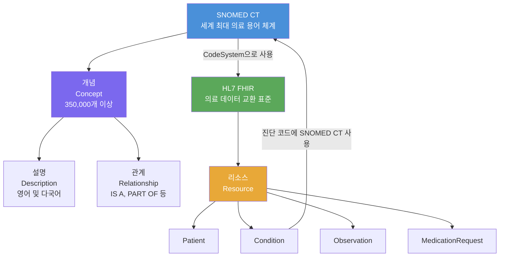

# 5회차: SNOMED CT + HL7 FHIR

## 학습 목표

이 세션을 마치면 다음을 할 수 있습니다:

- SNOMED CT의 구조(개념, 설명, 관계)와 그 규모를 이해한다
- SNOMED CT가 OWL 2 EL로 형식화되는 이유를 설명할 수 있다
- HL7 FHIR의 탄생 배경과 리소스(Resource) 개념을 이해한다
- SNOMED CT와 FHIR이 어떻게 연동되는지 설명할 수 있다
- 의료 정보 표준화가 왜 어렵고 중요한지 설명할 수 있다

## 이번 세션 전체 그림



> **왜 의료 정보 표준화가 필요한가?**
> 의사가 환자를 진찰하고 "폐렴"이라는 진단을 내립니다. 이 정보가 병원 전자의무기록(EMR)에 저장됩니다. 환자가 다른 병원으로 이송되면, 그 병원의 시스템은 이 데이터를 읽을 수 없을 수도 있습니다. 각 병원이 다른 소프트웨어를 쓰고, 다른 코드 체계를 쓰기 때문입니다. "폐렴"이 A 병원에서는 "J18.9"(ICD-10 코드), B 병원에서는 "233604007"(SNOMED CT 코드)으로 저장되어 있다면, 두 시스템을 연결하지 않고는 같은 질병임을 알 수 없습니다. SNOMED CT와 FHIR은 이 문제를 해결하기 위한 표준입니다.

## SNOMED CT (Systemized Nomenclature of Medicine - Clinical Terms)

### 역사와 규모

SNOMED CT는 1970년대에 미국병리학회(College of American Pathologists)가 개발한 SNOMED(Systemized Nomenclature of Medicine)에서 시작되었습니다. 영국 NHS(National Health Service)가 개발한 CTV3(Clinical Terms Version 3)와 2002년에 합쳐져 SNOMED CT가 되었습니다.

현재 SNOMED CT는 **SNOMED International**이 관리하며, 40개국 이상이 공식 회원으로 참여합니다. 한국은 2021년에 SNOMED International 회원이 되었습니다.

**규모 (2024년 기준)**:
- 개념(Concept): 350,000개 이상
- 설명(Description): 1,500,000개 이상
- 관계(Relationship): 1,500,000개 이상

### SNOMED CT의 핵심 구조

SNOMED CT는 세 가지 핵심 요소로 구성됩니다:

#### 1. 개념 (Concept)

각 의료 개념은 고유한 <strong>SCTID(SNOMED CT Identifier)</strong>를 가집니다.

```
SCTID 233604007 = Pneumonia (disorder)    [폐렴]
SCTID 73211009  = Diabetes mellitus       [당뇨병]
SCTID 44054006  = Diabetes mellitus type 2 [제2형 당뇨병]
```

개념은 크게 임상 개념의 유형(semantic tag)에 따라 분류됩니다:
- **disorder** (질환): 비정상적인 상태 (예: Pneumonia)
- **finding** (발견): 임상적 관찰 (예: Fever)
- **procedure** (처치): 의료 행위 (예: Appendectomy)
- **substance** (물질): 약물, 화학물질 등
- **organism** (생물): 세균, 바이러스 등
- **body structure** (신체 구조): 해부학적 구조

#### 2. 설명 (Description)

각 개념에는 여러 개의 설명이 있습니다:

| 설명 유형 | 설명 |
|----------|------|
| Fully Specified Name (FSN) | "Pneumonia (disorder)" — 정규 명칭 |
| Preferred Term | "Pneumonia" — 선호 용어 |
| Acceptable Synonym | "Lung inflammation" — 동의어 |

설명은 언어별로 다를 수 있어, 한국어 확장(Korean Language Extension)을 통해 한국어 설명이 추가됩니다.

#### 3. 관계 (Relationship)

개념들 사이의 관계를 정의합니다. 주요 관계 유형:

```
44054006 | Diabetes mellitus type 2 |
    IS A → 73211009 | Diabetes mellitus |
    FINDING SITE → 113331007 | Endocrine system |
    ASSOCIATED MORPHOLOGY → 15376000 | Atrophy |
    CAUSATIVE AGENT → (없음, 원인 불명)
```

IS A 관계가 SNOMED CT의 분류 계층을 형성합니다. 나머지 관계들은 개념의 의미를 더 상세히 기술합니다.

### SNOMED CT와 OWL 2 EL

SNOMED CT는 **OWL 2 EL** 프로파일로 형식화됩니다.

SNOMED CT의 개념 정의는 DL(Description Logic) 표현으로 나타낼 수 있습니다:

```
# 제2형 당뇨병의 OWL 2 EL 표현 (단순화)
DiabetesMellitusType2 SubClassOf
    DiabetesMellitus AND
    (hasAssociatedMorphology SOME Atrophy) AND
    (hasFindingSite SOME EndocrineSystem)
```

OWL 2 EL을 사용하면:
- <strong>자동 분류기(Classifier)</strong>가 개념의 계층 구조를 자동으로 추론
- 새 개념 추가 시 적절한 위치를 자동 결정
- 350,000개 이상의 대규모 개념에서도 효율적 추론 가능

> **연결 포인트: Gene Ontology와 SNOMED CT의 공통점**
> Gene Ontology와 SNOMED CT는 모두 OWL 2 EL을 사용하고, 모두 수십만 개 이상의 개념을 가진 대규모 온톨로지입니다. 이는 우연이 아닙니다. 두 도메인 모두 "규모가 크지만 추론이 필요한" 특성을 가지며, OWL 2 EL은 이 요구를 충족하는 최적의 프로파일입니다.

## HL7 FHIR (Fast Healthcare Interoperability Resources)

### FHIR의 탄생

HL7(Health Level Seven International)은 1987년에 설립된 의료 정보 표준화 단체입니다. HL7은 수십 년간 HL7 v2, HL7 v3, CDA(Clinical Document Architecture) 등 의료 데이터 교환 표준을 개발했습니다.

그러나 기존 표준들은 복잡하고 구현하기 어렵다는 비판을 받았습니다. 2011년, 호주의 의료 정보학자 <strong>그레이엄 그리브(Grahame Grieve)</strong>가 "Resource"라는 단순한 개념에 기반한 새로운 표준을 제안했고, 이것이 FHIR(Fast Healthcare Interoperability Resources)의 시작입니다.

### FHIR의 핵심 아이디어

FHIR는 의료 데이터를 <strong>리소스(Resource)</strong>라는 단위로 모듈화합니다. 각 리소스는:
- 독립적으로 의미 있는 데이터 단위
- REST API(RESTful API)로 접근 가능
- JSON 또는 XML 형식으로 표현
- 명확한 식별자(ID)와 메타데이터 포함

### 핵심 FHIR 리소스

**Patient (환자)**

```json
{
  "resourceType": "Patient",
  "id": "patient-hong-123",
  "identifier": [
    {
      "system": "https://hospital.example.com/patients",
      "value": "P12345"
    }
  ],
  "name": [
    {
      "use": "official",
      "family": "홍",
      "given": ["길동"]
    }
  ],
  "birthDate": "1980-05-15",
  "gender": "male",
  "address": [
    {
      "use": "home",
      "line": ["서울시 강남구 테헤란로 123"],
      "city": "서울",
      "country": "KR"
    }
  ]
}
```

**Condition (진단)**

```json
{
  "resourceType": "Condition",
  "id": "condition-diabetes-001",
  "subject": {
    "reference": "Patient/patient-hong-123"
  },
  "code": {
    "coding": [
      {
        "system": "http://snomed.info/sct",
        "code": "44054006",
        "display": "Diabetes mellitus type 2"
      },
      {
        "system": "http://hl7.org/fhir/sid/icd-10",
        "code": "E11",
        "display": "Type 2 diabetes mellitus"
      }
    ],
    "text": "제2형 당뇨병"
  },
  "clinicalStatus": {
    "coding": [{
      "system": "http://terminology.hl7.org/CodeSystem/condition-clinical",
      "code": "active"
    }]
  },
  "onsetDateTime": "2020-03-15"
}
```

위 예시에서 `Condition.code.coding` 배열에 SNOMED CT 코드(44054006)와 ICD-10 코드(E11)가 함께 포함된 것을 볼 수 있습니다. FHIR은 여러 코드 시스템을 동시에 지원합니다.

**Observation (검사 결과)**

```json
{
  "resourceType": "Observation",
  "id": "obs-hba1c-001",
  "status": "final",
  "code": {
    "coding": [{
      "system": "http://loinc.org",
      "code": "4548-4",
      "display": "Hemoglobin A1c/Hemoglobin.total in Blood"
    }]
  },
  "subject": {
    "reference": "Patient/patient-hong-123"
  },
  "effectiveDateTime": "2024-03-10",
  "valueQuantity": {
    "value": 7.5,
    "unit": "%",
    "system": "http://unitsofmeasure.org",
    "code": "%"
  }
}
```

> **연결 포인트: FHIR과 여러 코드 시스템**
> FHIR은 특정 코드 시스템에 의존하지 않고, `system` URL로 어떤 코드 시스템인지 명시합니다. SNOMED CT는 `http://snomed.info/sct`, LOINC(검사 결과 코드)는 `http://loinc.org`, ICD-10은 `http://hl7.org/fhir/sid/icd-10`을 사용합니다. 이 설계 덕분에 FHIR은 다양한 코드 시스템을 동시에 지원할 수 있습니다.

### FHIR의 REST API

FHIR 리소스는 RESTful API로 접근합니다:

| 동작 | HTTP 메서드 | URL 예시 |
|------|------------|---------|
| 리소스 조회 | GET | /Patient/patient-hong-123 |
| 환자 검색 | GET | /Patient?name=홍길동 |
| 리소스 생성 | POST | /Condition |
| 리소스 수정 | PUT | /Condition/condition-001 |
| 특정 조건 환자 검색 | GET | /Patient?_has:Condition:subject:code=44054006 |

### SNOMED CT와 FHIR 연동

FHIR에서 SNOMED CT를 사용하는 주요 사례:

1. **진단 코딩**: `Condition.code`에 SNOMED CT 개념 사용
2. **약물 기술**: `Medication.code`에 SNOMED CT 물질 개념 사용
3. **처치 기록**: `Procedure.code`에 SNOMED CT 처치 개념 사용
4. **임상 소견**: `Observation.code`에 SNOMED CT 소견 개념 사용

FHIR의 **ValueSet** 리소스를 사용해 SNOMED CT의 특정 하위 개념 집합을 정의할 수 있습니다:

```json
{
  "resourceType": "ValueSet",
  "id": "diabetes-types-valueset",
  "name": "DiabetesTypes",
  "compose": {
    "include": [{
      "system": "http://snomed.info/sct",
      "filter": [{
        "property": "concept",
        "op": "is-a",
        "value": "73211009"
      }]
    }]
  }
}
```

위 ValueSet은 SNOMED CT에서 당뇨병(73211009)의 모든 하위 개념을 포함합니다.

## 한국 SNOMED CT 적용 현황

한국은 2021년 SNOMED International 정회원이 되었습니다. 이로써:

- 한국어 SNOMED CT 확장(Korean Language Extension) 개발 가능
- 한국 의료 기관의 SNOMED CT 사용 합법화
- 글로벌 의료 데이터 교환 생태계와 연결 가능

건강보험심사평가원(HIRA), 국민건강보험공단(NHIS), 주요 대학병원들이 SNOMED CT 도입을 검토하거나 파일럿 프로젝트를 진행하고 있습니다.

그러나 현재 한국 의료계에서는 여전히 **KCD(한국표준질병·사인분류)**, ICD-10 기반의 체계가 주로 사용됩니다.

## 의료 정보 표준화의 도전과제

의료 정보 표준화는 기술적 문제 이외에도 다양한 도전에 직면합니다:

### 용어 모호성

같은 개념도 의사, 전공, 문화에 따라 다르게 표현됩니다. "심부전"이 누군가에게는 "울혈성 심부전", 다른 누군가에게는 "심장 기능 부전"입니다.

### 다국어 지원

SNOMED CT는 영어가 주 언어이며, 각 국가의 언어 확장을 개별적으로 관리해야 합니다. 의료 용어의 언어 간 정확한 매핑은 매우 어렵습니다.

### 버전 관리

SNOMED CT는 6개월마다 업데이트됩니다. 오래된 개념은 은퇴(retired)되고 새 개념이 추가됩니다. 임상 데이터는 수십 년간 보관되므로, 과거 데이터가 현재 버전에서도 이해 가능해야 합니다.

### 구현 복잡도

SNOMED CT의 전체 배포본은 수 GB에 달하는 파일로 구성됩니다. 이를 효율적으로 검색하고 추론할 수 있는 시스템을 구축하는 것은 상당한 기술적 투자가 필요합니다.

> **연결 포인트: SNOMED CT와 Gene Ontology의 비교**
> 두 온톨로지 모두 대규모이고 OWL 2 EL을 사용하지만, 관리 방식이 다릅니다. GO는 오픈소스이고 무료로 사용 가능하지만, SNOMED CT는 사용료가 있는 상용 표준입니다(단, SNOMED International 회원국에서는 무료 사용 가능). 또한 GO는 커뮤니티가 분산 개발하지만, SNOMED CT는 중앙집권적으로 관리됩니다.

## 흔한 오해

**오해 1: "SNOMED CT와 ICD-10은 같은 것이다"**

이 둘은 목적이 다릅니다. ICD-10(국제질병분류)은 주로 **통계적 목적**(사망 원인, 유병률 집계)을 위해 설계되었습니다. 약 16,000개의 코드를 가집니다. SNOMED CT는 **임상 문서화**를 위해 설계되어 350,000개 이상의 상세한 개념을 가집니다. 실제로 많은 시스템이 두 코드 체계를 모두 사용하며, FHIR은 이를 병렬로 지원합니다.

**오해 2: "FHIR이 있으면 의료 정보가 자동으로 표준화된다"**

FHIR은 데이터 교환 형식(format)과 API를 표준화하지만, 어떤 SNOMED CT 코드를 사용할지는 여전히 각 기관이 결정합니다. 두 병원이 모두 FHIR을 쓰더라도, 같은 진단을 다른 SNOMED CT 코드로 기록했다면 자동 통합이 어렵습니다.

**오해 3: "SNOMED CT는 완벽한 의료 온톨로지이다"**

SNOMED CT에도 오류와 불일치가 있습니다. 특히 개념 간의 계층 관계가 항상 임상 현실을 완벽히 반영하지는 않습니다. SNOMED International은 오류 보고 시스템을 통해 지속적으로 개선하고 있습니다.

## 요약

SNOMED CT는 350,000개 이상의 개념을 가진 세계 최대의 의료 임상 용어 체계이며, OWL 2 EL로 형식화되어 자동 추론을 지원합니다. HL7 FHIR은 의료 데이터를 리소스 단위로 모듈화하고 REST API로 교환하는 현대적 표준입니다. 두 표준이 결합되면, 전 세계 의료 시스템이 환자 데이터를 안전하고 효율적으로 공유할 수 있습니다.

**다음 세션 예고**: 비교 분석 — 이번 6단계에서 배운 5개 온톨로지를 다양한 기준으로 종합 비교하고, 새 프로젝트에서 어떤 온톨로지를 선택할지 가이드라인을 제시합니다.
