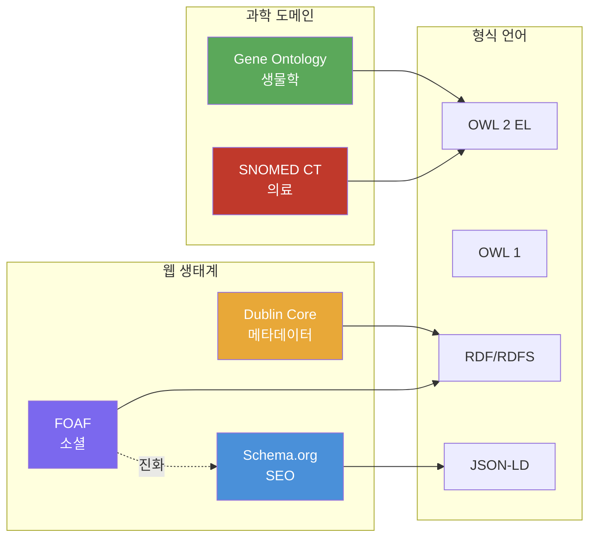
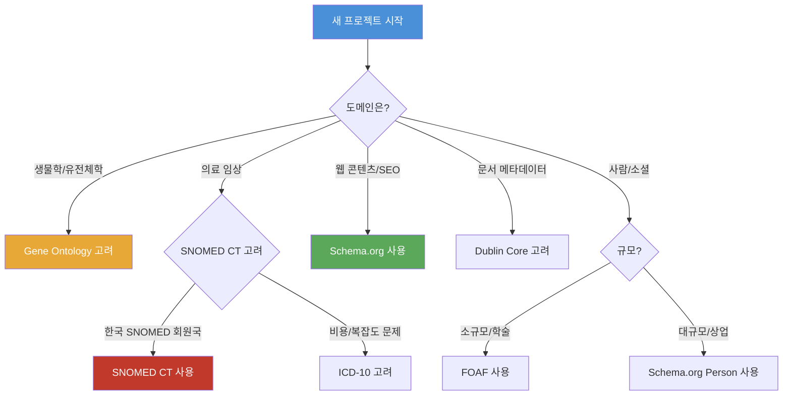

# 6회차: 비교 분석

## 학습 목표

이 세션을 마치면 다음을 할 수 있습니다:

- 5개 표준 온톨로지를 다양한 기준으로 체계적으로 비교할 수 있다
- 각 온톨로지가 성공한 이유와 한계를 분석할 수 있다
- 새 프로젝트에서 어떤 표준 온톨로지를 선택해야 할지 판단할 수 있다
- 실패한 온톨로지들의 교훈을 이해하고 적용할 수 있다

## 이번 세션 전체 그림

> **왜 비교 분석이 중요한가?**
> 온톨로지를 잘못 선택하면 나중에 전체를 재설계해야 할 수도 있습니다. 도서관 시스템에 Schema.org를 무리하게 적용하거나, 일반 웹 콘텐츠에 SNOMED CT를 사용하면 불필요한 복잡성과 호환성 문제가 생깁니다. 각 온톨로지의 강점과 한계를 알면, 프로젝트에 맞는 최적의 선택을 할 수 있습니다.

## 5개 온톨로지 종합 비교표

| 항목 | FOAF | Dublin Core | Schema.org | Gene Ontology | SNOMED CT |
|------|------|------------|-----------|---------------|-----------|
| **도메인** | 소셜/사람 | 문서 메타데이터 | 웹 콘텐츠 | 생물학 | 의료 임상 |
| **탄생 연도** | 2000 | 1995 | 2011 | 1998 | 2002(합병) |
| **형식 언어** | RDF/OWL | RDF/RDFS | JSON-LD | OWL 2 EL | OWL 2 EL |
| **규모** | 소규모 (~50 개념) | 소규모 (15개 요소) | 중규모 (800+ 타입) | 대규모 (40,000+ GO 용어) | 초대규모 (350,000+ 개념) |
| **개방성** | 무료, 오픈소스 | 무료, 오픈소스 | 무료, 오픈소스 | 무료, 오픈소스 | 회원국 무료, 비회원 유료 |
| **SEO 효과** | 없음 | 제한적 | 매우 높음 | 없음 | 없음 |
| **추론 지원** | 제한적 | 없음 | 없음 | OWL 2 EL | OWL 2 EL |
| **채택 기반** | 링크드 데이터 커뮤니티 | 도서관, 학술, 공공기관 | 검색 엔진 | 생명과학 연구 | 의료 기관, 보건 기관 |
| **갱신 주기** | 2014년 이후 중단 | 지속 운영 | 지속 운영 | 분기/반기 | 반기 |
| **다국어 지원** | 제한적 | 우수 | 우수 | 다국어 동의어 | 언어 확장 지원 |

## 하나의 개념, 다섯 가지 시선: "사람"을 어떻게 표현하는가?

> **왜 필요한가?**
> 같은 현실 세계 개념("사람")도 온톨로지의 목적과 도메인에 따라 완전히 다르게 모델링됩니다. 이것이 온톨로지 통합(integration)에서 `owl:equivalentClass`나 `skos:exactMatch`와 같은 매핑(mapping)이 필수적인 이유입니다. 다섯 가지 접근법을 비교해보면서, 각 온톨로지가 "사람"을 어떻게 바라보는지 이해해봅시다.

**5개 온톨로지의 "사람" 표현 비교표**

| 정보 항목 | FOAF | Dublin Core | Schema.org | Gene Ontology | SNOMED CT |
|----------|------|-------------|-----------|---------------|-----------|
| **개념 이름** | `foaf:Person` | `dcterms:creator` `dcterms:contributor` | `schema:Person` | (표현 불가) | `Person` (환자/의료진 역할) |
| **이름** | `foaf:name` | (없음) | `schema:name` `schema:givenName` `schema:familyName` | (해당 없음) | (다양한 naming 속성) |
| **소속** | `foaf:organization` | (없음) | `schema:affiliation` | (해당 없음) | `Employment` |
| **관계** | `foaf:knows` `foaf:member` | (없음) | `schema:colleague` `schema:follows` | (해당 없음) | `Family member` `Clinical relationship` |
| **연락처** | `foaf:mbox` (email) | (없음) | `schema:email` `schema:telephone` | (해당 없음) | `Contact point` |
| **식별자** | `foaf:homepage` `foaf:weblog` | (없음) | `schema:url` `schema:sameAs` | (해당 없음) | `Patient identifier` |
| **도메인 초점** | 소셜 관계 | 자원 기여 | 웹 검색 | 유전자/단백질 기능 | 임상 정보 |
| **핵심 사용처** | 분산 소셜 그래프 | 학술 저작물 메타데이터 | SEO, 지식 그래프 | 바이오인포매틱스 | 전자 건강 기록 (EHR) |

**각 온톨로지의 "사람"에 대한 접근법**

```mermaid
graph TD
    subgraph FOAF["FOAF: 소셜 관계 중심"]
        FOAF_Person["foaf:Person"]
        FOAF_Person --> FOAF_knows["knows: 다른 사람과의 관계"]
        FOAF_Person --> FOAF_interest["interest: 관심사"]
        FOAF_Person --> FOAF_homepage["homepage: 개인 공간"]
    end

    subgraph DC["Dublin Core: 역할로서의 사람"]
        DC_Person["dcterms:creator/contributor"]
        DC_Person --> DC_role["자원의 기여자 역할"]
        DC_role --> DC_article["논문, 책, 데이터셋"]
    end

    subgraph Schema["Schema.org: 검색 최적화"]
        Schema_Person["schema:Person"]
        Schema_Person --> Schema_jobTitle["jobTitle: 직업"]
        Schema_Person --> Schema_affiliation["affiliation: 소속 기관"]
        Schema_Person --> Schema_sameAs["sameAs: 다른 ID와의 연결"]
    end

    subgraph GO["Gene Ontology: 사람 없음"]
        GO_no["GO는 유전자/단백질 기능 어휘"]
        GO_no --> GO_focus["사람은 범위 밖"]
        GO_focus --> GO_example["예: 단백질 키나아제 활성은\n사람이 아니라 분자 기능"]
    end

    subgraph SNOMED["SNOMED CT: 임상 맥락"]
        SNOMED_Person["Person (환자/의료진)"]
        SNOMED_Person --> SNOMED_role["Clinical role: 환자, 의사, 간호사"]
        SNOMED_Person --> SNOMED_finding["Clinical finding: 의료 기록의 주체"]
        SNOMED_Person --> SNOMED_procedure["Clinical procedure: 진료, 수험의 대상"]
    end

    style FOAF_Person fill:#7B68EE,color:#fff
    style DC_Person fill:#E8A838,color:#fff
    style Schema_Person fill:#4A90D9,color:#fff
    style GO_no fill:#5BA85A,color:#fff
    style SNOMED_Person fill:#C0392B,color:#fff
```

**핵심 인사이트**

1. **같은 개념, 다른 모델링**: 모든 온톨로지가 "사람"이라는 개념을 다루지만, 각자의 도메인 목적에 따라 완전히 다르게 모델링합니다.
   - FOAF: "사람은 소셜 네트워크의 노드다"
   - Dublin Core: "사람은 자원의 기여자다"
   - Schema.org: "사람은 검색 가능한 정보의 출처다"
   - Gene Ontology: "사람은 우리 어휘의 범위 밖이다"
   - SNOMED CT: "사람은 임상 정보의 주체다"

2. **온톨로지 선택이 중요한 이유**: 프로젝트의 목적에 맞지 않는 온톨로지를 선택하면, 필수적인 정보를 표현할 수 없습니다.
   - 예: 소셜 네트워크 앱에 Dublin Core를 쓰면 `knows` 관계를 표현할 수 없음
   - 예: 임상 시스템에 FOAF를 쓰면 환자의 의료 정보를 충분히 기술할 수 없음

3. **매핑이 필수적인 이유**: 서로 다른 온톨로지 간의 데이터를 통합하려면 매핑이 필수입니다.
   - `foaf:Person` `owl:equivalentClass` `schema:Person`
   - `foaf:knows` `skos:closeMatch` `schema:colleague`
   - 이런 매핑이 있어야 연구자의 FOAF 프로필과 Schema.org 프로필을 연결할 수 있습니다

> **연결 포인트: 온톨로지 간의 매핑(Mapping)**
> 여러 온톨로지를 사용하면 서로 다른 온톨로지 간의 개념을 연결하는 **매핑(mapping)**이 필요합니다. 예를 들어, FOAF의 `foaf:Person`과 Schema.org의 `schema:Person`은 같은 개념을 나타냅니다. `owl:equivalentClass`나 `skos:exactMatch`를 사용해 이 동등 관계를 명시할 수 있습니다. SNOMED CT와 ICD-10 사이의 매핑 테이블도 이런 방식으로 구성됩니다.

## 각 온톨로지의 성공 요인

### FOAF의 성공 요인

1. **타이밍**: 소셜 네트워크가 부상하던 2000년대 초에 시맨틱 웹의 첫 번째 실용 사례를 제시
2. **단순함**: 핵심 개념이 직관적이고 이해하기 쉬움
3. **확장 가능성**: 다른 어휘와 쉽게 조합 가능
4. **링크드 데이터 정신**: 분산된 웹에서 데이터를 연결하는 원칙을 실현

FOAF의 후퇴 요인:
- 소셜 미디어 플랫폼의 중앙화(페이스북, 트위터)
- 프라이버시 우려 증가
- Schema.org의 등장으로 인한 흡수

### Dublin Core의 성공 요인

1. **단순함과 보편성**: 15개의 요소가 거의 모든 유형의 자원에 적용 가능
2. **도메인 중립성**: 특정 기관이나 국가의 관행에 치우치지 않음
3. **표준 생태계**: OAI-PMH와의 결합으로 실질적인 데이터 교환 표준으로 자리 잡음
4. **확장성**: dcterms를 통해 필요에 따라 정밀도를 높일 수 있음

### Schema.org의 성공 요인

1. **검색 엔진의 직접 지원**: Google, Bing, Yahoo의 공동 창설로 즉각적인 채택 인센티브
2. **실용성 우선**: 형식적 엄밀성보다 실용적 활용성을 선택
3. **리치 결과**: 마크업 적용 시 검색 결과에 즉각적인 시각적 이득
4. **JSON-LD 채택**: 현대 웹 개발 워크플로와 자연스럽게 통합
5. **지속적 확장**: 커뮤니티의 피드백을 받아 새로운 타입 지속 추가

### Gene Ontology의 성공 요인

1. **커뮤니티 주도**: 특정 기관이 아닌 생명과학 커뮤니티 전체가 공동 개발
2. **필요에서 출발**: 게놈 데이터의 폭발적 증가라는 실제 문제 해결
3. **무료 개방**: 상업적 이용 포함 모든 사용에 무료
4. **풍부한 도구 생태계**: GO 풍부화 분석, 시각화 도구 등이 함께 발전
5. **어노테이션 증거 체계**: 데이터 품질을 투명하게 표시하는 증거 코드

### SNOMED CT의 성공 요인

1. **의료 정보학의 복잡성 수용**: 단순화 대신 임상 현실의 복잡성을 있는 그대로 표현
2. **국가/기관 참여**: 정부와 대형 의료 기관의 공식 채택
3. **OWL 2 EL 형식화**: 자동 추론과 품질 검증 지원
4. **다코드 매핑**: ICD-10, LOINC 등 다른 코드 시스템과의 매핑 제공

## 실패한 온톨로지의 교훈

온톨로지가 왜 실패하는지 이해하는 것도 중요합니다.

### 교훈 1: "너무 완벽하면 채택되지 않는다"

**CycL/Cyc 온톨로지**: 1984년부터 개발된 Cyc는 "상식 지식(common sense knowledge)"을 완전히 형식화하려는 야심 찬 프로젝트였습니다. 수십만 개의 공리와 수백만 개의 사실을 포함하지만, 너무 복잡하고 독점적(proprietary)이어서 폭넓게 채택되지 못했습니다.

교훈: **실용성과 형식적 완전성 사이의 균형**이 필요합니다. 사용자가 이해하고 적용할 수 있는 수준의 복잡도여야 채택됩니다.

### 교훈 2: "닫힌 생태계는 성공하기 어렵다"

많은 독점 온톨로지가 특정 소프트웨어 플랫폼에 종속되어 외부 채택을 방해했습니다. FOAF, Dublin Core, Gene Ontology가 오픈소스로 공개되어 성공한 것과 대조적입니다.

교훈: <strong>개방성(openness)</strong>은 온톨로지 생태계 형성의 필수 조건입니다.

### 교훈 3: "채택 인센티브 없이는 확산되지 않는다"

많은 잘 설계된 온톨로지가 실제 사용자에게 즉각적인 이득을 주지 못해 외면받았습니다. Schema.org가 SEO 효과라는 즉각적 인센티브를 제공한 것이 빠른 확산의 핵심이었습니다.

교훈: **"이걸 쓰면 무엇이 좋은가?"**라는 질문에 명확한 답이 있어야 합니다.

### 교훈 4: "도메인 전문가 없이는 신뢰받지 못한다"

Gene Ontology는 생물학 연구자들이 직접 설계하고 유지 관리합니다. SNOMED CT는 의사, 병리학자, 임상 정보학 전문가들이 참여합니다. 도메인 지식이 없는 사람들이 만든 온톨로지는 실제 사용 맥락을 놓치는 경우가 많습니다.

교훈: **도메인 전문가와 온톨로지 엔지니어의 협력**이 필수입니다.

> **왜 많은 온톨로지가 방치되는가?**
> 온톨로지는 한 번 만들면 끝이 아닙니다. 세상이 변하면 온톨로지도 변해야 합니다. FOAF가 2014년 이후 업데이트를 멈춘 것처럼, 유지 관리 조직과 커뮤니티가 없으면 온톨로지는 점점 현실과 괴리가 생깁니다. 온톨로지 프로젝트를 시작할 때는 **장기적 거버넌스 계획**이 반드시 있어야 합니다.

## 온톨로지 선택 가이드

새 프로젝트에서 어떤 표준 온톨로지를 선택해야 할지 결정하는 가이드입니다.

### 의사결정 흐름도

### 도메인별 권장 온톨로지

| 사용 사례 | 권장 온톨로지 | 이유 |
|----------|--------------|------|
| 웹사이트 SEO | Schema.org | 검색 엔진 직접 지원, 리치 결과 |
| 디지털 도서관 | Dublin Core + dcterms | OAI-PMH 호환, 업계 표준 |
| 소셜 프로필 앱 | Schema.org Person | FOAF 계승, 더 넓은 지원 |
| 학술 저작물 관리 | Dublin Core + Schema.org | 두 표준의 장점 결합 |
| 바이오인포매틱스 연구 | Gene Ontology | 생명과학 사실상 표준 |
| 임상 데이터 시스템 | SNOMED CT + FHIR | 의료 표준 준수 |
| 공공 데이터 포털 | Dublin Core | 전자정부 메타데이터 표준 |
| 지식 그래프 구축 | Schema.org + 도메인 전용 | 범용성과 도메인 특화의 균형 |

### 여러 온톨로지 조합하기

실제 프로젝트에서는 여러 온톨로지를 조합하는 경우가 많습니다:

**학술 데이터 포털 예시**:
- Dublin Core: 논문의 기본 메타데이터 기술
- Schema.org: 웹 검색 최적화를 위한 마크업
- FOAF: 저자 식별 및 연구자 네트워크 기술
- (특정 학문 분야의) 도메인 온톨로지: 연구 내용 분류

**임상 연구 데이터베이스 예시**:
- SNOMED CT: 임상 진단, 처치, 소견 코딩
- HL7 FHIR: 데이터 교환 형식
- Dublin Core: 연구 데이터셋 메타데이터
- Gene Ontology: 유전체 연구 결과 어노테이션

> **연결 포인트: 온톨로지 간의 매핑(Mapping)**
> 여러 온톨로지를 사용하면 서로 다른 온톨로지 간의 개념을 연결하는 <strong>매핑(mapping)</strong>이 필요합니다. 예를 들어, FOAF의 `foaf:Person`과 Schema.org의 `schema:Person`은 같은 개념을 나타냅니다. `owl:equivalentClass`나 `skos:exactMatch`를 사용해 이 동등 관계를 명시할 수 있습니다. SNOMED CT와 ICD-10 사이의 매핑 테이블도 이런 방식으로 구성됩니다.

## 대형 언어 모델(LLM) 시대의 온톨로지

ChatGPT와 같은 대형 언어 모델이 등장하면서 "온톨로지가 여전히 필요한가?"라는 질문이 나옵니다.

**온톨로지의 지속적 가치**:

1. **신뢰성**: LLM은 환각(hallucination)을 만들 수 있지만, 온톨로지는 명시적으로 정의된 지식을 제공합니다
2. **법적/규제 요건**: 의료, 금융 등 규제 산업에서 데이터의 정확한 의미는 법적으로 중요합니다
3. **시스템 간 통합**: 다른 소프트웨어 시스템 간의 데이터 교환에는 기계가 처리할 수 있는 명확한 어휘가 필요합니다
4. **LLM의 기반**: Schema.org 마크업은 LLM이 웹 콘텐츠를 학습하는 데도 활용됩니다

오히려 온톨로지와 LLM의 <strong>결합(Neurosymbolic AI)</strong>이 미래의 방향으로 주목받고 있습니다.

## 흔한 오해

**오해 1: "하나의 온톨로지가 모든 것을 커버할 수 있다"**

어떤 단일 온톨로지도 모든 도메인의 지식을 완전히 커버할 수 없습니다. Schema.org는 의료 임상 세부 사항을 SNOMED CT 수준으로 표현할 수 없고, Gene Ontology는 문서 메타데이터를 Dublin Core 수준으로 다루지 않습니다. 적절한 온톨로지를 조합하는 것이 현실적인 접근입니다.

**오해 2: "표준 온톨로지를 사용하면 무결점이다"**

표준 온톨로지도 오류, 불완전한 정의, 다른 온톨로지와의 불일치가 있습니다. SNOMED CT에도 알려진 오류가 존재하고, Gene Ontology의 어노테이션 중 일부는 나중에 수정됩니다. 표준을 신뢰하되, 비판적으로 검토하는 자세가 필요합니다.

**오해 3: "새로운 온톨로지를 만드는 것이 항상 나쁘다"**

표준 온톨로지를 재사용하는 것이 일반적으로 좋지만, 기존 표준이 도메인의 특수성을 충분히 다루지 못하는 경우에는 새로운 온톨로지가 필요합니다. Gene Ontology 자체가 기존 표준의 한계에서 출발한 새로운 온톨로지였습니다. 핵심은 "완전히 새로 만들기"보다 "기존 온톨로지를 확장하거나 특화"하는 것입니다.

> **연결 포인트: 이 단계의 큰 그림**
> 6단계에서 배운 5개 온톨로지는 온톨로지 설계의 다양한 접근 방식을 보여줍니다. FOAF와 Dublin Core는 단순성을 선택했고, Schema.org는 실용성을, Gene Ontology와 SNOMED CT는 도메인 완전성을 선택했습니다. 어떤 선택도 "절대적으로 옳다"고 말할 수 없습니다. 도메인의 요구 사항, 사용자의 기술 수준, 채택 생태계, 유지 관리 역량에 따라 최선의 선택이 달라집니다.

## 요약

5개 표준 온톨로지는 각자의 도메인에서 서로 다른 문제를 해결하기 위해 설계되었습니다. FOAF는 분산 소셜 그래프를, Dublin Core는 보편적 문서 메타데이터를, Schema.org는 웹 검색 최적화를, Gene Ontology는 생물학적 지식 통합을, SNOMED CT는 의료 임상 정보 표준화를 목표로 했습니다. 각각의 성공과 한계를 이해하면, 새 프로젝트에서 최적의 온톨로지 전략을 수립할 수 있습니다.

**다음 세션 예고**: 실습 — 이번 단계에서 배운 내용을 직접 코드로 작성해보는 종합 실습. Schema.org JSON-LD 마크업, FOAF 트리플 작성, Gene Ontology DAG 분석, Dublin Core 메타데이터 기술을 실습합니다.
