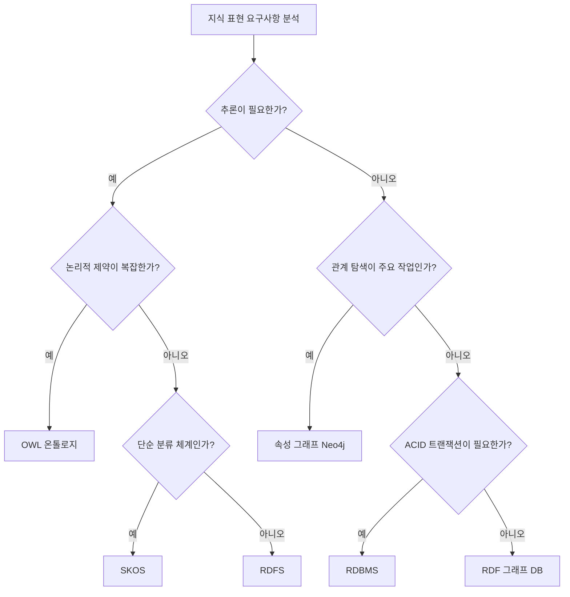

# 4회차: 기술 비교

> "올바른 도구를 선택하는 것은 그 도구를 잘 사용하는 것만큼 중요하다."

## 이번 세션 전체 그림

<MermaidDiagram chart={`flowchart TD
    A[지식 표현 기술 선택] --> B[온톨로지 OWL/RDF]
    A --> C[속성 그래프 Neo4j]
    A --> D[관계형 DB RDBMS]
    A --> E[SKOS/RDFS 단순 어휘]
    B --> F{평가 기준}
    C --> F
    D --> F
    E --> F
    F --> G[추론 능력]
    F --> H[구축 비용]
    F --> I[성능]
    F --> J[표준화]
    F --> K[유연성]
    G --> L[최적 기술 선택]
    H --> L
    I --> L
    J --> L
    K --> L`} caption="4가지 기술의 비교 프레임워크" />

## 왜 이 비교가 필요한가?

> "기술을 선택하는 가장 흔한 실수는 자신이 가장 잘 아는 기술을 선택하는 것이다. 최선의 선택은 문제에 가장 적합한 기술을 선택하는 것이다."

지식 표현과 데이터 모델링에는 여러 기술이 있습니다. 각각은 다른 문제를 해결하기 위해 설계되었으며, 각자의 고유한 강점과 약점이 있습니다.

이 회차에서는 4가지 주요 기술을 체계적으로 비교합니다:
1. **온톨로지** (OWL 2, RDF)
2. **속성 그래프** (Property Graph: Neo4j, TigerGraph)
3. **관계형 데이터베이스** (RDBMS: PostgreSQL, MySQL)
4. **SKOS/RDFS** (단순한 어휘)

## 기술 1: 온톨로지 (OWL 2 / RDF)

### 언제 사용하는가?

온톨로지는 다음 상황에서 가장 강력합니다:
- 도메인이 복잡하고 많은 개념과 관계가 있을 때
- 명시적인 형식 논리 추론이 필요할 때
- 여러 조직이나 시스템 간 표준화된 지식 공유가 필요할 때
- 새로운 사실을 기존 사실에서 자동으로 도출해야 할 때
- 데이터의 일관성과 완전성을 형식적으로 검증해야 할 때

### 실제 사용 사례
- SNOMED CT: 의료 용어 표준 온톨로지
- Gene Ontology (GO): 유전자 기능 분류
- Dublin Core: 메타데이터 표준
- Schema.org: 웹 구조화 데이터

### 강점
- **의미론적 정확성**: 개념과 관계를 형식적으로 정의
- **추론 가능성**: 명시되지 않은 사실을 논리적으로 도출
- **상호운용성**: W3C 표준 기반으로 국제적 공유 가능
- **모순 감지**: 논리적으로 불일치한 데이터를 자동 탐지

### 약점
- **높은 구축 비용**: 전문 지식과 많은 시간 필요
- **성능 문제**: 복잡한 추론은 대규모 데이터에서 느림
- **높은 진입 장벽**: OWL, SPARQL 학습 곡선
- **과명세(Over-specification) 위험**: 너무 세밀하게 정의하면 오히려 유연성 저하

## 기술 2: 속성 그래프 (Property Graph)

대표 도구: Neo4j, TigerGraph, Amazon Neptune (Property Graph Mode), JanusGraph

### 언제 사용하는가?

- 데이터 간 관계 탐색이 주요 작업일 때 (소셜 네트워크, 추천 시스템)
- 빠른 그래프 탐색이 필요할 때 (최단 경로, 연결성 분석)
- 데이터 모델이 직관적이고 자주 변경될 때
- 형식적 추론보다 패턴 탐색이 중요할 때

### 실제 사용 사례
- 소셜 네트워크 분석 (Facebook, LinkedIn)
- 사기 탐지 (금융 거래 네트워크)
- 추천 시스템 (사용자-상품 관계)
- 공급망 관리 (부품-조립 관계)

### 강점
- **직관적 모델링**: 노드(Node)와 엣지(Edge)로 실세계를 자연스럽게 표현
- **빠른 그래프 쿼리**: 다중 홉 관계 탐색에 최적화
- **유연한 스키마**: 속성을 쉽게 추가하거나 변경 가능
- **낮은 진입 장벽**: Cypher 쿼리 언어가 상대적으로 직관적

### 약점
- **표준 없음**: OWL/SPARQL 같은 국제 표준 부재 (벤더 종속 위험)
- **추론 부재**: 논리적 추론 기능 기본 제공 없음
- **의미론적 정확성 낮음**: 관계의 의미가 암묵적
- **상호운용성 낮음**: 시스템 간 직접 통합 어려움

### RDF 트리플 저장소 vs 속성 그래프 비교

| 특성 | RDF 삼중 저장소 | 속성 그래프 |
|------|-------------|-----------|
| 표준 | W3C 표준 (RDF/OWL) | 벤더별 다름 |
| 쿼리 언어 | SPARQL | Cypher, Gremlin 등 |
| 추론 | 지원 | 기본 미지원 |
| 그래프 쿼리 성능 | 보통 | 높음 |
| 유연성 | 낮음 (스키마 엄격) | 높음 |

## 기술 3: 관계형 데이터베이스 (RDBMS)

대표 도구: PostgreSQL, MySQL, Oracle, MS SQL Server

### 언제 사용하는가?

- 정형화된 데이터가 있고 스키마가 안정적일 때
- ACID 트랜잭션(원자성, 일관성, 격리성, 지속성)이 필요할 때
- 복잡한 집계 쿼리(GROUP BY, JOIN)가 많을 때
- 성숙하고 최적화된 기술이 필요할 때
- 팀에 SQL 전문성이 있을 때

### 실제 사용 사례
- 전자상거래 주문 관리
- 급여 및 인사 시스템
- 금융 거래 기록
- 대부분의 기업 업무 시스템

### 강점
- **성숙도**: 수십 년의 최적화와 신뢰성 검증
- **ACID 보장**: 데이터 무결성 보장
- **SQL 표준**: 광범위한 도구 생태계
- **최적화된 쿼리**: 인덱스, 실행 계획 최적화

### 약점
- **스키마 유연성 부족**: 구조 변경이 어렵고 비용이 큼
- **그래프 데이터에 불리**: 다중 조인으로 성능 저하
- **의미론적 표현 한계**: 데이터의 의미를 표현하기 어려움
- **상속 계층 표현 복잡**: OOP의 계층 구조를 테이블로 표현하기 어려움

## 기술 4: SKOS/RDFS (단순한 어휘)

SKOS (Simple Knowledge Organization System), RDFS (RDF Schema)

### 언제 사용하는가?

- 단순한 분류 체계(taxonomy)나 통제 어휘(controlled vocabulary)가 필요할 때
- 가벼운 메타데이터 구조가 필요할 때
- 온톨로지의 완전한 복잡성이 필요 없을 때
- 빠르게 시작해야 하는 프로토타입 단계에서

### 실제 사용 사례
- 도서관 분류 체계 (듀이 십진분류법 온라인 버전)
- 정부 데이터 포털의 주제 분류
- 기업 내 문서 태그 시스템
- Wikipedia의 카테고리 시스템

### 강점
- **단순함**: 배우기 쉽고 구현이 빠름
- **낮은 진입 장벽**: 전문 온톨로지 지식 불필요
- **충분한 표현력**: 대부분의 분류 체계에 충분
- **RDF 기반**: 시스템 간 기본적인 상호운용성

### 약점
- **추론 능력 제한**: 복잡한 논리적 추론 불가
- **표현력 제한**: OWL의 복잡한 제약 조건 표현 불가
- **확장 한계**: 요구사항이 복잡해지면 OWL로 마이그레이션 필요

## 종합 비교 매트릭스

| 특성 | 온톨로지 (OWL) | 속성 그래프 | RDBMS | SKOS/RDFS |
|------|-------------|-----------|-------|-----------|
| 추론 능력 | 높음 | 없음 | 없음 | 낮음 |
| 구축 비용 | 높음 | 중간 | 낮음~중간 | 낮음 |
| 쿼리 성능 | 낮음~중간 | 높음 | 높음 | 중간 |
| 표준화 | 높음 (W3C) | 낮음 | 높음 (SQL) | 높음 (W3C) |
| 유연성 | 낮음 | 높음 | 낮음 | 중간 |
| 진입 장벽 | 높음 | 낮음~중간 | 낮음 | 낮음 |
| 상호운용성 | 높음 | 낮음 | 중간 | 높음 |
| 설명 가능성 | 높음 | 낮음 | 중간 | 중간 |

## 연결 포인트

> 이 비교 매트릭스는 다음 회차(5회차 의사결정 트리)의 기초가 됩니다. 각 기술의 특성을 이해했다면, 이제 "어떤 상황에서 어떤 기술을 선택할 것인가"를 체계적인 의사결정 트리로 정리할 수 있습니다.

> 3회차의 벡터 임베딩 비교와 이 회차의 기술 비교를 함께 고려하면, 실제 AI 시스템 설계에서 지식 표현 기술 선택의 전체 그림이 완성됩니다.

## 흔한 오해

### 오해 1: "관계형 데이터베이스로 그래프 데이터를 표현할 수 없다"

표현은 할 수 있습니다. 인접 목록이나 클로저 테이블 패턴을 사용하면 됩니다. 다만 성능 문제가 발생합니다. 깊이 있는 그래프 탐색(3홉 이상)에서 JOIN 연산이 폭발적으로 증가합니다.

### 오해 2: "Neo4j를 쓰면 온톨로지가 필요 없다"

Neo4j(속성 그래프)는 관계 탐색에 최적화되어 있지만, OWL의 논리적 추론이나 국제 표준에 기반한 상호운용성을 제공하지 않습니다. 두 기술은 각각 다른 요구사항을 충족합니다.

### 오해 3: "SKOS는 온톨로지가 아니니까 덜 중요하다"

SKOS는 분류 체계와 통제 어휘를 위해 설계된 표준으로, 많은 실제 사용 사례에서 완전한 OWL 온톨로지보다 더 적합합니다. "덜 복잡함"이 "덜 적합함"을 의미하지 않습니다.

## 폴리글롯 아키텍처: 여러 기술의 조합

현실 시스템에서는 하나의 기술만 사용하지 않습니다. <strong>폴리글롯 퍼시스턴스(Polyglot Persistence)</strong>란 서로 다른 문제에 서로 다른 저장소를 사용하는 아키텍처 패턴입니다.

### 실제 사례: 의료 정보 시스템

한 대형 의료 기관의 시스템 아키텍처를 예시로 들면:

- **OWL 온톨로지**: 의약품 분류, 진단 코드, 의학 지식 (SNOMED CT 기반)
- **PostgreSQL (RDBMS)**: 환자 기록, 처방 데이터, 예약 정보 (ACID 필요)
- **Neo4j (속성 그래프)**: 환자-의사-보험사 관계망, 전염병 접촉 추적
- **SKOS**: 의료 절차 분류, 보험 코드 어휘

이 네 가지 기술이 협력해서 하나의 완전한 시스템을 구성합니다.

### 기술 간 데이터 흐름

폴리글롯 아키텍처에서는 기술 간 데이터 흐름이 중요합니다:

RDBMS의 환자 데이터가 온톨로지 추론의 입력이 되고, 추론 결과가 다시 RDBMS에 저장됩니다. Neo4j의 관계 탐색 결과가 RDBMS의 집계 쿼리와 결합되어 최종 리포트를 생성합니다.

이러한 통합에는 추가적인 미들웨어와 데이터 파이프라인 설계가 필요합니다. 이것이 폴리글롯 아키텍처의 장점이자 복잡성의 원천입니다.

## 기술 선택 시 고려할 생태계 요소

기술 자체의 특성 외에도 생태계를 고려해야 합니다:

### 도구 성숙도

| 기술 | 도구 성숙도 | 커뮤니티 크기 |
|------|-----------|-----------|
| RDBMS | 매우 높음 | 매우 큼 |
| 속성 그래프 (Neo4j) | 높음 | 큼 |
| SKOS/RDFS | 높음 | 중간 |
| OWL 온톨로지 | 중간 | 작음 |

### 인재 가용성

팀을 구성할 때 필요한 인재를 구할 수 있는가?

- SQL 전문가: 매우 구하기 쉬움
- Neo4j/Cypher 전문가: 구하기 가능
- OWL/SPARQL 전문가: 구하기 어려움, 급여 높음
- 온톨로지 엔지니어: 매우 구하기 어려움

이 현실적 제약은 기술 선택에 큰 영향을 미칩니다.

## 요약

4가지 기술(온톨로지, 속성 그래프, RDBMS, SKOS)은 각각 다른 요구사항을 위해 최적화되어 있습니다. 온톨로지는 추론과 표준화가 필요할 때, 속성 그래프는 관계 탐색이 중심일 때, RDBMS는 정형 데이터와 트랜잭션이 필요할 때, SKOS는 단순한 분류 체계에 적합합니다. 실제 시스템에서는 이 기술들을 조합하는 폴리글롯 아키텍처가 자주 사용됩니다. 기술 선택 시 기술 자체의 특성뿐 아니라 도구 성숙도, 인재 가용성, 커뮤니티 규모도 고려해야 합니다.

## 기술 비교 연결: 3계층 표현력 스펙트럼

> "Phase 4에서 배운 RDF-RDFS-OWL 3계층은 이 회차의 기술 비교와 직접 연결됩니다. 표현력의 스펙트럼에서 SKOS부터 OWL까지 어디에 위치하는지 이해하면, 각 기술이 왜 존재하는지 명확해집니다."

이 섹션에서는 Phase 4(온톨로지 기초)에서 배운 **RDF-RDFS-OWL 3계층**과 이 회차의 4가지 기술 비교를 연결하여, **표현력의 연속성**을 보여줍니다.

### 표현력 스펙트럼

Phase 4에서 우리는 온톨로지 기술이 **동일한 트리플**을 점점 더 풍부하게 해석하는 3계층으로 구성된다는 것을 배웠습니다:

```
RDF (데이터만) → RDFS (구조 추가) → OWL (추론과 제약)
```

이 회차의 4가지 기술 비교는 이 스펙트럼을 더 확장합니다:

```
SKOS → RDFS → OWL (온톨로지 표현력)
      ↓
      ↓
속성 그래프, RDBMS (관계형 접근)
```

### Phase 4의 3계층 vs 이 회차의 기술 비교

**SKOS와 RDFS의 관계:**
- SKOS는 **단순한 분류 체계**에 최적화되어 있습니다
- RDFS는 SKOS보다 **더 풍부한 프로퍼티 제약**을 제공합니다
- 실무에서 많은 프로젝트가 SKOS로 시작한 후, 요구사항이 복잡해지면 RDFS나 OWL로 마이그레이션합니다

**OWL과 속성 그래프의 대조:**
- OWL은 **형식적 추론**과 **논리적 제약**에 집중합니다
- 속성 그래프는 **관계 탐색**과 **그래프 패턴 매칭**에 최적화되어 있습니다
- 둘은 "그래프"라는 공통점이 있지만, **해결하는 문제가 완전히 다릅니다**:
  - OWL: "모순이 없는가?" "새로운 사실을 도출할 수 있는가?"
  - 속성 그래프: "A에서 B까지 최단 경로는?" "누가 누구와 연결되어 있는가?"

**RDFS와 관계형 데이터베이스의 유사성:**
- 둘 다 **구조화된 데이터**를 다룹니다
- RDFS의 `rdfs:domain`/`rdfs:range`는 RDBMS의 **외래 키 제약조건**과 유사한 역할을 합니다
- 하지만 RDFS는 **개방형 세계 가정(Open World Assumption)**을 따르고, RDBMS는 **폐쇄형 세계 가정(Closed World Assumption)**을 따릅니다

### RDF 기반 기술 vs 비-RDF 기술의 선택 트리

이 회차의 비교 매트릭스를 Phase 4의 지식과 결합하면, 다음과 같은 **선택 의사결정 트리**를 만들 수 있습니다:



### 실제 통합 사례: 의료 시스템에서의 3계층 활용

이 회차에서 소개한 의료 정보 시스템 예시를 Phase 4의 3계층 관점에서 재해석해보겠습니다:

**1계층 - RDF (데이터 교환):**
```turtle
# 환자 기록을 RDF 트리플로 교환
ex:patient123 ex:hasDiagnosis ex:diagnosis456 .
ex:diagnosis456 rdfs:label "당뇨병"@ko .
```
- 병원 간 데이터 공유에 RDF 사용
- 추론 없이 있는 그대로 기록

**2계층 - RDFS (기본 구조):**
```turtle
# 질병 분류 체계
ex:Disease a rdfs:Class .
ex:Diabetes a rdfs:Class ;
    rdfs:subClassOf ex:Disease .
ex:Type2Diabetes a rdfs:Class ;
    rdfs:subClassOf ex:Diabetes .
```
- RDFS로 질병 분류 계층 정의
- "Type2Diabetes인 환자는 Diabetes이기도 하다"는 기본 추론

**3계층 - OWL (복잡한 의료 규칙):**
```turtle
# 의료 규칙 제약
ex:DiabetesMedication a owl:Class ;
    rdfs:subClassOf [
        owl:onProperty ex:contraindicatedFor ;
        owl:someValuesFrom ex:Pregnancy
    ] .
```
- "임산부에게 당뇨병 약을 투여하면 위험하다"는 제약 표현
- OWL 추론기가 자동으로 금기(contraindication) 감지

**속성 그래프와의 통합:**
```cypher
// Neo4j에서 환자-의사 관계 탐색
MATCH (p:Patient)-[:TREATED_BY]->(d:Doctor)-[:WORKS_AT]->(h:Hospital)
WHERE p.diagnosis = "Diabetes"
RETURN p, d, h
```
- 추론이 필요 없는 **관계 탐색**은 속성 그래프에 위임
- 온톨로지 추론 결과를 속성 그래프에 저장하고 탐색

**RDBMS와의 통합:**
```sql
-- PostgreSQL에서 ACID 트랜잭션으로 처방 기록
INSERT INTO prescriptions (patient_id, drug_id, date)
VALUES (123, 456, '2026-03-10')
ON CONFLICT (patient_id, drug_id) DO UPDATE;
```
- **데이터 무결성**이 중요한 금전/처방 기록은 RDBMS에 저장
- 온톨로지 추론의 결과를 RDBMS 테이블에 동기화

### 표현력 vs 성능의 트레이드오프

Phase 4에서 배운 3계층의 핵심 통찰은 **표현력과 성능의 트레이드오프**입니다:

| 기술 | 표현력 | 추론 성능 | 쿼리 성능 | 적합한 상황 |
|------|-------|----------|----------|-----------|
| SKOS | 낮음 | 매우 빠름 | 빠름 | 단순 분류, 통제 어휘 |
| RDFS | 중간 | 빠름 | 빠름 | 계층 탐색, 기본 검증 |
| OWL | 높음 | 느림 | 느림 | 복잡한 추론, 일관성 검증 |
| 속성 그래프 | 중간* | 없음 | 매우 빠름 | 관계 탐색, 패턴 매칭 |
| RDBMS | 낮음~중간** | 없음 | 빠름 | ACID 트랜잭션, 집계 |

* 속성 그래프의 표현력은 관계 모델링에 특화되어 있으나, 형식적 추론은 불가능합니다
** RDBMS는 스키마 제약조건으로 일정 수준의 표현력을 제공합니다

### 연결 포인트

> Phase 4의 3계층 비교는 이 회차의 기술 비교에 **이론적 기초**를 제공합니다. "왜 OWL이 필요한가?", "SKOS는 언제 충분한가?" 같은 질문에 대한 답이 Phase 4의 RDF-RDFS-OWL 스펙트럼에 있습니다.

> 다음 회차(5회차 의사결정 트리)에서는 이 비교를 체계적인 의사결정 프레임워크로 발전시킵니다. "어떤 상황에서 어떤 기술을 선택할 것인가?"를 결정 트리로 정리하여, 실제 프로젝트에서 즉시 적용할 수 있는 가이드를 제공합니다.
